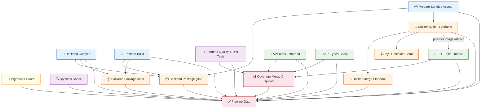

# CI Pipeline Schema

## Overview

Both **Core CI** and **Nightly CI** invoke the same reusable workflow (`_ci-pipeline.yml`) with different matrix sizes.

---

## Job Dependency Graph

---

## Dependency Legend

| Arrow | Meaning |
|-------|---------|
| `→` (solid) | Hard `needs:` dependency — job won't start until upstream succeeds |
| `⇢` (dashed) | Implicit runtime dependency — E2E polls for Docker image artifact via GH API, no `needs:` in YAML |

---

## Detailed Job Descriptions

### Pre-flight (no dependencies, runs in parallel with everything)

| Job | Purpose |
|-----|---------|
| **Migrations Guard** | Verifies new DB migrations are strictly appended after the last release tag |

### Build Stage (no dependencies, run in parallel)

| Job | Purpose |
|-----|---------|
| **Backend Compile** | `mvn compile` — produces compiled `.class` artifacts |
| **Frontend Build** | Yarn build of `openaev-front` — produces static assets |
| **Prepare Bundled Assets** | Downloads agent/implant binaries from JFrog, patches catalog version (`catalog-integrators.json`), uploads as `release-assets` artifact |

### Static Quality (no dependencies, run in parallel)

| Job | Purpose |
|-----|---------|
| **Spotless Check** | Java formatting validation |
| **Frontend Quality** | ESLint + Vitest unit tests + coverage |

### Packaging

| Job | Depends On | Purpose |
|-----|-----------|---------|
| **Backend Package (glibc)** | Frontend Build, Backend Compile, Prepare Bundled Assets | Produces fat JAR for standard Linux |
| **Backend Package (musl)** | Frontend Build, Backend Compile, Prepare Bundled Assets | Produces fat JAR for Alpine |

### Docker

| Job | Depends On | Purpose |
|-----|-----------|---------|
| **Docker Build** (×4) | Prepare Bundled Assets | Builds `standard/amd64`, `standard/arm64`, `ubi9/amd64`, `ubi9/arm64` images |
| **Docker Merge** (×2) | Docker Build | Combines amd64+arm64 into multi-arch manifest |
| **Snyk Container Scan** | Docker Build | CVE scan on amd64 images; advisory in Core CI and enforcing in Nightly CI |

### Tests

| Job | Depends On | Purpose |
|-----|-----------|---------|
| **API Tests** (sharded) | _(none)_ | Spring Boot integration tests against PostgreSQL + search engine |
| **API Types Check** | _(none)_ | Validates generated TS types match API schema |
| **E2E Tests** (matrix) | _(none in YAML)_ ← **polls Docker Build artifact** | Playwright tests against running Docker container |

> **E2E ↔ Docker Build link**: E2E tests have NO `needs:` on `docker-build` in the workflow YAML.
> Instead, the `e2e-tests` composite action **polls the GitHub API** for up to 15 minutes waiting for
> the Docker image artifact to become available. This allows E2E setup (service containers, Node.js,
> Playwright browsers) to proceed in parallel with the Docker build. If the Docker Build job fails or
> is cancelled, E2E detects this via the API and aborts immediately.

### Aggregation

| Job | Depends On | Purpose |
|-----|-----------|---------|
| **Coverage Merge & Upload** | API Tests, Frontend Quality, E2E Tests, API Types Check | Merges JaCoCo + Vitest + Playwright coverage → Codecov |
| **Pipeline Gate** ⚠️ | All required jobs except Snyk (Migrations Guard, Backend Compile, Frontend Build, Prepare Bundled Assets, Spotless Check, Frontend Quality, API Tests, E2E Tests, API Types Check, Backend Package, Backend Package musl, Docker Build, Docker Merge, Coverage) | **Branch protection status check** — gates PR merge |

### Snyk enforcement policy

- **Core CI:** scan findings and scanner errors are reported through logs and artifacts but never fail the required Pipeline Gate.
- **Nightly CI:** high/critical findings and scanner execution errors fail the nightly workflow.

---

## Core CI vs Nightly CI — Matrix Differences

### API Tests

| | Core CI | Nightly CI |
|-|---------|------------|
| Elasticsearch shards | 4 (main, rest-1, rest-2, remaining) | 4 |
| OpenSearch shards | ✗ | 4 (same split) |
| **Total jobs** | **4** | **8** |

### E2E Tests

| | Core CI | Nightly CI |
|-|---------|------------|
| Browsers | chrome, webkit, chromium | + Firefox, Edge |
| Images | std-amd64, std-arm64, ubi9-amd64, ubi9-arm64 | same |
| Search engines | Elasticsearch only | + OpenSearch |
| Infra tests | chromium only (amd64+arm64) | + chrome, firefox, webkit, edge |
| **Total jobs** | **10** | **25** |
