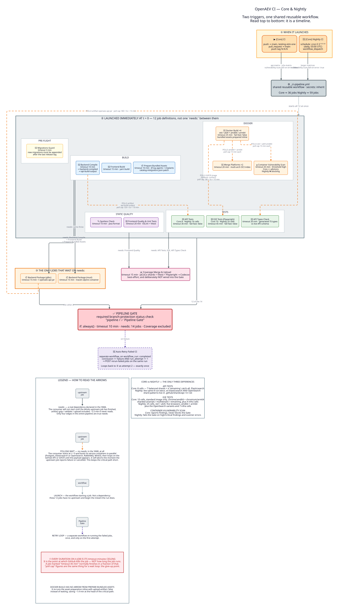

# CI Pipeline Schema

Both **Core CI** (`core-ci.yml`) and **Nightly CI** (`nightly-ci.yml`) are thin callers.
All the work lives in one reusable workflow, `_ci-pipeline.yml`, and the callers differ
only in three inputs: `api-matrix`, `e2e-matrix` and `vulnerability-scan-fail-on-error`.



The diagram is generated, not hand-drawn. Source: [`ci-pipeline-schema.d2`](ci-pipeline-schema.d2).

```bash
d2 --layout elk --pad 60 ci-pipeline-schema.d2 ci-pipeline-schema.svg
```

> Keep the source free of `|md` blocks. d2 renders markdown into `<foreignObject>`,
> which browsers refuse to draw when an SVG is embedded as an `` — the legend
> would silently disappear on GitHub.

### Reading the arrows

The legend swatches in the diagram are drawn with the same edge classes as the graph
itself, so their colour and dash pattern cannot drift from what they describe.

| Arrow | Colour | Meaning |
|-------|--------|---------|
| solid | dark slate `#37474F` | A real `needs:` in the YAML. The consumer will not start until the whole upstream job has finished |
| dashed | orange `#EF6C00` | Polling wait. No `needs:` at all — the consumer starts at t = 0 and polls for the payload |
| dashed | grey `#78909C` | The workflow launching a job. Not a dependency |
| dashed | purple `#4527A0` | Auto-retry loop. Fires once, on the first attempt only |

> [!IMPORTANT]
> **Every duration printed on a job is its `timeout-minutes`, never a measured runtime.**
> It is the point at which GitHub kills the job, not an indication of how long the job
> takes — a job labelled "timeout 45 min" normally finishes in a fraction of that.
> The same applies to the "poll cap" figures on the orange arrows: they are the
> give-up point of a wait loop, not an expected wait.

---

## The one thing to understand

Almost nothing in this pipeline waits. Of the 16 job definitions in `_ci-pipeline.yml`,
**12 launch at t = 0 with no `needs:` at all**; only 4 declare a dependency.

`needs:` waits for the *entire* upstream job to finish — including the artifact
gzip / validate / upload tail, roughly 2.5 min the consumer never actually reads. So
wherever only the *payload* matters, the consumer starts immediately, boots its service
containers in parallel, and polls the GitHub API or GHCR until the payload appears.

Every polling loop also watches the upstream job's conclusion and aborts the moment it
reports `failure` or `cancelled`, so a broken build fails fast instead of burning the
full timeout.

### The four real `needs:` edges

| Job | `needs:` | Why a hard dependency is correct |
|-----|----------|----------------------------------|
| **Backend Package (glibc)** | Frontend Build, Backend Compile, Prepare Bundled Assets | Needs all three outputs on disk before packaging |
| **Backend Package (musl)** | Frontend Build, Backend Compile, Prepare Bundled Assets | Same, inside an Alpine Maven container |
| **Coverage Merge & Upload** | API Tests, Frontend Quality, E2E Tests, API Types Check | Must see every shard's result; runs `if: !cancelled()` |
| **Pipeline Gate** | 14 jobs (see below) | Aggregates results; runs `if: always()` |

### The five polling waits

None of these appear as `needs:` in the YAML. The cap is the point at which the loop
gives up and fails the job — not how long the wait normally lasts.

| Consumer | Waits for | Poll cap | Aborts early when |
|----------|-----------|----------|-------------------|
| **API Tests** | artifact `api-build-output` | 120 × 5s = 10 min | Backend Compile is `failure`/`cancelled` |
| **API Types Check** | artifact `openaev-api-jar` | 180 × 5s = 15 min | Backend Compile is `failure`/`cancelled` |
| **E2E Tests** | GHCR image tag, falling back to the image artifact | 180 × 5s = 15 min | the arch-matched Docker Build cell fails |
| **Docker Merge** | both `amd64` and `arm64` images of its variant | 180 × 5s = 15 min each | any Docker Build cell fails |
| **Container Vulnerability Scan** | `standard-amd64` and `ubi9-amd64` images | 180 × 5s = 15 min each | any Docker Build cell fails |

E2E additionally tolerates a flaky control plane: after 10 consecutive GitHub API errors
it stops polling and attempts the download directly.

### Docker Build has no upstream at all

It deliberately does **not** `needs:` Prepare Bundled Assets. It re-runs the same
composite action inline with `upload-artifact: false`, which removes ~1.4 min of serial
wait from the head of the critical path. This is why the job checks out with
`fetch-depth: 0` — the asset version comes from `git describe`.

---

## Job reference

The minutes column is each job's `timeout-minutes` ceiling, not its runtime.

### Launched at t = 0

| Job | `timeout-minutes` | Purpose |
|-----|-------------------|---------|
| 🔎 **Migrations Guard** | 3 min | New DB migrations must be strictly appended after the last release tag |
| 🔨 **Backend Compile** | 10 min | `mvn compile`; uploads `backend-compiled` and `api-build-output` |
| 🎨 **Frontend Build** | 15 min | Yarn build of `openaev-front` |
| 📦 **Prepare Bundled Assets** | 10 min | Agent/implant binaries from JFrog, patches `catalog-integrators.json`, uploads `release-assets` |
| 🔍 **Spotless Check** | 10 min | Java formatting |
| 🧪 **Frontend Quality & Unit Tests** | 20 min | ESLint + Vitest + coverage |
| 🐳 **Docker Build** ×4 | 25 min | `standard`/`ubi9` × `amd64`/`arm64`, native runners, no QEMU. `fail-fast: false` |
| 🐳 **Merge Platforms** ×2 | 20 min | Multi-arch OCI index per variant, assembled server-side in the registry |
| 🔒 **Container Vulnerability Scan** | 25 min | CVE scan of both amd64 images, threshold `high` |
| 🧪 **API Tests** | 30 min | Spring Boot integration tests vs PostgreSQL + search engine. `fail-fast: false` |
| 🔎 **API Types Check** | 20 min | Generated TS types must match the live API schema |
| 🧪 **E2E Tests** | 45 min | Playwright against the built container. `fail-fast: false` |

### Gated by `needs:`

| Job | `timeout-minutes` | Purpose |
|-----|-------------------|---------|
| 📦 **Backend Package (glibc)** | 15 min | Fat JAR for standard Linux → `openaev-api-jar` |
| 📦 **Backend Package (musl)** | 15 min | Fat JAR for Alpine, built in `maven:3.9-eclipse-temurin-21-alpine` |
| 📊 **Coverage Merge & Upload** | 15 min | Merges JaCoCo shards + Vitest + Playwright → Codecov |
| ✅ **Pipeline Gate** | 10 min | Branch-protection status check |

---

## Pipeline Gate

⚠️ **Required status check for branch protection.** Full name: `pipeline / ✅ Pipeline Gate`.
If the caller's job key changes, the branch-protection rule must be updated.

It `needs:` these 14 jobs:

`migrations-guard`, `backend-compile`, `frontend-build`, `prepare-bundled-assets`,
`spotless-check`, `frontend-quality`, `api-tests`, `e2e-tests`, `api-types-check`,
`backend-package`, `backend-package-musl`, `docker-build`, `docker-merge`, `container-vulnerability-scan`

**Coverage is deliberately excluded.** Coverage upload is best-effort reporting and must
never hold a merge.

The gate evaluates `needs` results itself in a shell loop rather than relying on
job-level `continue-on-error`, whose mapping onto `needs.<job>.result` is undocumented.

### Container vulnerability enforcement policy

| | Core CI | Nightly CI |
|-|---------|------------|
| `vulnerability-scan-fail-on-error` | `false` | `true` |
| Findings and scanner errors | Reported in logs and artifacts, marked ⚠️ advisory, never fail the gate | High/critical findings and scanner execution errors ❌ fail the gate |

---

## Core CI vs Nightly CI

### When they launch

| | Core CI | Nightly CI |
|-|---------|------------|
| Triggers | `push` to `main` / `testing-xtm-one`, `push` of a `N.N.N` tag, `pull_request` → `main` | `schedule: cron "0 3 * * *"` (daily 03:00 UTC), `workflow_dispatch` |
| Total expanded jobs | ≈ 36 | ≈ 59 |

### API Tests matrix

Shard patterns live in `.github/shards/api-<n>.txt`, balanced from measured per-class
runtimes. The `remaining` shard runs whatever no shard file claims, so a newly added
package is never silently untested.

| | Core CI | Nightly CI |
|-|---------|------------|
| Elasticsearch | 7 shards + `remaining` | 7 shards + `remaining` |
| OpenSearch | ✗ | 7 shards + `remaining` |
| **Total cells** | **8** | **16** |

### E2E Tests matrix

| | Core CI | Nightly CI |
|-|---------|------------|
| Images | standard only (amd64 + arm64) | standard + ubi9, amd64 + arm64 |
| Browsers | chrome (amd64), chromium (arm64) | chrome, chromium, webkit, firefox, edge |
| Search engines | Elasticsearch only | Elasticsearch + OpenSearch |
| Sharding | `arsenals`, `multitenant`, `remaining` catch-all | unsharded full suites |
| Infra tests | 4 cells, `infra-chromium` | 7 cells across chrome, chromium, firefox, webkit, edge |
| **Total cells** | **10** | **25** |

`ubi9` and `webkit` are nightly-only: they exercise the same JAR and were doubling the
critical path. `artifact_suffix` must stay unique per cell — the report artifact is named
`playwright-report-<browser><suffix>` and duplicates fail the upload.

---

## Auto-retry

`ci-retry.yml` watches both workflows via `workflow_run: completed`. When the conclusion
is `failure` **and** `run_attempt == 1`, it POSTs `rerun-failed-jobs` on the same run.
It retries exactly once; a second failure stands.
