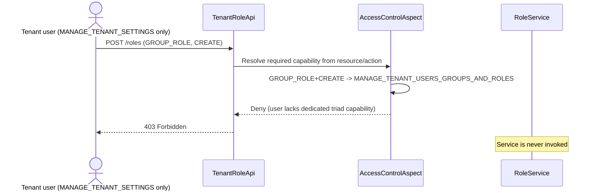
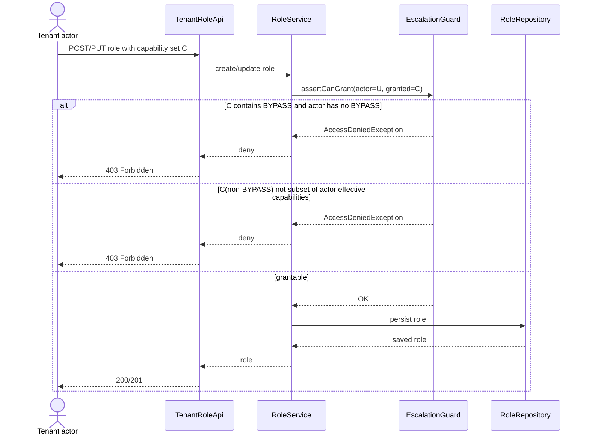
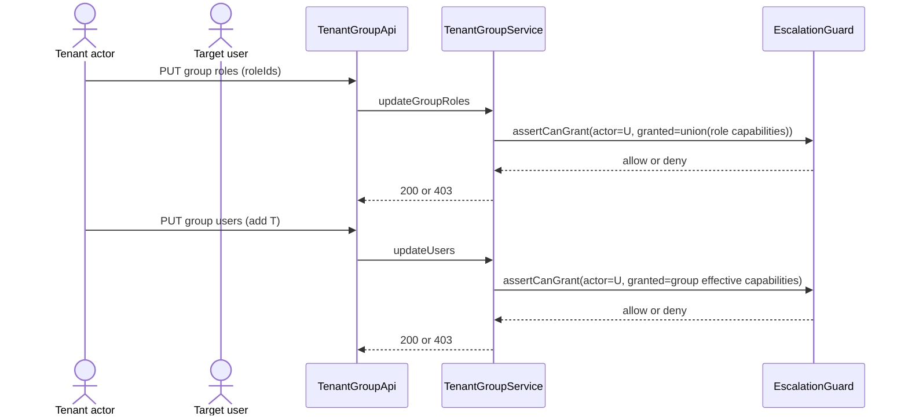
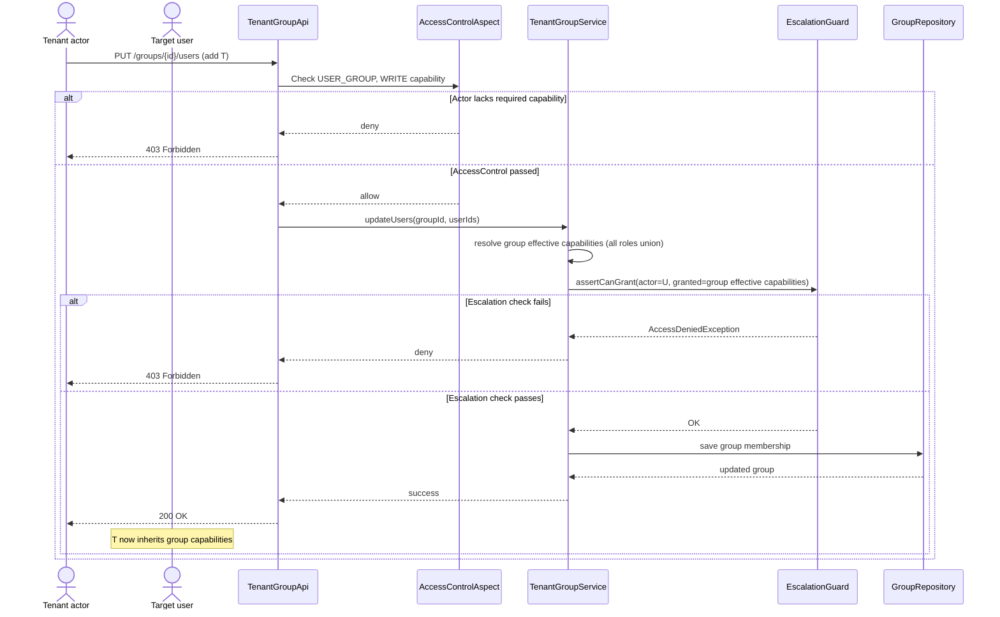
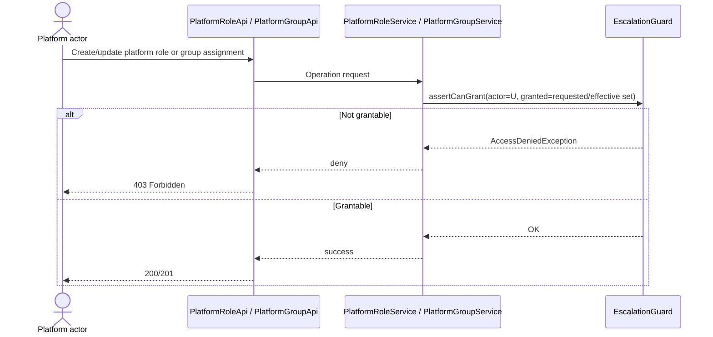

# RBAC Capability Segregation and No-Escalation — Technical Design (US.1/US.2/US.3)

## Scope

This design covers:

1. **US.1**: Extract tenant users/groups/roles permissions from `*_TENANT_SETTINGS` into a dedicated tenant triad.
2. **US.2**: Enforce tenant no-escalation (cannot grant capabilities you do not hold).
3. **US.3**: Enforce the same no-escalation rule on platform flows.

This document intentionally excludes implementation planning details.

## Design Goals

1. **Least privilege by capability shape**: tenant settings management must not implicitly grant identity and access administration.
2. **No privilege escalation**: role/group/user assignment operations cannot increase another user's effective privileges beyond the actor's own effective privileges.
3. **Parity**: tenant and platform paths use the same authorization model and guard semantics.

## Key Decisions

### 1. Dedicated tenant capability triad (US.1)

Create tenant-side equivalents of the existing platform triad:

- `ACCESS_TENANT_USERS_GROUPS_AND_ROLES`
- `MANAGE_TENANT_USERS_GROUPS_AND_ROLES`
- `DELETE_TENANT_USERS_GROUPS_AND_ROLES`

Move `USER`, `USER_GROUP`, and `GROUP_ROLE` resource-action pairs from `*_TENANT_SETTINGS` to the new triad.

### 2. Unified no-escalation guard (US.2 + US.3)

Apply one shared guard rule across tenant and platform operations where effective permissions may increase:

- Role create/update
- Attach roles to group
- Attach users to group

Guard principle:

- Actor must hold all non-`BYPASS` capabilities being granted.
- If granted set contains `BYPASS`, actor must literally hold `BYPASS` in the relevant scope.

> NOTE: A user can only give permissions they already have themselves.
> There is one special case: BYPASS.
> Even if someone has many normal permissions, they still cannot grant BYPASS unless they also personally have BYPASS.
> So the system checks:
> 1. For regular permissions: “Do you have all of these?”
> 2. If BYPASS is in the set: “Do you explicitly have BYPASS too?”

### 3. Update semantics (resolved)

For role updates, the guard is evaluated on the **full resulting capability set** (not diff-only additions).

Rationale:

- Prevents bypass through replacement payload tricks.
- Keeps behavior deterministic and consistent between create and update.
- Simplifies reasoning for tenant and platform parity.

## Authorization Flow Overview

1. **AccessControl gate** first validates operation-level capability (e.g., `GROUP_ROLE:CREATE` resolves to the new tenant triad capability after US.1).
2. **No-escalation guard** then validates grantability against actor effective capabilities.
3. **Business service** performs persistence only if both checks pass.

## Sequence Diagrams

### Flow A — Tenant role management denied after capability split (US.1)

### Flow B — Tenant role create/update with no-escalation guard (US.2)

### Flow C — Tenant group assignment path with transitive escalation check (US.2)

**Flow C clarification (resulting-state check):**

- For `updateGroupRoles`, `granted = union(role capabilities)` means:
  - compute the group role set **after** applying the request (`resultingRoles`),
  - then compute `resultingCapabilities = union(capabilities of resultingRoles)`,
  - then require actor `U` to be allowed to grant the full `resultingCapabilities` set.
- This includes capabilities from roles already on the group that remain, plus the newly added role(s).
- So when adding a new role to an existing group, the check is performed on the **entire resulting group capability set**, not only on the delta.
- For `updateUsers`, use the same principle: evaluate the target group's **current effective capabilities** (union of all roles currently attached to that group), then require actor `U` to be allowed to grant that full set before adding users.

### Flow D — Assign user to group (sequential AccessControl then no-escalation guard)

### Flow E — Platform parity with tenant guard semantics (US.3)

## Non-Goals

- No implementation task breakdown in this document.
- No rollout checklist, estimates, or ownership allocation.
