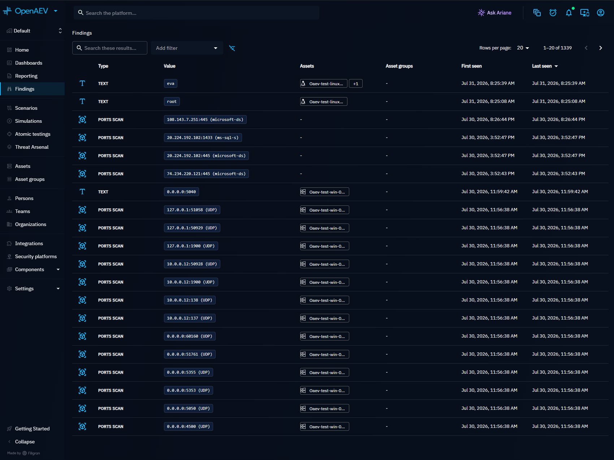
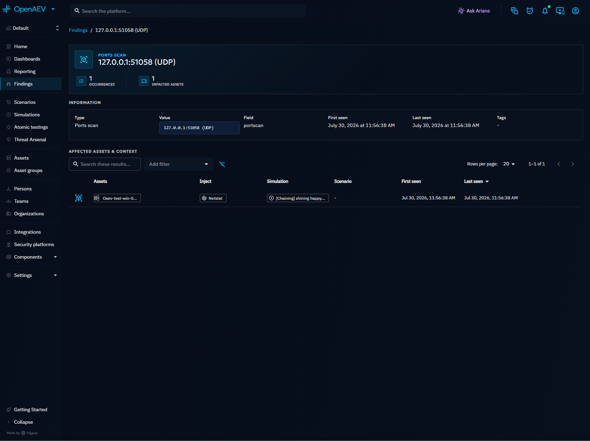

# Findings PoC: stable Findings, triage and Prowler (OCSF)

This branch (`denisemonreale-restore-prowler-findings-poc`) is a proof of concept that reworks how OpenAEV stores, displays and manages Findings. It introduces a stable Finding identity with a separate occurrence history (the "Triforce" model), an analyst workflow (triage, comments, archive) and a first cloud-posture source: Prowler results ingested as OCSF records.

!!! warning "Proof of concept"

    This branch is not production-ready. It is kept in sync with `main` and is meant to be demoed and reviewed. See [Known limitations](#known-limitations) before relying on any behavior described here.

## Why this PoC?

Findings on `main` are one row per detection. The same CVE found on ten hosts over five Simulations produces many rows, with no single place to decide what to do about it. This PoC explores how to turn Findings into a work queue:

- **One identity per issue**: re-detections and new locations attach to the same Finding instead of creating new ones.
- **Evidence is never overwritten**: every observation is kept as an occurrence with its own timestamp, location and raw payload.
- **Analysts can act**: triage a Finding with a justification, discuss it in comments, archive it, and keep an auditable history.
- **Cloud posture**: Prowler checks (AWS, GCP, Azure) appear next to network and Active Directory Findings, with remediation guidance.
- **Faster navigation**: a facet sidebar with live counts by severity, triage status, type, cloud provider and source.

## The PoC at a glance

| Part | What it adds | Section |
|---|---|---|
| Stable Finding model | `stable_findings` + `finding_occurrences` tables, identity key, Locations | [Concepts](#concepts) |
| Ingestion | Dual-write from Inject results into the stable model, OCSF output processor | [How Findings are ingested](#how-findings-are-ingested) |
| Prowler / OCSF | OCSF contract output type, Prowler source, cloud resource Locations | [Prowler and OCSF Findings](#prowler-and-ocsf-findings) |
| Findings page | Hero, Active/Archived tabs, list and grid views, facet sidebar, bulk actions | [Findings page](#findings-page) |
| Triage | Four statuses, transition rules, justification, history | [Triage](#triage) |
| Archive | Manual archive, archive-days setting, soft-delete job | [Archive](#archive) |
| Comments | Free-text discussion per Finding | [Comments](#comments) |
| Finding detail | Information, cloud details, evidence, remediation, timeline, raw response | [Finding detail](#finding-detail) |
| Permissions | `TRIAGE` and `ARCHIVE` actions, two new capabilities | [Permissions](#permissions) |
| Demo data | Seeder that runs real callbacks for Prowler and native Findings | [Demo data](#demo-data) |

## Try it locally

The branch uses the standard development environment described in [`openaev-dev/README.md`](openaev-dev/README.md).

1. Start the four mandatory containers (PostgreSQL, Silo, Elasticsearch, RabbitMQ) from `openaev-dev/`.
2. Create `openaev-api/src/main/resources/application-dev.properties` from the `.example` file and add:

    ```properties
    # Seed demo Prowler and native Findings at startup (dev profile only)
    openaev.dev.seed-findings=true
    ```

3. Build and start the backend with the `dev` profile, then start the frontend:

    ```bash
    mvn clean install -DskipTests -Pdev
    java -jar openaev-api/target/openaev-api.jar --spring.profiles.active=dev
    ```

    ```bash
    cd openaev-front && yarn install && yarn start
    ```

4. Open http://localhost:3001, log in with the admin account from `application-dev.properties`, and go to **Findings**.

!!! note "Database shared with other branches"

    The branch adds Flyway migrations (see [Data model and migrations](#data-model-and-migrations)). If your local database was migrated by another branch, Flyway may refuse to start. In a throwaway dev database you can add `spring.flyway.out-of-order=true` and `spring.flyway.ignore-migration-patterns=*:missing,*:future` to `application-dev.properties`.

!!! tip "Feature environment"

    The `test-feature-branch` GitHub workflow passes `OPENAEV_DEV_SEED-FINDINGS=true`, so a deployed feature environment (`https://feat-<branch>.oaev.staging.filigran.io`) comes with the demo data.

## Concepts

### Stable Finding, occurrence and Location

```
Stable Finding  (what was found)          e.g. s3_bucket_public_access, from Prowler
 ├── Occurrence (when and where)          2026-08-20, arn:aws:s3:::production-assets
 ├── Occurrence                           2026-08-20, arn:aws:s3:::public-assets
 └── Occurrence                           2026-09-03, arn:aws:s3:::production-assets
```

| Concept | Description |
|---|---|
| **Stable Finding** | One identity per tenant, source, type and value. It carries what analysts own: tags, archive state, first and last seen dates. Table `stable_findings`. |
| **Occurrence** | One observation of a stable Finding by one Inject at one point in time. It keeps the evidence: outcome, observed severity, resource details, MITRE ATT&CK techniques, remediation and the raw payload. Table `finding_occurrences`. |
| **Location** | Where an occurrence was observed: an **Asset**, a cloud **Resource**, a **User** or a **Team**. Informative Findings have no Location. A Location is part of the occurrence, never of the identity, so a new location adds an occurrence instead of creating a new Finding. |

The stable identity key is a SHA-256 of the tenant, the **source namespace**, the type and the value. The source namespace is `<injector id>/<contract output key>`; for OCSF records the source product (for example `prowler`) is appended, so similarly named rules from different scanners are never merged.

A re-detection appends an occurrence and refreshes the first/last seen dates. Replaying the same callback for the same Inject and Location does not create duplicates.

### Legacy Findings (dual-write)

The legacy `findings` table is still written and remains the rollback source. Each occurrence references the legacy Finding it comes from (`finding_occurrence_migrated_from`). Triage, comments and archive actions are stored on the legacy Finding and read back through the **latest** occurrence. This is why stable Finding outputs expose a `finding_legacy_id`.

### Actionable groups

Each stable Finding is classified into an analyst-oriented group (`stable_finding_aggregation_category`):

| Group | Contract output types |
|---|---|
| Surface & Reachability | Port, PortsScan, IPv4, IPv6, Computer |
| Identities | SID, Username, Admin username, Email |
| Credential Access | Credentials, account without password requirement, AS-REP-roastable account, Kerberoastable account |
| Privilege & Trust Structure | Group, Delegation |
| Exploitable Weaknesses | CVE, Vulnerability |
| Resources | Share, File |
| Configuration & Posture | Password policy, OCSF |
| Informative | Text, Number, action output, expectation signature, Asset |

### Severity

The severity shown on a Finding is a normalized bucket: **Critical**, **High**, **Medium**, **Low** or **Unknown**. It is the highest of:

- **Observed severity** of any occurrence. Labels (`critical`, `high`, `medium`, `low`) map directly. Numeric values are read as CVSS: ≥ 9.0 Critical, ≥ 7.0 High, ≥ 4.0 Medium, > 0 Low.
- **Asset criticality** of any Asset linked to an occurrence: Very high → Critical, High → High, Medium → Medium, Low → Low.

**Credentials** Findings are always **Critical**. **Unknown** is a real bucket and is never merged into Medium.

### Cloud provider

The cloud provider (AWS, GCP, Azure) comes from `resources[].cloud_partition` of OCSF records. A Finding only shows a provider when all its occurrences agree on a single one.

### Lifecycle

Each stable Finding has a lifecycle derived from the latest OCSF outcome: **Active**, **Review required** (`MANUAL`) or **Muted** (`MUTED`). Since only `FAIL` records are ingested today, live Findings are always **Active**.

## How Findings are ingested

Ingestion reuses the standard Inject execution callback; there is no separate import path.

1. An Injector returns structured output for a contract output marked as Finding-compatible.
2. The output processor for that output type validates each record and builds legacy Findings (unchanged behavior).
3. **New**: `StableFindingIngestionService` receives the same records, computes the identity key, finds or creates the stable Finding, resolves Locations and appends one occurrence per Location.
4. The stable Finding's first/last seen dates and lifecycle are recomputed from its occurrences.

Agent-produced Findings follow the same path through `ingestAgent`.

### Prowler and OCSF Findings

The PoC adds an `OCSF` contract output type and an `OCSFOutputProcessor`. Prowler output (`prowler … -M json-ocsf`) is expected to be forwarded unmodified through the execution callback.

| OCSF field | Used as |
|---|---|
| `metadata.event_code` | Finding value (the Prowler check id, for example `s3_bucket_public_access`) |
| `metadata.product.uid` / `name` | Part of the source namespace |
| `resources[]` | One `RESOURCE` Location per resource; key = `data.metadata.arn`, else `uid` |
| `resources[].cloud_partition` | Cloud provider |
| `severity` | Observed severity |
| `finding_info.title`, `finding_info.desc` | Title and description |
| `status_detail` | Evidence and status detail |
| `risk_details` | Risk details |
| `unmapped.compliance` | Compliance (`Framework: control, control; …`) and MITRE ATT&CK techniques |
| `remediation.desc`, `remediation.references` | Remediation |
| `cloud.account.uid`, `cloud.region` | Cloud account and region (fallback when the resource has none) |
| whole record | Raw response |

Resources are linked to existing Assets when an Asset's external reference matches the resource ARN.

OCSF outcome and OpenAEV triage are separate concepts:

| OCSF outcome (`status_code`) | Finding behavior |
|---|---|
| `FAIL` | Persisted as an active misconfiguration |
| `PASS` | Compliant; not persisted |
| `MANUAL` | Not persisted by the output processor |
| `MUTED` | Not persisted by the output processor |

OCSF Findings are labeled **Misconfig** in the list, the cards and the sidebar.

!!! note "Prowler Injector"

    A built-in **Prowler** Injector (`openaev_prowler`) is registered for every tenant so that Prowler Findings have a source name and icon. It has no executable contract yet: running Prowler from OpenAEV is out of scope for this PoC.

## Findings page

Navigate to **Findings** in the left menu. The page lists one row per stable Finding.



### Layout

- **Header**: the title with a **unique findings** counter, the view toggle, the export button and, for administrators, the **Finding settings** button.
- **Active / Archived tabs**: switching tabs clears the selection and reloads the list.
- **Facet sidebar** on the left, **search bar**, **Add filter** and filter chips above the results.

### List and grid views

The view toggle switches between a table and cards. The choice is remembered in the browser. List is the default.

| Column | Description | Sortable |
|---|---|---|
| Type | Finding type, for example CVE, Credentials, Misconfig | Yes |
| Value | Technical value in monospace, masked for sensitive Findings | Yes |
| Asset | Location(s) of the Finding | No |
| Source | Injector icon; the tooltip gives its name, or **Manual** | No |
| First seen | First detection | Yes |
| Last seen | Most recent detection (default sort, descending) | Yes |
| Triage status | Interactive triage chip | Yes |

In **grid view**, each card has a header colored by severity (Critical red, High orange, Medium yellow, Low green, Unknown grey), the type icon and severity, the value, the Location, the occurrence count, the last seen date and the triage chip.

Click a row or a card to open the [Finding detail](#finding-detail).

### Facet sidebar

| Section | Values |
|---|---|
| Severity | Critical, High, Medium, Low, Unknown |
| Triage status | Untriaged, Confirmed, False positive, Risk accepted |
| Type | Types present in the results |
| Cloud provider | AWS, GCP, Azure |
| Source | Injectors that produced the results (Prowler has its own icon) |

Each value shows how many Findings match. Checking values adds a regular filter: values in the same section are combined with **OR**. A value with no match is greyed out.

!!! tip "Counts stay useful while filtering"

    Each section ignores its own selection when counting, but applies every other filter and the search text. Selecting **High** therefore does not reset the other severities to zero, so you can add **Critical** in one click.

### Add filter

| Filter | Description |
|---|---|
| Type | Finding type |
| Severity | Normalized severity |
| Cloud Provider | Provider of the cloud resource |
| First seen / Last seen | Detection dates |
| Updated at | Last human action (triage, comment, archive) |
| Triage status | Current triage status |
| Source | Injector that produced the Finding |

**Last seen** only moves when a scanner detects the Finding again. **Updated at** only moves when someone acts on it.

### Export

The export button writes the currently loaded page to `Findings.csv`. Source, Assets and Asset groups are exported as names.

### Bulk actions

Select Findings with the checkboxes (or **Select all**, which applies to every page of the current query). A bar shows the selection count and offers:

- **Triage**: set Confirmed, False positive or Risk accepted, with one justification for the whole selection. Administrators can also **Revert to Untriaged**.
- **Archive** (Active tab) or **Un-archive** (Archived tab).

Each Finding is processed independently. If some cannot be updated, for example because the transition is not allowed, a summary dialog lists the failures and their reasons; the others are updated.

## Triage

Triage records the analyst's decision about a Finding. It is set from the triage chip in the list or on a card, or in bulk.

| Status | Meaning | Color |
|---|---|---|
| Untriaged | No decision yet (default) | Grey |
| Confirmed | The issue is real and must be handled | Red |
| False positive | The detection is wrong | Green |
| Risk accepted | The issue is real but accepted | Orange |

### Allowed transitions

| From | To |
|---|---|
| Untriaged | Confirmed, False positive |
| Confirmed | Risk accepted, False positive |
| False positive | – (final) |
| Risk accepted | – (final) |

Only administrators can **Revert to Untriaged** from any other status.

Every change requires a **justification** of 10 to 4000 characters. The confirmation dialog shows the transition (for example *Untriaged → Confirmed*) and a character counter.

### Triage history

Every triage change, archive and un-archive is recorded with its author, date and justification. The history is shown in the **Activity log** tab of the Finding detail. Entries without an author are shown as **System**.

## Archive

Archiving moves a Finding out of the **Active** tab without deleting anything.

- **Manual archive**: use the bulk **Archive** action. The Finding moves to the **Archived** tab and the action is logged in the triage history. **Un-archive** brings it back.
- **Archive after (days)**: administrators set this per tenant from **Finding settings** (default **30**). It defines when a Finding that has not been detected again is treated as archived.
- **Soft-delete**: a daily job (02:30) marks Findings that have stayed manually archived for longer than `openaev.finding.soft-delete-grace-days` (default **30**) as soft-deleted. Nothing is ever hard-deleted, and the Findings remain accessible from the Simulations that produced them.

!!! warning "Archive behavior differs between the two models"

    The **Archived** tab of the stable Findings page only shows **manually** archived Findings. The days-based rule and the soft-delete filter are applied by the legacy distinct search only. See [Known limitations](#known-limitations).

## Comments

The **Activity log** tab of the Finding detail lists comments, newest first, with author and date. Write a comment and click **Post**. Comments are limited to 4000 characters.

The API also supports editing (author only) and deleting comments, but the UI does not expose them yet.

## Finding detail

Click a Finding to open its detail page.



### Header

The type, the value, a **CVSS** chip when a score is known, and the counters **Occurrences**, **Asset** (distinct Locations) and **CVSS score** (CVE Findings).

### Information

Type, **Severity**, Value, Field, **Source**, First seen, Last seen, **Inject** (link to the Atomic testing or Simulation Inject when you have access to it) and Tags. CVE Findings also show the vulnerability panel from `main`.

### Prowler / OCSF sections

| Section | Content |
|---|---|
| Cloud details | Rule ID, Resource, Resource UID, Resource type, Service, Cloud provider, Cloud account, Cloud region, Compliance |
| Evidence | Description, Evidence, Status detail, Source finding ID |
| Attack context | Risk details, MITRE ATT&CK techniques |
| Remediation | Remediation text and references |

### Tabs

| Tab | Content |
|---|---|
| Timeline | Every occurrence, as a list or a timeline, with links to the Simulation and Scenario |
| Also Detected On | Distinct Locations of the Finding with their occurrence count and first/last seen dates |
| Raw response | The raw OCSF record, pretty-printed (OCSF Findings only) |
| Activity log | Comments and triage history |

## Permissions

| Action | Capability required |
|---|---|
| View Findings, comments, current triage status | `ACCESS_FINDINGS` |
| Post or edit a comment | `MANAGE_FINDINGS` (edit: author only) |
| Delete a comment | `DELETE_FINDINGS` |
| Change triage status, view triage history | `MANAGE_FINDING_TRIAGE` (new) |
| Revert to Untriaged | Administrator |
| Archive / un-archive | `MANAGE_FINDING_ARCHIVE` (new) |
| Read / change the archive-days setting | `ACCESS_TENANT_SETTINGS` / `MANAGE_TENANT_SETTINGS` |

!!! note "New capabilities are not granted by default"

    `MANAGE_FINDING_TRIAGE` and `MANAGE_FINDING_ARCHIVE` are hidden capabilities (like `MANAGE_FINDINGS`) and no default role receives them. In practice, triage and archive are available to administrators and users with the bypass capability.

## Demo data

When `openaev.dev.seed-findings=true` and the `dev` or `test-feature-branch` profile is active, `FindingDemoSeeder` creates demo Findings in the default tenant at startup. It sends real execution callbacks, so the data goes through the full ingestion pipeline. It is idempotent (injects are matched by title).

Every dataset is replayed over **three scans** (2026-08-20, 2026-09-03, 2026-09-17), so each Finding has a filled **Timeline**, and almost every Finding is observed on **at least two Locations**, so **Also Detected On** is filled too.

| Dataset | Injector | Content |
|---|---|---|
| Prowler synthetic | **Prowler** (`openaev_prowler_demo`) | 4 OCSF FAIL records on AWS account `123456789012`: public S3 buckets, IAM user without MFA, security group open to SSH |
| Prowler examples | **Prowler** (`openaev_prowler_demo`) | 24 OCSF records from [`finding-demo/prowler-ocsf-examples.json`](openaev-api/src/main/resources/finding-demo/prowler-ocsf-examples.json): the examples of the earlier `poc/FindingPage` demo, including real Prowler records, across **AWS, Azure, GCP and Kubernetes** |
| Native | **OpenAEV Demo Scanner** | Every native finding type on 5 Assets (Prod Payment Gateway, Internal API Server, Staging Web App, Dev Sandbox VM, Unclassified Legacy Host) |
| Triage | System | Confirmed, False positive and Risk accepted decisions on a few Findings, with their history |

### Covered finding types

| Type | Example values | Locations |
|---|---|---|
| PortsScan, Port, IPv4, IPv6 | `198.51.100.10:443 (https)`, `3389`, `2001:db8::10` | Port scans alternate Assets across scans; Port, IPv4 and IPv6 are informative (no Location) |
| Username, AdminUsername, Email | `alice`, `Administrator`, `it-support@demo.example` | 2 Assets each |
| Credentials | `alice`, `backup-operator`, `service-deploy` (masked) | 2 Assets each |
| AccountWithPasswordNotRequired, AsreproastableAccount, KerberoastableAccount | `guest-kiosk`, `legacy-svc`, `svc-backup`, `svc-sql` (from the second scan) | 2 Assets each |
| Group, Delegation, SID, Computer | `Domain Admins`, `svc-sql [Constrained] -> MSSQLSvc/db01.demo.local`, `S-1-5-21-…-500`, `SRV-LEGACY-01` | 2 Assets each |
| CVE, Vulnerability | `CVE-2023-44487`, `CVE-2024-3400` (latest scan only), `CVE-2024-6387`, `CVE-2021-44228` | 2 Assets each |
| Share, File | `\\files.demo.internal\Finance (READ)`, `payroll-2026.xlsx`, `.env` | 2 Assets each |
| PasswordPolicy | `MinimumPasswordLength`, `LockoutThreshold` | 2 Assets each |
| Text, Number, ActionOutput | Free-form text, numbers, command output | Informative (no Location) |
| OCSF (Misconfig) | 14 Prowler checks, for example `s3_bucket_public_access` on 5 buckets, `cloudfront_distributions_using_deprecated_ssl_protocols`, `storage_blob_public_access_level_is_disabled` (Azure), `apikeys_key_exists` (GCP), `apiserver_always_pull_images_plugin` (Kubernetes) | 1 to 5 cloud resources |

!!! note "About the Prowler examples"

    The three `s3_bucket_public_access` records on the `eu-west-staging-main-ff-oaev-openaev-*` buckets are real Prowler output. They were `PASS` results and are replayed as `FAIL` so that they appear as Findings. Checks that had a single resource in the original examples received a second, synthetic resource (marked `demo_source` in the file) to populate **Also Detected On**.

## Reference

### API

All endpoints also exist under `/api/tenants/{tenantId}/…`.

| Method | Path | Purpose |
|---|---|---|
| POST | `/api/stable-findings/search` | Search stable Findings |
| POST | `/api/stable-findings/facet-counts` | Counts by severity, type, cloud provider, triage status and source |
| GET | `/api/stable-findings/{id}` | Stable Finding detail |
| GET | `/api/stable-findings/{id}/summary` | First/last seen and distinct counters |
| GET | `/api/stable-findings/{id}/locations` | Distinct Locations |
| POST | `/api/stable-findings/{id}/occurrences/search` | Occurrence history |
| GET / PATCH | `/api/findings/{legacyId}/triage` | Read / change the triage status |
| PATCH | `/api/findings/triage/bulk` | Bulk triage |
| GET | `/api/findings/{legacyId}/triage/history` | Triage history |
| GET / POST | `/api/findings/{legacyId}/comments` | List / add comments |
| PUT / DELETE | `/api/findings/comments/{commentId}` | Edit / delete a comment |
| PATCH | `/api/findings/archive/bulk` | Bulk archive / un-archive |
| GET / PUT | `/api/tenants/{tenantId}/findings/settings/archive-days` | Archive-days setting |
| GET | `/csrf` | Issues the CSRF cookie needed by the new PATCH / PUT calls |

### Data model and migrations

| Migration | Adds |
|---|---|
| `V6_20260731130000000__Add_finding_triage` | `finding_triages`, `finding_triage_histories` (justification 10–4000), backfill to Untriaged |
| `V6_20260731140000000__Add_finding_comments` | `finding_comments` (≤ 4000 characters) |
| `V6_20260810144924000__Add_finding_cloud_misconfiguration_fields` | Severity, resource, cloud account/region, remediation, compliance on `findings` |
| `V6_20260811073211000__Add_finding_cloud_provider` | `finding_cloud_provider` |
| `V6_20260811091007000__Add_finding_human_updated_at` | `finding_human_updated_at` |
| `V6_20260812082950000__Add_finding_type_value_index` | Index for the type/value deduplication query |
| `V6_20260814163808000__Add_finding_archived_at` | `finding_archived_at` |
| `V6_20260817124500000__Add_finding_triage_history_action` | History action type: triage change, archive, un-archive |
| `V6_20260818090000000__Add_finding_soft_deleted_at` | `finding_soft_deleted_at` |
| `V6_20260819150900000__Add_finding_location_asset` | Location Asset on legacy Findings, merge of duplicates, new unique index |
| `V6_20260901170000000__Add_finding_raw_data` | `finding_raw_data` |
| `V6_20260917091900000__Add_triforce_finding_persistence` | `stable_findings`, `finding_occurrences` and their join tables, backfill of every legacy Finding with validation |

### Configuration

| Property | Default | Description |
|---|---|---|
| `openaev.dev.seed-findings` | `false` | Seed demo Findings (profiles `dev`, `test-feature-branch`) |
| `openaev.finding.soft-delete-grace-days` | `30` | Days a manually archived Finding stays before soft-delete |
| Tenant setting `finding_archive_days` | `30` | Archive after (days), set from the Findings page |

### Code map

| Area | Location |
|---|---|
| Model | `openaev-model/…/database/model/` — `StableFinding`, `FindingOccurrence`, `FindingTriage*`, `FindingComment`, finding enums |
| Facet counts | `openaev-model/…/database/repository/StableFindingRepositoryCustomImpl.java` |
| Ingestion | `openaev-api/…/service/finding/StableFindingIngestionService.java`, `output_processor/OCSFOutputProcessor.java` |
| Severity / risk | `openaev-api/…/service/finding/SeverityNormalizationService.java`, `RiskScoreService.java` |
| Read API | `openaev-api/…/api/finding/StableFindingApi.java`, `service/finding/StableFindingReadService.java`, `StableFindingMapper.java` |
| Workflow API | `openaev-api/…/rest/finding/FindingTriage*`, `FindingComment*`, `FindingArchive*` |
| Soft-delete job | `openaev-api/…/scheduler/jobs/FindingSoftDeleteJob.java` |
| Prowler | `openaev-api/…/injectors/prowler/`, `integration/impl/injectors/prowler/` |
| Demo data | `openaev-api/…/runner/FindingDemoSeeder.java` |
| UI | `openaev-front/src/admin/components/findings/` |

## Known limitations

- **Archive**: the stable Findings page only reflects manual archive. The days-based rule, the soft-delete job and the soft-delete filter only apply to legacy Findings; `stable_finding_soft_deleted_at` is set by the migration only.
- **Triage on the detail page**: the triage status and control are only available in the list and grid views, not on the detail page.
- **Lifecycle**: triage does not change the stable Finding lifecycle; live lifecycle comes from the OCSF outcome only.
- **Permissions**: the UI does not hide triage and archive controls from users who lack the capabilities; the server rejects the request.
- **Risk score**: `RiskScoreService` (severity × Asset criticality) is implemented and tested but not exposed yet.
- **Severity**: the SQL used for filters and facets accepts numeric severities above 10 as Critical, while the Java normalization treats them as Unknown.
- **Migration and live ingestion** use slightly different rules for the Informative category, Location fan-out and OCSF resource keys.
- **Labels**: the **Add filter** type picker shows OCSF as "Cloud" while the rest of the UI shows "Misconfig". Triage status labels are not translated in every language.
- **Comments**: no edit/delete UI and no character counter yet.
- **Export**: only the loaded page is exported, and the Asset column may be empty for stable Findings.
- **To verify**: Agent Findings ingestion (`ingestAgent`) links occurrences to a legacy Finding instance that is not yet persisted, and the triforce migration's validation error message does not format its counts.

## What's next?

- [Findings](docs/docs/usage/evaluate/findings/findings.md) — Official Findings documentation, updated on this branch
- [Inject results](docs/docs/usage/evaluate/injects/inject-result.md) — Where Findings come from
- [Assets](docs/docs/usage/build/assets.md) — Asset criticality and external references used by severity and OCSF matching
