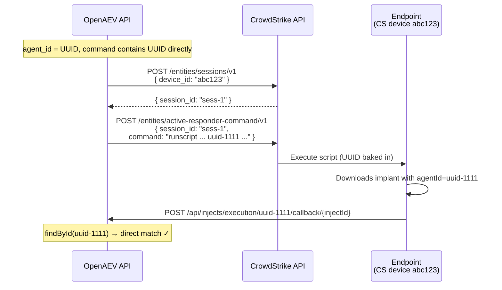
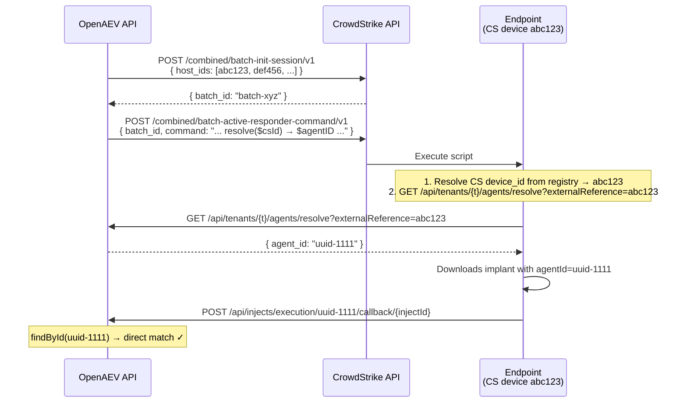

# ADR-001: CrowdStrike/SentinelOne multi-tenancy without batch processing API

|  |  |
| --- | --- |
| Status | Accepted |
| Related | https://github.com/OpenAEV-Platform/openaev/issues/6526 |
| Epic | https://github.com/OpenAEV-Platform/openaev/issues/4864 |

## 1. Context

OpenAEV supports CrowdStrike (CS) and SentinelOne (S1) executors that deploy implants on endpoints via their respective Real-Time Response APIs. The original design used the external device ID (CS `aid` / S1 `UUID`) as the `agent.id` primary key in our database. This allowed the CS/S1 batch API to send a single command containing a shell variable (`$agentID`) to all devices at once — each endpoint resolved its own device ID locally and used it as the callback identifier.

With multi-tenancy (#4864), this design causes **cross-tenant PK collisions**: when two tenants connect the same CS/S1 instance, both try to create agents with the same primary key (the external device ID). The second tenant's `save()` triggers a `merge()` that finds the first tenant's agent, leading to a composite FK violation on `(agent_executor, tenant_id)`.

The fix requires decoupling `agent.id` from the external reference — using a UUID as PK. But this breaks the batch processing design because the implant command can no longer use a shell variable that the endpoint resolves to a value our database recognizes as a PK.

## 2. Decision drivers

1. **Data isolation** — agents must not collide across tenants; composite FK `(agent_executor, tenant_id)` must hold
2. **Time to market** — the multi-tenancy epic is blocking; we need a working fix now
3. **Simplicity** — minimize divergence between executor types (CS/S1/PaloAlto/Tanium/OpenAEV)
4. **Performance** — CS/S1 batch API reduces API calls from 2×N to 2 for N devices
5. **Maintainability** — avoid dual-lookup fallback logic scattered across multiple services

## 3. Considered options

### Option A: Single-device API with UUID baked in command

Switch from CS batch API (`/combined/batch-*`) to single-device API (`/entities/sessions/v1` + `/entities/active-responder-command/v1`). Embed the agent UUID directly in each command. Each device gets its own unique command.

**Pros:**
- Eliminates all shell variable resolution (no OS-specific registry/CLI commands)
- Callback uses UUID → simple `findById()`, no fallback
- Aligns CS/S1 with all other executors (PaloAlto, Tanium, OpenAEV)
- Simpler codebase — no dual-lookup in 4+ services

**Cons:**
- 2 API calls per agent instead of 2 per batch of 2500
- Higher CS/S1 API rate-limit pressure at scale (1000 agents → 2000 calls)
- Pagination reduced from 2500 to 100

### Option B: Keep batch API with external-reference fallback

Keep `$agentID` shell variable, keep batch API. Use `Agent::getExternalReference` for CS `host_ids`. Add fallback lookup (`findFirstByExternalReference`) in callback/status services.
Explored in this [draft PR](https://github.com/OpenAEV-Platform/openaev/pull/6525)

**Pros:**
- Minimal CS API calls (2 per 2500 devices)
- No change to implant command structure

**Cons:**
- Requires fallback logic in 4+ services (`InjectExecutionService`, `BatchingInjectStatusService`, `InjectStatusService`, `InjectExpectationService`)
- Shell variable resolution remains (OS-specific, fragile)
- Divergent code path for CS/S1 vs all other executors
- More complex to reason about and test

> NOTE:
> **Follow-up issue to create**: Explore re-enabling batch processing for CS/S1 while keeping multi-tenant UUID-based agent IDs (Option C: HTTP-based UUID resolution on endpoint). This would restore batch efficiency for large-scale deployments. Track under the multi-tenancy epic #4864.

### Option C: Keep batch API with HTTP-based UUID resolution on endpoint

Keep batch API. Replace the shell self-discovery snippet with an HTTP call to a new OpenAEV endpoint that resolves `externalReference → agent UUID`. The implant then calls back with the UUID.

**Pros:**
- Keeps batch efficiency (2 CS API calls per 2500 devices)
- Callback uses UUID → no fallback logic needed
- No dual-lookup in Java services

**Cons:**
- 1 additional HTTP call per endpoint to resolve UUID
- Still requires OS-specific shell commands for CS device_id resolution
- New endpoint to maintain and secure
- More complex implant bootstrap (HTTP call before download)
- Needs network connectivity to OpenAEV at script-level (before implant starts)

## 4. Decision

We chose **Option A** (single-device API, UUID in command) because it prioritizes **simplicity and time to market** over batch performance.

This aligns CS/S1 execution with all other executors (PaloAlto, Tanium, OpenAEV agent) which already use per-device sessions with the agent UUID baked into the command. It eliminates fragile OS-specific shell snippets and removes the need for any fallback lookup logic.

### What this means concretely

1. **`agent.id`** is always a random UUID — never the external reference
2. **`agent.externalReference`** stores the CS/S1 device ID — used only for CS/S1 API registration calls
3. CS/S1 `ExecutorContextService` creates **one action per agent** (not one per OS group)
4. CS client switches from `/combined/batch-*` to `/entities/sessions/v1` + `/entities/active-responder-command/v1`
5. Command string contains the actual UUID: `"... download?agent=uuid-1111 ..."`
6. Migration reassigns UUIDs to existing agents where `agent_id = agent_external_reference`, cascading to all child tables

### API call volume at scale

| Agents | Old (batch) | Option A (single) |
|--------|-------------|-------------------|
| 10 | 2 calls | 20 calls |
| 100 | 2 calls | 200 calls |
| 1000 | 2 calls | 2000 calls |
| 5000 | 4 calls | 10000 calls |

This is acceptable for now. CS/S1 rate limits are generous for RTR APIs, and the 5-second stagger between pagination batches (100 per batch) mitigates burst pressure.

## 5. Consequences

### Positive

- Multi-tenancy works correctly — no PK collisions, no composite FK violations
- Unified execution model across all executor types
- Simpler codebase — no shell variable resolution, no dual-lookup services
- Easier to test — no OS-specific behavior to mock

### Negative / trade-offs

- Higher CS/S1 API call volume (2×N instead of 2 per batch)
- At very large scale (>5000 agents per inject), may need to revisit rate-limit handling
- Existing CS/S1 agents require a data migration (PK reassignment + FK cascade)

### Neutral

- The implant binary itself is unchanged — only the bootstrap command changes
- Callback endpoint contract is unchanged (still `POST /api/injects/execution/{agentId}/callback/...`)
- OpenAEV agent, PaloAlto, and Tanium executors are unaffected

---

