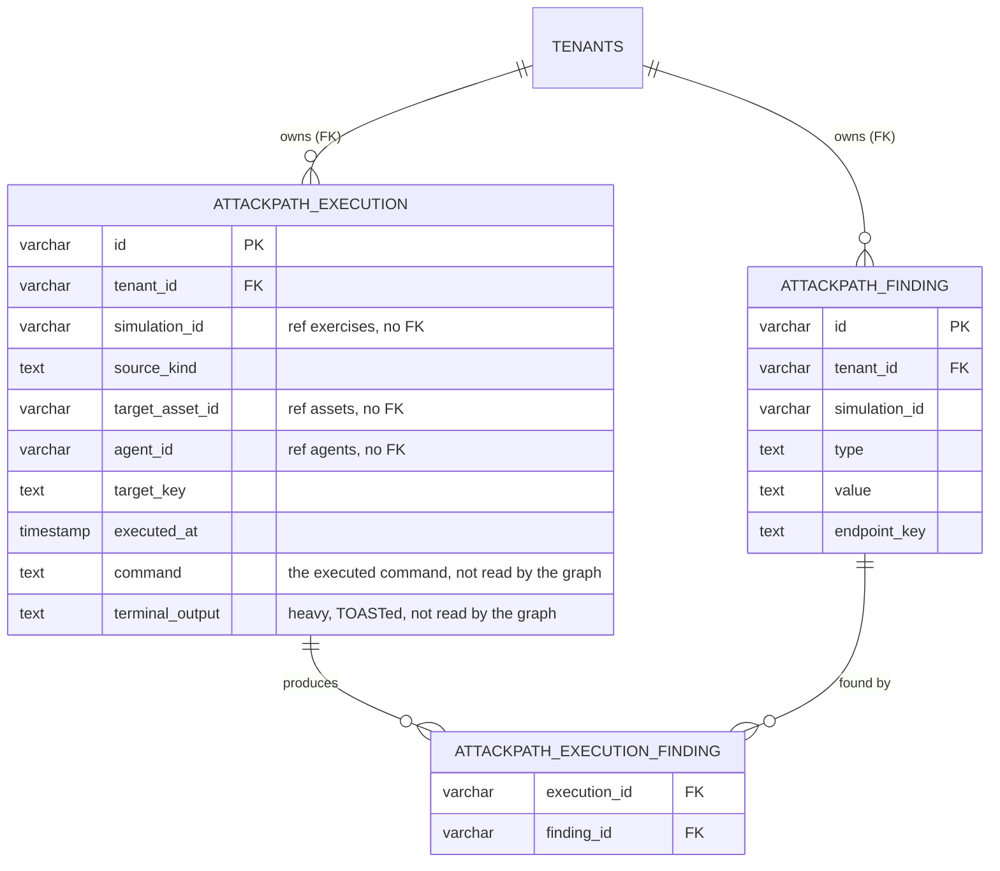
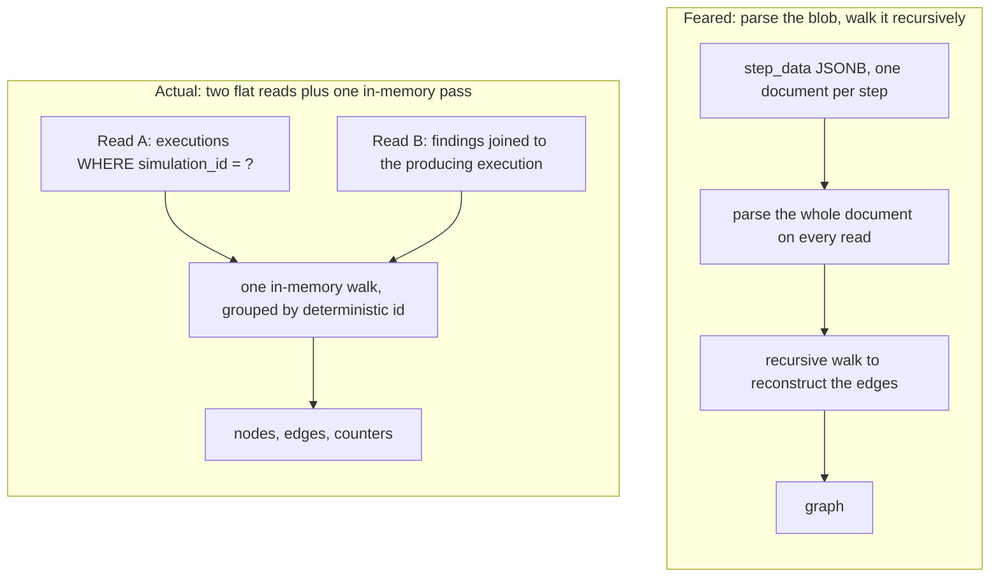

# ADR-003: Attack path execution store on PostgreSQL

|  |  |
| --- | --- |
| Status | Accepted (POC-backed) |
| Related | https://github.com/OpenAEV-Platform/openaev/issues/6647 |

> **In one paragraph.** The attack-path view rebuilds a graph of what a simulation did (which injector
> hit which endpoint, what it found). Today that data lives in a JSONB blob (`step_data`) that is slow to
> read and impossible to index well. We decided to store it instead in three small, normalized
> PostgreSQL tables, so the graph rebuilds from two flat, indexed reads with no recursion. A proof of
> concept measured this at scale; the numbers and the trade-offs are below. A hands-on guide for building
> on it is in `docs/docs/development/attack-path.md`.

## 1. Context

The attack path view rebuilds an interactive graph of what a chaining simulation did: which injector hit which endpoint, what each execution found, and how it all links together. Today the chaining engine stores each step as a serialized `Inject` object inside one JSONB column, `step_data`.

That blob is a weak base for the attack path:

- Every update rewrites the whole document, which causes write amplification and table bloat.
- Reading one value means parsing the whole document.
- There is no clean index to aggregate or to read a single field cheaply.

We want a source of truth for the attack path that rebuilds the graph from flat, indexed reads, stays correct under multi-tenancy v2, and does not add operational weight we cannot justify yet.

## 2. Decision drivers

In order of importance for this decision:

1. Read performance at scale. The graph is rebuilt per simulation, and a simulation can be large (a real credential spray touches a thousand endpoints).
2. Source-of-truth correctness. Executions are written transactionally as a simulation runs, and an execution links to its findings.
3. Tenant isolation. The store must plug into multi-tenancy v2 (the statement inspector), not carry its own scheme.
4. Operational simplicity. OpenAEV already operates Elasticsearch, so the real cost of an ES-backed store is not standing up a new datastore but running and keeping a second copy of the truth in sync; prefer not to add that.
5. Time to market. This is a proof of concept and should reuse the existing stack.

## 3. Considered options

### Option A: Keep the JSONB blob, index on top

Leave the data in `step_data` and add expression or GIN indexes to query it.

**Pros**: no schema change, no migration, minimal code.
**Cons**: every read still parses the whole document; updates still rewrite the whole blob; partial reads (reading only the short columns and never the heavy terminal output) are impossible; aggregation stays awkward. This keeps exactly the weaknesses we set out to remove. Restructuring `step_data` itself (adding structured fields inside it, rather than indexing it) hits the same wall: it stays one JSONB document per step, so a write still rewrites the whole document and a read still parses it, it couples the attack-path store to the chaining engine's `step_data` schema (so it cannot be added or dropped independently), and it still gives no real join between an execution and its findings.

### Option B: Normalized PostgreSQL tables as the source of truth

Model the attack path in three additive, prefixed tables: `attackpath_execution` (one row per source-to-target edge, carrying the run snapshot), `attackpath_finding`, and `attackpath_execution_finding` (the link). Rebuild the graph from two flat indexed reads plus one in-memory pass.

**Pros**: flat, indexed, per-simulation reads; partial reads (the graph read never selects the `command` or `terminal_output` columns; `terminal_output` is the heavy one that stays TOASTed off-row, `command` is generally much smaller); a real join between an execution and its findings; tenant isolation through the existing inspector; no new datastore; aggregation is a plain indexed `GROUP BY`.
**Cons**: a schema and a migration; for the POC the endpoint status is denormalized onto the execution row; isolation from the engine means no hard foreign keys to the real product tables; rebuilding the whole graph of a very large single simulation is expensive (see the measured numbers below).

### Option C: Elasticsearch as the source of truth

Put the execution and finding data in Elasticsearch and rebuild from it.

**Pros**: fast aggregations over huge, mixed corpora; horizontal scale.
**Cons**: no ACID writes; no real joins, so execution and finding would be denormalized into one document, which re-introduces the write amplification and whole-document reads we are trying to remove; a different tenancy model; and a second datastore to operate and keep in sync with the truth. Rejected as the source of truth. It stays a plausible read index for later (see Consequences, Neutral).

## 4. Decision

We chose **Option B** because it is the only option that gives flat, indexed, per-simulation reads and partial reads while staying transactional, joinable, tenant-isolated, and on the existing stack.

### The model

Three tables, additive and droppable, prefixed `attackpath_*`. Reference ids (simulation, asset, agent, contract) are plain columns, frozen at execution time, never resolved against the live entities at rebuild. The one real foreign key is to `tenants`, because that is what the inspector enforces isolation through.

### The rebuild

The feared cost was one giant recursive query over a document. The actual rebuild is two flat reads plus one in-memory pass, with no recursion and a constant number of SQL statements regardless of graph size.

Read A becomes the edges and the injector and endpoint nodes; Read B becomes the finding nodes; the single walk turns them into `{ nodes, edges, counters }` with deterministic ids, and the counters are accumulated in that same walk (no extra query).

### Access rules

- Reads go through Hibernate as JPQL projections that select only the short columns. The benchmark measured the ORM overhead against a native query through Hibernate as negligible, so no native fallback was needed and the evidence-gated escape hatch stayed closed.
- One deliberate exception, recorded here: the bulk seed generator writes with batched, multi-row raw JDBC that bypasses the inspector. This is safe because the inspector adds no guarantee to a plain `INSERT ... VALUES` (it passes those through unchanged) and the seed sets `tenant_id` explicitly on every row. Going through the inspector was measured at about 1,500 rows per second (it parses every statement), which would make the full dataset (about twenty million rows once findings and links are counted) take about four hours; the raw-JDBC path is about seventeen times faster. The bypass is admin-only, flag-gated, and isolated to the seed service.

### Evidence

Measured single-run, on a dev machine, local PostgreSQL. Full detail in the POC `results.md`.

- Per-simulation full rebuild: a ~30k-execution simulation is about 0.75 s (p50) at 5M total. Note ~30k is above the 20k collapse threshold, so the auto mode serves this size *collapsed* (sub-second, see below), not full; the 0.75 s is the full-rebuild cost that auto avoids at this scale. The deliberate outliers are about 1.4 s (100k), 3.8 s (300k), and 6.3 s with about 3.2 GB of heap (500k).
- The collapsed (aggregated) mode is the lever for large simulations: forcing it on the 500k outlier is about 1.2 s and 16 MB of heap, roughly 5x faster and 200x less heap. Its `GROUP BY` is one indexed scan producing about 2,050 endpoint groups from 500k rows in about 577 ms, so the front renders ~2,050 nodes rather than 500k, and a single endpoint's detail is a bounded read (about 0.18% of the rows, a few milliseconds).
- The short-column read is worth about 2x: the 500k read is 1.3 s, versus 2.5 s for a `SELECT *` that detoasts the heavy columns.
- The read plan is a bounded index scan on the `simulation_id` index, no recursion. The single-column `simulation_id` index turned out redundant (the composite `(simulation_id, target_key)` covers the read) and was removed.

## 5. Consequences

### Positive

- Flat, indexed, per-simulation reads. The graph read never pays for the `command` or `terminal_output` columns (`terminal_output` is the heavy, TOASTed one).
- Deterministic, collision-safe node and edge ids computed at read time.
- Tenant isolation is the platform's, not a bespoke one: entities are `TenantBase`, the tables are in `openaev.tenant.active-tables`, and the inspector rewrites every read with `can_access_tenant`.
- No new datastore to operate. Aggregation, when needed, is a plain indexed `GROUP BY`.

### Negative and trade-offs

- For the POC the endpoint status is denormalized onto the execution row rather than resolved live.
- No hard foreign keys to the real product tables (self-contained and droppable), so referential integrity to `exercises`, `assets`, and `agents` is not enforced by the database.
- Date partitioning by `executed_at` does not speed the per-simulation read (that read is keyed on `simulation_id`); its only value is cheap retention (`DETACH` or `DROP` a period).
- Rebuilding the whole graph of a very large single simulation is expensive (seconds and gigabytes of heap for the outliers), and per-simulation cost is not volume-independent once the wide-row table outgrows cache. This is addressed by a two-mode read: full for small and medium simulations, and a DB-aggregated collapsed mode for large ones (endpoint groups, grouped edges, and counters computed with a `GROUP BY`, never materializing the rows), which brings a 500k simulation from about 6.3 s to about 1.2 s and about 16 MB of heap (roughly 5x faster, 200x less heap) and makes it renderable. Collapsed removes the JVM materialization cost, not the underlying database scan, so it is about 1.2 s, not sub-second; sub-second on a giant simulation would need a pre-computed rollup, which is out of scope. A very large spray can still have a high endpoint count (about 2,050 for a 500k simulation), where front-side endpoint clustering is the direction. The `?mode=full` override the front exposes bypasses the collapse threshold, so a forced full rebuild of a large simulation still pays the full heap, and several concurrent ones would multiply it on the shared JVM; a production version would cap forced-full by size (reject rather than allocate unboundedly). The POC endpoint is admin-only and flag-gated, so this is a production-hardening item, not a POC risk.
- The seed bypasses the inspector (raw JDBC). Justified and isolated above, but it is a real exception to the "everything through Hibernate" rule and must not spread to the read path.

### Neutral

- Elasticsearch stays a plausible read index for later. The day the product wants cross-simulation analytics with free-form filters over the whole history, an Elasticsearch or materialized-view read model fed from PostgreSQL is the right shape. It is out of scope for the MVP, and single-simulation aggregation (the counters, the collapsed view) is cheap in PostgreSQL, so it is not added now. (OpenAEV already operates Elasticsearch — an `EsAttackPathService` reads MITRE attack-pattern data from it for dashboards, a separate concern from this per-execution store — so an ES read model here would be a second copy to keep in sync, not a new datastore to stand up. The rejection of ES as the *source of truth* rests on ACID, real joins, and the tenancy model, not on the operational cost.)

## Scope boundary

This ADR covers the POC's store, rebuild, and per-simulation read performance. It does not cover, and the POC does not validate:

- Ingestion from the real chaining engine (feeding these tables from real executions, and the blast radius of pulling fields out of `step_data`). This is the number-one next step.
- A production model. In production the finding side already exists (the real `findings` table, `ContractOutputType`, `findings_assets`), so a production implementation would reuse and extend it. The genuinely new relational object is the per-execution edge that lives in `step_data` today, which becomes `attackpath_execution`.
