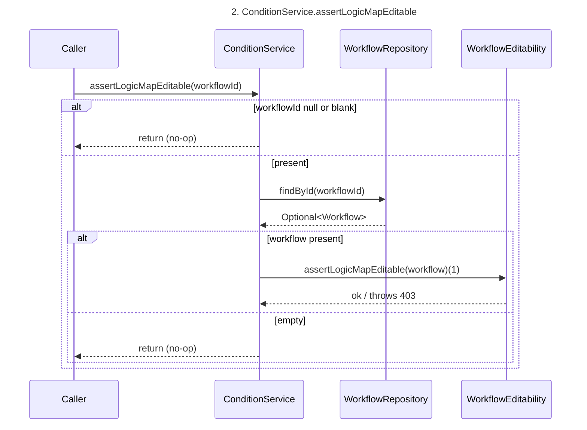
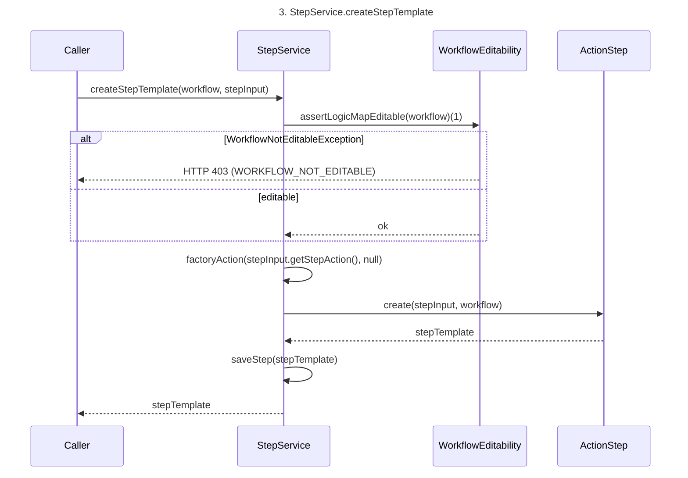
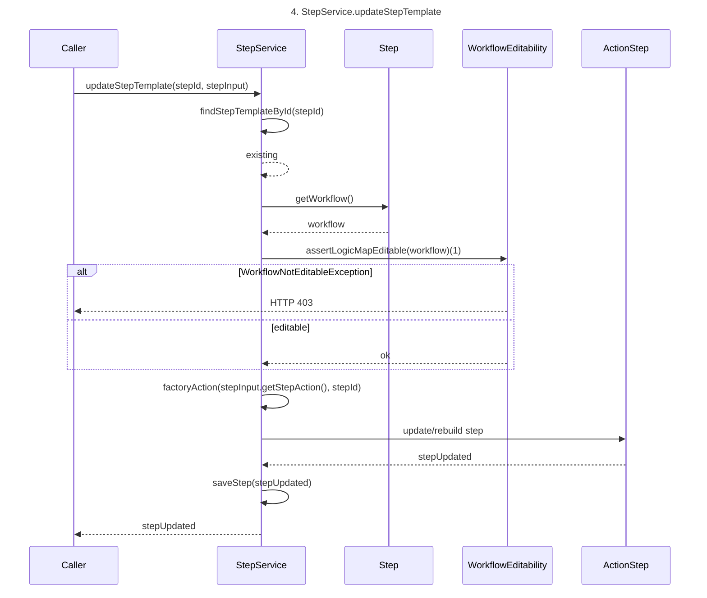
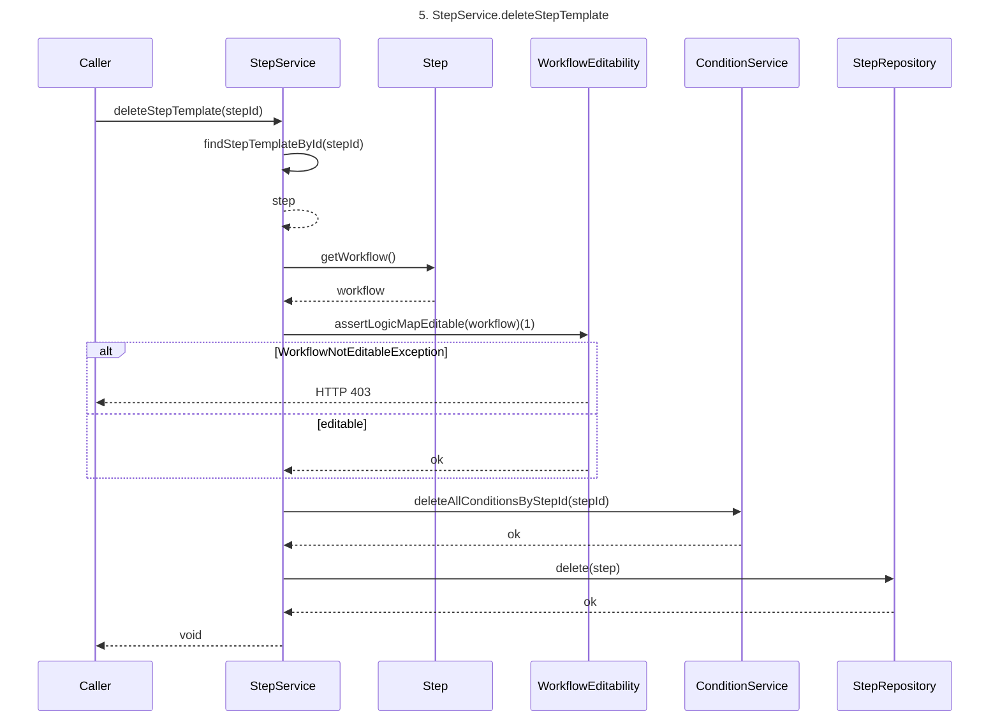
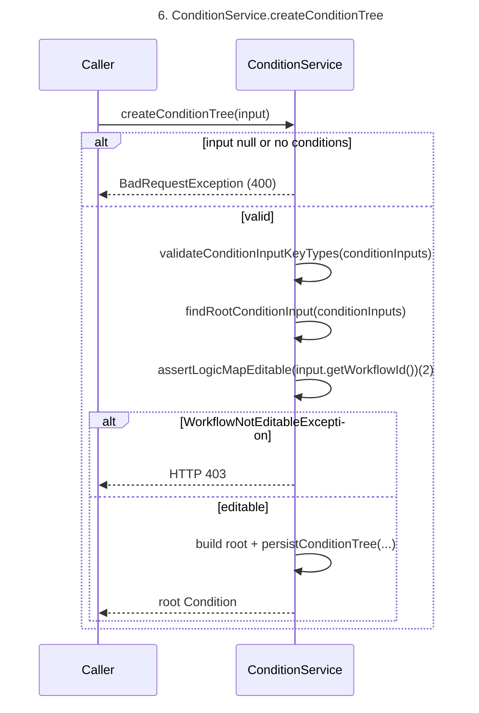
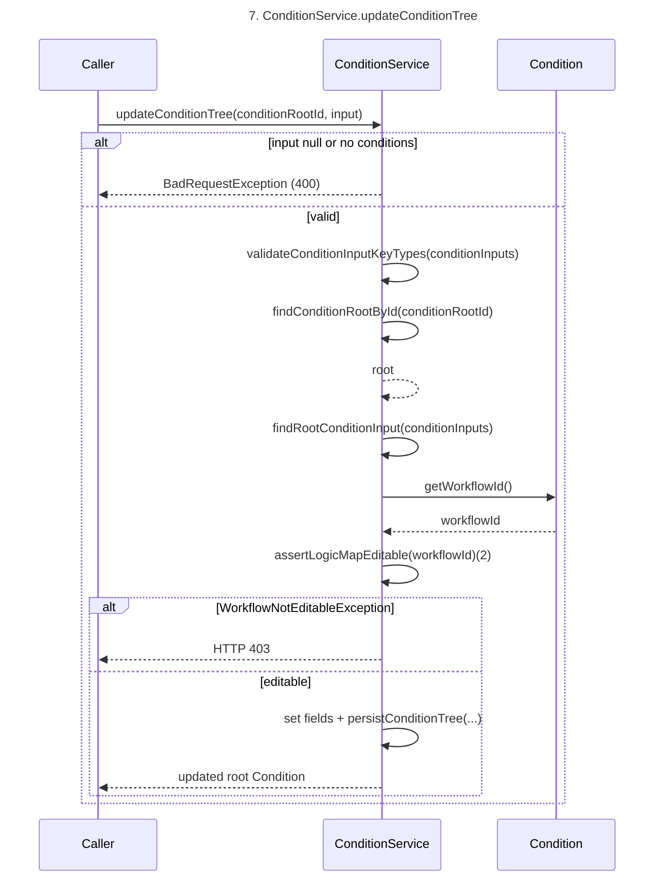
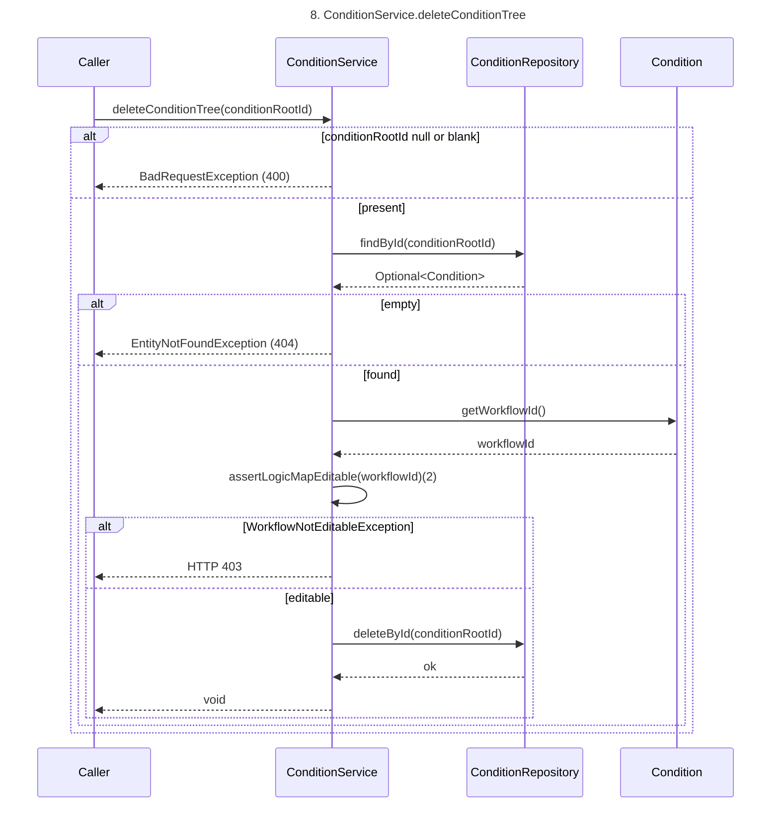
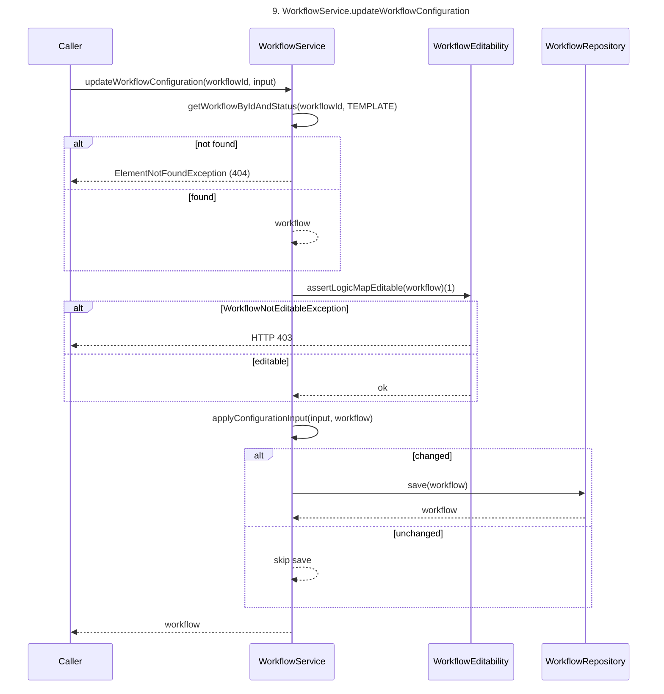
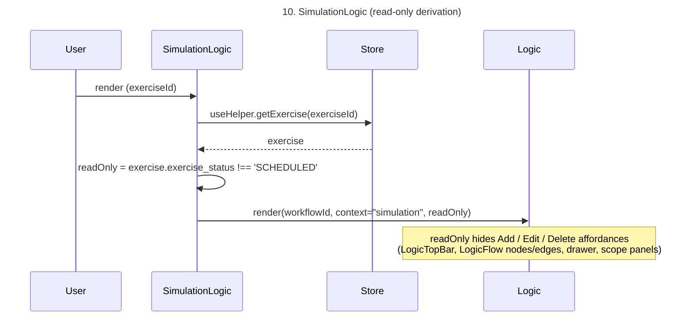
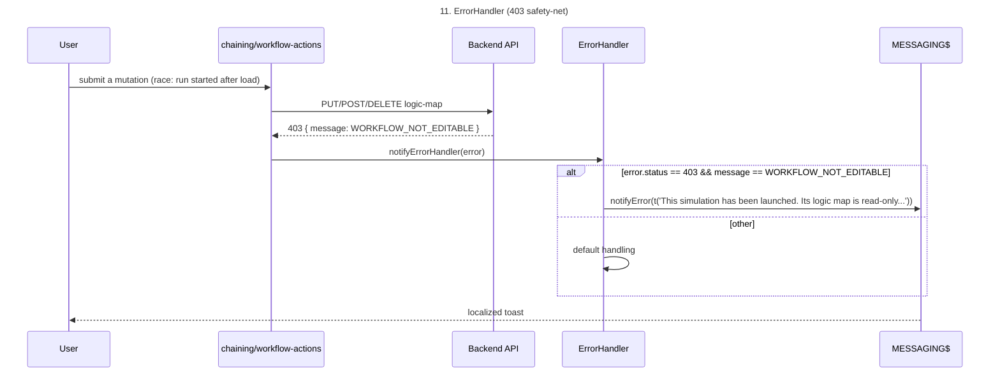

# ADR-005: Simulation logic-map is editable only while the simulation is SCHEDULED (frozen once launched)

|         |                                                        |
| ---     |--------------------------------------------------------|
| Status  | Accepted                                               |
| Related | https://github.com/OpenAEV-Platform/filigran-private/issues/245|

## 1. Context

The chaining "logic map" attached to a simulation — step templates, condition trees (event and
mapping conditions) and workflow configuration (scope rules, scope variables, timeout,
rate-limit, safe mode) — is stored on the simulation's workflow TEMPLATE.

Scope rules, scope variables, timeout, rate-limit and safe mode are already copied into the
workflow RUN at launch, so template edits never reach a run for those parts. The step templates
and conditions, however, are NOT copied: runtime steps are cloned from the templates as the run
progresses, so editing them during an active run can silently change the semantics of a run that
is already in progress.

This concerns simulation-attached workflows only. A scenario's logic map is already isolated:
launching a scenario copies its step templates and conditions into a brand-new simulation
template (`launchWorkflowScenario` → `stepService.copyStepTemplate(...)`), so scenario edits
never affect a running simulation.

A simulation has a well-defined lifecycle (`ExerciseStatus`: SCHEDULED → RUNNING → FINISHED /
CANCELED; chaining simulations are never PAUSED). The editable phase is before launch, i.e.
while the simulation is SCHEDULED — the state the UI shows as "Draft" (SCHEDULED with no start
date) or "Scheduled" (SCHEDULED with a start date). This is the same gate the platform already
enforces for other pre-launch operations (`ExerciseApi`). Resetting a simulation returns it to
SCHEDULED (clearing its start date), which naturally re-opens the logic map for editing.

## 2. Decision drivers

- Data correctness: a launched simulation must never be semantically altered mid-flight (top priority)
- Consistency with the existing simulation lifecycle (SCHEDULED = editable, already enforced elsewhere)
- Operational simplicity / time to market (a guard vs a full versioned freeze-copy)
- No regression on scenario editing (already isolated by copy-on-launch)
- Reproducibility: a launched simulation is an immutable record of what was run

## 3. Decision

We choose the **status-guard** approach: a launched simulation must not move — it is an immutable
record of what was executed, and any change must go through the scenario followed by a new
execution. This closes the data-correctness gap with a guard consistent with the SCHEDULED
lifecycle already enforced platform-wide, without a versioned freeze-copy of the logic map into
the run — unnecessary since concurrent editing of a live run is explicitly not a goal.

Concretely:
- The logic map (step templates, condition trees, workflow configuration) is mutable **only when
  the owning simulation's status is `SCHEDULED`** (UI "Draft" and "Scheduled" are both SCHEDULED).
- The guard is enforced in the **service layer** (StepService, ConditionService, WorkflowService)
  so every entry point is covered — REST controllers, internal calls, future callers — not only
  the current endpoints.
- We **block everything** in the logic map for consistency (steps + conditions + configuration),
  even the parts already frozen at launch (scope/config), so the rule is simple and predictable.
- Scenario-owned workflows (no simulation) are unaffected and remain fully editable.
- To edit a launched simulation, the user **resets** it (returns it to SCHEDULED, which clears the
  start date and re-opens editing) or edits the **scenario** and re-executes it.
- Chaining simulations are never PAUSED; should PAUSE become possible later, the logic map stays
  non-editable in that state — SCHEDULED remains the sole editable status.

### Backend enforcement
A single guard `WorkflowService.assertLogicMapEditable(workflowTemplate)` resolves the owning
simulation from the workflow TEMPLATE (`workflow.getSimulation()`); when it is `null` (scenario)
it allows the edit, otherwise it requires `status == SCHEDULED`. It is called from
`StepService` (create/update/delete template), `ConditionService` (create/update/delete tree)
and `WorkflowService.updateWorkflowConfiguration`. The launch-time `copyStepTemplate` is exempt
by design (it populates a fresh, still-SCHEDULED simulation template).

### Error handling
A dedicated `WorkflowNotEditableException` is raised by the service layer and mapped to **HTTP 403
Forbidden** (a forbidden state-transition, not an RBAC denial) via the existing
`@RestControllerAdvice`, reusing the standard error payload. It carries a **stable machine-readable
code** (`WORKFLOW_NOT_EDITABLE`, consistent with other coded 403s such as `TENANT_ACCESS_DENIED`),
which the frontend maps to a localized message in `ErrorHandler.tsx`.

### Frontend behaviour (read-only mode)

The chaining "logic map" screen becomes read-only whenever the owning simulation is not
SCHEDULED. Scenario logic maps are never read-only.

- **Read-only derivation.** The simulation page already exposes `exercise_status` from the store.
  `SimulationLogic` computes `readOnly = exercise_status !== 'SCHEDULED'` and passes it to `Logic`;
  `ScenarioLogic` always passes `readOnly = false`.
- **Propagation.** `Logic` forwards `readOnly` to the editing surfaces, which disable or hide their
  mutating controls:
  - `LogicTopBar` / `AddComponentButton`: "Add component" and "Add compatible action" hidden/disabled
  - `LogicFlow` nodes/edges: step/event editing, edge deletion (`DeletableEdge`) and node popovers
    (`NodePopover`) disabled
  - `ChainingFlowConfiguration` and its drawer: save actions disabled
  - Scope panels (`ScopeRules`, `ScopeVariables`, `ScopeRateLimit`, `ScopeTimeOut`): rendered read-only
- **Information banner.** When `readOnly`, `LogicWarningBanner` shows a translatable message, e.g.
  *"This simulation has been launched. Its logic map is read-only. Reset the simulation to edit it,
  or update the scenario and run it again."*
- **Safety net.** The frontend guard is a UX affordance, not the source of truth. Write actions
  (`chaining-actions`, `workflow-actions`) let the backend 403 propagate and surface its message as
  a toast, covering the race where a run starts between page load and submit.

## 4. Consequences

### Positive
- A launched (RUNNING / FINISHED / CANCELED) simulation's logic map is immutable → runs can never
  be altered mid-flight, and each launched simulation is a faithful record of what ran.
- One simple, predictable rule aligned with the existing SCHEDULED gate, enforced server-side and
  mirrored by a clear read-only UI.
- No data-model change, minimal surface, fast to ship.

### Negative / trade-offs
- No concurrent "prepare the next version" while a run is active; iterating means resetting the
  simulation or editing the scenario and re-executing.

### Neutral
- Scenario editing unchanged. The existing scope/config copy-on-launch isolation is unchanged
  (now also covered by the guard for consistency).

## 5. Sequence diagrams

One Mermaid diagram per method, numbered by name. When a method calls another method that has its
own diagram, it is referenced by appending `(N)` to the method call (e.g.
`assertLogicMapEditable(workflow)(1)`) instead of being re-expanded. Each
```mermaid``` block is self-contained so it can be rendered to an image.

Index:
1. `WorkflowEditability.assertLogicMapEditable(Workflow)`
2. `ConditionService.assertLogicMapEditable(String)`
3. `StepService.createStepTemplate(...)`
4. `StepService.updateStepTemplate(...)`
5. `StepService.deleteStepTemplate(...)`
6. `ConditionService.createConditionTree(EventInput)`
7. `ConditionService.updateConditionTree(String, EventInput)`
8. `ConditionService.deleteConditionTree(String)`
9. `WorkflowService.updateWorkflowConfiguration(String, WorkflowConfigurationInput)`
10. `SimulationLogic` — read-only derivation (frontend)
11. `ErrorHandler` — 403 safety-net (frontend)

### 5.1. WorkflowEditability.assertLogicMapEditable

```mermaid
sequenceDiagram
title 1. WorkflowEditability.assertLogicMapEditable
    participant Caller
    participant WorkflowEditability
    participant Workflow
    participant Exercise

    Caller->>WorkflowEditability: assertLogicMapEditable(workflowTemplate)

    alt workflowTemplate == null
        WorkflowEditability-->>Caller: return (no-op)
    else present
        WorkflowEditability->>Workflow: getSimulation()
        Workflow-->>WorkflowEditability: simulation
        alt simulation == null (scenario-owned)
            WorkflowEditability-->>Caller: return (editable, isolated by copy-on-launch)
        else simulation present
            WorkflowEditability->>Exercise: getStatus()
            Exercise-->>WorkflowEditability: status
            alt status != SCHEDULED
                WorkflowEditability->>WorkflowEditability: throw WorkflowNotEditableException(WORKFLOW_NOT_EDITABLE)
                WorkflowEditability-->>Caller: HTTP 403
            else status == SCHEDULED
                WorkflowEditability-->>Caller: return (editable)
            end
        end
    end
```

### 5.2. ConditionService.assertLogicMapEditable



### 5.3. StepService.createStepTemplate



### 5.4. StepService.updateStepTemplate



### 5.5. StepService.deleteStepTemplate



### 5.6. ConditionService.createConditionTree



### 5.7. ConditionService.updateConditionTree



### 5.8. ConditionService.deleteConditionTree



### 5.9. WorkflowService.updateWorkflowConfiguration



### 5.10. SimulationLogic — read-only derivation (frontend)



### 5.11. ErrorHandler — 403 safety-net (frontend)




