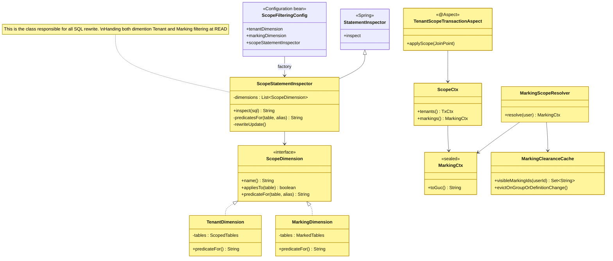
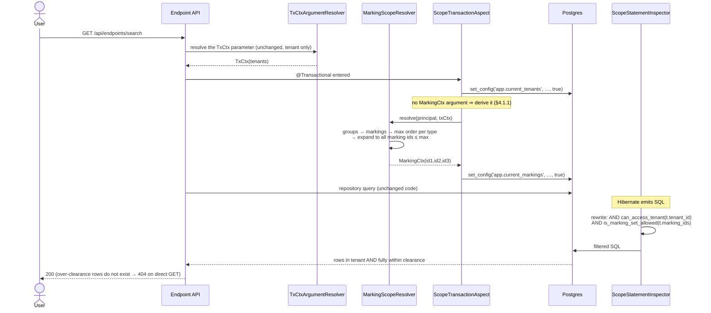

# Option C — Marking isolation "à la" tenant v2 

> This document covers the generic SQL-rewrite mechanism (`ScopeDimension`, `ScopeStatementInspector`) and
> its asset-side data model (Task 3). Group clearance — `groups_markings`, `MarkingScopeResolver`,
> `MarkingClearanceCacheManager` and the group assign/unassign write path — is Task 2's own scope and is
> documented in [`../task2/tech-design.md`](../task2/tech-design.md); it is referenced here only where this
> design consumes it (§2.2, §3.3).

**Marking cardinality: many-to-many.** An entity carries **zero, one or many** markings
(STIX `object_marking_refs` semantics). This is the decision this document is built on, and it drives most
of the design below. *How* that set is stored physically is a separate, argued choice — see section 3.

---

## 1. Goal

Enforce marking-based visibility the **same way tenant isolation v2** is enforced today: **transparently**, at
the SQL level, driven by a per-transaction scope channel — so that onboarding a new table to marking is a
**configuration change plus one migration**, not a rewrite of every repository method or service layer.

Target developer experience:

```properties
# adding a table to marking isolation = 1 line + 1 migration
openaev.marking.active-tables=assets,asset_groups,secret_references
```

---

## 2. Why the tenant v2 mechanism is the right shape to reuse

The v2 tenant stack has exactly the four properties marking needs:
* **Transparent** for the developer: `TenantStatementInspector` rewrites the SQL Hibernate emits => ✅ identical need for marking
* **Fail-closed** when the GUC is unset: `can_access_tenant()` returns false => ✅ identical need for marking
* **Per-request**: `TxCtxArgumentResolver` → `TenantScopeResolver` → `TxCtx` → `set_config('app.current_tenants', …, true)` => ✅ same shape (groups → markings)
* **Incrementally activatable**: `openaev.tenant.active-tables` allowlist, inert until a table is onboarded => ✅ same need

### 2.1 The hard constraint that shapes the whole design

Hibernate accepts **exactly one** `AvailableSettings.STATEMENT_INSPECTOR`
(`TenantFilteringConfig#tenantStatementInspectorCustomizer` installs it with `putIfAbsent`).

>  ⚠️ ⚠️ **Marking cannot be a second, independent inspector.** It must be folded into the existing rewrite as a
> second *scope dimension*, or it will silently displace tenant isolation.

This is the single most important architectural consequence of choosing Option C.

### 2.2 The design trick that keeps it cheap: resolve ordinality in Java, not in SQL

The naive reading of Option C says: tenant is a *set-membership* check
(`row_tenant_id = ANY(app.current_tenants)`) while marking is an *ordinal* check
(`row_marking_order <= my_clearance`), so the generic mechanism must support two comparison styles.

> 💡💡 **It does not have to.** Ordinality is collapsed **in Java**, by `MarkingScopeResolver`: take the
> **highest order granted per type**, then expand it back into every id of that type at or below it. What
> reaches the database is a flat set of ids, so the SQL predicate stays a plain containment test —
> `app.current_markings = "id1,id2,id3"` where e.g. `id1: TLP:CLEAR, id2: TLP:GREEN, id3: CUSTOM1:GREEN`.

**What `<@` is for.** `<@` is Postgres's array operator for *"is contained by"*: `A <@ B` is true when **every**
element of `A` is also in `B`. The predicate `row.marking_ids <@ my_clearance` therefore reads *"is every
marking on this row inside my clearance?"*. With clearance `{green, amber}`:

| Row's `marking_ids` | `<@ {green,amber}` | Visible? | Why |
|---|---|---|---|
| `{}` (unmarked) | true | ✅ | the empty set is contained in everything — unmarked rows are visible for free |
| `{green}` | true | ✅ | held |
| `{green, amber}` | true | ✅ | both held |
| `{green, red}` | **false** | ❌ | `red` is not held — **one miss denies the whole row** |
| `{red}` | false | ❌ | not held |

That fourth row is the point: `<@` gives **AND semantics** for free — you need *all* of a row's markings, not
any of them. Using `&&` (overlap, "any") instead would make `{green, red}` visible to someone holding only
green: a leak. And with no clearance the right side is `{}`, so every marked row is denied while unmarked
rows still pass — fail-closed with no extra flag.

Three details the implementation adds to that sentence:

- **Per type, independently.** Types are separate scales: holding `TLP:RED` says nothing about `PAP`, and a
  type the caller was granted nothing on contributes nothing (it does not silently grant that type's lowest
  level).
- **Resolved per (user, tenant, bypass) and cached**, not recomputed on every request —
  `MarkingClearanceCacheManager` caches it with a 5-minute TTL. Eviction is therefore a **correctness**
  requirement: a stale clearance that is larger than current data fails **open**.
- **Bypass resolves to the whole tenant scale**, expanded into an explicit id list rather than a wildcard, so
  no wildcard ever enters the GUC channel on the HTTP path.

### 2.3 What many-to-many changes

Tenant isolation compares a **scalar**: `t.tenant_id` against a list. Marking compares a **set** against a
set. That single difference — not the choice of schema — is what drives the rest of the design:

```
tenant  :  row's tenant_id   ∈  my tenants          membership
marking :  row's marking set ⊆  my clearance set    containment
```

**Flattening (§2.2) does not make marking scalar.** It removes *ordinality* from the clearance side, not
*cardinality* from the row side: a row can still carry `{TLP:GREEN, PAP:AMBER}` — two markings from two
scales — so there is no single value to compare. Both sides stay sets, which is why the predicate is `<@`
(containment) and not `= ANY(...)` (membership). What flattening buys is that the SQL never has to know
about `order` or `type`.

## 3. Data model

### 3.1 Choosing the many-to-many shape — two options, one decision

Both options store the same thing (a set of markings per row). They differ only on **where** that set lives.

| | Shape | Read predicate |
|---|---|---|
| **Option 1** | one join table per marked table (`assets_markings`, …) | correlated anti-join |
| **Option 2** | `marking_ids text[]` column on the marked table | local `<@` containment test |

#### Option 1 — join table

```sql
assets_markings(asset_id, marking_id)                        PK (asset_id, marking_id)
asset_groups_markings(asset_group_id, marking_id)            PK (asset_group_id, marking_id)
secret_references_markings(secret_reference_id, marking_id)  PK (secret_reference_id, marking_id)
```

| ✅ Pros | ❌ Cons |
|---|---|
| Real FKs both sides → `ON DELETE CASCADE`, no orphans possible | One migration per marked table |
| Composite PK is exactly the anti-join access path (good plans) | Cannot mark tables whose PK is composite (relationships) |
| Plain JPA `@ManyToMany` + `@JoinTable` | Cross-entity queries need a `UNION` |

#### Option 2 — `marking_ids text[]` column *(chosen for the PoC)*

```sql
ALTER TABLE assets ADD COLUMN marking_ids text[];
CREATE INDEX assets_marking_ids_idx ON assets USING GIN (marking_ids);
```

```sql
-- the whole predicate, no join:
COALESCE(t.marking_ids, '{}') <@ COALESCE(string_to_array(current_setting('app.current_markings', true), ','), '{}')
```

`<@` is "is contained by", which **is** the AND semantics: *every* marking on the row must be in my
clearance. An unmarked row is `'{}'`, and `'{}' <@ anything` is true, so it stays visible for free; with no
clearance the right side is `'{}'` and any marked row is denied.

| ✅ Pros | ❌ Cons |
|---|---|
| No join at all — same cost class as the tenant check | No referential integrity: a garbage id is accepted, a deleted definition leaves a dangling id |
| Works on relationships unchanged (composite PK irrelevant) | `<@` is rarely served by GIN — must be measured, not assumed |
| Onboarding = `ADD COLUMN` + index; markings die with the row | No per-marking audit trail (array mutation rewrites the column) |
| Proven pattern here (`assets.asset_ips` is already `text[]`) | Only viable as the **sole** store; alongside join tables it would need trigger-syncing |

> **Do not "optimise" this into `NOT (marking_ids && :lacked)`.** The lacked set is *all markings minus
> mine*, so a definition created after the scope was resolved is absent from it and its rows become
> **visible** — fail-open. The `<@` held-set form fails closed. Take the correct form; the arrays are tiny.

#### Decision: **Option 2** for the PoC

Chosen because the read predicate is a local column test and it marks relationships unchanged. The price is
the lost FK, paid back with machinery the design already requires:

- **Insert side is free.** The §4.3 write guard already loads each marking definition to answer *"do you hold
  it?"*, so existence is verified as a by-product — a garbage id cannot pass the service layer.
- **Delete side is explicit.** See §3.2.

### 3.2 Deletion without a cascade

Option 2 has no FK, so nothing cascades. Three cases must be distinguished, and only one is a problem:

| What is deleted | What happens to the markings | Needs work? |
|---|---|---|
| A **marked row** (asset, asset group, secret reference) | the array dies with the row | ❌ nothing — simpler than Option 1 |
| A **marking removed from a row** (declassification) | the id is dropped from that row's array | ❌ nothing beyond the write guard — see below |
| A **marking definition** | `groups_markings` grants cascade, but `marking_ids` arrays keep the dead id | ✅ scrub + cache eviction |

**Removing a marking from an asset needs nothing extra**, and the reason is worth stating because it looks
like it should. The predicate is `is_marking_set_allowed(marking_ids)`: the row's array is a function
*argument*, re-read on every query, while only the *clearance* lives in the cached GUC. So
`AssetMarkingsService.updateAssetMarkings` deliberately does **not** evict the clearance cache — evicting on a
row write would be a no-op that *looks* like protection. Eviction belongs only where a **clearance shrinks**
(group membership, grant removal, definition delete, order lowered).

Two consequences fall out for free:

- **Self-lockout is impossible.** The write guard enforces `requested ⊆ your clearance`, and a row is visible
  iff `row_markings ⊆ clearance` — so you can always still read what you just marked.
- **Declassification is the only direction worth auditing.** Adding a marking narrows visibility; removing one
  widens it, so removals are logged (`logDeclassification`).

**Deleting a definition permanently hides data — this is a real bug, not untidiness.** Once the definition
row is gone, its id survives inside `marking_ids` arrays. The read predicate is pure set membership against
the GUC and never consults `marking_definitions`, so it cannot tell *"deleted"* from *"exists but you do not
hold it"* — both simply deny. And the deleted id can never re-enter anyone's clearance, because its grants
cascaded away with it. Result: **every row carrying that id becomes invisible to the entire platform,
permanently, with no error raised** — not even to an admin holding every marking that still exists.

```
clearance = m_green,m_warm
  m_green   (held)              -> allowed
  m_red     (exists, not held)  -> denied
  m_deleted (orphan)            -> denied     <- indistinguishable from m_red
```

#### What the PoC code does today

✅ **Both mitigations now exist** — `MarkingDefinitionService.delete(id)` scrubs `marking_ids` and evicts
the cache; `.update(id)` evicts on order change. Tracked and delivered as
`implementation-plan-option-c.md` **3.8** (scrub + eviction on delete) and **3.9** (eviction on order
change), pinned by `MarkingDefinitionServiceTest`. The scrub is generated from the same `MarkedTables`
registry that drives the inspector, so it cannot drift out of sync with the allowlist:

```java
for (String table : markedTables.tableNames())
  jdbc.update("UPDATE " + table + " SET marking_ids = array_remove(marking_ids, ?)"
      + " WHERE marking_ids @> ARRAY[?]::text[]", markingId, markingId);
```

**And this is the cost Option 2 pays for losing the FK.** `ON DELETE CASCADE` would have touched only the
rows that actually reference the marking, via an index. The scrub instead issues one `UPDATE` **per marked
table**, and each one is a **full-table scan and rewrite** of every row it touches — the array is a plain
column, so Postgres has no cheap way to find "rows containing this id" unless the GIN index is used, and it
must still rewrite each matching row. Cost therefore grows with the *size of every marked table*, not with
the number of rows carrying the marking. On `assets` — the largest and most-joined of the three — that is a
noticeable write burst inside the delete transaction.

Mitigations, in order of preference:

1. **Do not hard-delete**: archive the definition instead. This works because the row still exists, so
   the id in `marking_ids` is never dangling — but it only works under one **load-bearing condition**: the
   clearance resolver must keep seeing archived definitions. Clearance is computed from
   `marking_definitions` (the tenant scale) joined with `groups_markings` (the grants), so as long as the
   archived row and its grants survive, whoever held it still holds it and the marked rows stay readable.
   An archive that also strips the grants — or a resolver that filters on `archived = false` — reproduces
   the hard-delete bug exactly: the id becomes unholdable and the rows vanish platform-wide. Archiving
   changes the id from *unholdable* to *still holdable but no longer assignable*; that is the whole trick.
   🔴 **Not the chosen path**: the PO wants a marking definition to stay hard-deletable even while still in
   use, so 3.8 implements the scrub below instead of this mitigation.
2. **Narrow the scan** with `WHERE marking_ids @> ARRAY[?]` so the GIN index can select candidate rows
   (`@>` is the containment direction GIN serves well), instead of rewriting blindly — the approach 3.8
   takes, shown in the snippet above and now shipped.
3. **Move it off the request** — run the scrub asynchronously if the per-request cost above ever proves
   too high in practice, accepting a short window where the id is dangling. Not needed for 3.8; revisit
   only if the synchronous scrub shows up in performance testing (§5.5/5.4).

```mermaid
sequenceDiagram
    actor A as Admin
    participant API as MarkingDefinitionApi
    participant SVC as MarkingDefinitionService
    participant REPO as MarkingDefinitionRepository
    participant PG as PostgreSQL
    participant CACHE as MarkingClearanceCacheManager

    A->>API: DELETE /markings/{markingId}
    API->>SVC: delete(markingId)
    SVC->>REPO: findById + delete
    REPO->>PG: DELETE FROM marking_definitions
    PG-->>REPO: groups_markings grants cascade (FK)
    Note right of PG: no cascade to marking_ids arrays<br/>(no FK under Option 2)
    SVC->>PG: UPDATE {marked table} SET marking_ids = array_remove(marking_ids, id)
    Note right of SVC: delivered — 3.8<br/>one UPDATE per marked table, narrowed by the @&gt; containment guard
    SVC->>CACHE: evictAll()
    Note right of CACHE: delivered — 3.8<br/>grants are gone, and the cache is now evicted so no clearance stays stale
    SVC-->>API: done
    API-->>A: 204 No Content
```

✅ The scrub (mitigation 2) is now shipped as 3.8; the archive-rather-delete policy above was considered
and explicitly not chosen, since the PO wants hard delete to stay available while a marking is still in
use.

### 3.3 Concrete schema

```sql
-- Task 1 (prerequisite): marking definitions, tenant-scoped
marking_definitions(
  marking_id          varchar PK,
  marking_type        varchar   NOT NULL,   -- TLP, PAP, custom
  marking_definition  varchar   NOT NULL,   -- TLP:RED
  marking_order       int       NOT NULL,   -- 1..10, 10 = highest
  marking_color       varchar,
  tenant_id           varchar   NOT NULL REFERENCES tenants,
  UNIQUE (marking_definition, tenant_id)    -- composite, per multi-tenancy conventions
)

-- Task 2 (prerequisite): group clearance
groups_markings(
  group_id   varchar REFERENCES groups(group_id)                       ON DELETE CASCADE,
  marking_id varchar REFERENCES marking_definitions(marking_id)        ON DELETE CASCADE,
  PRIMARY KEY (group_id, marking_id)
)

-- Task 3 (this design): one marking-set column per marked entity table
ALTER TABLE assets              ADD COLUMN marking_ids text[];
ALTER TABLE asset_groups        ADD COLUMN marking_ids text[];
ALTER TABLE secret_references   ADD COLUMN marking_ids text[];

CREATE INDEX idx_assets_marking_ids ON assets USING GIN (marking_ids);
-- GIN serves "what is marked X?" (marking_ids @> ARRAY['X']).
-- The read predicate is `<@`, which GIN rarely serves; step 1.4 measures whether the index
-- is worth keeping on the read path or exists purely for admin/impact queries.
```

**Convention (load-bearing)**: the column is named `marking_ids`, type `text[]`, on the marked table itself.
Its *presence* is what lets `MarkingFilteringConfig` derive `MarkedTable` from `information_schema` instead
of a hand-maintained mapping — exactly how tenant tables are derived from `tenant_id`. `MarkedTable` therefore
needs **no PK column, no join table, no FK column**, which is why composite-PK tables and relationships work
unchanged.

**Tenant scoping**: `marking_ids` lives on the marked row, which is already tenant-scoped. There is no second
table to confine.

#### `groups_markings` — clearance grant, detailed in Task 2

`groups_markings(group_id, marking_id)` is the clearance **grant** this design's read predicate is checked
against — it is *not* a marking attachment (it answers "what can members of this group see?", not "who is
allowed to see this group?"). Its full rationale (why it stays a plain join table under Option 2, why it is
deliberately not itself marking-filtered, and the write/escalation path that populates it) is documented in
[`../task2/tech-design.md`](../task2/tech-design.md) §2, since assigning markings to groups is Task 2's own
scope. What this design needs from it is only the resolved, flattened clearance set described in §2.2 above.

Marking the `groups` table itself, if ever wanted, is just `ALTER TABLE groups ADD COLUMN marking_ids text[]`
— sitting **beside** `groups_markings`, not replacing it.


## 4. How to adjust Tenant API v2 to fit Marking

### 4.1 Class diagram



The `ScopeDimension` interface is the whole generalization: the inspector stops knowing *what* a tenant or
a marking is and only asks each dimension for a boolean SQL predicate on a table alias.

#### 4.1.1 What activating a table on marking requires — compared to tenant v2

Activating a table on tenant v2 costs the developer **two** things at every entry point: the method must be
`@Transactional`, **and** it must take a `TxCtx` parameter. Marking needs the first but **not** the second.

| | tenant v2 | marking |
|---|---|---|
| `@Transactional` on the entry point | ✅ required | ✅ **required** |
| a `Ctx` parameter on the REST method | ✅ required (`TxCtx`) | ❌ **not required** |

**Why `@Transactional` is still required.** The scope travels as a *transaction-local* Postgres setting
(`set_config(…, true)`). The aspect that writes it runs `@Before` a `@Transactional` method, i.e. *inside*
an already-open transaction. Outside a transaction there is nothing to attach the setting to, the GUC stays
unset, and every marked row is hidden — fail-closed, but silently. This is identical to tenant v2 and is not
negotiable.

**Why no `MarkingCtx` parameter is needed.** `TxCtx` is a parameter because a tenant scope is a *caller
choice* wheereas a **clearance is not a choice**. The practical consequence: **activating `assets` on marking changes no controller signature.**

#### 4.1.2 The two dimensions are independent, not layered

`ScopeStatementInspector` holds a `List<ScopeDimension>`. For each table it asks **every** dimension two
questions — *do you cover this table?* and if so *what is your predicate?* — and `AND`s whatever comes back.
No dimension knows the others exist.

So the two allowlists, `openaev.tenant.active-tables` and `openaev.marking.active-tables`, are genuinely
independent, and all four combinations are legal:

| tenant v2 | marking | Result |
|---|---|---|
| ✅ | ✅ | `can_access_tenant(t.tenant_id) AND is_marking_set_allowed(t.marking_ids)` |
| ✅ | ❌ | today's behaviour, unchanged |
| ❌ | ✅ | **marking alone** — the table keeps tenant v1 `@Filter`, or is not tenant-scoped at all |
| ❌ | ❌ | inert |


#### 4.1.3 Background jobs — worked example: `InjectsExecutionJob`

Take the question directly: Quartz fires `InjectsExecutionJob.execute()`, it picks up an inject whose target
is a **marked asset**. Does the job see that asset?

**There is no user, so there is no clearance to derive.**

**The answer: the job runs at system clearance, assigned by the primitive.** 
The job sees every asset of its tenant, exactly as it does today, and **activating `assets` is a no-op for it**.

> ⚠️ [OUT OF SCOPE of this POC] **But the job also writes.** It creates `InjectExpectation` rows against those
> marked assets, and those rows are later read by real users on the HTTP path. Seeing every asset obliges it
> to **re-apply the marking on the way out** — an expectation naming a `TLP:RED` endpoint must itself be
> `TLP:RED`, or the job has laundered the marking through a table nobody thought to activate. This
> generalises, and it is bigger than it looks: marking propagates transitively along every
> write the system makes on a marked row. Elasticsearch is the other instance — the ES sync legitimately indexes every
> marked row, so the **index** must carry `marking_ids` and the query side must filter on it. Same for
> anything that emails, exports or renders a digest.


### 4.2 Sequence — read path (transparent)


## 5. How to deliver MARKING iteratively?

### 5.1 Feature flag

As always, gate the rollout on both ends — frontend FF, but also backend.

Back-end feature flag: `MarkingFilteringConfig.isMarkingFeatureEnabled`.

`MarkingFilteringConfig.markedTables()` reads `openaev.enabled-dev-features` directly and checks
for `MARKING` or `*` (`PreviewFeature.FEATURE_FLAG_ALL`), matching
`PreviewFeatureService.isFeatureEnabled`'s exact semantics (comma-separated, case-insensitive).

> ⚠️⚠️  Deliberately did **not** inject `PreviewFeatureService` itself: it resolves through
`PlatformSettingsService` → `SettingRepository` (a JPA repository), which needs the
`EntityManagerFactory` — but this class's `MarkingDimension` bean feeds into the
`HibernatePropertiesCustomizer` that builds that same `EntityManagerFactory`. Wiring it in would be
a circular dependency at context startup. Reading the raw property directly avoids that while still
using the same enum/config knob.

### 5.2 Per-table activation

Activate through a property, the same way tenant v2 does, plus one SQL migration script to add the
column.

Advantage of having this extra step for activation: at delivery time we can opt a marking table back out without 
removing the SQL column. Likely easier to test too.

### 5.3 `TxCtx` requirement on the endpoint

The endpoint must carry `@Transactional` **and** a `TxCtx` argument for filtering to activate. What
happens if a REST endpoint has `@Transactional` but no `TxCtx` arg?

Confirmed by the actual predicate function (`V6_20260917090000000__Add_is_marking_set_allowed_function.java`)
— it's the inverse of what "no filtering" would look like: the filter still applies, and it fails
closed.

Mechanism: `is_marking_set_allowed(row_marking_ids)` is:

```sql
COALESCE(row_marking_ids, '{}') <@ COALESCE(string_to_array(current_setting('app.current_markings', true), ','), '{}')
```

If a `@Transactional` method has no `TxCtx` param, `TenantScopeTransactionAspect` never runs
`set_config('app.current_markings', ...)`. `current_setting(..., true)` then returns `NULL` → the
right side collapses to `'{}'` (empty clearance).

Result for a table listed in `openaev.marking.active-tables` but hit from a `TxCtx`-less
transaction:

- Unmarked rows (`marking_ids = '{}'` / `NULL`) → `'{}' <@ '{}'` = true → still visible.
- Any marked row (`marking_ids` non-empty) → `X <@ '{}'` = false → silently hidden, for every
  caller including admins (this is a SQL-level filter, orthogonal to admin/RBAC bypass).

So the query still runs, still returns 200, just with an incomplete result set — every row that
carries at least one marking vanishes from it. It's not "filtering skipped, everything returned";
it's "filtering applied against a clearance of nothing," which is strictly narrower than intended,
not wider. This is exactly the risk the class javadoc calls out: "a transaction sees only unmarked
rows of any marking-active table — a partial, silent narrowing rather than an obvious empty
result."

## 6. Edge cases / Open question (thoughts for task4 writing)

Five ways the two independent knobs — the `MARKING` feature flag and per-table activation
(`openaev.marking.active-tables`) — combine with the calling context to produce a result that
looks wrong at first glance but is actually the mechanism behaving exactly as designed (or, in
6.1, exactly as designed *until* a specific caller identity is accounted for).

### ❓ 6.1 The service account (agent/implant) has no marking clearance of its own

`ServiceAccountPrivilegeService` provisions one well-known account per tenant
(`service-{tenantId}@openaev.invalid`), carrying only the `Service integration` role
(`Capability.AGENT_RUNTIME_ACCESS`, `Capability.ACCESS_DOCUMENTS`). It is not admin, has no
`BYPASS`, and — critically — its group has no `groups_markings` grant. Under
`HttpMarkingScopeSupplier`, an empty grant resolves to `MarkingCtx.none()`, which (per §2.2/§5.3)
still admits *unmarked* rows only.

**Consequence, observed live**: the moment the asset an agent is installed on is marked (even
`TLP:GREEN`, the lowest level), the agent's own service-account identity can no longer see that
asset. `register_agent` fails with `Unable to find Asset with id ...`, and the agent is stuck
retrying `list_jobs` forever — the execution/scenario stays pending.

**Two ways to close the gap**, not mutually exclusive:

1. **Grant the clearance explicitly**: add the `Service integration` group to `groups_markings`
   for every marking level tenants expect agents to operate under. Correct in spirit (least
   privilege, explicit grant) but operationally fragile — it must be redone every time a new
   marking value is introduced or a new tenant is provisioned, and it is easy to forget since
   nothing fails loudly until an asset happens to get marked.
2. **Bypass at the identity level** (the fix applied): in `HttpMarkingScopeSupplier`, treat
   `Capability.AGENT_RUNTIME_ACCESS` the same as `isAdminOrBypass()` —

   ```java
   boolean bypass =
       currentUser.isAdminOrBypass()
           || currentUser.getCapabilities().contains(Capability.AGENT_RUNTIME_ACCESS);
   ```

   This is the same shape as the background-job answer in §4.1.3 ("there is no user, so there is
   no clearance to derive — the job runs at system clearance"): the agent/implant service account
   is not a real end user either, it exists solely to run the minimal agent API surface, and it
   must always see the asset it is installed on regardless of what markings are later applied to
   it. `AGENT_RUNTIME_ACCESS` is a well-known, narrowly-scoped capability (only the two endpoints
   the agent runtime needs), so widening it to marking-bypass does not leak into any other
   read path.

> ⚠️ ⚠️ All users (even with TLP:GREEN only clearance) can run a scenario that targets a TLP:RED asset, although the user cannot see the asset

### ❓ 6.2 A user with TLP:GREEN clearance can still launch a scenario that targets a TLP:RED asset

Today, nothing at launch time compares the *launching* user's clearance against the markings of
the assets a scenario's injects target. §6.6 below shows why the generic per-table SQL filter
(§4.1.2/§4.2) does not close this gap by itself: by the time an inject actually fires, execution
has moved to `InjectsExecutionJob`, a tenant-scoped Quartz job with no HTTP principal — there is no
"current user" left for `HttpMarkingScopeSupplier` to derive a clearance from, no matter how
generic the statement-inspector rewrite is. Closing this gap is a deliberate design decision, not a
bug fix, and the three options below trade off differently on user experience, blast radius, and
what has to be persisted.

**Option A — restriction stays read-only; launch is unaffected**

The status quo, made explicit as a chosen option rather than an oversight. A user with TLP:GREEN
clearance cannot *see* the TLP:RED asset (row-level filtering already applies via §4.2), but the
scenario still launches in full and the inject still fires against it. Nothing new to build, no
new field to persist, no "who launched/scheduled it" needed. The trade-off: an operator can direct
an action at an object they are not cleared to see, which is the exact asymmetry a PO/security
reviewer is likely to reject once named — visibility and actionability diverge, which is not how
mandatory access control is normally reasoned about (see the Bell-LaPadula-style framing earlier in
this doc's brainstorming). Cheapest option; recorded here mainly as the baseline the other two are
measured against.

**Option B — all-or-nothing: one under-cleared asset blocks the whole launch**

At launch time (`createRunningExerciseFromScenario`, and the recurrence path once it fires), resolve
every asset targeted by the scenario's injects (directly via `Inject.assets`, and per-member-asset
through `Inject.assetGroups` — `AssetGroup` itself carries no `marking_ids`, see §3). If **any**
targeted asset's `marking_ids` is not covered by the launching/scheduling user's clearance, reject
the whole launch with a clear error naming what's missing — mirroring
`MarkingEscalationValidator.assertCanAssignMarkings`'s pattern of "resolve clearance, compare,
throw." Simple mental model for the user ("you can't run this, period"), simple to implement (one
guard, one call site per launch/schedule endpoint), but coarse: a scenario with 50 assets and one
TLP:RED outlier cannot run at all for a GREEN-cleared operator, even against the 49 assets they are
fully entitled to hit.

**Option C — selective run: skip only the assets the user isn't cleared for**

Same resolution step as Option B, but instead of rejecting the launch outright, only the
injects/asset-targets outside the caller's clearance are skipped (marked as skipped with a reason,
not silently dropped), while everything within clearance still executes normally. Best operator
experience and blast radius — a partial team without TLP:RED clearance can still run their 49
in-scope assets — but the most to build: the execution path (`InjectsExecutionJob`, and whatever
resolves the per-inject/per-asset fan-out) needs a per-asset clearance check at the point it
decides whether to dispatch an inject, not just a single up-front gate, plus a status/UI story for
"this inject didn't run — insufficient clearance" so it isn't mistaken for a failure.

**Why B and C both need to know who launched/scheduled it, and A does not**

For an instant "launch now," the acting user is live in the HTTP request, so B/C could in principle
check clearance synchronously without persisting anything new. But recurrence/schedule breaks that:
`updateScenarioRecurrence` only sets up a cron; the `Exercise` is created and its injects actually
fire later, from `InjectsExecutionJob`/`ScenarioExecutionJob` — a background job with no principal
at all (confirmed in §6.6/§4.1.3: `entityManager.unwrap(Session.class).disableFilter("tenantFilter")`,
no user-service dependency anywhere in the job). B and C both need clearance to be evaluated *at
that later point*, and there is no user to derive it from unless one was recorded when the schedule
was requested. So the "record who launched/requested the schedule" is not a generic audit ask — for
B and C it is the specific, minimal piece of state that lets a background job re-resolve a
`MarkingCtx` when it eventually runs. Option A needs none of this, because it never checks
clearance at launch at all.

### ✅ 6.3 Table missing from `openaev.marking.active-tables`, feature flag ON

No marking is applied, full stop — `MarkingFilteringConfig.markedTables()` is what
`MarkingDimension`/`ScopeStatementInspector` consult to decide *which* tables get the
`is_marking_set_allowed(...)` predicate rewritten in at all. The flag being `ON` only means the
mechanism is compiled/wired into Hibernate's statement inspector; it does not retroactively cover
every table with `marking_ids`. A table not listed behaves exactly as it did before marking
existed: `marking_ids` may be populated in the column, but nothing ever reads it. This is the
intended per-table activation story from §5.2 (opt in one table at a time, opt back out without
dropping the column) — but it means a table can silently carry markings that are pure metadata,
enforced nowhere, until someone adds it to the list.

### ✅ 6.4 Table listed in `openaev.marking.active-tables`, feature flag OFF

Same outcome as 6.3, different knob: `MarkingFilteringConfig.isMarkingFeatureEnabled` gates whether
`MarkingDimension` registers itself with the statement inspector at all (see §5.1). With the flag
off, per-table activation is inert configuration — the property is read, but no predicate is ever
rewritten in, on any table, regardless of what `active-tables` lists. Both knobs must be `true`/
present together for enforcement to actually happen on a given table; either one alone is a no-op.

### ✅ 6.5 Feature flag ON, table active, but the endpoint's `@Transactional` method has no `TxCtx` argument

Covered in detail in §5.3, restated here as the edge case it is: this is **not** "filtering
skipped." `TenantScopeTransactionAspect` never calls `set_config('app.current_markings', ...)` for
that request, so `current_setting('app.current_markings', true)` returns `NULL` inside
`is_marking_set_allowed`, which coalesces to `'{}'` — an empty clearance. The predicate still
runs and still fails closed: only unmarked rows survive, for *every* caller, including admins,
because this is a SQL-level filter orthogonal to RBAC/admin bypass. The endpoint returns `200`
with a silently narrowed result set rather than an error, which is the dangerous part — nothing
about the response shape tells the caller a marked row was dropped.

### ❓ 6.6 Relationships: what `InjectsExecutionJob` actually creates when a scenario runs, and how each object relates to `assets`

Not theoretical — an inventory of every row a scenario execution produces off a marked asset today,
read from the model classes directly, cross-checked against the current activation state
(`openaev.marking.active-tables=assets` only, per `application-dev.properties:427`; `findings` and
`injects_expectations` have **no** `marking_ids` column at all — confirmed by grep, no migration
has ever added one).

| Object created | Table | Link to `Asset` | Marking-active today? |
|---|---|---|---|
| `InjectStatus` | `injects_statuses` | none — FK is `status_inject` (the `Inject`, not an asset) | n/a, no asset relation |
| `ExecutionTrace` | `execution_traces` | indirect — FK `execution_agent_id` → `Agent` → `Endpoint`/`Asset` | No `marking_ids` column; `Agent` is still v1-`@Filter`, not marking-aware either |
| `InjectExpectation` (`Technical`/`Detection`/`Prevention`/`Vulnerability` subtypes, single-table `injects_expectations`) | `injects_expectations` | **direct** — `asset_id`, `agent_id`, `asset_group_id` FKs on the row itself | No `marking_ids` column, table not in `active-tables` |
| `InjectExpectationTrace` | `injects_expectations_traces` | none — FK `inject_expectation_trace_source_id` → `SecurityPlatform` (the detection/prevention tool that reported it), not the asset | n/a, no asset relation |
| `Finding` (via `FindingService.createFinding`/`createFindings`, `FindingCapableOutputProcessor` subclasses) | `findings`, joined to assets through `findings_assets` | **direct** — `List<Asset> assets` many-to-many | No `marking_ids` column, table not in `active-tables` |

**Two rows have a direct, hard FK/join-table relationship to the asset that produced them:
`InjectExpectation` and `Finding`.** Both are read on ordinary HTTP paths by ordinary users
(`GET /findings`, expectation listings on the inject/exercise) — these are exactly the rows a
non-admin caller sees after the fact, independent of whether they could ever `GET` the source
asset directly.

**Consequence for the current PoC scope (`assets` only)**: the laundering described generically
in §4.1.3 is not hypothetical here, it is the actual state of the schema — and it's worse than "the
predicate isn't applied": for `Finding`, the predicate has **nothing to attach to** in the query
that matters. `FindingRepository extends JpaSpecificationExecutor<Finding>` — the listing query
that backs `GET /findings` selects straight from `findings`, and the `assets` relation is a
separate many-to-many through the `findings_assets` join table, not a column on `findings` itself.
`ScopeStatementInspector` rewrites a query by finding *its own* table in the SQL text and appending
`is_marking_set_allowed(...)` against *that* table's `marking_ids` column; a `SELECT ... FROM
findings f WHERE ...` query never mentions `assets` at all, so there is no `assets.marking_ids` for
the inspector to find or rewrite regardless of whether `assets` is activated. It isn't that the
join table breaks enforcement that would otherwise apply — enforcement was never reachable from
that query to begin with. (A query that *does* filter/sort by `assets.id`, per the `@Queryable(path
= "assets.id")` annotation on the field, would join `assets` in and could theoretically pick up the
rewrite then — but the base listing query, and any caller not filtering by asset, does not.)

Same logic applies to `InjectExpectation`: `asset_id` there *is* a column on `injects_expectations`
itself (not a join table), so a hypothetical activation of that table would at least have something
local to filter on directly — but today it isn't activated and has no `marking_ids` column either,
so the point is moot until that changes.

Net effect: any caller who can list expectations or findings for the exercise/inject sees the full
detail (`asset_id`, extracted `finding_value`, etc.) regardless of their clearance for the source
asset, and for `findings` specifically this cannot be fixed by activating `assets` more thoroughly
or by joining harder — the marking has to live on `findings` itself for the inspector to ever see
it on that query path.

**What closing this would require, concretely** (out of scope for this PoC, called out in §4.1.3
as the general transitive-propagation problem): add a `marking_ids` column and an
activation entry for both `injects_expectations` and `findings`; have `InjectExpectationService`
(expectation creation) and `FindingService`/`FindingCapableOutputProcessor` (finding creation)
resolve the source asset's `marking_ids` at write time and stamp it on the new row, the same way
`FindingService.createFinding` already resolves and stamps `tenant_id` from the inject
(`tenantWriteScopeResolver.tenantForWrite(...)`) rather than trusting caller input. `ExecutionTrace`
is lower priority: it links to the asset only indirectly through `Agent`, which is not itself
marking-active and carries far less sensitive detail than an expectation result or a finding
value.


