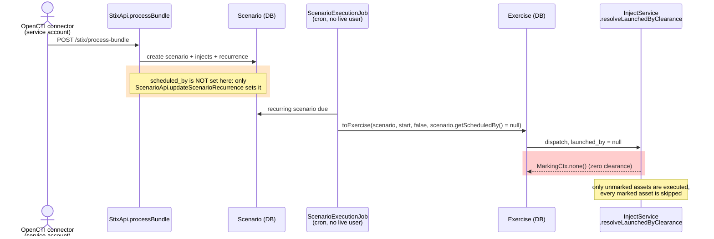

## TODO discussed Corinne / Damien 
- [x] OpenCTI recurring scenarios -> launch all assets + set user service account OpenCTI in the scenario? -> Damien
    - We need to add all the markings to the OpenCTI service account in addition to adding the OpenCTI user to the scheduled scenario
    - See resolveLaunchedByClearance

- [ ] Tests chained simulation
- [x] Tests with OpenAEV agent and external executors:
    - Atomic testing -> OK
    - Simulation manual and scheduled -> OK
    - Scenario manual and scheduled -> OK
    - Inject expectations -> same global score is seen even if we don't see the assets linked, different global score if manual asset

- [ ] StreamApi and solutions A/B to check -> Corinne

- [x] Clean the tech design -> Corinne

  - [ ] POC "asset not targetted" VS "no agent found" -> Corinne
    - Damien's proposal -> in ExecutionExecutorService, at the end, check the assets list with and without markings

- [ ] Do a brainstorm/choose the solution with Laurent

- [ ] Little UX bugs with the new solution?
    - A lot of "Access denied" when I am not an admin user
    - Execution details are weird for Injects when you launch it with an admin and you look it with a user
    - Header overview number of assets for simulation KO when logged as a user while the simulation's list is OK
    - Global inject status status can be weird if you don't see all the assets
    - Platforms in scenario's list are KO for a user
    - Bugs with inject expectations (see above)

- [ ] Last spike to POC (dashboards)

## TODO extracted from tech-design, suggested by AI

- [ ] Possible defect: a user who belong to a group with ByPass checked and a marking TLP:GREEN, could see TLP:RED
    **Quoting AI:**
    Why it matters here: `resolveLaunchedByClearance` (`InjectService.java:481`) uses `isAdminOrBypass()` as
    its only bypass test. A launcher whose group holds a `BYPASS` role would resolve through their group
    marking grants at dispatch instead of getting full clearance — a narrower result (fail-closed), but
    not the documented one. `HttpMarkingScopeSupplier` would still treat the same user as bypass, because
    the expanded set contains `AGENT_RUNTIME_ACCESS`, so reads and dispatch could disagree for that user.
    Not verified: no test exercises `isAdminOrBypass()` with a `BYPASS` role (the only test mention is a
    comment in `InjectServiceTest`), and the method is used widely, so there may be a path that makes it
    work. A unit test with a user in a group carrying a `BYPASS` role would settle it; if confirmed, the
    fix is to use `hasBypassIn(...)` / `hasTenantBypass()` or to test the role capabilities directly.

- [ ] At execution time assetGroups are not resolved per user clearance.
  **Quoting AI:**
  * .assets(...) is filtered by the launcher's clearance: it comes from getAssetsToExecute(), with resolveAllAssetsToExecute() as the fallback.
  * .assetGroups(...) is still unfiltered, and the code comment says it's deliberate until US1 is decided.
  * The payload only carries each group's id and name (AssetGroupSimple), not its members. The external injector resolves the members itself, later, so the launcher's clearance never applies to them.
  * NOTE: asset_groups_assets is now filtered, but by the clearance of whoever reads it. When the injector resolves a group's members, it reads them under its own account's clearance, not the launcher's:
- [ ] Agentless traces of a RED asset — a real gap, worth doing

What it is. External injectors that don't run through an agent (for example network scanners targeting agentless endpoints) report their results in an execution callback. That callback carries contextIdentifiers, the ids of the targets the result is about: assets, teams or players. The trace is saved with no agent and those ids in execution_context_identifiers (InjectStatusService.java:237).

Why it leaks. The filter added yesterday follows trace → agent → asset. These traces have no agent, so they count as "global" and stay visible.

In the UI, the trace only shows when you click the RED target, which the GREEN user can't see, so there is no leak there.
Through the API, GET /api/injects/execution-traces?targetId=<RED id> returns them (findByInjectIdAndAssetId matches on the array).
So do the endpoints that return the raw Inject, which embed status_traces. Those carry the RED asset id and the injector's output to anyone who can read the inject.

Fix. The trace needs a second condition: hidden if any asset named in the array is restricted.

NOT EXISTS (SELECT 1 FROM assets a
WHERE a.asset_id = ANY(t.execution_context_identifiers)
AND NOT is_marking_set_allowed(a.marking_ids))

Team and player ids in the array match no asset, so they don't affect the result. The engine work is that a table can only be filtered one way today, and execution_traces already follows the agent. So MarkedTable would need a fourth filter type ("an array of asset ids"), and a table would need to accept several filters ANDed together. That's a small-to-medium change in MarkedTable and MarkingDimension, plus tests.

- [ ] The asset-group expectation row — the verdict still includes RED

What it is. When an inject targets an asset group, one group expectation row is stored: asset_group_id is set and asset_id is NULL. Its verdict is rolled up from every member's result, using the group's validation mode ("all assets" or "at least one").

Why it leaks. The new filter only hides rows with an asset_id. The RED member's own row is hidden, but the group row is not, and its verdict was computed with RED included:

"all assets" mode: the group shows Failed because of RED alone, while every visible member succeeded.
"at least one" mode: the group shows Success thanks to RED alone.

The global score also uses this row (InjectExpectationRepository.java:390-397), so it's skewed too. This doesn't reveal RED's identity, but it reveals RED's outcome, and the GREEN user can't make sense of it.

Options:
* Recompute the group verdict at read time from the members the viewer can see. This is correct, but it changes the scoring code and costs more.
* Hide the group row from a viewer who can't see every member. This is simple, but it moves this one case toward Option 2.
* Accept it and document it, since it's an aggregate.
This needs a product decision before any code. It's the "stored aggregates" con of Option 1.

- [ ] asset_agent_jobs — defence in depth only, low priority

What it is. The queue of commands waiting for an agent. Only implants read it, through POST /api/endpoints/jobs and /jobs/{externalReference} (EndpointApi.java:122-139). Those require the JOB capability, which only agents get (AGENT_RUNTIME_ACCESS), and agents have full clearance.

Why it's low priority. No end-user endpoint or screen reads it, so no GREEN user can reach a RED agent's job today. Adding linkedTo("asset_agent_jobs", "asset_agent_agent", "agents", "agent_id") would only protect against a future endpoint exposing jobs. It's one line, but it adds the trace → agent → asset sub-select cost on a table agents poll constantly. I'd leave it out unless a user-facing read appears.

- [ ] UX/UI changed to add the user "launchedBy"
With more marked entities, partial runs become the norm rather than the exception. A viewer with higher
clearance, e.g. an admin opening a Scenario, a Simulation or an Atomic Testing, must be able to tell that a
run covered only part of the targets, and why. Otherwise scores and findings get misread as "everything
was tested".

  - **Show who launched the run, and on whose clearance.** Display `launched_by` (and `scheduled_by` for
  recurring runs) on Simulations and Atomic Testing, e.g. "Launched by *jdoe*", "Scheduled by *jdoe*".
  - **Show marking chips on every asset list.** Target lists, result tables, findings and asset-group
  members should all carry them, so a viewer immediately sees which targets are marked and at which level.
  - **Give each skipped target an explicit status for viewers who can see it.** For example "Not executed:
  outside the launcher's clearance", instead of the target looking simply absent or pending.
    - **How to record it.** Write a trace or status row per skipped asset at dispatch time.
    - **Why it does not leak.** That row is linked to the restricted asset, so it is itself a derived row
      filtered by the same C-2 mechanism. A `TLP:GREEN` viewer never sees it, and a `TLP:RED` viewer
      does.
  - **Show a run-level indicator, computed per viewer.** For example "Partial run: 2 of 5 targets were not
  executed". Show it **only** to viewers who can see at least one skipped target. A viewer with the same
  clearance as the launcher sees no indicator, which preserves "a restricted asset does not exist".
  - **Label scores clearly.** State that a score covers the targets that actually ran. Read-time scores
  already reflect what the viewer can see once `injects_expectations` is filtered (§3.2).

## TODO (Corinne) Proposed solution: Marking and the real-time stream (`StreamApi`) (proposed — not yet decided)

`StreamApi` pushes every database mutation to every connected browser over SSE. It is a **third read
path**, next to the REST reads (Task 3) and execution dispatch (above), and today it has no marking
check at all.

### Why the SQL rewrite cannot protect it

- `listenDatabaseUpdate` (`StreamApi.java:215`) is `@Async("streamExecutor")` +
  `@TransactionalEventListener`: it runs **after commit, on a pool thread, with no transaction**. The
  inspector only filters inside a transaction that set `app.current_markings`
  (`TenantScopedTransaction.setMarkingScope`), so there is nothing to rewrite here.
- The event instance was loaded earlier, in the **publisher's** transaction, under the publisher's
  clearance (typically an admin, or an agent with `AGENT_RUNTIME_ACCESS`). `sendStreamEvent`
  (`StreamApi.java:195`) then serializes that whole instance per consumer.
- Per consumer, the gate today is `isVisibleForTenant` (`StreamApi.java:385`) + `hasReadPermission`
  (RBAC / grants). Neither knows about markings.

**Leak**: a `TLP:RED` asset created or updated is broadcast, in full, to a `TLP:GREEN` user's stream.
The same holds for any entity that embeds restricted data (see "Payloads that embed restricted data"
below).

### Proposal — a Java-side marking gate, next to the permission check

1. **Where**: in `listenDatabaseUpdate`, after the existing permission check and before
   `sendStreamEvent`. Entities that can carry markings implement a small `Marked` interface
   (`String[] getMarkingIds()`); `Asset` first, the linked tables later (see below).
2. **Clearance source**: `MarkingClearanceCacheManager.findClearance(userId, tenantId, bypass)`,
   called **directly** with `bypass = user.isAdminOrBypass()` — the same rule as the dispatch-time
   guardrail in "Interaction with the existing marking bypass". It must not go through
   `HttpMarkingScopeSupplier`, which would fold in `AGENT_RUNTIME_ACCESS`. The call is `@Cacheable`
   and evicted on every clearance-reducing change, so it costs **no database query per event** — the
   constraint behind #6868 (see the comments on `userCache` and `permissionDecisionCache`).
3. **Test**: containment of the entity's `marking_ids` in the consumer's clearance — the Java twin of
   `is_marking_set_allowed` (every marking on the row must be held, an unmarked row is visible to
   everyone, no clearance hides every marked row). It must stay behaviourally identical to the SQL
   function; whether `MarkingCtx` already exposes a containment helper is to be checked at
   implementation time.
4. **Outcome when not allowed**: reuse the existing **id-only DELETE** event
   (`StreamApi.java:266-285`). It leaks nothing, and it also covers the case where an asset's
   markings are *raised*: users who could see it a moment ago see it disappear from their UI.
5. **Do not put the marking decision in `permissionDecisionCache`.** That cache keeps decisions for
   30 s; a "yes" cached before a marking change would deliver the new payload (with its new markings)
   to someone who no longer qualifies. The marking test is in-memory and cheap, so it runs on every
   event, and the clearance cache is already evicted on reductions. The existing 60 s `userCache`
   staleness (bypass flag, capabilities) is accepted as is.
6. **Consumers without a tenant** (legacy `/api/stream`, blank `tenantId`): clearance is
   `MarkingCtx.none()` — they see unmarked rows only (fail closed, same as
   `HttpMarkingScopeSupplier` when no user or no restricted tenant scope).

### Payloads that embed restricted data (the hard part)

An event for a parent entity (`Inject`, `Exercise`, `Scenario`, `AssetGroup`) can serialize
collections of assets. Over REST those collections are lazy-loaded under the **reader's** clearance,
so the rewrite hides restricted assets. In the stream they were loaded under the **publisher's**
clearance, so restricted asset ids would reach every reader of the parent. The marking gate above
cannot fix this: the parent itself is allowed.

| Option | How | Trade-off |
|---|---|---|
| **Notify and refetch** (preferred for these types) | send `{id, type}` only; the client re-reads through the filtered REST path | one extra request per event, no payload to sanitize; same pattern as the attack-path nudge, whose own Javadoc states the notification can never leak state |
| Filter per consumer | strip marked ids from the serialized tree using the consumer's clearance | keeps the push payload, but needs per-type knowledge of every embedded marked reference — easy to miss one |

### Consequences for the linked-objects solutions

Findings, agents and expectations are streamed too, so the stream is a second consumer of whichever
solution is retained above:

- **Solution A (column copy)**: the entity carries its own `marking_ids`, so the stream gate is the
  same in-memory test as for assets — no extra work.
- **Solution B (`EXISTS` through the join)**: the stream has no SQL to rewrite, so it would need the
  parent asset's markings **per event and per consumer** — an extra lookup on the hottest path.
  Workable only with a short-lived cache keyed by asset id, i.e. the pattern that already had to be
  built for permissions after #6868.

Solution B was chosen for the SQL reads (see "Marking the objects linked to an asset"), so for
the streamed derived entities (findings, expectations) this lookup is the cost to design here. It is
not decided yet.

### Out of scope / unchanged

- `listenBulkOperation` carries counts and an entity label only, scoped to the launching user — no
  marked data.
- `listenAttackPathVersion` already gates on `AttackPathAccessControl.canRead` and sends a
  notification only. It needs a marking review only if the simulation's own visibility becomes
  marking-dependent (open item 2).
- A **raised** clearance emits no event, so a user who gains access sees newly visible assets only
  after a refetch. This matches the global principle that read access follows current group
  markings, and is accepted.

### Tests to add

- A `TLP:GREEN` consumer receives an id-only DELETE, not the payload, when a `TLP:RED` asset is
  created or updated.
- The same consumer receives a DELETE when an asset it could see is re-marked `TLP:RED`.
- An unmarked asset is still delivered to everyone with READ permission.
- A consumer holding `TLP:RED` receives the full event.
- A parent entity event (inject) never carries a restricted asset id.

## TODO (Damien) STIX security coverage: OpenCTI scenarios have no scheduling actor

`POST /stix/process-bundle` (`StixApi.processBundle`) does **not** launch anything. It creates a
`SecurityCoverage`, a `Scenario` and its injects, and sets the scenario's recurrence directly
(`SecurityCoverageService.setRecurrence`, first start two minutes later). The launch happens later,
from the cron:

**Current behaviour (fail-closed)**

- The service account is never the actor: nothing writes it into `scheduled_by` or `launched_by`, so
  it cannot bring its own clearance (or a bypass) into a run.
- `launched_by = null` resolves to zero clearance (`InjectService.java:478`), as the cron's own
  comment states (`ScenarioExecutionJob.java:113-115`). Marked assets are skipped, never run.
- Consequence: **a scenario generated from a security coverage can never execute on a marked
  asset**, whatever the marking.

### The OpenCTI connector user (verified by reading the code)

`PrivilegeService.ensurePrivilegedUserExistsForConnector`
(`opencti/connectors/service/PrivilegeService.java:80`) creates one technical user per connector:

- email `connector-opencti-<connectorId>@openaev.invalid`, `admin = false` (forced on every update by
  `AbstractPrivilegeService.applyUserServiceAttributes`);
- a single per-tenant group, "STIX bundle processors" (`defaultUserAssignation = false`), whose role
  holds exactly one capability: `MANAGE_STIX_BUNDLE` (`Constants.java:9`), i.e. `STIX_BUNDLE` /
  `PROCESS` at tenant scope. The capability is `hidden` and `checkable`, like `AGENT_RUNTIME_ACCESS`;
- no `BYPASS`, no `AGENT_RUNTIME_ACCESS`, and no marking granted anywhere in this code. The role and
  group are re-applied each time `ensurePrivilegedUserExistsForConnector` runs.

So `isAdminOrBypass()` is false for it, and its own marking grants are empty: **its clearance is
none**, exactly as for a null actor.

**Effect on inject generation.** `fetchAssetGroupsFromScenarioTagRules` and `assetsFromAssetGroupMap`
(`SecurityCoverageInjectService`) read asset groups and endpoints during the HTTP request, under the
connector's HTTP clearance. Resolved through `HttpMarkingScopeSupplier`, that clearance was none, so
the platform/architecture combinations that decide which injects exist came **only from unmarked
endpoints**. There was therefore no inference leak by default (the leak would have required a bypass),
but a coverage could not generate injects for a platform that exists only on marked assets.

**Change made on the branch (to validate with the PO).** `HttpMarkingScopeSupplier` now also treats
`MANAGE_STIX_BUNDLE` as a read bypass, next to `AGENT_RUNTIME_ACCESS`, so that `processBundle` builds
its scenario from every asset of the tenant. It affects the **read clearance of the request only**:
dispatch (`InjectService.resolveLaunchedByClearance`) still uses `isAdminOrBypass()` alone, so the run
still has zero clearance. Consequences to be aware of:

- **Generation and execution now disagree.** The scenario is built from all assets but the run skips
  marked ones. An asset group made only of marked endpoints yields injects that end in
  "No asset executed". This is the shape-of-the-scenario inference the previous behaviour avoided.
- **Any holder of the capability gets the bypass on every HTTP request**, not only `processBundle`.
  `AGENT_RUNTIME_ACCESS` has the same exposure; both are `hidden`, so they are not offered by the role
  editor — that is the assumption this relies on, not a check.
- Covered by `HttpMarkingScopeSupplierTest` (plain user, `AGENT_RUNTIME_ACCESS`, `MANAGE_STIX_BUNDLE`,
  no user).

**Guardrail**: stamping the connector's user as `scheduled_by` would not change anything today — it
has no bypass at dispatch and no grants, so it resolves to the same zero clearance as null. It would
only differ if markings were granted to its group (PO option 2) or if it were given a `BYPASS` role, in
which case the cron would run on every asset, the escalation Option 1 rules out.

