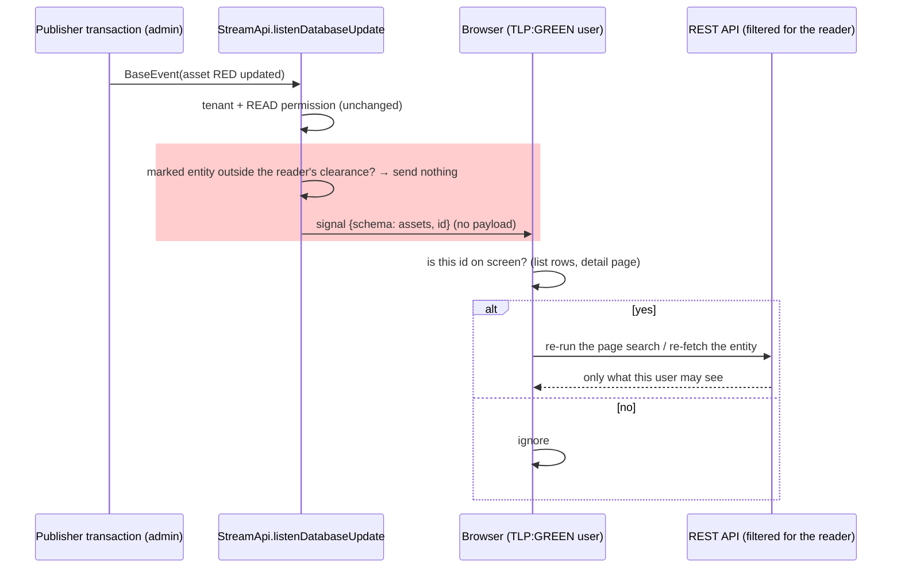

# Task 4 — Handle Side Effects of Asset Markings: Implementation Plan

**Design doc**: [`tech-design.md`](./tech-design.md) — Option 1 (partial/scoped launch), the four new
`scheduled_by`/`launched_by` fields, dispatch-time clearance resolution, and the marking-bypass guardrail.

**Depends on**: [Task 2 — Assign Markings to Groups](../task2/tech-design.md) (`MarkingScopeResolver`,
`MarkingClearanceCacheManager`); [Task 3 — Marking-based Access Control for Assets](../task3/tech-design.md)
(asset marking = read filter, enforced via the statement-inspector rewrite).

**Status**: 

---

# Chunk 1: POC — Launch scoping for Scenario/Simulation/Atomic Testing with marking clearance

### 1) Scope of this implementation (PoC)

This PoC delivers **Option 1 only** — partial/scoped execution — for the two paths `tech-design.md`
traces end-to-end: **Scenario → Exercise** (manual launch, scheduled recurrence, dispatch) and
**Atomic Testing** (launch, relaunch, scheduled relaunch, dispatch). Concretely, in scope:

- Four new columns: `Scenario.scheduled_by`, `Exercise.launched_by`, `Inject.scheduled_by`,
  `Inject.launched_by` — written at the points shown in `tech-design.md`'s sequence diagrams.
- One new enforcement point: a `MarkingClearanceCacheManager.findClearance(...)` call inside asset
  resolution (`InjectService.resolveAllAssetsToExecute`), gating what actually gets dispatched.
- The `duplicateInject()` fix so a relaunch does not silently carry the previous launcher's identity
  forward.
- The guardrail that this new check must resolve clearance directly, never through
  `HttpMarkingScopeSupplier` (which would fold in the unrelated agent-runtime bypass).

**It deliberately does not resolve** `tech-design.md`'s "Open items carried forward" — those are open
user-story-level decisions, not implementation gaps in this plan, and are tracked as later PoCs in this
same document rather than folded into this one:

1. Asset Group behaviour (US1) — Option 1/2/3 for a group containing a restricted asset.
2. Whether a Scenario/Simulation/Atomic Testing with mixed targets is itself hidden or filtered
   (Row 2) in lists, detail pages, and target pickers.
3. Whether a Finding inherits its asset's marking (Q4).
4. Surfacing a partial run clearly to a higher-clearance viewer — no UI/API shape decided yet.

None of these block this PoC or would force rework of it: the dispatch-time check operates on
whatever flat asset list target resolution already hands it, regardless of how that list was built or
whether the parent entity is fully visible to the launcher. See `tech-design.md`'s own "Open items
carried forward" section for the full reasoning on why each is independent of what's built here.

Section 4 below restates this same boundary against concrete delivery steps — this section is the
authoritative scope statement; that one just points back to it per step.

---

### 2) Confirmed decisions and constraints

- Launch/relaunch/scheduled execution runs in **partial/scoped mode** (Option 1): only targets visible
  to the resolved actor execute; running on all targets and filtering only the read side (Option 2) is
  rejected as a privilege-escalation vector (`tech-design.md`, "Design options for launch behavior").
- The actor whose clearance gates a run is captured **explicitly**, at the security-relevant action
  itself (launch, relaunch, or recurrence configuration) — never inferred from a "last edited/updated"
  field. `inject_user` keeps its existing "last content editor" meaning and is not reused
  (`tech-design.md`, "Why 'last edited/updated user' cannot be the resolved actor").
- All four new columns are nullable FKs to `users` with `ON DELETE SET NULL`, matching the existing
  `inject_user` FK pattern (`V2_60__Delete_fk_users_injects.java`). A deleted/deactivated actor resolves
  to **zero clearance** — every remaining restricted target is skipped, never executed, never an error.
- `Inject.scheduled_by` / `Inject.launched_by` apply only to root/atomic-testing injects
  (`exercise == null && scenario == null`). A Scenario-linked inject has no copy of its own; its
  clearance is resolved via `inject.getExercise().getLaunchedBy()`.
- Clearance is resolved **live**, at dispatch time, via
  `MarkingClearanceCacheManager.findClearance(actorId, tenantId, bypass)` — never cached or
  snapshotted on the entity itself. `bypass` is computed as `actor.isAdminOrBypass()` **only**; the
  check must never route through `HttpMarkingScopeSupplier`, which would incorrectly fold in the
  unrelated `AGENT_RUNTIME_ACCESS` agent-callback bypass (`tech-design.md`, "Interaction with the
  existing marking bypass (service account) — unchanged").
- `InjectUtils.duplicateInject()` must not blindly copy `launched_by` forward the way it already does
  for `user` — a relaunch has to explicitly overwrite it (current user for a manual relaunch, the
  original inject's `scheduled_by` for a scheduled one).
- The per-tenant service account (`ServiceAccountPrivilegeService`) holds only
  `{AGENT_RUNTIME_ACCESS, AGENT_DOCUMENT_ACCESS, INSTALL_AGENT}` — none of which satisfies
  `@AccessControl(Action.LAUNCH)`. It cannot authenticate a launch/relaunch/recurrence call today, so it
  structurally cannot become `launched_by`/`scheduled_by`. This is a **verified invariant** this PoC
  relies on, not an assumption — if that role's capabilities ever change, this must be re-checked.

### 3) Delivery steps

#### Step 4.1 — Data model: four new columns + migration ✅ done

| Column | Table | Type |
|---|---|---|
| `scenario_scheduled_by` | `scenarios` | FK → `users(user_id)`, nullable, `ON DELETE SET NULL` |
| `exercise_launched_by` | `exercises` | FK → `users(user_id)`, nullable, `ON DELETE SET NULL` |
| `inject_scheduled_by` | `injects` | FK → `users(user_id)`, nullable, `ON DELETE SET NULL` |
| `inject_launched_by` | `injects` | FK → `users(user_id)`, nullable, `ON DELETE SET NULL` |

Flyway migration alongside the corresponding `@ManyToOne @JoinColumn` additions on `Scenario.java`,
`Exercise.java`, `Inject.java`. No backfill: existing rows get `null`, which resolves to zero clearance
until the next launch/relaunch/recurrence-update re-stamps them.

**DoD**: migration applies cleanly on a populated dev DB; entity mapping round-trips in a repository test.

**Done**: `V6_20260930120000000__Add_scheduled_by_and_launched_by_columns.java` — indexed, matches the
existing `inject_user` FK idiom. Verified via the integration suites in step 4.3/4.5 actually loading a
Spring context against it (Postgres via Podman, not Testcontainers — this repo uses a plain compose-managed
test database).

#### Step 4.2 — Write `scheduled_by` on recurrence configuration ✅ done

- `ScenarioApi.updateScenarioRecurrence` (`ScenarioApi.java:577`) — stamp
  `scenario.setScheduledBy(currentUser())` whenever the call actually configures a schedule
  (`schedules == true`, same condition already guarding `throwIfScenarioNotLaunchable`).
- `AtomicTestingService.updateRecurrence()` — same treatment for `Inject.scheduled_by`.

**DoD**: unit test — configuring/updating a recurrence stamps the current user; clearing a recurrence
does not (nothing to gate anymore, but the field is deliberately left as-is rather than nulled, so a
later re-enable doesn't silently lose the last confirmed owner).

**Done**: both call sites stamp as planned; covered by the "launched_by / scheduled_by stamping" nested
tests in `InjectServiceTest` (4 tests, green) for the Atomic Testing side.

#### Step 4.3 — Write `launched_by` on Exercise creation ✅ done

`ScenarioToExerciseService.toExercise()` (`ScenarioToExerciseService.java:54`) gains a new actor
parameter — it has no way to know its own caller today. Both call sites resolve it differently:

- `ScenarioApi.createRunningExerciseFromScenario` (`ScenarioApi.java:668`) → `userService.currentUser()`
  (covers both the normal and the autonomous/chaining branch, lines 672-682 — still the same HTTP call).
- `ScenarioExecutionJob.createScheduledExercise` (`ScenarioExecutionJob.java:117`) →
  `scenario.getScheduledBy()`.

**DoD**: unit test per call site confirming the right actor lands on the created `Exercise`; existing
`ScenarioToExerciseService` tests updated for the new parameter.

**Corrections found while building, not while assuming**: `toExercise()` has a *third* caller family
this plan didn't account for — `AutonomousRunService` calls it from three places (`doCreate`,
`restart`, `promoteToRealRun`), not just `ScenarioApi`. All three are live-user, capability-gated
operator actions, so resolving current-user there is consistent with the design, but it's more surface
than planned: `AutonomousRunService.java` gained a `resolveLaunchedBy()` helper wired into all three
call sites, and `AutonomousRunServiceTest` needed a new `UserRepository` mock plus
`SecurityContextHolder` setup/teardown to exercise it.

**Done**: `ScenarioToExerciseServiceTest`, `ScenarioToExerciseDocumentAttributionTest`,
`AutonomousRunServiceTest` all green (integration suites run against Postgres via Podman — see §Status).

#### Step 4.4 — Write `launched_by` on Atomic Testing launch/relaunch ✅ done

- `AtomicTestingService.launch()` (`AtomicTestingService.java:231-234`) currently writes nothing —
  add `inject.setLaunchedBy(currentUser())`.
- `AtomicTestingService.doRelaunch()` (`AtomicTestingService.java:254-262`) — **after**
  `InjectUtils.duplicateInject()` runs, explicitly overwrite `launched_by` on the new inject: current
  user for a manual relaunch (`checkLaunchable = true`), or the original inject's `scheduled_by` for a
  scheduled one (`checkLaunchable = false`, `AtomicTestingExecutionJob.java:101-112`). This is the
  `duplicateInject()` trap fix from §2 — do not let it fall through to a copy-forward.

**DoD**: regression test proving a manual relaunch by user B does **not** inherit user A's
`launched_by` from the original inject; scheduled-relaunch test proving it inherits `scheduled_by`
instead.

**Corrections found while building, not while assuming**:

- `AtomicTestingService.launch()`/`doRelaunch()` don't touch the `Inject` entity directly — they
  delegate to `InjectService.launch()`/`InjectService.doRelaunch()`, which is where the actual entity
  mutation and the `duplicateInject()` call live. The stamping landed there instead, per the plan's
  intent, not literally inside `AtomicTestingService`.
- Not in the original plan text but necessary for correctness: `duplicateInject()` also needed to copy
  `scheduledBy` forward (recurrence-adjacent, like `recurrence`/`recurrenceStart`/`recurrenceEnd`) so a
  recurring atomic testing doesn't lose its schedule owner after its first scheduled relaunch — only
  `launchedBy` is deliberately withheld from the copy.

**Done**: 14 new tests in `InjectServiceTest` cover the launch/relaunch stamping and the
`duplicateInject()` trap specifically (manual relaunch does not inherit the prior launcher).

#### Step 4.5 — Dispatch-time enforcement ✅ done

Inside `InjectService.resolveAllAssetsToExecute`, called from `InjectsExecutionJob.executeInject()`
(`InjectsExecutionJob.java:149`):

1. Resolve the actor: `inject.getExercise() != null ? inject.getExercise().getLaunchedBy() :
   inject.getLaunchedBy()`.
2. Null actor (deleted/never stamped) → treat as zero clearance, skip every marked target.
3. Otherwise: `bypass = actor.isAdminOrBypass()`; call
   `markingClearanceCacheManager.findClearance(actor.getId(), tenantId, bypass)`.
4. Drop every resolved asset whose marking is not covered by the returned `MarkingCtx`; unmarked
   assets are never filtered (per Task 3).

**DoD**: unit tests covering full clearance (all targets run), partial clearance (`ASSET_GREEN` runs,
`ASSET_RED` silently skipped — the canonical worked example from `user-stories.md`), zero clearance (no
targets run), bypass actor (all targets run regardless of grants), and null actor (no targets run).

#### Step 4.6 — Guardrail test against the bypass leak ✅ done

A targeted test proving `AGENT_RUNTIME_ACCESS` alone does **not** grant bypass in this new path — i.e.
that step 4.5 calls `MarkingClearanceCacheManager` directly and never through
`HttpMarkingScopeSupplier`. This is the regression this PoC exists to prevent, per `tech-design.md`'s
bypass section, so it gets its own explicit test rather than relying on code review alone.

**Done**: `given_agentRuntimeAccessOnlyActor_should_notBypass()` in `InjectServiceTest` — no production
code change was needed, the guardrail was already correctly implemented (`bypass =
launchedBy.isAdminOrBypass()` only); this test exists purely to pin that property against regression.

#### Step 4.8 — Filter the agent-routing dispatch path (the actual fix) ✅ done

`InjectService.getAgentsAndAgentlessAssetsByInject(inject)` (`InjectService.java:1111-1126`), called
from `ExecutionExecutorService.launchExecutorContext(inject)` unconditionally before the
internal/external split — this is the method that builds the real `Set<Agent>` commanded to execute,
and it reads `inject.getAssets()` / expanded `inject.getAssetGroups()` directly, with no marking
awareness. Fix:

1. Extract the clearance-resolution half of step 4.5's `filterByMarkingClearance` into its own
   reusable method, e.g. `resolveLaunchedByClearance(Inject inject): MarkingCtx` (same actor
   resolution, same live `MarkingClearanceCacheManager.findClearance` call, same null-actor →
   `MarkingCtx.none()` fallback) — shared by both this step and step 4.5, rather than duplicated.
2. In `getAgentsAndAgentlessAssetsByInject`, resolve clearance once, then skip
   `extractAgentsAndAssetsAgentless(...)` for any asset not visible under that clearance — both in the
   direct-assets loop and the asset-group-expansion loop.

**DoD**: the canonical worked example as an actual execution test, not just an asset-list assertion —
launch (or directly call `launchExecutorContext`) with a `TLP:GREEN` actor against one unmarked and one
`TLP:RED` endpoint; assert the returned `Set<Agent>` excludes the `TLP:RED` endpoint's agent entirely.
Regression test: an admin/bypass actor still gets both. Ideally re-run the exact manual e2e scenario
that found this (two assets, one `TLP:RED` agent, `TLP:GREEN` launcher) and confirm no execution trace
is produced for the restricted agent at all — not just that it's hidden from a result view.

**Done**: `resolveLaunchedByClearance(Inject): MarkingCtx` extracted from step 4.5's
`filterByMarkingClearance` and shared by both. New `InjectServiceTest` nested class
(`AgentRoutingDispatchFilterTests`, 3 tests): partial clearance excludes the restricted agent from the
returned `Set<Agent>` entirely (not just from a display list), bypass actor gets both, unmarked asset
included under zero clearance. Regression across every known caller of
`getAgentsAndAgentlessAssetsByInject` — `ExecutionExecutorServiceTest`, `InjectExecutionStepTest`,
`AttackPathExecutionIngestionServiceTest` (82 tests) — green.

#### Step 4.9 — Filter the external-push dispatch payload (non-agent connectors) ✅ done

`ExecutableInjectDTOMapper.toExecutableInjectDTO()` (`ExecutableInjectDTOMapper.java:23-39`) builds
`.assets(...)`/`.assetGroups(...)` from `executableInject.getAssets()`/`getAssetGroups()` — the
original fields set once in `InjectHelper.toExecutableInject()`, independent of anything
`resolveAllAssetsToExecute()` computed. This is the path for any injector classified `isExternal()`
that isn't agent-based (email, SMS, OpenCTI, etc.). Fix: consume the filtered
`executableInject.getAssetsToExecute()` instead, falling back to calling
`injectService.resolveAllAssetsToExecute(inject)` when null — the same fallback pattern
`AbstractTechnicalBehavior` already uses for direct callers that don't pre-cache
(`AbstractTechnicalBehavior.java:92-97`).

**To resolve during implementation, not assume**: whether `.assetGroups(...)` in the DTO is used
downstream only for target expansion (in which case it should become empty once `.assets(...)` carries
the already-expanded, filtered flat list — passing both would double-submit and could leak unfiltered
group members through that second channel) or serves another purpose the connector needs (e.g.
labeling/reporting) that would be lost by emptying it. Check every downstream consumer of
`ExecutableInjectDTO.assetGroups` before deciding.

**DoD**: unit test on the mapper proving a restricted asset present in `executableInject.getAssets()`
is absent from the built DTO when a filtered `assetsToExecute` excludes it; existing mapper tests
(non-marking cases) unaffected.

**Done**: `ExecutableInjectDTOMapper` now takes an `InjectService` dependency and builds `.assets(...)`
from `executableInject.getAssetsToExecute()`, falling back to `injectService.resolveAllAssetsToExecute(inject)`
when null. New `ExecutableInjectDTOMapperTest` (3 tests): cached-filtered-list path, fallback-to-resolve
path, non-marking case unaffected.

**`.assetGroups(...)` decision — left unfiltered, deliberately, not resolved the way the DoD assumed a
clean answer existed:** the mapper's own existing comment confirms non-endpoint assets reached via a
group (e.g. AI targets) are resolved by the downstream injector *from the group itself*, independent of
the filtered flat asset list. Asset groups carry no marking of their own today — that's Task 4's own
explicitly-deferred US1 — so there is no clearance rule to apply to this set yet; emptying it would
silently break the AI-target-via-group path for external injectors, not just de-duplicate. **Known,
scoped gap, not an oversight**: a marked AI-target asset reachable only through an asset group,
dispatched to a non-agent external connector, is not covered by this fix. Revisit once US1 (POC 2)
gives asset groups their own marking semantics.

#### Step 4.7 — End-to-end proof, as a Playwright e2e test (CI-covered) 🔴 not started

Replaces the earlier `curl`-based demo-script idea: Task 2/3's UI is now actually implemented
(`GroupManageMarkings.tsx`, `MarkingDefinitions.tsx`, `ItemMarkings.tsx`), Playwright is already wired
into `core-ci.yml`/`nightly-ci.yml` (`yarn test:e2e`), and no e2e test currently touches markings at
all — so a real through-the-UI test both proves this PoC and becomes permanent regression coverage,
for free, instead of a one-off manual demo.

New file: `openaev-front/tests_e2e/tests/marking/marking-scoped-launch.spec.ts` (new `marking/` folder —
none exists yet, alongside the existing `scenario/`, `threat-arsenals/` groupings).

Reproduces the `FULL_ADMIN` / `USER_GREEN` / `ASSET_RED` / `ASSET_GREEN` worked example from
`user-stories.md`, fixtures created via API (matching `scenario-teams.spec.ts`'s pattern of API setup +
UI-driven assertions, not clicking through every setup step):

1. *(API setup)* `FULL_ADMIN` creates `ASSET_RED` (`TLP:RED`) and `ASSET_GREEN` (unmarked), a group
   cleared for `TLP:GREEN` with `USER_GREEN` as a member, and a Scenario with an inject targeting both.
2. *(UI, as `USER_GREEN`)* open the Scenario — assert `ASSET_RED` never appears in the target list
   (Task 3's existing read filter, incidentally exercised here too).
3. *(UI, as `USER_GREEN`)* click Launch.
4. *(UI, as `USER_GREEN`)* open the resulting Simulation — assert only `ASSET_GREEN` shows as a
   target/result; no count, placeholder, or error hints that a second target exists. **Also assert no
   execution trace exists for the `TLP:RED` agent** (via API, not just UI) — a UI-only assertion here
   would have passed even with the step 4.5-only gap manual testing found, since the overview already
   hid the restricted asset while it was still actually executing underneath.
5. *(UI, as `FULL_ADMIN`)* open the same Simulation — assert both `ASSET_GREEN` and `ASSET_RED` are
   still configured as targets, proving the underlying data wasn't altered, only filtered per-viewer
   (the "configurations and results are not altered or corrupted" acceptance principle in
   `user-stories.md`).

**Genuinely new test infrastructure this requires** (not a rename of something that already exists):

- A second authenticated session for `USER_GREEN`. Every project today shares one `storageState`
  (`tests_e2e/.auth/user.json`) written once by the `setup` project (`auth.setup.ts`) — there's no
  existing multi-user fixture in this suite, so a second `browser.newContext()` + login (or a second
  storageState file) has to be added.
- New API helpers under `tests_e2e/api-helpers/` for Asset, Group/User, and Marking setup — only
  `ScenarioApiHelpers`, `TeamApiHelpers`, `DocumentApiHelpers`, `TenantApiHelpers` exist today.

**DoD**: spec green in CI under the existing `test:e2e` job, no new pipeline required.

## Chunk 2 — SSE - Stream API revisited

**Status**: leak reproduced (2026-10-08), fix not started.

### 1) What we observed: two browsers, one admin, one `TLP:GREEN` user

**Setup.** 

Browser 1: a user whose group grants `TLP:GREEN` (role with `ACCESS_ASSETS`). 

Browser 2:
admin. Endpoint `WWcorinne…` is marked `TLP:RED`, so browser 1 does not see it in Assets → Endpoints
(the REST search is filtered by the Task 3 rewrite).

**Scenario 1 — the leak.** In browser 2, the admin renames the RED endpoint. In browser 1, DevTools →
Network → `stream` → EventStream shows a `message` event with the **full RED endpoint**: name,
hostname, every IP and MAC address, `asset_markings` (the `TLP:RED` id), tags, and its embedded agent
(`agent_external_reference`, executor, run-as user). Nothing appears on screen.

**Scenario 2 — the UI does not refresh either.** In browser 1, the GREEN user renames a visible
endpoint `toto` → `toto3`. Browser 2 (admin) receives the event with `asset_name: "toto3"`, but its
Endpoints table keeps showing `toto` until the page is reloaded.

**Why: the event carries the data, but nothing displays it.**

- **The stream is always open.** `admin/Index.tsx` (the root layout) calls `useDataLoader`, so every
  logged-in browser keeps one `EventSource` on `/api/stream`, whatever page it is on. 110 components
  register a loader, but they only say *what to reload on reconnection*; one global handler
  (`useDataLoader.js`, `addEventListener('message', …)`) receives every event.
- **Events go to the Redux store, under the wrong key for endpoints.** The handler normalizes each
  event under its `attribute_schema`. `BaseEvent` takes it from the class declaring the `@Id`
  (`Asset`), so an endpoint lands in `entities.assets`, while every endpoint helper reads
  `entities.endpoints` (`Schema.js`, `getEndpoint` / `getEndpoints`).
- **The table is not store-driven anyway.** `Endpoints.tsx` keeps its rows in local state filled by
  the paginated REST search (`PaginationComponentV2 … setContent={setEndpoints}`); a stream event never
  touches it. Same for every `useQueryableWithLocalStorage` + `PaginationComponentV2` list.
- **The backend gate ignores markings.** `StreamApi.listenDatabaseUpdate` checks the consumer's tenant
  and READ permission (for assets, the `ACCESS_ASSETS` capability only), then serializes the instance
  loaded under the **publisher's** clearance and sends it.

So the UI *looks* right (the RED asset never shows in browser 1) while the data is in the browser: in
the network stream and in the Redux store, readable by DevTools or by any component that later reads
`entities.assets`. And the legitimate update of scenario 2 is lost for the same reason.

> Side observation: each endpoint change is streamed **twice** (1 ms apart). `Asset` and `Endpoint`
> both declare `@EntityListeners(ModelBaseListener.class)`, and JPA invokes a superclass's listeners as
> well as the subclass's. Not verified further; unrelated to markings.

### 2) Proposal: stream a signal, not the content

`StreamApi` stops sending the entity. It sends **"entity `<id>` of type `<schema>` changed / was
deleted"**, and the client re-reads what it displays through the REST API, which already applies
tenant, RBAC and marking filtering (statement inspector) for the **reader**.

```json
{ "event_type": "DATA_UPDATE_SUCCESS", "attribute_schema": "assets", "attribute_id": "asset_id",
  "instance": { "asset_id": "5a962860-…" } }
```

This is the shape of the id-only DELETE `StreamApi` already sends to consumers without READ
permission, and the pattern of the attack-path version nudge, whose Javadoc states the notification can
never leak state.



**Backend (`StreamApi`)**

- `sendStreamEvent` sends `{ <id attribute>: <id> }` instead of `mapper.valueToTree(instance)`, for
  every event (or, as a first step, for the schemas that can carry marked data: `assets`, `agents`,
  `findings`, `injects_expectations`, `execution_traces`, `injects`, `asset_groups`).
- Keep the tenant and READ-permission gate: it stops ids reaching consumers who may not read the type.
- Add a marking gate on marked entities (`Asset` first, via a small `Marked` interface):
  `MarkingClearanceCacheManager.findClearance(userId, tenantId, user.isAdminOrBypass())`, cached, no
  query per event. Outside the clearance → send nothing (an id alone still reveals that a RED asset
  exists and changed).

**Frontend (`useDataLoader.js` + consumers)**

- The `message` handler no longer normalizes `instance` into the store. It notifies subscribers per
  schema with the changed / deleted ids (the existing `SseActionBatcher` already coalesces by entity).
- Lists subscribe and refetch only when a visible row is signalled. For `Endpoints.tsx`: bump
  `reloadContentCount` on `PaginationComponentV2` (already supported, used by `AtomicTesting`,
  `ThreatArsenal`, `GroupDetail`), debounced.
- Detail pages re-fetch their entity when its id is signalled.
- Fixes scenario 2 as a side effect: a list that subscribes now refreshes on another user's change.

**Why a signal rather than filtering the payload per consumer**

- **Nothing to sanitize.** Parent payloads embed restricted data (an asset embeds its agents; an
  inject or asset group embeds asset ids). Filtering the payload means per-type knowledge of every
  embedded marked reference, easy to miss one. A signal carries none.
- **One rule for every entity**, derived ones included: with Variant B, findings / expectations / traces
  carry no marking, and the refetch goes through the SQL rewrite that already filters them.
- **Same answer as the REST API by construction**: the screen shows what the reader's own query returns.

**Costs and residual risks**

- One REST request per refresh instead of zero. Bounded by: refetch only for ids on screen, debounce,
  and coalescing per schema + id. To watch on a running simulation (many inject / expectation events).
- Store-driven views lose the instant payload and depend on their refetch; every view relying on the
  pushed payload must be migrated (110 `useDataLoader` callers to review, most only reload taxonomies).
- Derived entities without a marking (a finding of a RED asset): the signal still reaches the GREEN
  user, but only an id, and their refetch returns nothing. Acceptable, or gate with a parent-asset
  lookup later.

### 3) Steps

- **2.1** Failing test first: a `TLP:GREEN` consumer of `StreamApi` must not receive the `instance` of a
  `TLP:RED` asset update (today it does).
- **2.2** Backend: signal-only events + marking gate on `Asset`; tests for an unmarked asset (signal to
  everyone with READ), a RED asset (nothing to a GREEN consumer), a RED-cleared consumer (signal).
- **2.3** Frontend: signal handling in `useDataLoader.js` (per-schema subscribers), then `Endpoints.tsx`
  refetch via `reloadContentCount`.
- **2.4** Review the remaining `useDataLoader` / store-driven views and migrate those that relied on
  the pushed payload.
- **2.5** (optional) Stream each endpoint change once (duplicate `ModelBaseListener` on `Asset` /
  `Endpoint`).

## Chunk 3 — OCTI: scenario create 
