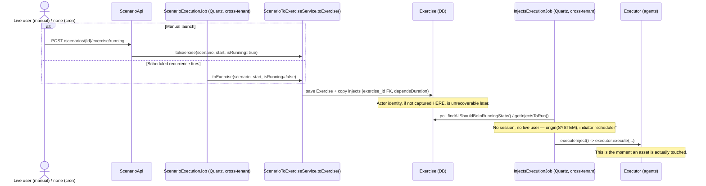
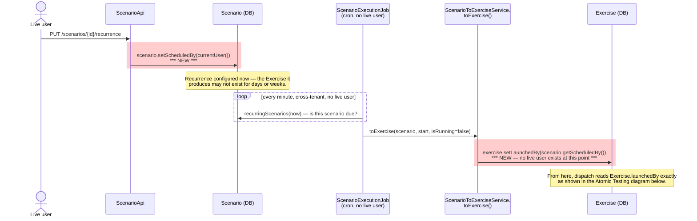
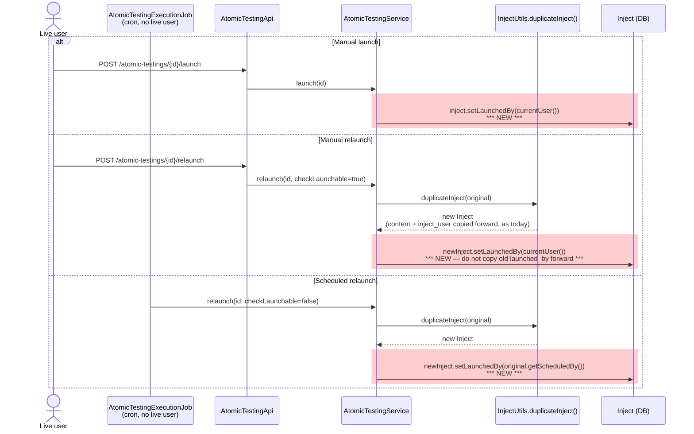
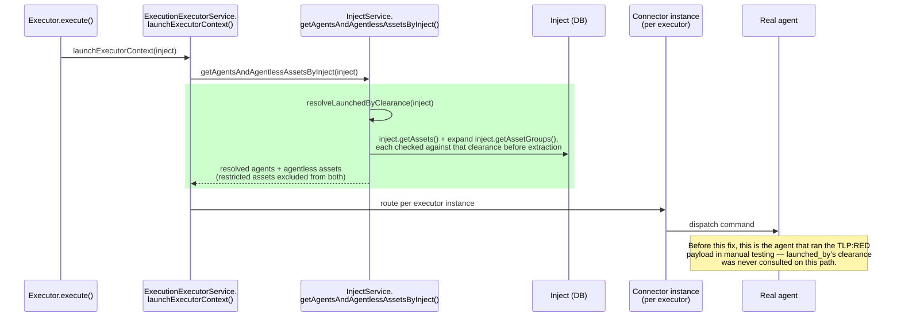
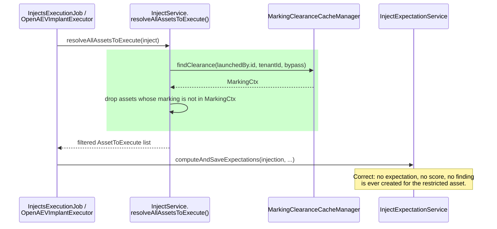
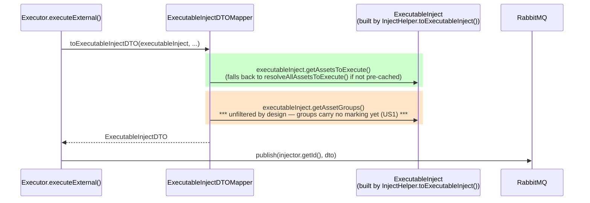
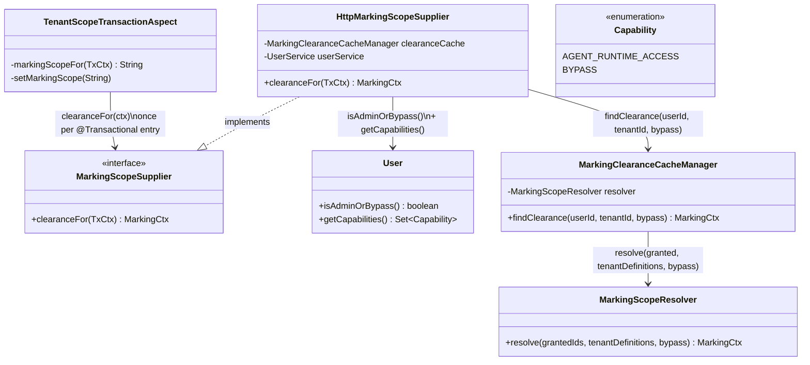
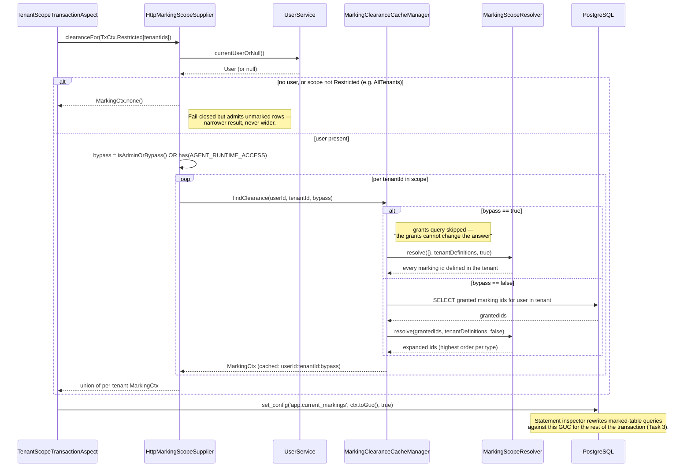

# Task 4 — Handle Side Effects of Asset Markings on Related Entities: Technical Design

**Issue**: https://github.com/OpenAEV-Platform/openaev/issues/8171

**Type**: Full Stack

**Estimation**: [ **L** ]

**Depends on**: 
* [Task 2 — Assign Markings to Groups](../task2/tech-design.md) (`MarkingScopeResolver`),
* [Task 3 — Marking-based Access Control for Assets](../task3/tech-design.md) (asset marking = read filter)

---

# 📋 Context

Task 3 established that a marking on an asset is a **read filter**: a user sees an asset only if
their effective group clearance covers its marking, and an unmarked asset is visible to everyone.

**Task 4 asks what happens when an asset is referenced *indirectly* — through an Asset Group, a
Scenario, a Simulation (`Exercise`), or an Atomic Testing (`Inject`) — rather than opened directly.**

Two options under evaluation:

Task 4 is being explored through two alternative answers to one question: *what does a user see of, and
do with, a parent entity (Asset Group, Scenario, Simulation, Atomic Testing) that holds an asset they
have no clearance for?*

| | [Option 1: fine granularity](#-option-1-fine-granularity) | [Option 2: hide parents](#-option-2-hide-parents) |
|---|---|---|
| **In one line** | The parent stays visible; restricted assets are filtered out of it in depth, including partial/scoped execution | Any parent that holds a restricted asset is completely hidden from that user |


# 🔥 Option 1: Fine granularity

* The parent entity stays visible to every user who could see it before Task 4. 
* Inside it, each restricted
  asset is filtered out everywhere it appears (targets, results, scores, findings, remediations).
* Launches have 2 options:
  * variant A: in **partial/scoped mode**, executing only the targets the resolved actor is cleared for.
  * variant B: in **full mode**, executing all targets, including restricted ones.

**Decision: variant A.**

**Why variant B is ruled out — privilege escalation.** This is a confused-deputy pattern: the user isn't
just seeing a filtered view, they are **causing** an effect on a resource they have zero clearance
on, and the fact that the effect is hidden from them afterward doesn't undo that they triggered it.

# 🫣 Option 2: hide parents

- An **Atomic Testing** (a root `inject`), a **Scenario**, a **Simulation** (`exercise`) or an **Asset Group**
  that holds at least one asset outside the user's clearance is **completely hidden** from that user:
  lists, counts, search, target pickers, and direct URL/API (`404`). Example: an asset group is hidden from
  a `TLP:GREEN` user as soon as one of its members is `TLP:RED`.
- A hidden Scenario or Simulation cannot be launched by that user, so no Exercise is ever created from it
  on their behalf.
- Objects **generated at execution time** (findings, `findings_assets`, expectations, traces, attack-path
  rows) from a hidden parent are hidden too.
- **The user never sets a marking on the Scenario.** The parent is hidden *implicitly*, derived from the
  assets it holds.

| | **Variant-1: derived marking set stored on each parent** | **Variant-2: read-time check through SQL functions** |
|---|---|---|
| **Principle** | Each parent stores the markings of everything it holds, updated on write | No new column: a SQL function per parent (`can_see_scenario(id)`, …) follows the links down to the assets |
| **New columns** | `marking_ids` on every parent and derived table | none |
| **Dynamic asset groups** | ✅ evaluated in Java at write time | ❌ not seen: SQL only knows static members |
| **Kept up to date on write** | the whole chain: groups → injects → scenarios / simulations → findings, … | nothing |
| **Read cost** | none (one-column test) | an `EXISTS` chain on every row, `COUNT(*)` included |
| **Stale-data risk** | a missed update leaves a parent visible → leak | none |
| **Elasticsearch** | ✅ index the same column | ❌ needs a set computed at indexing time |
| **Can express "visible if *any* linked asset is visible"** | ❌ | ✅ |

# Comparison: Option 1 vs. Option 2

* Common ground: filtering the objects generated at execution

> ✅ **Implemented for Option 1 with Solution B.** The need described below is met by the derived
> tables of [Marking the objects linked to an asset](#-problem-2-marking-the-objects-linked-to-an-asset---the-derived-entities):
> a `MarkedTable` shape inside the existing `MarkingDimension`, declared in `MarkingDerivedTables`.
> Its link-rows shape expresses the **ANY** mode below, and its parent-link shape the per-row links.
> The separate `DerivedMarkingDimension` + SQL functions of Variant-2 is only needed for what Option 2 adds
> (ALL links on containers, dynamic groups).

* Pros and cons

**🔥 Option 1: fine granularity**

- ✅ Lower-clearance users keep working with shared scenarios, groups and results: only the restricted
  assets disappear.
- ✅ Scales with markings: each newly marked object hides only itself.
- ✅ Already built on `task4-poc`: execution (launch, relaunch, scheduled runs, the 3 dispatch paths)
  and derived entities (findings, expectations, traces).
- ⚠️ Runs can be partial: higher-clearance viewers need UI hints (who launched it, which targets were
  skipped).
- ⚠️ Stored aggregates (asset-group expectation row, status counts, Elasticsearch) need extra work for
  viewers with less clearance than the launcher.
- ❌ Main risk: one missed read or dispatch path leaks a restricted asset inside a visible parent.

**🫣 Option 2: hide parents**

- ✅ Simple to reason about: a visible parent never holds a restricted asset, runs are never partial,
  aggregates are correct as they are.
- ❌ One restricted asset hides the whole parent, including the author's own work and past
  simulations, and transitively through broad dynamic groups.
- ❌ Gets worse as more objects are marked: each new marked type hides every parent that reaches it.
- ❌ Not built, and costly either way: a marking set to keep up to date along the whole chain
  (Variant-1), or SQL functions blind to dynamic groups (Variant-2). Elasticsearch needs its own set.

<div style="background-color: #d4edda; color: #155724; border: 1px solid #c3e6cb; border-radius: 6px; padding: 12px 16px;">
💡💡 <b>Recommendation: Option 1 Fine Granularity</b> <br/><br/>Fine granularity (option1) offers more functional potential for future evolution: <br/>As we mark more
objects we still want end users with clearance to be able to see and act on the platform.<br/><br/>
</div>

# Option 1: The problems to solve

## 👤 Problem-1/ The user is needed to resolve clearance at inject execution time
None of the entities today carries the author/user. 
When the **OAEV service account is running the inject** matching assets/agent to a payload execution the user 
information is needed. We need the user who initially triggered the run.

### 1-1/ Which user to use?
* The one who created the scenario?
* The one who last updated it?
* The one who scheduled it?
* The one who last launched it?

> **Side note**: Why "last edited/updated user/author" cannot be the resolved actor
>
> If a background job's clearance were resolved from "whoever last edited the Scenario," an unrelated,
> incidental edit — an admin fixing a typo, updating a description — would silently change *whose*
> clearance a future recurring launch inherits.

**SPOILER:** The source of truth (even for scheduled scenario/atomic testing) is always the user who triggered the run. 

### 1-2/ Where to store the user information?

Looking at the life cycle of a scenario/simulation, the common case is `Exercise`.
Looking into atomic testing => `Inject` table.

So the only point where an actor identity can still be captured is at `Exercise`/`Inject` creation
time — after that, it's gone. 

#### Current Flow
Scenario → Exercise, and the Exercise/Inject link for time-based scheduling 



* When a user launches a scenario, the scenario creates an `Exercise` record.
* Later the `InjectsExecutionJob` background job picks up the `Exercise` to run the inject against an asset.

#### Modified Flow for launching a scenario: LaunchedBy
**What's actually new here — the `scheduled_by` → `launched_by` handoff.** The manual-launch write and
the dispatch-time `MarkingClearanceCacheManager` check are structurally identical to the Atomic Testing
diagram below (same enforcement point, reached via `inject.getExercise().getLaunchedBy()` instead of a
direct field on `Inject`) — no need to repeat them. What's specific to Scenario is the gap between
configuring a recurrence and the `Exercise` it eventually produces, with no live user at either end:



#### Modified Flow for Atomic Testing 

**Where the new writes and the new clearance check land.** Red highlights mark what Task 4 adds; every
other call already exists today.



What happens to this `launched_by` value once dispatch actually starts — and why reaching
`resolveAllAssetsToExecute` turned out not to be the whole story — is covered next, since it's shared
with the Scenario/Exercise path rather than specific to Atomic Testing.

### 1-3/ When in code to resolve user clearance during execution?

> ⚠️ ⚠️ Execution dispatch has three independent asset-resolution paths, not one!
> And many more to discover...

#### Path 1: Agent-routing dispatch (the path manual testing caught)

`Executor.execute()` calls `ExecutionExecutorService.launchExecutorContext(inject)`
**unconditionally**, before branching into `executeInternal`/`executeExternal`, whenever
`injectorContract.getNeedsExecutor()` is true. That method calls
`InjectService.getAgentsAndAgentlessAssetsByInject(inject)` (`InjectService.java:1111-1126`) — a
**separate, independent** method that builds the real `Set<Agent>` commanded to execute via each agent's
connector/executor instance. Manual e2e validation found this method originally walked
`inject.getAssets()` + expanded `inject.getAssetGroups()` directly off the entity with no marking
awareness at all — the actual cause of the `TLP:RED` agent executing in that test.



**This is the highest-leverage point for the filter.** It's inject-type-agnostic (any `Inject`,
Scenario-linked or Atomic Testing) and runs before the internal/external split, so filtering here covers
both Scenario/Simulation and Atomic Testing, and however an injector is classified (internal or
external), in one place.

#### Path 2: Expectation / finding computation

`InjectService.resolveAllAssetsToExecute()`, called from `InjectsExecutionJob.executeInject()`
(`InjectsExecutionJob.java:149`) and again from `OpenAEVImplantExecutor.process()`
(`OpenAEVImplantExecutor.java:39`) and `AbstractTechnicalBehavior` (`AbstractTechnicalBehavior.java:94`,
with a fallback to calling it directly for "direct callers" that don't pre-cache). This is the one path
where the marking filter is wired in, and it's correct **for what it feeds**: which assets get
expectation rows, scores, and therefore findings.



This explains why the overview didn't show `ASSET_RED` as a target — but it does **not** prevent a
finding on a restricted asset that actually ran, because which asset runs is decided by path 1,
which this path never controls.


#### Path 3: External-push dispatch payload (non-agent connectors)

For an injector classified `isExternal()` (e.g. email, SMS, OpenCTI — not agent-based), `executeExternal()`
builds the published payload via `ExecutableInjectDTOMapper.toExecutableInjectDTO()`. Its `.assets(...)`
is built from `executableInject.getAssetsToExecute()` (the filtered list, cached by `InjectsExecutionJob`
or resolved fresh on the same fallback `AbstractTechnicalBehavior` already uses for direct callers) —
consistent with path 1's filter, since both resolve clearance through the same
`resolveLaunchedByClearance`.

`.assetGroups(...)`, however, is passed through **unfiltered** — a deliberate boundary, not an
oversight. Asset groups carry no marking of their own today (that's US1, still open), so there is no clearance rule to apply to a group reference itself, and the
downstream injector resolves non-endpoint members (e.g. AI targets) from the group independently of the
filtered flat asset list. Emptying `.assetGroups(...)` once `.assets(...)` carries the filtered list
would silently break that AI-target-via-group path, not just de-duplicate it.




## 🔒 Problem-2/ Marking the objects linked to an asset - the derived entities

The asset row is filtered by the Task 3 rewrite, but the rows that **point at** an asset are not, 
so they can still leak what the asset hides (its id, its existence, a finding's title, an expectation's score…).

### Why the existing rewrite does not cover them

`MarkingDimension.readPredicate()` (`MarkingDimension.java:55`) only ever emits
`is_marking_set_allowed(<alias>.marking_ids)` — a test on a column **of the table being queried**.
It never follows a foreign key. A table is filtered only if it (a) has a `marking_ids text[]` column
(`MarkingFilteringConfig.deriveFromSchema()`) and (b) is listed in `openaev.marking.active-tables`.
Today that is `assets` alone. Objects linked to an asset:

| Table | Link to the asset |
|---|---|
| `agents` | `agent_asset` FK (`Agent.java:62`) |
| `findings_assets` | join table (`Finding.java:135-138`) |
| `injects_assets` | join table (`Inject.java:341-344`) |
| `asset_groups_assets` | join table (`AssetGroup.java:94-98`) |
| `injects_expectations` (technical subtype) | `asset_id` FK (`TechnicalInjectExpectation.java:30`) |
| `asset_agent_jobs` | `asset_agent_agent` / `asset_agent_inject` |

`Endpoint` and the other asset subtypes share the `assets` table (`SINGLE_TABLE` inheritance), so they
are already covered. Which of these tables *should* be marked is a product decision (e.g.
`assets_tags` and `asset_groups_assets` arguably should not — see US1).

### Variant A — Denormalized `marking_ids` column on each linked table

Give each linked table its own `marking_ids text[]` column holding a **copy** of its asset's markings,
and add the table to `openaev.marking.active-tables`. No engine change: the inspector already filters
any table with the column, joins and sub-queries included, using the same predicate.

### Variant B — Derived tables, filtered through the asset (✅ chosen, implemented)

Keep **no** column on the linked table. A table *derived* from assets is filtered by asking whether
the asset row it comes from is visible:

```sql
-- injects_expectations, rewritten
(ie.asset_id IS NULL OR EXISTS (
   SELECT 1 FROM assets a
   WHERE a.asset_id = ie.asset_id
     AND is_marking_set_allowed(a.marking_ids)))
```


- **Always consistent**: the asset is the single source of truth; changing its markings changes what
  every derived row shows, instantly, with nothing to propagate.
- **Costs**: one correlated sub-select per derived table per query; the unmarked fast path
  (`COALESCE(marking_ids,'{}')` on a local column) is lost, and the planner must use the asset PK /
  FK indexes.
- **Writes**: the same predicate on UPDATE/DELETE targets works, but an INSERT of a derived row
  cannot be checked by a WHERE; that stays a service-layer guard (as already stated for markings in
  `MarkingDimension`).

### Comparison

| | A — column copy | B — derived through the asset |
|---|---|---|
| Engine change | none | three shapes of `MarkedTable`, inside `MarkingDimension` |
| Source of truth | duplicated | single (asset) |
| Failure mode | stale/missing copy → leak | none by construction; cost is performance |
| Query cost | local test, GIN-indexable | correlated sub-select |
| Migration/backfill | per table | none |

**B was chosen** (2026-10-06): correctness must not depend on every application
write path remembering to copy a marking. The stream is the one consumer where A would have been
simpler.

<div style="background-color: #d4edda; color: #155724; border: 1px solid #c3e6cb; border-radius: 6px; padding: 12px 16px;">
💡💡 <b>Recommendation: Variant B - Derived tables, filtered through the asset</b> <br/><br/>
MarkingDimension is enriched with several layers of filtering.<br/>
Each child table is filtered through the parent table (i.e. the asset). The parent table is the source of truth.<br/>
The developer must explicitly declare the linked tables, and how they are linked. <br/><br/>
</div>


# Option 1: How to implement: the technical design

## 💾 Data model changes

Four new columns, following one consistent naming convention (`scheduled_by` = who owns/configured
a recurring schedule; `launched_by` = whose clearance gates one specific run):

| Entity | Field | Written by | Live-user path | No-live-user path |
|---|---|---|---|---|
| `Scenario` | `scheduled_by` **(new)** | `PUT /scenarios/{id}/recurrence` → `updateScenarioRecurrence` (`ScenarioApi.java:577`) | current user, on every recurrence create/update | **null** for scenarios generated from an OpenCTI security coverage: `SecurityCoverageService.setRecurrence` (`SecurityCoverageService.java:515`) sets the recurrence directly, with no signed-in user and without going through `updateScenarioRecurrence`. Null resolves to zero clearance at dispatch |
| `Exercise` | `launched_by` **(new)** | `ScenarioToExerciseService.toExercise()` (`ScenarioToExerciseService.java:54`) | current user (manual launch, `ScenarioApi.java:668`, incl. the autonomous/chaining branch at lines 672-682, which is still inside the same HTTP call) | copied from `scenario.getScheduledBy()` (cron creation, `ScenarioExecutionJob.java:117`) |
| `Inject` (atomic testing only) | `scheduled_by` **(new)** | `AtomicTestingService.updateRecurrence()` | current user, on every recurrence create/update | — |
| `Inject` (atomic testing only) | `launched_by` **(new)** | `AtomicTestingService.launch()` / `relaunch()` (`AtomicTestingService.java:231-262`) | current user (manual launch/relaunch) | copied from the original inject's `scheduled_by` (scheduled relaunch, `AtomicTestingExecutionJob.java:101-112`) |

All four are net-new columns — none of them reuse or rename an existing field (in particular, `Inject.launched_by`/`scheduled_by` are distinct from the pre-existing `inject_user`, which keeps its current "last content editor" meaning).

Both `launched_by` columns are nullable FKs to `users` (`ON DELETE SET NULL`), matching the existing
`inject_user` FK pattern (`V2_60__Delete_fk_users_injects.java`). A deleted/deactivated actor resolves
to **zero effective clearance** — any restricted target is skipped, never executed. This is a
deny-by-default fallback consistent with the rest of Task 4's global acceptance principles.

`Inject.launched_by` and `Inject.scheduled_by` only apply to root/atomic-testing injects
(`exercise == null && scenario == null`). A Scenario-linked inject never gets its own copy — its
clearance is resolved through `inject.getExercise().getLaunchedBy()`.

## Interaction with the existing marking bypass (service account) — unchanged

Task 3's read-filtering mechanism (Option C) already has a "sees everything" bypass, used today so
the per-tenant agent/implant service account never loses sight of its own host asset once that asset
is marked. It's worth spelling out precisely, because Task 4's dispatch-time check must **not**
accidentally inherit it.

**Class relationships:**



**Runtime flow, both branches:**



**Why Task 4 doesn't need to change this, and the guardrail it must follow instead:**

- The bypass exists only inside `HttpMarkingScopeSupplier` — it is the HTTP/agent-callback-specific
  wrapper, not part of `MarkingScopeResolver`'s general contract. `MarkingScopeResolver.resolve()`
  (`MarkingScopeResolver.java:60-62`) just does what its `bypass` argument tells it to; the *decision*
  of what counts as bypass is made entirely by the caller.
- The per-tenant service account (`ServiceAccountPrivilegeService`) holds exactly
  `{AGENT_RUNTIME_ACCESS, AGENT_DOCUMENT_ACCESS, INSTALL_AGENT}` — none of which satisfies
  `@AccessControl(Action.LAUNCH)` on the Scenario/Atomic Testing endpoints. It structurally cannot
  authenticate a launch/relaunch/recurrence-update call, so it can never be the value written into
  `launched_by` or `scheduled_by`.
- **Guardrail for implementation**: the dispatch-time check must call
  `MarkingClearanceCacheManager.findClearance(launchedByUserId, tenantId, bypass)` **directly**, with
  `bypass = launchedByUser.isAdminOrBypass()` — it must never route through `HttpMarkingScopeSupplier`,
  which would incorrectly fold in `AGENT_RUNTIME_ACCESS`, a concern that belongs to a different actor
  entirely. (`MarkingScopeResolver` itself is not something Task 4's code calls directly — it's the
  internal collaborator `findClearance()` already delegates to once it has fetched `grantedIds` and
  `tenantDefinitions`.)
- **This is still "live," not a cached snapshot.** `findClearance()` is `@Cacheable`, but that cache is
  evicted on every clearance-*reducing* change — group membership removed, a marking unassigned, an
  order lowered/archived (`MarkingClearanceCacheManager.java:117-170`; Task 2 tech design §3.3). So a
  call at dispatch time always reflects the actor's current group markings; it is not the same thing
  as the resolved-clearance **snapshot on the entity** that this document rules out elsewhere — nothing
  would ever evict a value baked into an `Exercise`/`Inject` column when the actor's groups change,
  which is exactly why that approach isn't safe and this one is.

## Clearance resolution at dispatch time (launchedBy)

Whichever field is read (`Exercise.launched_by`, `Inject.launched_by`), the rule is the same:

- **Never cache the resolved clearance, only the actor reference.** Clearance is recomputed live from
  that actor's **current** group memberships at the moment of dispatch, reusing Task 2's
  `MarkingScopeResolver`.

- **A stored, deleted, or deactivated actor resolves to zero clearance.** No error, no fallback to
  "run anyway" — every remaining restricted target is simply skipped, same as if the actor had never
  had any group markings.

- This rule must be applied at **each** of the three independent asset-resolution points described in
  ["1-3/ When in code to resolve user clearance during execution?"](#1-3-when-in-code-to-resolve-user-clearance-during-execution)
  above — `resolveAllAssetsToExecute` alone (path 2) was found, during manual e2e validation, to filter
  expectations/findings but not the actual dispatch. Path 1
  (`getAgentsAndAgentlessAssetsByInject`/`launchExecutorContext`) is the primary target; path 3
  (`ExecutableInjectDTOMapper`) covers non-agent external connectors.

## Derived tables (Variant B)

### Where it lives: inside `MarkingDimension`, not a new `ScopeDimension`

A derived table is "marked" in exactly the same sense as `assets`: same clearance, same
`is_marking_set_allowed`, same rule for reads and writes. So it is not a new dimension, it is a new
**shape** of `MarkedTable`, handled by the existing `MarkingDimension`:

| `MarkedTable` shape | Example | Predicate emitted by `MarkingDimension.predicate()` |
|---|---|---|
| **Own column** | `assets` | `is_marking_set_allowed(t.marking_ids)` |
| **Parent link** (`linkedTo`) — the table points to one marked row | `injects_expectations.asset_id → assets` | `(t.fk IS NULL OR EXISTS (SELECT 1 FROM parent p WHERE p.key = t.fk AND <parent predicate>))` |
| **Link rows** (`throughLinkRows`) — rows of a link table point to it | `findings ← findings_assets` | `(NOT EXISTS (<links>) OR EXISTS (<links> AND <link table predicate>))` |

`<parent predicate>` / `<link table predicate>` are produced by the same method, recursively, so a
chain resolves hop by hop down to the one table that holds `marking_ids`. A separate dimension would
have duplicated the active-table set, the chain validation and the recursion, and the inspector would
only have ANDed two predicates that test the same clearance.

### Which tables: a registry in code, not a property

The derived tables are part of the **data model**, not of the deployment, so they live in
`MarkingDerivedTables` (`io.openaev.config`) and nothing is configured for them:

```java
// The links from a parent to an asset (editing them must keep the hidden ones)
public static final List<MarkedTable> LINKS_TO_ASSETS =
    List.of(
        linkedTo("injects_assets", "asset_id", "assets", "asset_id"),                 // (4)
        linkedTo("asset_groups_assets", "asset_id", "assets", "asset_id"));           // (5)

// What a run produces on an asset
public static final List<MarkedTable> FROM_ASSETS =
    List.of(
        linkedTo("findings_assets", "asset_id", "assets", "asset_id"),                // (1)
        throughLinkRows("findings", "finding_id", "findings_assets", "finding_id"),   // (2)
        linkedTo("injects_expectations", "asset_id", "assets", "asset_id"),           // (3)
        linkedTo("agents", "agent_asset", "assets", "asset_id"),                      // (6)
        linkedTo("execution_traces", "execution_agent_id", "agents", "agent_id"));    // (7)
```

- **One property, one meaning.** `openaev.marking.active-tables` lists only tables that carry a
  `marking_ids` column (`assets`). Activating `assets` filters every table derived from it
  (`MarkedTables.withDerived`); if `assets` is not active, its derived tables stay unfiltered. Listing
  a derived table in `active-tables` fails the startup: it has no marking column.
- **Why the columns are spelled out.** The predicate is generated SQL and must name its join columns.
  Deriving them from the foreign keys was considered and rejected: `injects_expectations` has three
  candidate columns (`asset_id`, `agent_id`, `asset_group_id`), `findings` has no foreign key to
  `assets` at all, some tables have no FK constraint, and "follow every FK to `assets`" would also
  hide `injects` and `asset_groups` (Option 2). A few readable lines tell exactly what SQL is emitted.
- **Checked against the schema** by `MarkingLinkedTablesRowsTest` (every column of the registry
  exists), instead of a startup check.
- **Removed**: the `openaev.marking.linked-tables` property, its `child.fk>parent.key` /
  `table.key<link.fk` syntax and parser, and the startup column check that came with it.

### How the inspector applies it

Nothing changes in `ScopeStatementInspector`; it already works table by table:

1. **Fast gate, before parsing**: a regex on `activeTables()` of every dimension. `MarkingDimension`
   returns `assets` **and** its derived tables, so a statement on `findings` alone is not skipped.
   A statement naming none of them (`scenarios`, `tags`…) is returned unchanged, never parsed.
2. **Per table, after parsing**: for each table of the statement, each dimension that `covers()` it
   adds its predicate; several dimensions are ANDed.

| Statement touches | `TenantDimension` | `MarkingDimension` |
|---|---|---|
| `scenarios` only | — | — (stopped at the fast gate) |
| `assets` | `can_access_tenant(…)` | own column |
| `injects_expectations` | — | parent link (3) |
| `findings` | `can_access_tenant(…)` | link rows (2) |
| `findings_assets` | — | parent link (1) |
| `injects_assets` / `asset_groups_assets` | — | parent link (4) / (5) |
| `agents` | `can_access_tenant(…)` if v2-active | parent link (6) |
| `execution_traces` | — | parent link (7), a two-hop chain: trace → agent → asset |

### Concrete example: a lower-clearance user opens a simulation run by an admin

An admin (full clearance) runs a scenario on `ASSET_GREEN` and `ASSET_RED`. A `TLP:GREEN` user then
opens the simulation's results.

**Findings.** `SELECT * FROM findings f`, as rewritten. `<findings_assets predicate>` in (2) is
predicate (1) applied to the link row `l`:

```sql
SELECT * FROM findings f
WHERE (
  -- a) the finding is attached to no asset → nothing marks it → visible
  NOT EXISTS (SELECT 1 FROM findings_assets l WHERE l.finding_id = f.finding_id)
  OR
  -- b) at least one of its assets is visible to me: (2), with (1) inlined for the link row
  EXISTS (SELECT 1 FROM findings_assets l
          WHERE l.finding_id = f.finding_id
            AND (l.asset_id IS NULL OR EXISTS (
                   SELECT 1 FROM assets a
                   WHERE a.asset_id = l.asset_id
                     AND is_marking_set_allowed(a.marking_ids))))
)
```

`findings_assets.asset_id` is part of the primary key, so the `IS NULL` branch never matches here;
it belongs to the generic parent-link shape, where a NULL foreign key is real. Branch b) is, by hand,
`EXISTS (SELECT 1 FROM findings_assets l JOIN assets a ON a.asset_id = l.asset_id WHERE
l.finding_id = f.finding_id AND is_marking_set_allowed(a.marking_ids))`.

| Finding | `findings_assets` rows | a) no link? | b) a visible asset? | `TLP:GREEN` user sees it |
|---|---|---|---|---|
| port 445 open | GREEN, RED | no | yes (GREEN) | ✅, with only GREEN in its asset list |
| CVE-2024-xxxx | RED | no | no | ❌ |
| finding with no asset | — | yes | — | ✅ |

**Expectations and scores.** The rows computed on `ASSET_RED` (its asset expectation and its agents'
expectations, which carry `asset_id` too) are removed by (3); team, player and asset-group rows have
no `asset_id` and stay. Global scores are computed at read time from these rows
(`ResultUtils.computeGlobalExpectationResults`), so they cover the GREEN asset only.

**Execution traces (the RED agent's output).** A trace is derived from its agent (7), the agent from
its asset (6):

```sql
(t.execution_agent_id IS NULL OR EXISTS (
   SELECT 1 FROM agents ag WHERE ag.agent_id = t.execution_agent_id
     AND (ag.agent_asset IS NULL OR EXISTS (
          SELECT 1 FROM assets a WHERE a.asset_id = ag.agent_asset
            AND is_marking_set_allowed(a.marking_ids)))))
```

In the UI the traces are reached by clicking a target in the target list (Atomic testing or
Simulation inject → target → *Execution* and *Terminal view*, also the *Terminal view* of the attack
path), which already hides `ASSET_RED`. But the API takes any target id
(`GET /api/injects/execution-traces?targetId=…`, `GET /api/injects/{id}/execution-result?targetId=…`),
and the raw `Inject` responses embed `inject_status.status_traces`: the RED agent's output was
reachable for anyone who knew or guessed the RED asset id. With (6) and (7), the RED agent and its
traces do not exist for the `TLP:GREEN` user. Global traces (no agent) stay visible.

**Editing the targets of an inject.** The `TLP:GREEN` user adds `ASSET_NEW` to an inject that
targets `ASSET_GREEN` and `ASSET_RED`. They load `[GREEN]` (the join to `assets` hides RED) and send
`[GREEN, NEW]`. `Inject.assets` is a `List` (a Hibernate bag), so changing it emits:

```sql
DELETE FROM injects_assets WHERE inject_id = ?            -- 1. drop every link
INSERT INTO injects_assets VALUES (?, GREEN), (?, NEW)     -- 2. re-insert what the user sent
```

Without (4), statement 1 deletes the RED link: **editing an inject silently removed a target the
user could not see** (reproduced by `InjectAssetsMarkingUpdateTest`, both for scenario/simulation
injects and atomic testings). With (4), the inspector narrows it:

```sql
DELETE FROM injects_assets WHERE inject_id = ?
  AND (injects_assets.asset_id IS NULL OR EXISTS (SELECT 1 FROM assets a
       WHERE a.asset_id = injects_assets.asset_id AND is_marking_set_allowed(a.marking_ids)))
```

The RED link is out of reach, so it survives; statement 2 re-inserts GREEN and NEW, with no
conflict. Static asset groups (`AssetGroup.assets`, also a `List`) behave the same way, fixed by (5).
Reading `inject.getAssets()` is unchanged (the joined `assets` already hides RED), so launch,
duplication and the scenario → simulation copy behave exactly as before.

**Loading a finding's asset list.** For `finding.getAssets()` Hibernate emits:

```sql
SELECT fa.finding_id, a.*
FROM findings_assets fa
JOIN assets a ON a.asset_id = fa.asset_id
WHERE fa.finding_id = ?
```

| Table | `TenantDimension` | `MarkingDimension` | Rewrite |
|---|---|---|---|
| `findings_assets` (main) | not covered | parent link (1) | `AND (fa.asset_id IS NULL OR EXISTS (… assets …))` in the `WHERE` |
| `assets` (joined) | `can_access_tenant(…)` | own column | `JOIN (SELECT * FROM assets a WHERE can_access_tenant(…) AND is_marking_set_allowed(…)) a` |

Here the RED link already disappears through the joined `assets` (inner join, Task 3), so (1) is
redundant for this query. (1) is what protects the statements that read `findings_assets` **without**
joining `assets`:

- ids or counts: `SELECT asset_id FROM findings_assets WHERE finding_id = ?` would return the RED id;
- the collection rewrite: `DELETE FROM findings_assets WHERE finding_id = ?` when a lower-clearance
  user changes the finding's assets is narrowed to visible links, so the RED link survives instead
  of being silently dropped;
- the `EXISTS` of predicate (2) itself.

### Semantics worth knowing

- **A NULL foreign key is visible.** A row attached to no asset (a team expectation) has no marking
  to inherit, exactly like an empty marking set.
- **A hidden parent hides the row everywhere the table is read**, including as a joined table, a
  sub-query, and a link table read on its own.
- **Findings use a permissive rule**: visible when there is no link, or at least one visible asset.
  A finding attached to a visible and to a restricted asset stays visible, and may carry information
  that came from the restricted one. The strict alternative (hidden as soon as one asset is hidden)
  is a one-branch change in `MarkingDimension.linkRowsPredicate`. To confirm with the PO.
- **The parent's tenant is not re-checked inside the sub-select**: the foreign key already ties the
  row to a parent of its own tenant, and the child is tenant-filtered on its own where it is a
  tenant table.
- **Who sees agents.** An HTTP transaction carrying a `TxCtx` gets the caller's clearance; the agent
  callbacks (`/api/endpoints/register`, jobs, expectation updates) run as the agent service account,
  whose `AGENT_RUNTIME_ACCESS` is a read bypass, so an agent always sees itself. The external
  executors (CrowdStrike, MDE, SentinelOne, Tanium, Palo Alto Cortex, Caldera) sync agents through
  `TenantScopedTransaction`, i.e. with system clearance. A transaction with no `TxCtx` has an empty
  clearance and does not see agents of marked assets, exactly as it already does not see the assets.
