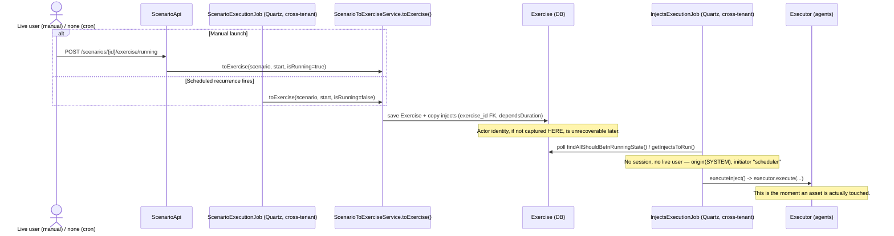
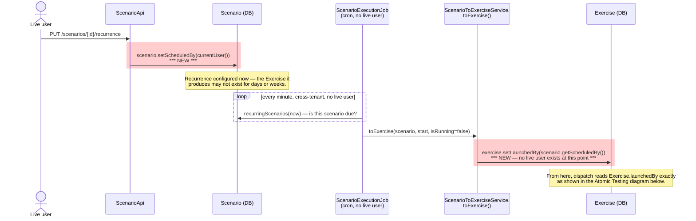
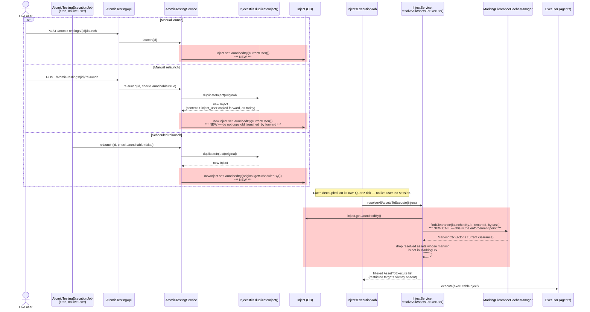
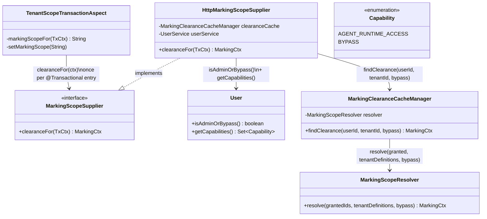
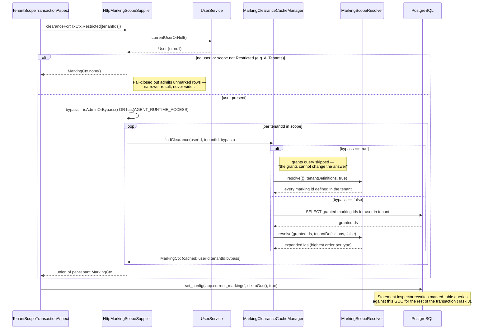

# Task 4 — Handle Side Effects of Asset Markings on Related Entities: Technical Design

**Issue**: #[number] (if applicable)
**Type**: Full Stack
**Estimation**: [S | M | L | XL]
**Depends on**: [Task 2 — Assign Markings to Groups](../task2/tech-design.md) (`MarkingScopeResolver`),
[Task 3 — Marking-based Access Control for Assets](../task3/tech-design.md) (asset marking = read filter)

---

## 📋 Context

Task 3 established that a marking on an asset is a **read filter**: a user sees an asset only if
their effective group clearance covers its marking, and an unmarked asset is visible to everyone.
Task 4 asks what happens when an asset is referenced *indirectly* — through an Asset Group, a
Scenario, a Simulation (`Exercise`), or an Atomic Testing (`Inject`) — rather than opened directly.

The user-stories doc ([`../user-stories.md`](../user-stories.md), Task 4 section) states the
governing principle:

> **Read filter, not write filter:** a marking filters what a user can read. A user may be allowed
> to update a parent entity without being able to read every asset it references. However,
> restricted information must never be exposed through asset names, identifiers, counts, previews,
> results, errors or derived objects.

This document works out one specific consequence of that principle that the user-stories doc leaves
open (Open Question #2): **can a user launch a Scenario, Simulation, or Atomic Testing whose targets
include an asset they have no clearance for?**

### Why this isn't answered by "read filter, not write filter" alone

The principle as written covers *metadata writes* on a parent entity — renaming a Scenario, editing
its description, adding a new visible target. None of those require reading the referenced asset,
and none of them act on it.

**Launch is not that.** Launching:

1. Creates a **derived object** (an `Exercise`) — the principle already says restricted information
   must never be exposed through derived objects, so whatever the answer, the derived object must
   stay consistent with what the launching user can see.
2. **Triggers execution** against the referenced asset — a real operational effect on a resource the
   user has no visibility into. That is a materially different question from "can I edit a field,"
   and it's the reason Task 4's own technical use case flags it explicitly as unresolved:
   *"Open decision: can `USER_GREEN` launch this Scenario? Launching creates a Simulation containing
   an inject targeting `ASSET_RED`."*

STIX/TLP itself doesn't help resolve this either: TLP is a disclosure/sharing label (who may this be
shared or shown to), and the standard is explicit that access control — including whether an action
may be *performed* — is left entirely to the implementing system. "Read filter, not write filter" is
a faithful translation of TLP into an access model for **reads**; it says nothing about execution.

---

## Design options for launch behavior

The user-stories doc's "Impact of asset markings" table (Row 3) already frames the two candidate
behaviors for manual and scheduled execution alike:

### Option 1 — Partial / scoped launch (✅ chosen)

The launch, or the scheduled job, runs with the effective markings of a resolved actor (see
[Data model changes](#data-model-changes) below). It executes **only** the targets that actor can
see; a restricted target is skipped entirely — not run, not touched, not queued.

- **Pros**: generalizes the Task 4 core principle ("a restricted asset does not exist for the user")
  from reads to writes/execution — the user never causes an effect on an asset they cannot see, so
  there is no escalation. Matches the pre-existing worked example already in the user-stories doc
  (Atomic Testing: `USER_GREEN` can't launch while `ASSET_RED` is the only target, but *can* launch
  once `ASSET_GREEN` is added, even though `ASSET_RED` remains configured for `FULL_ADMIN`).
- **Cons**: a fully-restricted entity (every target hidden) has nothing left to run — needs an
  explicit "no visible targets" empty state on launch, distinct from a generic block. Reporting must
  make clear to a higher-clearance viewer that a given run only covered a subset of targets, so
  results aren't misread as "everything was tested."

### Option 2 — Run on all targets, filter only the read side (❌ ruled out)

The launch runs on every target regardless of the launcher's clearance; markings only filter what
the launcher can *read* back in the results (targets, scores, findings).

- **Why it's ruled out — privilege escalation.** This is a confused-deputy pattern: the user isn't
  just seeing a filtered view, they are **causing** an effect on a resource they have zero clearance
  on, and the fact that the effect is hidden from them afterward doesn't undo that they triggered it.
  A user who could never open `ASSET_RED`, never see it in a list, never learn it exists, could still
  command a payload to run against it — that is a strictly larger capability than anything marking
  clearance is supposed to grant, and it's exactly the scenario the PO flagged as unacceptable:
  *"that would cause an escalation of privileges, letting a user run on an asset where they have no
  clearance."*
- Also inconsistent with the core Task 4 principle itself: "a restricted asset does not exist for the
  user" cannot be squared with that same user's action reaching into it.

**Decision: Option 1.** Recorded in the Decisions Log addition below.

A third, stricter variant was considered and also rejected: hard-blocking the *entire* launch
whenever *any* referenced target is restricted, regardless of other visible targets. This was
rejected because it contradicts the existing worked example in the user-stories doc (which allows
launch once a visible target exists) and is materially more disruptive for no additional security
benefit over Option 1 — under Option 1 the restricted asset is never touched either way.

---

## Why "last edited/updated user" cannot be the resolved actor

Before landing on Option 1's mechanism, we considered resolving the gating actor from an existing
"who last touched this" field (`Scenario`'s last editor, or the pre-existing `Inject.user` /
`inject_user` column). Both fail, for related but distinct reasons.

### 1. There usually isn't a live user at the moment an asset is actually touched

A manual launch *does* have a live, authenticated user — but only at the moment the `Exercise` (or,
for Atomic Testing, the `Inject`) is created. The moment an asset is actually dispatched against is
later and decoupled:

- `POST /scenarios/{id}/exercise/running` → `ScenarioApi.createRunningExerciseFromScenario`
  (`ScenarioApi.java:668`, gated by `@AccessControl(actionPerformed = Action.LAUNCH)`) runs
  synchronously in the HTTP request and calls `ScenarioToExerciseService.toExercise(...)`
  (`ScenarioToExerciseService.java:54`) to materialize the `Exercise` and copy its injects. A live
  user is genuinely present here.
- The actual dispatch to executors/agents happens later, in `InjectsExecutionJob.executeClassicalInjects()`
  → `executeInject()` → `executor.execute(...)` (`InjectsExecutionJob.java:353-419`) — a Quartz job
  polling `InjectHelper.getInjectsToRun()` on its own schedule, cross-tenant, with **no session or
  user context at all**. It logs its own audit events with `origin(SYSTEM)` /
  `"initiator": "scheduler"` (`InjectsExecutionJob.java:450-480`).
- `ScenarioExecutionJob` (the recurrence/cron path) calls the *same* `toExercise(...)` with no user
  context whatsoever (`ScenarioExecutionJob.java:108-119`). The code itself documents that
  `toExercise` "runs from a cron, HTTP and autonomous callers" (`ScenarioToExerciseService.java:230`).

So the only point where an actor identity can still be captured is at `Exercise`/`Inject` creation
time — after that, it's gone. Whatever field gates execution has to be written there, deliberately,
not inferred later from session state that no longer exists.

### 2. "Last touched" reintroduces the same escalation, pointed the other way

If a background job's clearance were resolved from "whoever last edited the Scenario," an unrelated,
incidental edit — an admin fixing a typo, updating a description — would silently change *whose*
clearance a future recurring launch inherits. A restricted asset that was previously excluded from
automated runs could start being executed with no one having intended to grant that. This is the same
shape of escalation the PO just ruled out for manual launch, just introduced through the back door of
metadata edits instead of the launch action itself.

### 3. The one field that already exists for this (`inject_user`) demonstrably has the wrong semantics

`Inject.user` / the `inject_user` column looked, at first, like it might already serve this purpose.
Tracing its actual behavior rules that out:

- `AtomicTestingService.createOrUpdate()` re-stamps `inject.setUser(currentUser())` **on every save,
  including edits** (`AtomicTestingService.java:128-131`) — it tracks whoever last touched the
  *content*, not who created or launched the test.
- `launch()` and `relaunch()` never touch it. `launch()` (`AtomicTestingService.java:231-234`) only
  changes status. `relaunch()`'s duplicate step, `InjectUtils.duplicateInject()`
  (`InjectUtils.java:335`), explicitly **copies the old inject's user forward**
  (`duplicatedInject.setUser(injectOrigin.getUser())`) rather than stamping whoever clicked Relaunch.

  Concretely: User A creates an atomic test targeting `ASSET_RED` and saves it (`inject_user = A`).
  User B, with lower clearance, later opens it and clicks Launch or Relaunch. `inject_user` stays
  `A` through both actions. Gating execution on `inject_user` would check **A's** clearance, not
  **B's** — the user who actually triggered the run.
- It also isn't part of the access-control system at all: Atomic Testing visibility runs through the
  `Grant` table (`SpecificationUtils.hasGrantAccess(...)`, `SpecificationUtils.java:74-108`, resource
  type `ATOMIC_TESTING`, which also accepts grants on the parent `SCENARIO`/`SIMULATION`), not
  through `inject_user`.
- Historically, it predates both the Grant system and audit logging by years and was never built for
  this: `Inject.java`'s earliest traceable ancestor is `bdb66c492` (2021-12-19, *"Openex new backend
  (#117)"*), from the original backend rewrite/port — roughly 4.5 years before the audit-log package
  was introduced (`9024fc442`, 2026-05-24). No functional read of `inject_user` was found anywhere in
  the execution path, the grants system, or the current UI.

**Conclusion:** the resolved actor must be a field written *specifically and only* at the moment of
the security-relevant action (launch, relaunch, or recurrence configuration) — never inferred from,
or defaulted to, a general-purpose "last modified" attribute.

---

## Execution architecture: today's flow, and where Task 4's new calls land

### Scenario → Exercise, and the Exercise/Inject link for time-based scheduling (current flow, unchanged)

- `Inject.exercise` (`@ManyToOne`, set once at creation — `ScenarioToExerciseService.java:246`) is
  the only link between an `Exercise` and its injects.
- `Inject.getDate()` is **computed, not stored** (`Inject.java:498-509` →
  `InjectModelHelper.getDate(exercise, scenario, dependsDuration)`, `InjectModelHelper.java:143-162`):
  `exercise.getStart() + dependsDuration`, adjusted for `Pause` rows (`computeInjectDate`,
  `InjectModelHelper.java:81-124`).
- `InjectHelper.getInjectsToRun()` (`InjectHelper.java:184-215`) does not mention `Exercise` directly,
  but the specifications it calls do: `InjectSpecification.executable()` (`InjectSpecification.java:78-89`)
  joins to `exercise.start`/`exercise.status = RUNNING` at the SQL level, and
  `InjectSpecification.plannedDateReachable()` (`InjectSpecification.java:107-119`) computes
  `date_part('epoch', exercise.start)` directly in SQL as a coarse superset; the exact, pause-aware
  check (`isBeforeOrEqualsNow`, `InjectHelper.java:118-122`) runs in memory afterward.
- Because `Inject.exercise` is already traversed at exactly this checkpoint, adding an actor field on
  `Exercise` and reading it via `inject.getExercise().getLaunchedBy()` during asset resolution
  requires no new join — it fits the existing access path.

**What's actually new here — the `scheduled_by` → `launched_by` handoff.** The manual-launch write and
the dispatch-time `MarkingClearanceCacheManager` check are structurally identical to the Atomic Testing
diagram below (same enforcement point, reached via `inject.getExercise().getLaunchedBy()` instead of a
direct field on `Inject`) — no need to repeat them. What's specific to Scenario is the gap between
configuring a recurrence and the `Exercise` it eventually produces, with no live user at either end:

### Atomic Testing (current flow, plus where Task 4 adds new writes and a new check)

- `POST /atomic-testings/{id}/launch` → `AtomicTestingService.launch()` (`AtomicTestingService.java:231-234`)
  and `POST /atomic-testings/{id}/relaunch` → `relaunch()`/`doRelaunch()`
  (`AtomicTestingService.java:236-262`, duplicate + queue new + delete old) are both live-user, HTTP,
  `Action.LAUNCH`-gated endpoints.
- `AtomicTestingExecutionJob.relaunchScheduledAtomicTestings()` (`AtomicTestingExecutionJob.java:66-112`)
  is the cron equivalent: it calls `atomicTestingService.relaunch(injectId, checkLaunchable=false)`
  with no live user, on its own Quartz tick, for atomic tests configured with a recurrence.
- `InjectSpecification.forAtomicTesting()` (`InjectSpecification.java:121-128`) selects these
  injects with `exercise = null`, grouped under a synthetic `ATOMIC_BATCH_KEY` in
  `InjectsExecutionJob` (`InjectsExecutionJob.java:401-404`) — so the `Exercise`-based actor field
  cannot cover this path; atomic testing needs its own.

**Where the new writes and the new clearance check land.** Red highlights mark what Task 4 adds; every
other call already exists today.

---

## Data model changes

Four new columns, following one consistent naming convention (`scheduled_by` = who owns/configured
a recurring schedule; `launched_by` = whose clearance gates one specific run):

| Entity | Field | Written by | Live-user path | No-live-user path |
|---|---|---|---|---|
| `Scenario` | `scheduled_by` **(new)** | `PUT /scenarios/{id}/recurrence` → `updateScenarioRecurrence` (`ScenarioApi.java:577`) | current user, on every recurrence create/update | — (recurrence can only be configured by a signed-in user) |
| `Exercise` | `launched_by` **(new)** | `ScenarioToExerciseService.toExercise()` (`ScenarioToExerciseService.java:54`) | current user (manual launch, `ScenarioApi.java:668`, incl. the autonomous/chaining branch at lines 672-682, which is still inside the same HTTP call) | copied from `scenario.getScheduledBy()` (cron creation, `ScenarioExecutionJob.java:117`) |
| `Inject` (atomic testing only) | `scheduled_by` **(new)** | `AtomicTestingService.updateRecurrence()` | current user, on every recurrence create/update | — |
| `Inject` (atomic testing only) | `launched_by` **(new)** | `AtomicTestingService.launch()` / `relaunch()` (`AtomicTestingService.java:231-262`) | current user (manual launch/relaunch) | copied from the original inject's `scheduled_by` (scheduled relaunch, `AtomicTestingExecutionJob.java:101-112`) |

All four are net-new columns — none of them reuse or rename an existing field (in particular, `Inject.launched_by`/`scheduled_by` are distinct from the pre-existing `inject_user`, which keeps its current "last content editor" meaning, per [above](#3-the-one-field-that-already-exists-for-this-inject_user-demonstrably-has-the-wrong-semantics)).

Both `launched_by` columns are nullable FKs to `users` (`ON DELETE SET NULL`), matching the existing
`inject_user` FK pattern (`V2_60__Delete_fk_users_injects.java`). A deleted/deactivated actor resolves
to **zero effective clearance** — any restricted target is skipped, never executed. This is a
deny-by-default fallback consistent with the rest of Task 4's global acceptance principles.

`Inject.launched_by` and `Inject.scheduled_by` only apply to root/atomic-testing injects
(`exercise == null && scenario == null`). A Scenario-linked inject never gets its own copy — its
clearance is resolved through `inject.getExercise().getLaunchedBy()`.

### Implementation trap to guard against explicitly

`InjectUtils.duplicateInject()` (`InjectUtils.java:335`) currently copies `inject.user` forward on
relaunch (`duplicatedInject.setUser(injectOrigin.getUser())`). If `launched_by` is added to the same
duplication helper without a specific override, a manual relaunch would silently inherit the
*previous* launcher's clearance instead of the person clicking Relaunch now. `doRelaunch()` must
explicitly set `launched_by` **after** duplication:

- Manual relaunch → current user.
- Scheduled relaunch (`checkLaunchable = false`) → the original inject's `scheduled_by`.

This flags the corresponding checkbox in the Task 4 "Important Flags" — **Data-model updates** — in
[`../user-stories.md`](../user-stories.md).

---

## Clearance resolution at dispatch time

Whichever field is read (`Exercise.launched_by`, `Inject.launched_by`), the rule is the same:

- **Never cache the resolved clearance, only the actor reference.** Clearance is recomputed live from
  that actor's **current** group memberships at the moment of dispatch, reusing
  [`MarkingScopeResolver`](../task2/tech-design.md#32-components) from Task 2 — the same component
  that resolves any other user's effective clearance. This is what keeps the behavior consistent with
  the existing global principle: "when a user's effective Group markings change, what the user can
  read is updated" (`../user-stories.md`) — extended here to what a pending run may still execute.
- **A stored, deleted, or deactivated actor resolves to zero clearance.** No error, no fallback to
  "run anyway" — every remaining restricted target is simply skipped, same as if the actor had never
  had any group markings.
- This check runs inside asset resolution (`InjectService.resolveAllAssetsToExecute`, called from
  `InjectsExecutionJob.executeInject()`, `InjectsExecutionJob.java:149`) — filtering the resolved
  `AssetToExecute` list down to what the stored actor can currently see, before dispatch.

---

## Interaction with the existing marking bypass (service account) — unchanged

Task 3's read-filtering mechanism (Option C) already has a "sees everything" bypass, used today so
the per-tenant agent/implant service account never loses sight of its own host asset once that asset
is marked. It's worth spelling out precisely, because Task 4's dispatch-time check must **not**
accidentally inherit it.

**Class relationships:**

**Runtime flow, both branches:**

**Why Task 4 doesn't need to change this, and the guardrail it must follow instead:**

- The bypass exists only inside `HttpMarkingScopeSupplier` — it is the HTTP/agent-callback-specific
  wrapper, not part of `MarkingScopeResolver`'s general contract. `MarkingScopeResolver.resolve()`
  (`MarkingScopeResolver.java:60-62`) just does what its `bypass` argument tells it to; the *decision*
  of what counts as bypass is made entirely by the caller.
- The per-tenant service account (`ServiceAccountPrivilegeService`) holds exactly
  `{AGENT_RUNTIME_ACCESS, AGENT_DOCUMENT_ACCESS, INSTALL_AGENT}` — none of which satisfies
  `@AccessControl(Action.LAUNCH)` on the Scenario/Atomic Testing endpoints. It structurally cannot
  authenticate a launch/relaunch/recurrence-update call, so it can never be the value written into
  `launched_by` or `scheduled_by`.
- **Guardrail for implementation**: the dispatch-time check must call
  `MarkingClearanceCacheManager.findClearance(launchedByUserId, tenantId, bypass)` **directly**, with
  `bypass = launchedByUser.isAdminOrBypass()` — it must never route through `HttpMarkingScopeSupplier`,
  which would incorrectly fold in `AGENT_RUNTIME_ACCESS`, a concern that belongs to a different actor
  entirely. (`MarkingScopeResolver` itself is not something Task 4's code calls directly — it's the
  internal collaborator `findClearance()` already delegates to once it has fetched `grantedIds` and
  `tenantDefinitions`.)
- **This is still "live," not a cached snapshot.** `findClearance()` is `@Cacheable`, but that cache is
  evicted on every clearance-*reducing* change — group membership removed, a marking unassigned, an
  order lowered/archived (`MarkingClearanceCacheManager.java:117-170`; Task 2 tech design §3.3). So a
  call at dispatch time always reflects the actor's current group markings; it is not the same thing
  as the resolved-clearance **snapshot on the entity** that this document rules out elsewhere — nothing
  would ever evict a value baked into an `Exercise`/`Inject` column when the actor's groups change,
  which is exactly why that approach isn't safe and this one is.

---

## Direction

**Decided: Option 1 — partial/scoped launch**, backed by four new `scheduled_by`/`launched_by`
columns captured explicitly at the point of the security-relevant action, resolved live against
current group markings at dispatch time, never inferred from a general "last modified" field.

Decisions Log addition (to be reflected in [`../user-stories.md`](../user-stories.md)):

| Date | Decision | Owner |
| --- | --- | --- |
| 2026-09-30 | Launch/relaunch/scheduled execution runs in **partial/scoped mode** (Option 1): only targets visible to the resolved actor are executed; restricted targets are skipped, never run. Running on all targets and hiding the result (Option 2) is rejected as a privilege-escalation vector. | Soumaya Boussaha (PO) |
| 2026-09-30 | The actor whose clearance gates a run is captured explicitly at launch/relaunch/recurrence-configuration time (`Exercise.launched_by`, `Scenario.scheduled_by`, `Inject.launched_by`, `Inject.scheduled_by`) — never inferred from a "last edited/updated" field. | — |

---

## Open items carried forward

These remain open in [`../user-stories.md`](../user-stories.md) and are not resolved by this
document:

1. **Asset Group behaviour (US1)** — Option 1 (filter) vs Option 2 (hide the whole group) vs Option 3
   (manual group marking). Partial/scoped launch works under either, but changes what "a target the
   actor cannot see" means when the target is a group rather than a single asset.
2. **Whether the parent entity itself is hidden or filtered (Row 2)** when it has mixed
   visible/restricted targets — this document only settles what happens *at execution time*, not
   whether `USER_GREEN` sees the Scenario/Simulation/Atomic Testing at all in lists and detail pages.
3. **Should a Finding inherit its asset's marking?** (Q4) — affects whether `launched_by`'s clearance
   check needs to extend past execution into Findings/Remediations read paths, or whether that's
   already covered by ordinary asset-marking read filtering.
4. **Reporting a partial run clearly** — a higher-clearance viewer (e.g. `FULL_ADMIN`) must be able to
   tell that a given run only covered a subset of targets, so scores/findings aren't misread as
   covering assets that were actually skipped. No UI/API shape decided yet.
