# Task 4 — Handle Side Effects of Asset Markings on Related Entities: Technical Design

**Issue**: #[number] (if applicable)
**Type**: Full Stack
**Estimation**: [S | M | L | XL]
**Depends on**: [Task 2 — Assign Markings to Groups](../task2/tech-design.md) (`MarkingScopeResolver`),
[Task 3 — Marking-based Access Control for Assets](../task3/tech-design.md) (asset marking = read filter)

---

## 📋 Context

Task 3 established that a marking on an asset is a **read filter**: a user sees an asset only if
their effective group clearance covers its marking, and an unmarked asset is visible to everyone.
Task 4 asks what happens when an asset is referenced *indirectly* — through an Asset Group, a
Scenario, a Simulation (`Exercise`), or an Atomic Testing (`Inject`) — rather than opened directly.

The user-stories doc ([`../user-stories.md`](../user-stories.md), Task 4 section) states the
governing principle:

> **Read filter, not write filter:** a marking filters what a user can read. A user may be allowed
> to update a parent entity without being able to read every asset it references. However,
> restricted information must never be exposed through asset names, identifiers, counts, previews,
> results, errors or derived objects.

This document works out one specific consequence of that principle that the user-stories doc leaves
open (Open Question #2): **can a user launch a Scenario, Simulation, or Atomic Testing whose targets
include an asset they have no clearance for?**

### Why this isn't answered by "read filter, not write filter" alone

The principle as written covers *metadata writes* on a parent entity — renaming a Scenario, editing
its description, adding a new visible target. None of those require reading the referenced asset,
and none of them act on it.

**Launch is not that.** Launching:

1. Creates a **derived object** (an `Exercise`) — the principle already says restricted information
   must never be exposed through derived objects, so whatever the answer, the derived object must
   stay consistent with what the launching user can see.
2. **Triggers execution** against the referenced asset — a real operational effect on a resource the
   user has no visibility into. That is a materially different question from "can I edit a field,"
   and it's the reason Task 4's own technical use case flags it explicitly as unresolved:
   *"Open decision: can `USER_GREEN` launch this Scenario? Launching creates a Simulation containing
   an inject targeting `ASSET_RED`."*

STIX/TLP itself doesn't help resolve this either: TLP is a disclosure/sharing label (who may this be
shared or shown to), and the standard is explicit that access control — including whether an action
may be *performed* — is left entirely to the implementing system. "Read filter, not write filter" is
a faithful translation of TLP into an access model for **reads**; it says nothing about execution.

---

## Two options under evaluation

Task 4 is being explored through two alternative answers to one question: *what does a user see of, and
do with, a parent entity (Asset Group, Scenario, Simulation, Atomic Testing) that holds an asset they
have no clearance for?*

| | [Option 1: fine granularity](#1--option-1-fine-granularity) | [Option 2: hide parents](#2--option-2-hide-parents) |
|---|---|---|
| **In one line** | The parent stays visible; restricted assets are filtered out of it in depth, including partial/scoped execution | Any parent that holds a restricted asset is completely hidden from that user |
| **Status** | PoC on the `task4-poc` branch (execution side) | Design exploration (C-1 / C-2 / C-3 variants), not implemented |

§3 compares the two side by side, shows which part of the Option 2 design Option 1 reuses for findings,
and records the current leaning.

> **Naming note.** §1 contains its own sub-choice between "launch variant A" (partial/scoped launch,
> chosen) and "launch variant B" (run on all targets, ruled out). Those variants are internal to
> Option 1. They are not the same thing as Option 1 / Option 2 above. Likewise, C-1 / C-2 / C-3 in §2 are
> implementation variants of Option 2, all built on Task 3's Option C.

---

## 1 / Option 1: fine granularity

The parent entity stays visible to every user who could see it before Task 4. Inside it, each restricted
asset is filtered out everywhere it appears (targets, results, scores, findings, remediations), and
launches run in **partial/scoped mode**, executing only the targets the resolved actor is cleared for.
Everything in this section was designed and partly implemented on the `task4-poc` branch.

### Design options for launch behavior

The user-stories doc's "Impact of asset markings" table (Row 3) already frames the two candidate
behaviors for manual and scheduled execution alike:

#### Launch variant A — Partial / scoped launch (✅ chosen)

The launch, or the scheduled job, runs with the effective markings of a resolved actor (see
[Data model changes](#data-model-changes) below). It executes **only** the targets that actor can
see; a restricted target is skipped entirely — not run, not touched, not queued.

- **Pros**: generalizes the Task 4 core principle ("a restricted asset does not exist for the user")
  from reads to writes/execution — the user never causes an effect on an asset they cannot see, so
  there is no escalation. Matches the pre-existing worked example already in the user-stories doc
  (Atomic Testing: `USER_GREEN` can't launch while `ASSET_RED` is the only target, but *can* launch
  once `ASSET_GREEN` is added, even though `ASSET_RED` remains configured for `FULL_ADMIN`).
- **Cons**: a fully-restricted entity (every target hidden) has nothing left to run — needs an
  explicit "no visible targets" empty state on launch, distinct from a generic block. Reporting must
  make clear to a higher-clearance viewer that a given run only covered a subset of targets, so
  results aren't misread as "everything was tested."

#### Launch variant B — Run on all targets, filter only the read side (❌ ruled out)

The launch runs on every target regardless of the launcher's clearance; markings only filter what
the launcher can *read* back in the results (targets, scores, findings).

- **Why it's ruled out — privilege escalation.** This is a confused-deputy pattern: the user isn't
  just seeing a filtered view, they are **causing** an effect on a resource they have zero clearance
  on, and the fact that the effect is hidden from them afterward doesn't undo that they triggered it.
  A user who could never open `ASSET_RED`, never see it in a list, never learn it exists, could still
  command a payload to run against it — that is a strictly larger capability than anything marking
  clearance is supposed to grant, and it's exactly the scenario the PO flagged as unacceptable:
  *"that would cause an escalation of privileges, letting a user run on an asset where they have no
  clearance."*
- Also inconsistent with the core Task 4 principle itself: "a restricted asset does not exist for the
  user" cannot be squared with that same user's action reaching into it.

**Decision: variant A.** Recorded in the Decisions Log addition below.

A third, stricter variant was considered and also rejected: hard-blocking the *entire* launch
whenever *any* referenced target is restricted, regardless of other visible targets. This was
rejected because it contradicts the existing worked example in the user-stories doc (which allows
launch once a visible target exists) and is materially more disruptive for no additional security
benefit over variant A — under variant A the restricted asset is never touched either way.

---

### Why "last edited/updated user" cannot be the resolved actor

Before landing on variant A's mechanism, we considered resolving the gating actor from an existing
"who last touched this" field (`Scenario`'s last editor, or the pre-existing `Inject.user` /
`inject_user` column). Both fail, for related but distinct reasons.

#### 1. There usually isn't a live user at the moment an asset is actually touched

A manual launch *does* have a live, authenticated user — but only at the moment the `Exercise` (or,
for Atomic Testing, the `Inject`) is created. The moment an asset is actually dispatched against is
later and decoupled:

- `POST /scenarios/{id}/exercise/running` → `ScenarioApi.createRunningExerciseFromScenario`
  (`ScenarioApi.java:668`, gated by `@AccessControl(actionPerformed = Action.LAUNCH)`) runs
  synchronously in the HTTP request and calls `ScenarioToExerciseService.toExercise(...)`
  (`ScenarioToExerciseService.java:54`) to materialize the `Exercise` and copy its injects. A live
  user is genuinely present here.
- The actual dispatch to executors/agents happens later, in `InjectsExecutionJob.executeClassicalInjects()`
  → `executeInject()` → `executor.execute(...)` (`InjectsExecutionJob.java:353-419`) — a Quartz job
  polling `InjectHelper.getInjectsToRun()` on its own schedule, cross-tenant, with **no session or
  user context at all**. It logs its own audit events with `origin(SYSTEM)` /
  `"initiator": "scheduler"` (`InjectsExecutionJob.java:450-480`).
- `ScenarioExecutionJob` (the recurrence/cron path) calls the *same* `toExercise(...)` with no user
  context whatsoever (`ScenarioExecutionJob.java:108-119`). The code itself documents that
  `toExercise` "runs from a cron, HTTP and autonomous callers" (`ScenarioToExerciseService.java:230`).

So the only point where an actor identity can still be captured is at `Exercise`/`Inject` creation
time — after that, it's gone. Whatever field gates execution has to be written there, deliberately,
not inferred later from session state that no longer exists.

#### 2. "Last touched" reintroduces the same escalation, pointed the other way

If a background job's clearance were resolved from "whoever last edited the Scenario," an unrelated,
incidental edit — an admin fixing a typo, updating a description — would silently change *whose*
clearance a future recurring launch inherits. A restricted asset that was previously excluded from
automated runs could start being executed with no one having intended to grant that. This is the same
shape of escalation the PO just ruled out for manual launch, just introduced through the back door of
metadata edits instead of the launch action itself.

#### 3. The one field that already exists for this (`inject_user`) demonstrably has the wrong semantics

`Inject.user` / the `inject_user` column looked, at first, like it might already serve this purpose.
Tracing its actual behavior rules that out:

- `AtomicTestingService.createOrUpdate()` re-stamps `inject.setUser(currentUser())` **on every save,
  including edits** (`AtomicTestingService.java:128-131`) — it tracks whoever last touched the
  *content*, not who created or launched the test.
- `launch()` and `relaunch()` never touch it. `launch()` (`AtomicTestingService.java:231-234`) only
  changes status. `relaunch()`'s duplicate step, `InjectUtils.duplicateInject()`
  (`InjectUtils.java:335`), explicitly **copies the old inject's user forward**
  (`duplicatedInject.setUser(injectOrigin.getUser())`) rather than stamping whoever clicked Relaunch.

  Concretely: User A creates an atomic test targeting `ASSET_RED` and saves it (`inject_user = A`).
  User B, with lower clearance, later opens it and clicks Launch or Relaunch. `inject_user` stays
  `A` through both actions. Gating execution on `inject_user` would check **A's** clearance, not
  **B's** — the user who actually triggered the run.
- It also isn't part of the access-control system at all: Atomic Testing visibility runs through the
  `Grant` table (`SpecificationUtils.hasGrantAccess(...)`, `SpecificationUtils.java:74-108`, resource
  type `ATOMIC_TESTING`, which also accepts grants on the parent `SCENARIO`/`SIMULATION`), not
  through `inject_user`.
- Historically, it predates both the Grant system and audit logging by years and was never built for
  this: `Inject.java`'s earliest traceable ancestor is `bdb66c492` (2021-12-19, *"Openex new backend
  (#117)"*), from the original backend rewrite/port — roughly 4.5 years before the audit-log package
  was introduced (`9024fc442`, 2026-05-24). No functional read of `inject_user` was found anywhere in
  the execution path, the grants system, or the current UI.

**Conclusion:** the resolved actor must be a field written *specifically and only* at the moment of
the security-relevant action (launch, relaunch, or recurrence configuration) — never inferred from,
or defaulted to, a general-purpose "last modified" attribute.

---

### Execution architecture: today's flow, and where Task 4's new calls land

#### Scenario → Exercise, and the Exercise/Inject link for time-based scheduling (current flow, unchanged)

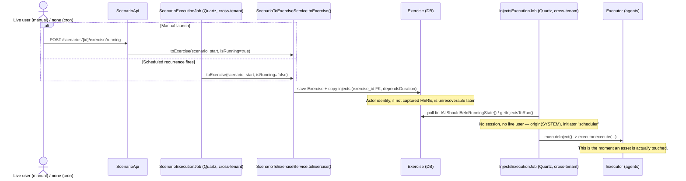

- `Inject.exercise` (`@ManyToOne`, set once at creation — `ScenarioToExerciseService.java:246`) is
  the only link between an `Exercise` and its injects.
- `Inject.getDate()` is **computed, not stored** (`Inject.java:498-509` →
  `InjectModelHelper.getDate(exercise, scenario, dependsDuration)`, `InjectModelHelper.java:143-162`):
  `exercise.getStart() + dependsDuration`, adjusted for `Pause` rows (`computeInjectDate`,
  `InjectModelHelper.java:81-124`).
- `InjectHelper.getInjectsToRun()` (`InjectHelper.java:184-215`) does not mention `Exercise` directly,
  but the specifications it calls do: `InjectSpecification.executable()` (`InjectSpecification.java:78-89`)
  joins to `exercise.start`/`exercise.status = RUNNING` at the SQL level, and
  `InjectSpecification.plannedDateReachable()` (`InjectSpecification.java:107-119`) computes
  `date_part('epoch', exercise.start)` directly in SQL as a coarse superset; the exact, pause-aware
  check (`isBeforeOrEqualsNow`, `InjectHelper.java:118-122`) runs in memory afterward.
- Because `Inject.exercise` is already traversed at exactly this checkpoint, adding an actor field on
  `Exercise` and reading it via `inject.getExercise().getLaunchedBy()` during asset resolution
  requires no new join — it fits the existing access path.

**What's actually new here — the `scheduled_by` → `launched_by` handoff.** The manual-launch write and
the dispatch-time `MarkingClearanceCacheManager` check are structurally identical to the Atomic Testing
diagram below (same enforcement point, reached via `inject.getExercise().getLaunchedBy()` instead of a
direct field on `Inject`) — no need to repeat them. What's specific to Scenario is the gap between
configuring a recurrence and the `Exercise` it eventually produces, with no live user at either end:

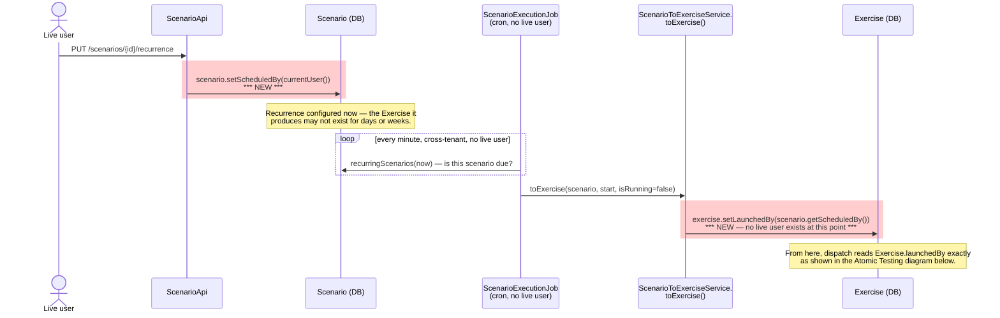

#### Atomic Testing (current flow, plus where Task 4 adds new writes and a new check)

- `POST /atomic-testings/{id}/launch` → `AtomicTestingService.launch()` (`AtomicTestingService.java:231-234`)
  and `POST /atomic-testings/{id}/relaunch` → `relaunch()`/`doRelaunch()`
  (`AtomicTestingService.java:236-262`, duplicate + queue new + delete old) are both live-user, HTTP,
  `Action.LAUNCH`-gated endpoints.
- `AtomicTestingExecutionJob.relaunchScheduledAtomicTestings()` (`AtomicTestingExecutionJob.java:66-112`)
  is the cron equivalent: it calls `atomicTestingService.relaunch(injectId, checkLaunchable=false)`
  with no live user, on its own Quartz tick, for atomic tests configured with a recurrence.
- `InjectSpecification.forAtomicTesting()` (`InjectSpecification.java:121-128`) selects these
  injects with `exercise = null`, grouped under a synthetic `ATOMIC_BATCH_KEY` in
  `InjectsExecutionJob` (`InjectsExecutionJob.java:401-404`) — so the `Exercise`-based actor field
  cannot cover this path; atomic testing needs its own.

**Where the new writes and the new clearance check land.** Red highlights mark what Task 4 adds; every
other call already exists today.

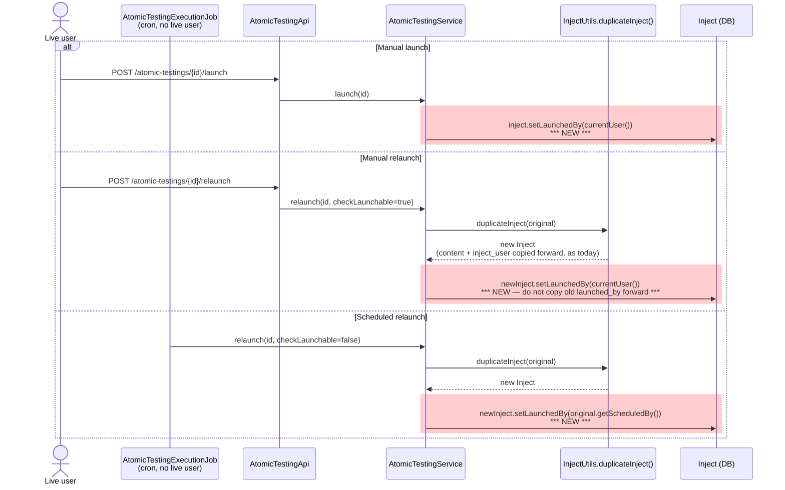

What happens to this `launched_by` value once dispatch actually starts — and why reaching
`resolveAllAssetsToExecute` turned out not to be the whole story — is covered next, since it's shared
with the Scenario/Exercise path rather than specific to Atomic Testing.

---

### Execution dispatch has three independent asset-resolution paths, not one

Manual e2e validation (launch an Atomic Testing targeting one unmarked, agentless asset and one
`TLP:RED` agent, as a `TLP:GREEN` user) found that the `TLP:RED` agent **actually executed** — not just
appeared in a result the launcher could see, but a real payload ran on it, confirmed by execution
traces (`"Distributing inject to 1 agent(s) across 1 endpoint(s)"`, then that agent's `stdout`). The
data was all correct — `launched_by` was the right user, that user's clearance was correctly `TLP:GREEN`
only, the agent's asset was correctly marked `TLP:RED` — yet it ran anyway.

Root cause: `Executor.execute()` → `ExecutableInject` → `resolveAllAssetsToExecute()` is **one of three
separate places** that independently decide "which assets does this inject concern." Per the launch variant A
decision (partial/scoped execution), the marking filter must apply consistently at all three — at the
time of this finding, it was wired into only one of them. The three paths and how each one now applies
(or, for one documented exception, doesn't yet apply) the filter are described below.

#### 1 — Expectation / finding computation

`InjectService.resolveAllAssetsToExecute()`, called from `InjectsExecutionJob.executeInject()`
(`InjectsExecutionJob.java:149`) and again from `OpenAEVImplantExecutor.process()`
(`OpenAEVImplantExecutor.java:39`) and `AbstractTechnicalBehavior` (`AbstractTechnicalBehavior.java:94`,
with a fallback to calling it directly for "direct callers" that don't pre-cache). This is the one path
where the marking filter is wired in, and it's correct **for what it feeds**: which assets get
expectation rows, scores, and therefore findings.

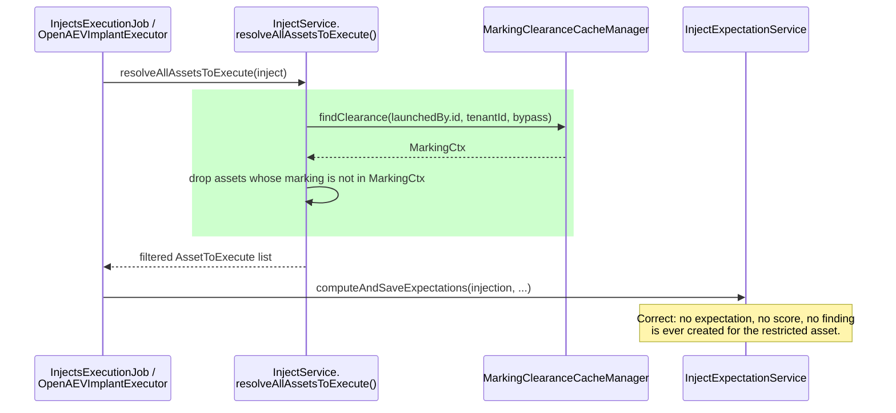

This explains why the overview didn't show `ASSET_RED` as a target — but it does **not** explain the
Finding showing `DDD`, because that Finding came from the asset that actually ran, which this path
never controls.

#### 2 — Agent-routing dispatch (the path manual testing caught)

`Executor.execute()` calls `ExecutionExecutorService.launchExecutorContext(inject)`
**unconditionally**, before branching into `executeInternal`/`executeExternal`, whenever
`injectorContract.getNeedsExecutor()` is true. That method calls
`InjectService.getAgentsAndAgentlessAssetsByInject(inject)` (`InjectService.java:1111-1126`) — a
**third, independent** method that builds the real `Set<Agent>` commanded to execute via each agent's
connector/executor instance. Manual e2e validation found this method originally walked
`inject.getAssets()` + expanded `inject.getAssetGroups()` directly off the entity with no marking
awareness at all — the actual cause of the `TLP:RED` agent executing in that test.

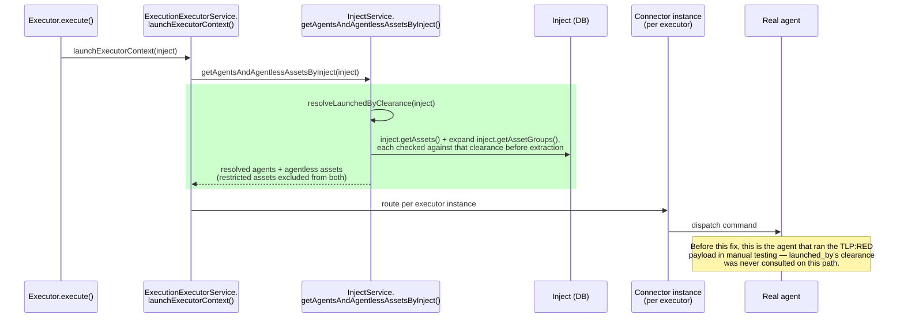

**This is the highest-leverage point for the filter.** It's inject-type-agnostic (any `Inject`,
Scenario-linked or Atomic Testing) and runs before the internal/external split, so filtering here covers
both Scenario/Simulation and Atomic Testing, and however an injector is classified (internal or
external), in one place.

#### 3 — External-push dispatch payload (non-agent connectors)

For an injector classified `isExternal()` (e.g. email, SMS, OpenCTI — not agent-based), `executeExternal()`
builds the published payload via `ExecutableInjectDTOMapper.toExecutableInjectDTO()`. Its `.assets(...)`
is built from `executableInject.getAssetsToExecute()` (the filtered list, cached by `InjectsExecutionJob`
or resolved fresh on the same fallback `AbstractTechnicalBehavior` already uses for direct callers) —
consistent with path 2's filter, since both resolve clearance through the same
`resolveLaunchedByClearance`.

`.assetGroups(...)`, however, is passed through **unfiltered** — a deliberate boundary, not an
oversight. Asset groups carry no marking of their own today (that's US1, still open — see "Open items
carried forward"), so there is no clearance rule to apply to a group reference itself, and the
downstream injector resolves non-endpoint members (e.g. AI targets) from the group independently of the
filtered flat asset list. Emptying `.assetGroups(...)` once `.assets(...)` carries the filtered list
would silently break that AI-target-via-group path, not just de-duplicate it.

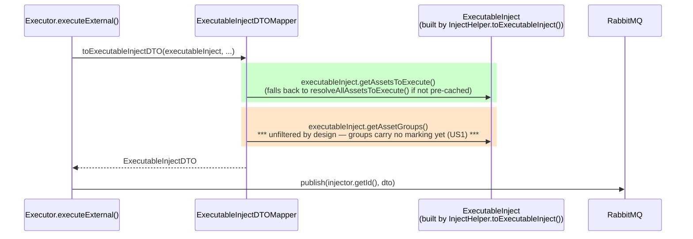

**Known, scoped consequence**: a marked AI-target asset reachable only through an asset group,
dispatched to a non-agent external connector, is not covered by partial/scoped execution today. This
is a direct function of US1 being open, not a gap in this path's own logic — revisit once asset groups
have their own marking semantics.

This path doesn't involve `Agent`/`Endpoint` extraction at all, so it's genuinely distinct from path 2 —
filtering one does not filter the other. Any injector type that isn't agent-based still needs its own
asset list filtered for the design to hold across *all* injector types, not just agent ones.

#### How launch variant A holds across all three paths

The partial/scoped execution decision is a property of the inject's dispatch as a whole, not of any one
method — so it must hold at every point that independently resolves "which assets does this concern."
All three paths now resolve clearance through the same `resolveLaunchedByClearance(Inject): MarkingCtx`
— one implementation of the rule, called from each path's own resolution point, rather than three
divergent copies of it. The one documented exception is `.assetGroups(...)` in path 3 (above): asset
groups themselves carry no marking today, so that one channel remains outside what this rule can
currently filter.

---

### Data model changes

Four new columns, following one consistent naming convention (`scheduled_by` = who owns/configured
a recurring schedule; `launched_by` = whose clearance gates one specific run):

| Entity | Field | Written by | Live-user path | No-live-user path |
|---|---|---|---|---|
| `Scenario` | `scheduled_by` **(new)** | `PUT /scenarios/{id}/recurrence` → `updateScenarioRecurrence` (`ScenarioApi.java:577`) | current user, on every recurrence create/update | **null** for scenarios generated from an OpenCTI security coverage: `SecurityCoverageService.setRecurrence` (`SecurityCoverageService.java:515`) sets the recurrence directly, with no signed-in user and without going through `updateScenarioRecurrence`. Null resolves to zero clearance at dispatch (see [STIX security coverage](#stix-security-coverage-openctis-scenarios-have-no-scheduling-actor)) |
| `Exercise` | `launched_by` **(new)** | `ScenarioToExerciseService.toExercise()` (`ScenarioToExerciseService.java:54`) | current user (manual launch, `ScenarioApi.java:668`, incl. the autonomous/chaining branch at lines 672-682, which is still inside the same HTTP call) | copied from `scenario.getScheduledBy()` (cron creation, `ScenarioExecutionJob.java:117`) |
| `Inject` (atomic testing only) | `scheduled_by` **(new)** | `AtomicTestingService.updateRecurrence()` | current user, on every recurrence create/update | — |
| `Inject` (atomic testing only) | `launched_by` **(new)** | `AtomicTestingService.launch()` / `relaunch()` (`AtomicTestingService.java:231-262`) | current user (manual launch/relaunch) | copied from the original inject's `scheduled_by` (scheduled relaunch, `AtomicTestingExecutionJob.java:101-112`) |

All four are net-new columns — none of them reuse or rename an existing field (in particular, `Inject.launched_by`/`scheduled_by` are distinct from the pre-existing `inject_user`, which keeps its current "last content editor" meaning, per [above](#3-the-one-field-that-already-exists-for-this-inject_user-demonstrably-has-the-wrong-semantics)).

Both `launched_by` columns are nullable FKs to `users` (`ON DELETE SET NULL`), matching the existing
`inject_user` FK pattern (`V2_60__Delete_fk_users_injects.java`). A deleted/deactivated actor resolves
to **zero effective clearance** — any restricted target is skipped, never executed. This is a
deny-by-default fallback consistent with the rest of Task 4's global acceptance principles.

`Inject.launched_by` and `Inject.scheduled_by` only apply to root/atomic-testing injects
(`exercise == null && scenario == null`). A Scenario-linked inject never gets its own copy — its
clearance is resolved through `inject.getExercise().getLaunchedBy()`.

#### Implementation trap to guard against explicitly

`InjectUtils.duplicateInject()` (`InjectUtils.java:335`) currently copies `inject.user` forward on
relaunch (`duplicatedInject.setUser(injectOrigin.getUser())`). If `launched_by` is added to the same
duplication helper without a specific override, a manual relaunch would silently inherit the
*previous* launcher's clearance instead of the person clicking Relaunch now. `doRelaunch()` must
explicitly set `launched_by` **after** duplication:

- Manual relaunch → current user.
- Scheduled relaunch (`checkLaunchable = false`) → the original inject's `scheduled_by`.

This flags the corresponding checkbox in the Task 4 "Important Flags" — **Data-model updates** — in
[`../user-stories.md`](../user-stories.md).

---

### Clearance resolution at dispatch time

Whichever field is read (`Exercise.launched_by`, `Inject.launched_by`), the rule is the same:

- **Never cache the resolved clearance, only the actor reference.** Clearance is recomputed live from
  that actor's **current** group memberships at the moment of dispatch, reusing
  [`MarkingScopeResolver`](../task2/tech-design.md#32-components) from Task 2 — the same component
  that resolves any other user's effective clearance. This is what keeps the behavior consistent with
  the existing global principle: "when a user's effective Group markings change, what the user can
  read is updated" (`../user-stories.md`) — extended here to what a pending run may still execute.
- **A stored, deleted, or deactivated actor resolves to zero clearance.** No error, no fallback to
  "run anyway" — every remaining restricted target is simply skipped, same as if the actor had never
  had any group markings.
- This rule must be applied at **each** of the three independent asset-resolution points described in
  ["Execution dispatch has three independent asset-resolution paths, not one"](#execution-dispatch-has-three-independent-asset-resolution-paths-not-one)
  above — `resolveAllAssetsToExecute` alone (path 1) was found, during manual e2e validation, to filter
  expectations/findings but not the actual dispatch. Path 2
  (`getAgentsAndAgentlessAssetsByInject`/`launchExecutorContext`) is the primary target; path 3
  (`ExecutableInjectDTOMapper`) covers non-agent external connectors.

---

### Interaction with the existing marking bypass (service account) — unchanged

Task 3's read-filtering mechanism (Option C) already has a "sees everything" bypass, used today so
the per-tenant agent/implant service account never loses sight of its own host asset once that asset
is marked. It's worth spelling out precisely, because Task 4's dispatch-time check must **not**
accidentally inherit it.

**Class relationships:**

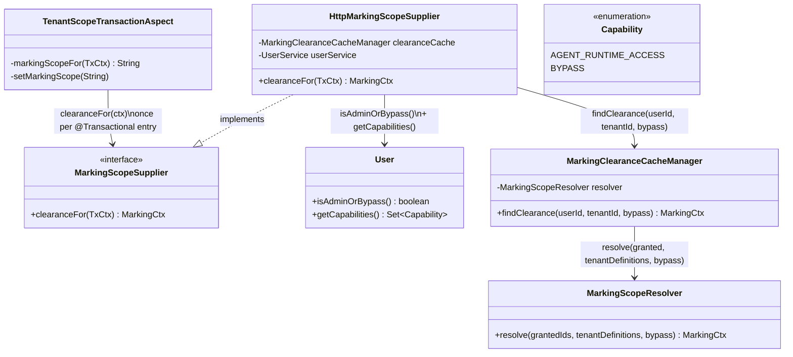

**Runtime flow, both branches:**

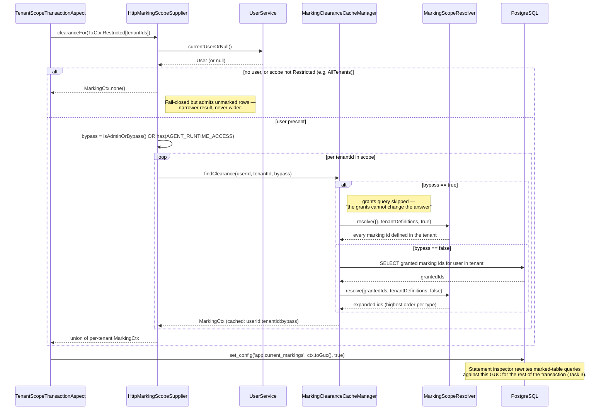

**Why Task 4 doesn't need to change this, and the guardrail it must follow instead:**

- The bypass exists only inside `HttpMarkingScopeSupplier` — it is the HTTP/agent-callback-specific
  wrapper, not part of `MarkingScopeResolver`'s general contract. `MarkingScopeResolver.resolve()`
  (`MarkingScopeResolver.java:60-62`) just does what its `bypass` argument tells it to; the *decision*
  of what counts as bypass is made entirely by the caller.
- The per-tenant service account (`ServiceAccountPrivilegeService`) holds exactly
  `{AGENT_RUNTIME_ACCESS, AGENT_DOCUMENT_ACCESS, INSTALL_AGENT}` — none of which satisfies
  `@AccessControl(Action.LAUNCH)` on the Scenario/Atomic Testing endpoints. It structurally cannot
  authenticate a launch/relaunch/recurrence-update call, so it can never be the value written into
  `launched_by` or `scheduled_by`.
- **Guardrail for implementation**: the dispatch-time check must call
  `MarkingClearanceCacheManager.findClearance(launchedByUserId, tenantId, bypass)` **directly**, with
  `bypass = launchedByUser.isAdminOrBypass()` — it must never route through `HttpMarkingScopeSupplier`,
  which would incorrectly fold in `AGENT_RUNTIME_ACCESS`, a concern that belongs to a different actor
  entirely. (`MarkingScopeResolver` itself is not something Task 4's code calls directly — it's the
  internal collaborator `findClearance()` already delegates to once it has fetched `grantedIds` and
  `tenantDefinitions`.)
- **This is still "live," not a cached snapshot.** `findClearance()` is `@Cacheable`, but that cache is
  evicted on every clearance-*reducing* change — group membership removed, a marking unassigned, an
  order lowered/archived (`MarkingClearanceCacheManager.java:117-170`; Task 2 tech design §3.3). So a
  call at dispatch time always reflects the actor's current group markings; it is not the same thing
  as the resolved-clearance **snapshot on the entity** that this document rules out elsewhere — nothing
  would ever evict a value baked into an `Exercise`/`Inject` column when the actor's groups change,
  which is exactly why that approach isn't safe and this one is.

### Possible defect: `isAdminOrBypass()` does not see a role-based `BYPASS` (to be confirmed by a test)

The dispatch guardrail above relies on `bypass = launchedByUser.isAdminOrBypass()`. By reading the
code, that method may not do what its name says:

- `User.isAdminOrBypass()` is `isAdmin() || getCapabilities().contains(Capability.BYPASS)`
  (`User.java:377`).
- `getCapabilities()` goes through `capabilitiesOf(...)` (`User.java:502`), which **expands** `BYPASS`
  into the concrete tenant- or platform-scoped capabilities and never adds `BYPASS` itself; its
  Javadoc says "BYPASS is expanded rather than returned, so it never leaks into a capability set", and
  `allTenantScoped()` / `allPlatformScoped()` both exclude it.
- So the `contains(BYPASS)` test looks unable to be true: `isAdminOrBypass()` would reduce to
  `isAdmin()`.

Why it matters here: `resolveLaunchedByClearance` (`InjectService.java:481`) uses `isAdminOrBypass()` as
its only bypass test. A launcher whose group holds a `BYPASS` role would resolve through their group
**marking grants** at dispatch instead of getting full clearance — a narrower result (fail-closed), but
not the documented one. `HttpMarkingScopeSupplier` would still treat the same user as bypass, because
the expanded set contains `AGENT_RUNTIME_ACCESS`, so reads and dispatch could disagree for that user.

Not verified: no test exercises `isAdminOrBypass()` with a `BYPASS` role (the only test mention is a
comment in `InjectServiceTest`), and the method is used widely, so there may be a path that makes it
work. A unit test with a user in a group carrying a `BYPASS` role would settle it; if confirmed, the
fix is to use `hasBypassIn(...)` / `hasTenantBypass()` or to test the role capabilities directly.

---

## Marking the objects linked to an asset (proposed — not yet decided)

Everything above is about *execution*. A second question is about *reads*: the asset row is filtered
by the Task 3 rewrite, but the rows that **point at** an asset are not, so they can still leak what
the asset hides (its id, its existence, a finding's title, an expectation's score…).

### Why the existing rewrite does not cover them

`MarkingDimension.readPredicate()` (`MarkingDimension.java:55`) only ever emits
`is_marking_set_allowed(<alias>.marking_ids)` — a test on a column **of the table being queried**.
It never follows a foreign key. A table is filtered only if it (a) has a `marking_ids text[]` column
(`MarkingFilteringConfig.deriveFromSchema()`) and (b) is listed in `openaev.marking.active-tables`.
Today that is `assets` alone. Objects linked to an asset:

| Table | Link to the asset |
|---|---|
| `agents` | `agent_asset` FK (`Agent.java:62`) |
| `findings_assets` | join table (`Finding.java:135-138`) |
| `injects_assets` | join table (`Inject.java:341-344`) |
| `asset_groups_assets` | join table (`AssetGroup.java:94-98`) |
| `injects_expectations` (technical subtype) | `asset_id` FK (`TechnicalInjectExpectation.java:30`) |
| `asset_agent_jobs` | `asset_agent_agent` / `asset_agent_inject` |

`Endpoint` and the other asset subtypes share the `assets` table (`SINGLE_TABLE` inheritance), so they
are already covered. Which of these tables *should* be marked is a product decision (e.g.
`assets_tags` and `asset_groups_assets` arguably should not — see US1 / open item 1).

### Solution A — Denormalized `marking_ids` column on each linked table

Give each linked table its own `marking_ids text[]` column holding a **copy** of its asset's markings,
and add the table to `openaev.marking.active-tables`. No engine change: the inspector already filters
any table with the column, joins and sub-queries included, using the same predicate.

Red = what Solution A adds (the copy and its propagation). Green = the existing Task 3 read path,
unchanged.

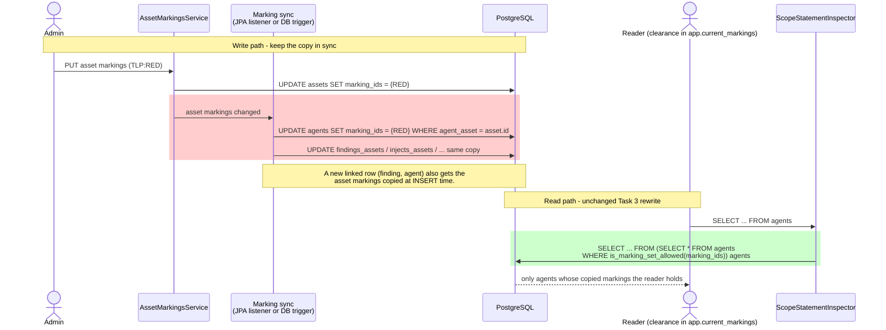

- **Per table**: a migration like `V6_20260921120000000__Mark_assets.java` (nullable column +
  `GIN ((COALESCE(marking_ids,'{}'))` expression index, no backfill needed for *visibility* because
  `NULL` = unmarked), an entity field, an allowlist entry.
- **Keeping the copy correct** is the real work. Three write paths must maintain it:
  1. asset marking change (`AssetMarkingsService`) → propagate to every linked row;
  2. creation of a linked row (new finding, new agent, new `injects_assets` row) → copy from the asset;
  3. delete of a marking definition → scrub the arrays (design §5.7; `AllTablesWithMarkingIds` already
     derives every table with the column, so the scrub picks the new ones up automatically).
- **Rows linked to several assets** (a finding on two assets) hold the **union** of their markings:
  consistent with the AND / STIX reading — the row is visible only to someone holding *all* of them.
- **Fail-open risk**: a path that forgets to copy leaves the row **unmarked**, hence visible to
  everyone. Mitigation: set the column in one place (a JPA `@PrePersist`/listener or a DB trigger) and
  add an architecture test listing linked tables without a marking column.

| Pros | Cons |
|---|---|
| Fits the design as-is (local column test, composite keys OK, no new dimension) | Denormalized data to keep in sync; stale copy = wrong visibility |
| Constant cost per query: no extra join | Write amplification when an asset's marking changes (N linked rows) |
| Rollout stays table-by-table via the allowlist | Backfill needed to mark rows that link to an *already marked* asset |

### Solution B — Rewrite through the join (`EXISTS` on the parent asset)

Keep **no** column on the linked table. Teach the rewrite that a table is *marked by its parent*:

```sql
-- agents, rewritten
EXISTS (SELECT 1 FROM assets a
        WHERE a.asset_id = t.agent_asset
          AND is_marking_set_allowed(a.marking_ids))
```

This needs a new `ScopeDimension` shape (or a `ParentMarkedTable(table, fkColumn, parentTable)`
variant of `MarkedTable`) with its own `readPredicate`/`writePredicate`; `MarkingDimension` today is
column-only and its Javadoc states the marked table's primary key never appears in the predicate.
For join tables the predicate is on the asset-side column (`asset_id`).

Red = what Solution B adds (the parent-based rewrite). There is no write path to maintain: the
asset row is the only place a marking is stored.

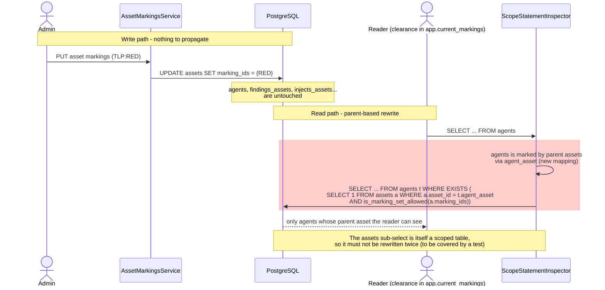

- **Always consistent**: the asset is the single source of truth; changing its markings changes what
  every linked row shows, instantly, with nothing to propagate.
- **Costs**: one correlated sub-select per linked table per query; the unmarked fast path
  (`COALESCE(marking_ids,'{}')` on a local column) is lost, and the planner must use the asset PK /
  FK indexes. The inspector must also avoid recursing into the sub-select it just added (it rewrites
  `assets` itself, which is harmless but must be tested — `MarkingRewriteHypothesisTest` is the
  place). Rows whose parent is not visible disappear (inner semantics), which is the intended result.
- **Writes**: the same predicate on UPDATE/DELETE targets works, but an INSERT of a linked row cannot
  be checked by a WHERE; that stays a service-layer guard (as already stated for markings in
  `MarkingDimension`).

| Pros | Cons |
|---|---|
| No copy, no sync, no backfill, no fail-open on a missed write path | New dimension type in the inspector: more engine surface and risk (it is the security boundary) |
| Asset marking change is O(1) | Extra join cost on hot tables (`injects_expectations`, `findings`) |
| Adding a linked table is configuration, not a migration | Needs a per-table FK/parent mapping to maintain |

### Comparison and recommendation

| | A — column copy | B — `EXISTS` through the join |
|---|---|---|
| Engine change | none | new parent-based dimension |
| Source of truth | duplicated | single (asset) |
| Failure mode | stale/missing copy → leak | none by construction; cost is performance |
| Query cost | local test, GIN-indexable | correlated sub-select |
| Migration/backfill | per table | none |
| Fits the current design doc | yes (§3.2 Option 2) | extends it |

Proposed: **A** for the high-volume, read-hot tables where a local test matters, if the sync can be
centralized in one listener; **B** if the number of linked tables grows or correctness must not
depend on application write paths, since it removes the fail-open mode entirely. This is a proposal
for discussion — it does not change the Option 1 decision below, and it is not recorded in the
Decisions Log until chosen. It also does not answer which tables to mark (open items 1 and 3).

### Status: Solution B is implemented (engine and configuration, off by default)

Solution B was chosen and built; nothing is switched on yet, so the emitted SQL is unchanged until a
table is configured.

- **Model**: `MarkedTable` is marked in exactly one of three ways: its own column, a `ParentLink
  (foreignKeyColumn, parentTable, parentKeyColumn)`, or `LinkRows` (see below). A linked table has no
  marking column of its own. `MarkedTables` validates every chain at construction: it must end on a
  table with its own column (a missing parent, a missing link table or a cycle fails the startup).
- **Predicate**: `MarkingDimension` emits, recursively down a chain,
  `(t.fk IS NULL OR EXISTS (SELECT 1 FROM parent p WHERE p.key = t.fk AND <parent predicate>))`,
  identical for reads and writes. Aliases are `mkp<depth>_<table>`, clear of the query's own.
- **Configuration**: `openaev.marking.linked-tables` (default empty), entries
  `child.foreign_key>parent.parent_key`, e.g. `agents.agent_asset>assets.asset_id`, or
  `table.key<link.foreign_key` for link rows. The parent must
  be in `openaev.marking.active-tables`; the columns are checked against the schema at startup, and
  a malformed entry fails the startup instead of being skipped. Identifiers are restricted to plain
  names because they end up verbatim in SQL.
- **Chains work**: `asset_agent_jobs.asset_agent_agent>agents.agent_id` on top of the `agents` link
  resolves job → agent → asset.

Semantics worth knowing before activating a table:

- **A NULL foreign key is visible.** A row attached to no asset (a team expectation, a parentless
  agent) has no marking to inherit, exactly like an empty marking set.
- **A hidden parent hides the row everywhere the table is read**, including as a joined table, a
  sub-query, and a join table read on its own.
- **A hidden link survives a lower-clearance edit.** Hibernate rewrites a collection with
  `DELETE ... WHERE inject_id = ?` then re-inserts what it loaded. With a join table linked
  (`injects_assets`, `findings_assets`, `asset_groups_assets`), that DELETE is narrowed to visible
  links, so a user who cannot see an asset edits an inject without dropping it from the inject — the
  "may update a parent without reading every asset it references" principle. Re-adding the same
  hidden asset is not possible for that user (they cannot see it).
- **The parent's tenant is not re-checked inside the sub-select**: the foreign key already ties the
  row to a parent of its own tenant, and the child is tenant-filtered on its own where it is a
  tenant table.
- **Findings are marked through their link rows** (third shape, below), with a deliberately
  permissive rule: **a finding is visible when it has no link, or when at least one of its assets is
  visible.** A finding attached to a visible and to a restricted asset therefore stays visible; the
  cost is that it may carry information that came from the restricted asset. The strict alternative
  (hide the finding as soon as one asset is hidden, the AND reading used on a single row) is a
  one-branch change in `MarkingDimension.linkRowsPredicate`. This is a product decision to confirm
  with the PO, and it is what open item 3 is about.

### Third shape: a table marked through link rows (`findings`)

A finding has no single parent: it reaches assets through the many-to-many `findings_assets`, so
there is no foreign key on `findings` to follow. `MarkedTable` therefore has a third shape,
`LinkRows(keyColumn, linkTable, linkForeignKeyColumn)`: the table is marked by the rows of a link
table that point to it, and that link table is itself marked through its parent (`findings_assets`
through `assets`). `MarkedTables` validates the whole chain findings → findings_assets → assets like
any other.

```sql
-- findings, rewritten
(NOT EXISTS (SELECT 1 FROM findings_assets l WHERE l.finding_id = f.finding_id)
 OR EXISTS (SELECT 1 FROM findings_assets l
            WHERE l.finding_id = f.finding_id
              AND (l.asset_id IS NULL OR EXISTS (SELECT 1 FROM assets a
                   WHERE a.asset_id = l.asset_id AND is_marking_set_allowed(a.marking_ids)))))
```

Configuration, in this order of concern (the parent of each link must be activated):

```properties
openaev.marking.active-tables=assets
openaev.marking.linked-tables=findings_assets.asset_id>assets.asset_id,findings.finding_id<findings_assets.finding_id
```

The arrow says which way the link points: `>` the table points to its parent, `<` link rows point to
the table. The columns of both shapes are checked against the schema at startup.

Cost to keep in mind: two correlated sub-selects per statement on `findings`, a hot table. Check the
plan once the table is enabled; `findings_assets` is keyed by `(finding_id, asset_id)`.

Tests: `MarkingLinkedTablesTest` (predicate shape for all three shapes, every statement shape
through the inspector, startup checks, configuration parsing) passes. `MarkingLinkedTablesRowsTest`
runs the same SQL on real rows in Postgres (children follow parents, NULL foreign key, a two-hop
chain, no copy to keep in sync, a DELETE reaching only visible rows, and the findings rule: no link,
one visible link, only hidden links, mixed); it compiles but **has not been run** — it needs
Postgres and RabbitMQ.

**Before enabling a table**: the rewrite is applied to every statement touching it, including
native queries, and the inspector refuses (fail-closed) shapes it does not understand. Activate one
table at a time in an environment with the full integration suite, starting with `agents`.

---

## Marking and the real-time stream (`StreamApi`) (proposed — not yet decided)

`StreamApi` pushes every database mutation to every connected browser over SSE. It is a **third read
path**, next to the REST reads (Task 3) and execution dispatch (above), and today it has no marking
check at all.

### Why the SQL rewrite cannot protect it

- `listenDatabaseUpdate` (`StreamApi.java:215`) is `@Async("streamExecutor")` +
  `@TransactionalEventListener`: it runs **after commit, on a pool thread, with no transaction**. The
  inspector only filters inside a transaction that set `app.current_markings`
  (`TenantScopedTransaction.setMarkingScope`), so there is nothing to rewrite here.
- The event instance was loaded earlier, in the **publisher's** transaction, under the publisher's
  clearance (typically an admin, or an agent with `AGENT_RUNTIME_ACCESS`). `sendStreamEvent`
  (`StreamApi.java:195`) then serializes that whole instance per consumer.
- Per consumer, the gate today is `isVisibleForTenant` (`StreamApi.java:385`) + `hasReadPermission`
  (RBAC / grants). Neither knows about markings.

**Leak**: a `TLP:RED` asset created or updated is broadcast, in full, to a `TLP:GREEN` user's stream.
The same holds for any entity that embeds restricted data (see "Payloads that embed restricted data"
below).

### Proposal — a Java-side marking gate, next to the permission check

Red = what is added. Everything else already exists in `StreamApi`.

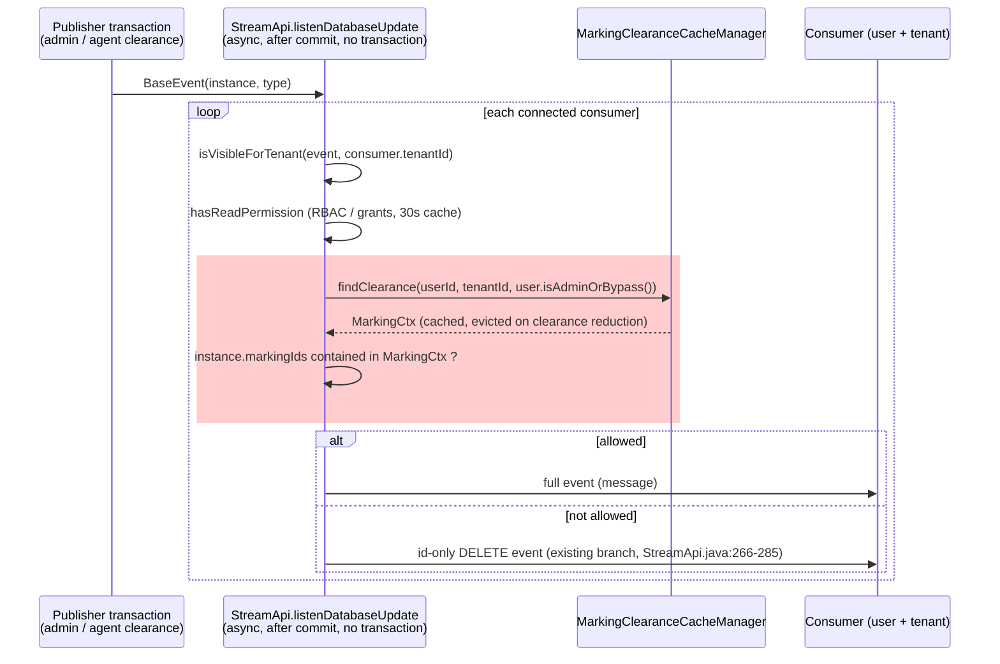

1. **Where**: in `listenDatabaseUpdate`, after the existing permission check and before
   `sendStreamEvent`. Entities that can carry markings implement a small `Marked` interface
   (`String[] getMarkingIds()`); `Asset` first, the linked tables later (see below).
2. **Clearance source**: `MarkingClearanceCacheManager.findClearance(userId, tenantId, bypass)`,
   called **directly** with `bypass = user.isAdminOrBypass()` — the same rule as the dispatch-time
   guardrail in "Interaction with the existing marking bypass". It must not go through
   `HttpMarkingScopeSupplier`, which would fold in `AGENT_RUNTIME_ACCESS`. The call is `@Cacheable`
   and evicted on every clearance-reducing change, so it costs **no database query per event** — the
   constraint behind #6868 (see the comments on `userCache` and `permissionDecisionCache`).
3. **Test**: containment of the entity's `marking_ids` in the consumer's clearance — the Java twin of
   `is_marking_set_allowed` (every marking on the row must be held, an unmarked row is visible to
   everyone, no clearance hides every marked row). It must stay behaviourally identical to the SQL
   function; whether `MarkingCtx` already exposes a containment helper is to be checked at
   implementation time.
4. **Outcome when not allowed**: reuse the existing **id-only DELETE** event
   (`StreamApi.java:266-285`). It leaks nothing, and it also covers the case where an asset's
   markings are *raised*: users who could see it a moment ago see it disappear from their UI.
5. **Do not put the marking decision in `permissionDecisionCache`.** That cache keeps decisions for
   30 s; a "yes" cached before a marking change would deliver the new payload (with its new markings)
   to someone who no longer qualifies. The marking test is in-memory and cheap, so it runs on every
   event, and the clearance cache is already evicted on reductions. The existing 60 s `userCache`
   staleness (bypass flag, capabilities) is accepted as is.
6. **Consumers without a tenant** (legacy `/api/stream`, blank `tenantId`): clearance is
   `MarkingCtx.none()` — they see unmarked rows only (fail closed, same as
   `HttpMarkingScopeSupplier` when no user or no restricted tenant scope).

### Payloads that embed restricted data (the hard part)

An event for a parent entity (`Inject`, `Exercise`, `Scenario`, `AssetGroup`) can serialize
collections of assets. Over REST those collections are lazy-loaded under the **reader's** clearance,
so the rewrite hides restricted assets. In the stream they were loaded under the **publisher's**
clearance, so restricted asset ids would reach every reader of the parent. The marking gate above
cannot fix this: the parent itself is allowed.

| Option | How | Trade-off |
|---|---|---|
| **Notify and refetch** (preferred for these types) | send `{id, type}` only; the client re-reads through the filtered REST path | one extra request per event, no payload to sanitize; same pattern as the attack-path nudge, whose own Javadoc states the notification can never leak state |
| Filter per consumer | strip marked ids from the serialized tree using the consumer's clearance | keeps the push payload, but needs per-type knowledge of every embedded marked reference — easy to miss one |

### Consequences for the linked-objects solutions

Findings, agents and expectations are streamed too, so the stream is a second consumer of whichever
solution is retained above:

- **Solution A (column copy)**: the entity carries its own `marking_ids`, so the stream gate is the
  same in-memory test as for assets — no extra work.
- **Solution B (`EXISTS` through the join)**: the stream has no SQL to rewrite, so it would need the
  parent asset's markings **per event and per consumer** — an extra lookup on the hottest path.
  Workable only with a short-lived cache keyed by asset id, i.e. the pattern that already had to be
  built for permissions after #6868.

This is an additional argument for Solution A on the streamed entities.

### Out of scope / unchanged

- `listenBulkOperation` carries counts and an entity label only, scoped to the launching user — no
  marked data.
- `listenAttackPathVersion` already gates on `AttackPathAccessControl.canRead` and sends a
  notification only. It needs a marking review only if the simulation's own visibility becomes
  marking-dependent (open item 2).
- A **raised** clearance emits no event, so a user who gains access sees newly visible assets only
  after a refetch. This matches the global principle that read access follows current group
  markings, and is accepted.

### Tests to add

- A `TLP:GREEN` consumer receives an id-only DELETE, not the payload, when a `TLP:RED` asset is
  created or updated.
- The same consumer receives a DELETE when an asset it could see is re-marked `TLP:RED`.
- An unmarked asset is still delivered to everyone with READ permission.
- A consumer holding `TLP:RED` receives the full event.
- A parent entity event (inject) never carries a restricted asset id.

---

## STIX security coverage: OpenCTI scenarios have no scheduling actor

`POST /stix/process-bundle` (`StixApi.processBundle`) does **not** launch anything. It creates a
`SecurityCoverage`, a `Scenario` and its injects, and sets the scenario's recurrence directly
(`SecurityCoverageService.setRecurrence`, first start two minutes later). The launch happens later,
from the cron:

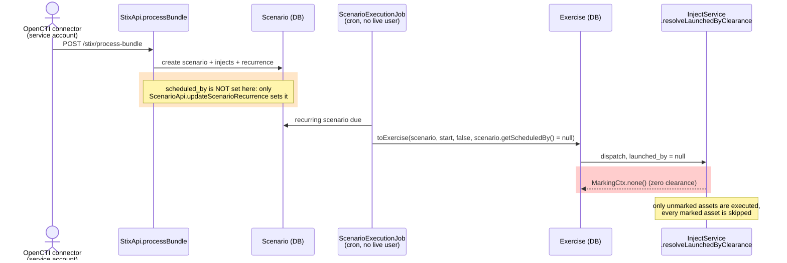

**Current behaviour (fail-closed)**

- The service account is never the actor: nothing writes it into `scheduled_by` or `launched_by`, so
  it cannot bring its own clearance (or a bypass) into a run.
- `launched_by = null` resolves to zero clearance (`InjectService.java:478`), as the cron's own
  comment states (`ScenarioExecutionJob.java:113-115`). Marked assets are skipped, never run.
- Consequence: **a scenario generated from a security coverage can never execute on a marked
  asset**, whatever the marking.

### The OpenCTI connector user (verified by reading the code)

`PrivilegeService.ensurePrivilegedUserExistsForConnector`
(`opencti/connectors/service/PrivilegeService.java:80`) creates one technical user per connector:

- email `connector-opencti-<connectorId>@openaev.invalid`, `admin = false` (forced on every update by
  `AbstractPrivilegeService.applyUserServiceAttributes`);
- a single per-tenant group, "STIX bundle processors" (`defaultUserAssignation = false`), whose role
  holds exactly one capability: `MANAGE_STIX_BUNDLE` (`Constants.java:9`), i.e. `STIX_BUNDLE` /
  `PROCESS` at tenant scope. The capability is `hidden` and `checkable`, like `AGENT_RUNTIME_ACCESS`;
- no `BYPASS`, no `AGENT_RUNTIME_ACCESS`, and no marking granted anywhere in this code. The role and
  group are re-applied each time `ensurePrivilegedUserExistsForConnector` runs.

So `isAdminOrBypass()` is false for it, and its own marking grants are empty: **its clearance is
none**, exactly as for a null actor.

**Effect on inject generation.** `fetchAssetGroupsFromScenarioTagRules` and `assetsFromAssetGroupMap`
(`SecurityCoverageInjectService`) read asset groups and endpoints during the HTTP request, under the
connector's HTTP clearance. Resolved through `HttpMarkingScopeSupplier`, that clearance was none, so
the platform/architecture combinations that decide which injects exist came **only from unmarked
endpoints**. There was therefore no inference leak by default (the leak would have required a bypass),
but a coverage could not generate injects for a platform that exists only on marked assets.

**Change made on the branch (to validate with the PO).** `HttpMarkingScopeSupplier` now also treats
`MANAGE_STIX_BUNDLE` as a read bypass, next to `AGENT_RUNTIME_ACCESS`, so that `processBundle` builds
its scenario from every asset of the tenant. It affects the **read clearance of the request only**:
dispatch (`InjectService.resolveLaunchedByClearance`) still uses `isAdminOrBypass()` alone, so the run
still has zero clearance. Consequences to be aware of:

- **Generation and execution now disagree.** The scenario is built from all assets but the run skips
  marked ones. An asset group made only of marked endpoints yields injects that end in
  "No asset executed". This is the shape-of-the-scenario inference the previous behaviour avoided.
- **Any holder of the capability gets the bypass on every HTTP request**, not only `processBundle`.
  `AGENT_RUNTIME_ACCESS` has the same exposure; both are `hidden`, so they are not offered by the role
  editor — that is the assumption this relies on, not a check.
- Covered by `HttpMarkingScopeSupplierTest` (plain user, `AGENT_RUNTIME_ACCESS`, `MANAGE_STIX_BUNDLE`,
  no user).

**Guardrail**: stamping the connector's user as `scheduled_by` would not change anything today — it
has no bypass at dispatch and no grants, so it resolves to the same zero clearance as null. It would
only differ if markings were granted to its group (PO option 2) or if it were given a `BYPASS` role, in
which case the cron would run on every asset, the escalation Option 1 rules out.

### Question for the PO (open)

> Scenarios generated from an OpenCTI security coverage are created and scheduled with **no signed-in
> user**. Today they run with **zero clearance**: they execute only on unmarked assets and silently
> skip every marked one. Is that the expected behaviour?
>
> If not, who should the clearance be?
>
> 1. **Keep zero clearance** (current). Safe by default. Document it, and surface it in the UI
>    (e.g. "scheduled by: none — marked assets are skipped") so a coverage that looks incomplete
>    can be explained.
> 2. **A dedicated per-tenant clearance for automated coverage**, assigned deliberately (e.g. the
>    OpenCTI connector's user placed in groups carrying the markings it may cover). It becomes the
>    ceiling for what OpenCTI can trigger. Must not be a bypass user unless the PO explicitly wants
>    coverage to run on every asset.
> 3. **The human who configured the OpenCTI connector** for the tenant. Reuses the existing
>    "recurrence owner" rule, but ties coverage to one person's group memberships.
>
> Separately: today the connector's HTTP request is given a read bypass (`MANAGE_STIX_BUNDLE`), so the
> scenario is generated from **all** assets while the run uses the (zero) clearance above. Should the
> generated injects instead be built from the assets visible to the same actor that will run them, so
> that generation and execution agree and the scenario's shape reveals nothing about restricted
> assets?

---

### Direction

**Decided (within Option 1): launch variant A — partial/scoped launch**, backed by four new `scheduled_by`/`launched_by`
columns captured explicitly at the point of the security-relevant action, resolved live against
current group markings at dispatch time, never inferred from a general "last modified" field.

Decisions Log addition (to be reflected in [`../user-stories.md`](../user-stories.md)):

| Date | Decision | Owner |
| --- | --- | --- |
| 2026-09-30 | Launch/relaunch/scheduled execution runs in **partial/scoped mode** (launch variant A): only targets visible to the resolved actor are executed; restricted targets are skipped, never run. Running on all targets and hiding the result (launch variant B) is rejected as a privilege-escalation vector. | Soumaya Boussaha (PO) |
| 2026-09-30 | The actor whose clearance gates a run is captured explicitly at launch/relaunch/recurrence-configuration time (`Exercise.launched_by`, `Scenario.scheduled_by`, `Inject.launched_by`, `Inject.scheduled_by`) — never inferred from a "last edited/updated" field. | — |
| 2026-10-01 | Manual e2e validation found the PoC's initial enforcement point (`resolveAllAssetsToExecute`, path 1) filters expectations/findings but not real dispatch. Scope expanded to all three independent asset-resolution paths (see "Execution dispatch has three independent asset-resolution paths, not one") — path 2 (agent routing) is the primary fix, path 3 (external-push payload) required for non-agent connectors. | — |
| 2026-10-06 | **Proposed, to validate with the PO**: the OpenCTI connector user (`MANAGE_STIX_BUNDLE`) gets a read bypass in `HttpMarkingScopeSupplier`, like `AGENT_RUNTIME_ACCESS`, so security-coverage scenarios are generated from all assets. Dispatch is unchanged: a coverage scenario still runs with zero clearance (`scheduled_by` null). See "STIX security coverage". | — |
| 2026-10-06 | **Chosen and built, off by default**: objects linked to an asset are marked through the join (Solution B), not by a copied column (Solution A). Findings are marked through their link rows with the permissive rule "visible when it has no asset or at least one visible asset"; the strict rule (hide when any asset is hidden) is to be confirmed with the PO. | — |

---

### Open items carried forward

These remain open in [`../user-stories.md`](../user-stories.md) and are not resolved by this
document:

1. **Asset Group behaviour (US1)** — user-stories Option 1 (filter) vs Option 2 (hide the whole group) vs
   Option 3 (manual group marking). [§2 Option 2](#2--option-2-hide-parents) explores the "hide" answer. Partial/scoped launch works under either, but changes what "a target the
   actor cannot see" means when the target is a group rather than a single asset.
2. **Whether the parent entity itself is hidden or filtered (Row 2)** when it has mixed
   visible/restricted targets — this document only settles what happens *at execution time*, not
   whether `USER_GREEN` sees the Scenario/Simulation/Atomic Testing at all in lists and detail pages.
   [§2 Option 2](#2--option-2-hide-parents) explores the "hide" answer.
3. **Should a Finding inherit its asset's marking?** (Q4) — affects whether `launched_by`'s clearance
   check needs to extend past execution into Findings/Remediations read paths, or whether that's
   already covered by ordinary asset-marking read filtering. Findings are *not* filtered until the
   tables are activated (only `assets` is marked); the mechanism is built (see [Marking the objects
   linked to an asset](#marking-the-objects-linked-to-an-asset-proposed--not-yet-decided), "Third
   shape") with the rule **a finding is visible when it has no asset or at least one visible asset**.
   To confirm with the PO: should a finding attached to both a visible and a restricted asset stay
   visible (current), or be hidden as soon as one of its assets is (strict)?
4. **Stream (SSE) gate** — the proposal in [Marking and the real-time stream](#marking-and-the-real-time-stream-streamapi-proposed--not-yet-decided)
   (Java-side marking test + id-only DELETE) and its handling of payloads that embed restricted
   asset ids are not decided yet.
5. **Who is the actor for OpenCTI security-coverage scenarios?** — they have no signed-in user, so
   they run with zero clearance today. See [STIX security coverage](#stix-security-coverage-openctis-scenarios-have-no-scheduling-actor)
   for the question to put to the PO.
6. **Reporting a partial run clearly** — a higher-clearance viewer (e.g. `FULL_ADMIN`) must be able to
   tell that a given run only covered a subset of targets, so scores/findings aren't misread as
   covering assets that were actually skipped. No UI/API shape decided yet.
7. **`isAdminOrBypass()` and role-based `BYPASS`** — it may only be true for `admin`, which would make
   dispatch use group grants for a `BYPASS`-role launcher. See [Possible defect](#possible-defect-isadminorbypass-does-not-see-a-role-based-bypass-to-be-confirmed-by-a-test);
   needs a unit test before anything is changed.

---

## 2 / Option 2: hide parents

> **Status: design exploration, nothing implemented.** This section records the design discussion so
> far. Nothing here exists on the `task4-poc` branch.

### 2.1 The rule (from the PO)

- An **Atomic Testing** (a root `inject`), a **Scenario**, a **Simulation** (`exercise`) or an **Asset Group**
  that holds at least one asset outside the user's clearance is **completely hidden** from that user:
  lists, counts, search, target pickers, and direct URL/API (`404`). Example: an asset group is hidden from
  a `TLP:GREEN` user as soon as one of its members is `TLP:RED`.
- A hidden Scenario or Simulation cannot be launched by that user, so no Exercise is ever created from it
  on their behalf.
- Objects **generated at execution time** (findings, `findings_assets`, expectations, traces, attack-path
  rows) from a hidden parent are hidden too.
- **The user never sets a marking on the Scenario.** The parent is hidden *implicitly*, derived from the
  assets it holds.

### 2.2 Tables related to assets

Inventory taken from the foreign keys of the dev database, plus asset references that have no FK.

| Category | Tables | How they relate to assets |
|---|---|---|
| **Marked source** (Task 3) | `assets` (endpoints and security platforms) | `marking_ids text[]` |
| Belong to an asset | `agents` (`agent_asset`), `asset_agent_jobs`, `assets_tags` | FK to `assets` |
| **Parents to hide** (PO) | `asset_groups` | static: `asset_groups_assets`; **dynamic: `asset_group_dynamic_filter`, evaluated in Java (`AssetGroupService.computeDynamicAssets`), never stored** |
| | `injects` (Atomic Testing, and every scenario/simulation inject) | `injects_assets`, `injects_asset_groups` |
| | `scenarios` / `exercises` | their injects (`injects.inject_scenario` / `injects.inject_exercise`) |
| **Generated at execution** | `findings` + `findings_assets` | `findings_assets.asset_id`; parent `finding_inject_id` |
| | `injects_expectations` | `asset_id`, `agent_id`, `asset_group_id`; parents `inject_id`, `exercise_id` |
| | `injects_statuses` / `injects_tests_statuses` → `execution_traces` | `execution_agent_id` |
| | `injects_expectations_traces` | `inject_expectation_trace_source_id` → security platform asset |
| | `attackpath_execution`, `attackpath_execution_collector`, `attackpath_finding` | `source/target_asset_id`, `agent_id`, `endpoint_id`, copies of hostname/IP: **no FK**; parent `simulation_id` |
| Other configuration (scope to decide) | `autonomous_runs.autonomous_run_scope_asset_group_id` (no FK), `tag_rule_asset_groups`, `injectors`/`collectors`/`detection_remediations` (`*_security_platform`), `workflows`, `security_coverages` | FK or plain id |
| Children of a scenario/simulation with no asset data | `logs`, `pauses`, `objectives`, `articles`, `variables`, `lessons_categories`, document/team/tag links | FK to the parent only |
| **Outside Postgres** | `EsAsset`, `EsAssetGroup`, `EsInject`, `EsScenario`, `EsSimulation`, `EsFinding`, `EsInjectExpectation`, `EsVulnerableEndpoint`, `EsSecurityPlatform` | Elasticsearch documents (dashboards); never covered by the SQL rewrite |

### 2.3 Where the filter goes: still Task 3's Option C

Task 3 compared three ways to enforce markings: A (service layer), B (explicit repository query) and C
(the statement inspector rewrites the SQL). Option 2 makes the case for C stronger, not weaker:

- **Parents are read from far more places than assets.** That includes scenario/simulation/inject lists,
  chaining, autonomous runs, reporting and import/export. With A or B, every one of those reads must
  remember to filter.
- **A breaks pagination.** A page of 50 scenarios would come back with 30.
- **A cannot even see the restricted asset.** Inside the user's transaction the inspector has already
  removed `ASSET_RED` from every query, so Java code computing a dynamic group's members sees an
  all-green group.

**Hiding a parent does not hide its children.** The inspector wraps every joined marked table in a
filtered sub-query (`ScopeStatementInspector.java:271-345`). As a result:

- `FROM findings f LEFT JOIN injects i` still returns the finding, with a `NULL` inject.
- `WHERE f.inject.id = :injectId` never touches `injects` at all.

So **every derived table needs its own predicate**. Which tables need one is therefore a design input,
not an afterthought.

The open question is **how the predicate on a parent learns what that parent holds**. Three variants were
explored. All of them keep Option C as the enforcement point, and `assets.marking_ids` stays as Task 3
designed it.

| | **C-1: derived marking set stored on each parent** | **C-2: read-time check through SQL functions** | **C-3: C-2 + stored marked dynamic members** |
|---|---|---|---|
| **Principle** | `parent.marking_ids = own_marking_ids ∪ markings of everything it holds`, kept up to date on write; the predicate stays `is_marking_set_allowed(t.marking_ids)` | No new column. The predicate on a parent table is a SQL function (`can_see_scenario(id)`, …) that follows the links down to `assets.marking_ids` | Same as C-2, plus a table that stores which **marked** assets match each dynamic group's filter |
| **New columns** | `marking_ids` on every parent / derived table (+ `own_marking_ids` when a table becomes markable itself) | none | one table: `asset_group_marked_dynamic_members` |
| **Dynamic asset groups** | ✅ evaluated in Java at write time | ❌ **not seen.** The SQL check only sees `asset_groups_assets`, so for dynamic groups C-2 falls back to Option 1 behaviour (group visible, red member filtered) | ✅ |
| **What must be kept up to date on write** | the whole chain: groups → injects → scenarios / simulations → findings, expectations, … | nothing | one level: which marked assets match which dynamic group |
| **Read cost** | none (one-column test) | a correlated `EXISTS` chain on every candidate row, including `COUNT(*)` | same as C-2 |
| **Stale-data risk** | a missed trigger leaves a parent visible → leak | none | only dynamic membership can go stale |
| **Elasticsearch** | ✅ index the same column | ❌ needs a separately computed set at indexing time | ❌ same |
| **Can express "visible if *any* linked asset is visible"** | ❌ a single set with `<@` always means "hidden if *any* is restricted" | ✅ | ✅ |

#### C-1: derived marking set stored on each parent

- **Formula.** `marking_ids = own_marking_ids ∪ markings of everything held`. Assets hold nothing, so for
  them *own = effective*, and `assets.marking_ids` keeps its Task 3 meaning. `own_marking_ids` is only
  added to a table that becomes markable itself (e.g. a Scenario later).
- **When it is recomputed.** On every write that changes what a parent holds: an asset's marking, the
  attributes of a *marked* asset (it can enter or leave a dynamic group), a group's members or filter, an
  inject's targets, Exercise creation, deletion of a marking definition. Only marked assets matter: an
  unmarked asset adds `{}` to a union, so agent inventory updates on unmarked assets trigger nothing.
- **Pitfalls.**
  1. The recompute must read **with system clearance**. Otherwise a `TLP:GREEN` user's edit computes
     `{}` for a group holding a `TLP:RED` member.
  2. A change that **adds** a marking must be recomputed **in the same transaction**, because a stale
     value leaves the parent visible. A change that removes one can be deferred.
  3. A reconciliation job is the safety net.
- **Two kinds of link once more entities become markable.**
  - A **reference** to a shared entity (join table: inject → asset, inject → group, group → asset)
    propagates **up only**.
  - **Ownership** (FK with cascade: scenario → injects → findings) propagates **both ways**, so a
    scenario and everything it owns share one set.
  - Marking a scenario would therefore hide its injects and findings, but never the shared assets or
    groups it targets.

#### C-2: read-time check through SQL functions

- **Same rewrite moment as today.** `ScopeStatementInspector` asks each `ScopeDimension` for its predicate,
  for each table in each statement. C-2 adds a **third dimension**, `DerivedMarkingDimension`, next to
  `TenantDimension` and `MarkingDimension` in `ScopeFilteringConfig`:

  ```sql
  SELECT … FROM scenarios s
  WHERE can_access_tenant(s.tenant_id)      -- TenantDimension
    AND can_see_scenario(s.scenario_id)     -- DerivedMarkingDimension (new)
  ```

- **Why a separate dimension.**
  - `MarkingDimension` finds its tables from the schema (a `marking_ids text[]` column). Derived tables
    have no such column.
  - The two dimensions **compose**. If a Scenario later gets its own `marking_ids`, both dimensions cover
    it and the inspector ANDs them. That is exactly *own ∪ inherited*, with no code change.
- **Each function ANDs one check per link.** All columns used by these joins are already indexed.

  ```sql
  -- an inject is visible if none of its target assets, and none of its target groups, is restricted
  CREATE FUNCTION can_see_inject(iid varchar) RETURNS boolean LANGUAGE sql STABLE AS $$
    SELECT NOT EXISTS (
             SELECT 1 FROM injects_assets ia
             JOIN assets a ON a.asset_id = ia.asset_id
             WHERE ia.inject_id = iid AND NOT is_marking_set_allowed(a.marking_ids))
       AND NOT EXISTS (
             SELECT 1 FROM injects_asset_groups iag
             WHERE iag.inject_id = iid AND NOT can_see_asset_group(iag.asset_group_id))
  $$;

  -- a scenario is visible if all its injects are visible
  CREATE FUNCTION can_see_scenario(sid varchar) RETURNS boolean LANGUAGE sql STABLE AS $$
    SELECT NOT EXISTS (
             SELECT 1 FROM injects i
             WHERE i.inject_scenario = sid AND NOT can_see_inject(i.inject_id))
  $$;
  ```

- **These must be real database functions, not SQL text inlined into the query.** The inspector never
  rewrites a function body, so the function sees `ASSET_RED` even in `USER_GREEN`'s transaction. That is
  what lets it *detect* the restricted asset. Inlined SQL could itself be filtered, and would then
  silently answer "nothing restricted".

#### C-3: C-2 + stored marked dynamic members

- **What is stored.** `asset_group_marked_dynamic_members(asset_group_id, asset_id)` lists only the
  *marked* assets that match each group's filter. Unmarked members can never change the answer.
- **How it is kept up to date.** Java maintains it with system clearance:
  - when a marked asset is written: `assetGroupsOfAsset(asset)`;
  - when a group's filter is edited: re-evaluate the filter on marked assets only.

#### Declaring which tables are derived: a link registry, not groups

A flat `openaev.marking.derived-tables=…` list cannot say *why* a table is filtered. Grouping per marked
table does not work either: once `secret_references` is marked, `injects` depends on both `assets` and
`secret_references`.

Instead, each derived table declares its **direct links** in a Java registry. Each link has a **mode**:

```yaml
asset_groups: [asset_groups_assets → assets (ALL), asset_group_marked_dynamic_members → assets (ALL)]
injects:      [injects_assets → assets (ALL), injects_asset_groups → asset_groups (ALL),
               injects_secret_references → secret_references (ALL)]    # one line when that table is marked
scenarios:    [children injects.inject_scenario → injects (ALL)]
exercises:    [children injects.inject_exercise → injects (ALL)]
findings:     [parent finding_inject_id → injects (ALL), findings_assets → assets (ALL)]
```

- **ALL**: hidden if *any* linked row is restricted (`NOT EXISTS … NOT allowed`).
- **ANY**: visible if *at least one* linked row is visible (`EXISTS … allowed`). See §3.1.
- **Derived from the graph.** The SQL functions come from the registry, either hand-written in Flyway
  migrations with a consistency test, or generated by a repeatable Java migration. The "marked table →
  derived tables" view is also computed and logged at startup, not maintained by hand.
- **Startup checks.**
  - Every target is a marked or registered table.
  - No cycles.
  - Every active derived table reaches at least one active marked table.
  - Links to an inactive marked table are dropped.
  - Link columns are indexed.
- **On/off switch.** The property only lists which derived tables are active, the way `active-tables` does
  today.

### 2.4 Open points specific to Option 2

1. **Elasticsearch / dashboards (US0).** Not covered by C-2/C-3. Documents need a marking set computed at
   indexing time, which brings back C-1's propagation problem for ES.
2. **Read cost of C-2/C-3.** Benchmark scenario, simulation and especially findings lists, including
   `COUNT(*)`. Two shortcuts to evaluate: skip the check for bypass users, and skip it when the tenant has
   no marked asset.
3. **Scheduled runs.** A recurrence configured on an all-green scenario keeps firing after a `TLP:RED`
   target is added. The cron runs without any user's clearance, so `scheduled_by` / `launched_by` (from
   §1) are still needed as an all-or-nothing gate.
4. **Blast radius.** One marked asset matching a broad dynamic group (e.g. "All endpoints") hides every
   group, test, scenario and simulation using it, from every user without that clearance. That includes
   the author's own work and past simulations, retroactively.
5. **Rule for findings.** Its inject's set ∪ its own assets. This hides a finding on `ASSET_GREEN` when it
   came from a run that also included a red asset (to confirm with the PO).
6. **Scope.** Decide which of `autonomous_runs`, `detection_remediations`, `injectors`/`collectors` and the
   attack-path tables are in scope, and how to protect children that carry no asset data (`logs`,
   `pauses`, …).

---

## 3 / Comparison: Option 1 vs. Option 2

### 3.1 Common ground: the C-2 mechanism also serves Option 1's findings

> 💡 **Reusable whichever option is chosen.** Option 1 also has to filter the objects generated at
> execution, and the `DerivedMarkingDimension` + link registry + SQL functions designed for Option 2
> (C-2) is the right tool for that too.

**Why Option 1 needs it.** `findings` has a unique key on `(finding_inject_id, finding_type,
finding_value, finding_field)`, so **one finding row is shared by every asset it was observed on**
(through `findings_assets`). Task 3 alone filters the red asset out of the join, but never the finding
row itself:

| Finding | `findings_assets` | `USER_GREEN` with Task 3 only |
|---|---|---|
| port 445 open | `ASSET_GREEN`, `ASSET_RED` | finding listing only `ASSET_GREEN` ✅ |
| CVE-2024-xxxx | `ASSET_RED` only | **the finding, with an empty asset list** ❌ reveals that a hidden target was vulnerable |

**Same mechanism, different link modes.**

| Derived table | Option 1: fine granularity | Option 2: hide parents |
|---|---|---|
| `findings` | `findings_assets → assets`, **ANY** (visible if ≥ 1 visible asset; findings with no asset stay visible) | + parent `→ injects`, ALL; assets ALL |
| `injects_expectations` (asset / agent rows) | `asset_id → assets`, `agent_id → agents → assets` | + parent `→ injects`, ALL |
| `execution_traces` | `execution_agent_id → agents → assets` | + parent status `→ injects`, ALL |
| `attackpath_finding` / `attackpath_execution` | `endpoint_id` / `target_asset_id → assets` | + `simulation_id → exercises`, ALL |
| `asset_groups`, `injects`, `scenarios`, `exercises` | **not registered** (they stay visible) | registered, ALL |

Consequences:

- **C-2 is enough for Option 1.** These links are stored (`findings_assets`, `asset_id`, `agent_id`), so no
  dynamic membership is involved. C-3's table is only needed when Option 2 registers `asset_groups`.
- **C-1 cannot serve Option 1.** A single stored set cannot express ANY, because the result depends on
  which assets *this* viewer can see.
- **Low-risk first step.** Build the dimension + registry and register `findings` (ANY), then
  `injects_expectations` and `execution_traces`. This closes Option 1's open Q4 leak today, and it is the
  foundation Option 2 would extend with ALL links on containers.

### 3.2 Pros and cons

| Dimension | Option 1: fine granularity | Option 2: hide parents |
|---|---|---|
| **Core rule** | Parent stays visible; restricted assets are filtered out of it everywhere | Parent holding any restricted asset is entirely invisible |
| **User-story choices** | Row 1 Option 1 (filter groups) · Row 2 Option 2 (filter in depth) · Q2 (b) | Row 1 Option 2 (hide groups) · Row 2 Option 1 (hide entity) · Q2 (d) |
| **Status** | PoC on `task4-poc`: execution side done (launch, relaunch, scheduled, 3 dispatch paths) | Design exploration only (§2) |
| **Usability for lower-clearance users** | ✅ They keep working with shared scenarios, groups and results that mix clearances | ❌ One restricted asset anywhere in the chain removes the whole parent, including the author's own work and past simulations |
| **Growth with more marked entities** | ✅ **Each new marked entity hides only itself.** Visibility shrinks in proportion to what is actually restricted | ❌ **Each new marked entity hides every parent that reaches it.** Visibility shrinks with each new marked type (assets, then secret references, then …) |
| **Blast radius of marking one asset** | ✅ Local | ❌ Transitive, including through broad dynamic groups |
| **Manual launch** | ⚠️ Partial run on visible targets; empty state when nothing is visible | ✅ Visible ⇒ fully cleared ⇒ runs on all targets |
| **Scheduled runs** | Partial run under `scheduled_by`'s live clearance (built) | All-or-nothing gate on `scheduled_by` / `launched_by` (still needed) |
| **Clarity of a partial run** | ❌ Needs UI guidance for higher-clearance viewers (§3.4) | ✅ Runs are never partial |
| **Generated objects (findings, expectations, traces)** | C-2 derived dimension, ANY links (§3.1) | Same mechanism, ALL links + parent links |
| **Aggregated values (scores, status counts, group-level expectations)** | ⚠️ Mostly automatic. A partial run guarantees no asset outside the **launcher's** clearance is in the results, so a viewer whose clearance covers the launcher's needs nothing. A viewer with *less* clearance than the launcher (e.g. an admin ran it), or with a clearance that cannot be compared, or after an asset is re-marked, must not see restricted results. Global scores are computed at read time from per-asset `injects_expectations` rows (`ResultUtils.computeGlobalExpectationResults`), so once that table is a derived table (§3.1) they exclude restricted assets on their own. Only **stored** aggregates need explicit work: the asset-group parent expectation row (verdict rolled up from all members, `InjectExpectationRepository.java:397-402`), inject status counts, and Elasticsearch-indexed results. | ✅ A visible parent never contains a restricted asset, so aggregates are correct as-is |
| **Containers (groups, injects, scenarios, simulations)** | Not filtered as rows; their *content* is filtered by Task 3 | Need C-1 or C-3 (dynamic groups) |
| **Read cost** | Per-asset filtering on target/result lists + C-2 on derived tables | C-2/C-3 chains on every parent list, or C-1 with no read cost |
| **Write cost** | Low: `launched_by` / `scheduled_by` stamping | C-1: propagation along the whole chain. C-3: dynamic membership of marked assets |
| **Main correctness risk** | A **missed read or dispatch path** leaks a restricted asset inside a visible parent (one dispatch path was already missed and fixed) | A **stale derived set** (C-1/C-3), or C-2 without C-3 missing dynamic groups, shows a whole parent |
| **Elasticsearch / dashboards** | Filter per asset in indexed documents | Indexed documents need a derived marking set |
| **Incremental delivery** | Per surface; findings / expectations next (§3.1) | Per table via the registry; `asset_groups` alone first |

### 3.3 Direction (leaning, to confirm with the PO)

**Leaning towards Option 1: fine granularity**, mainly because it holds up as more marked entities are
added.

- **Visibility tracks what is actually restricted.** Option 2's cost grows with every new marked type:
  each one adds new paths through which a parent becomes hidden. The share of the platform a
  lower-clearance user can work with keeps shrinking, even though most of the content they would see is
  not restricted. Option 1 hides only the restricted pieces, which scales with the marking model instead
  of against it.
- **Much of the work is already done or shared.** The execution side of Option 1 is built and verified on
  `task4-poc`. Its next step (findings, expectations, traces) reuses the C-2 mechanism designed for
  Option 2 (§3.1). The `scheduled_by` / `launched_by` columns are needed under both options.
- **Its real weaknesses are known and addressable:**
  1. stored aggregates (asset-group expectation rows, status counts, Elasticsearch) must be recomputed or
     hidden for viewers with less clearance than the launcher. Read-time scores follow from filtering
     `injects_expectations`;
  2. every read and dispatch surface must be covered (the derived dimension moves most of that into
     Option C's "can't forget" model);
  3. partial runs must be explained to higher-clearance viewers (§3.4).

### 3.4 Option 1 follow-up: making partial runs understandable

With more marked entities, partial runs become the norm rather than the exception. A viewer with higher
clearance, e.g. an admin opening a Scenario, a Simulation or an Atomic Testing, must be able to tell that a
run covered only part of the targets, and why. Otherwise scores and findings get misread as "everything
was tested".

- **Show who launched the run, and on whose clearance.** Display `launched_by` (and `scheduled_by` for
  recurring runs) on Simulations and Atomic Testing, e.g. "Launched by *jdoe*", "Scheduled by *jdoe*".
- **Show marking chips on every asset list.** Target lists, result tables, findings and asset-group
  members should all carry them, so a viewer immediately sees which targets are marked and at which level.
- **Give each skipped target an explicit status for viewers who can see it.** For example "Not executed:
  outside the launcher's clearance", instead of the target looking simply absent or pending.
  - **How to record it.** Write a trace or status row per skipped asset at dispatch time.
  - **Why it does not leak.** That row is linked to the restricted asset, so it is itself a derived row
    filtered by the same C-2 mechanism. A `TLP:GREEN` viewer never sees it, and a `TLP:RED` viewer
    does.
- **Show a run-level indicator, computed per viewer.** For example "Partial run: 2 of 5 targets were not
  executed". Show it **only** to viewers who can see at least one skipped target. A viewer with the same
  clearance as the launcher sees no indicator, which preserves "a restricted asset does not exist".
- **Label scores clearly.** State that a score covers the targets that actually ran. Read-time scores
  already reflect what the viewer can see once `injects_expectations` is filtered (§3.2).
