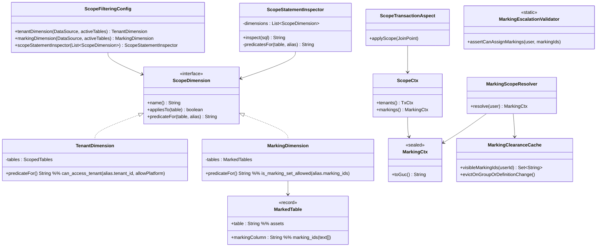
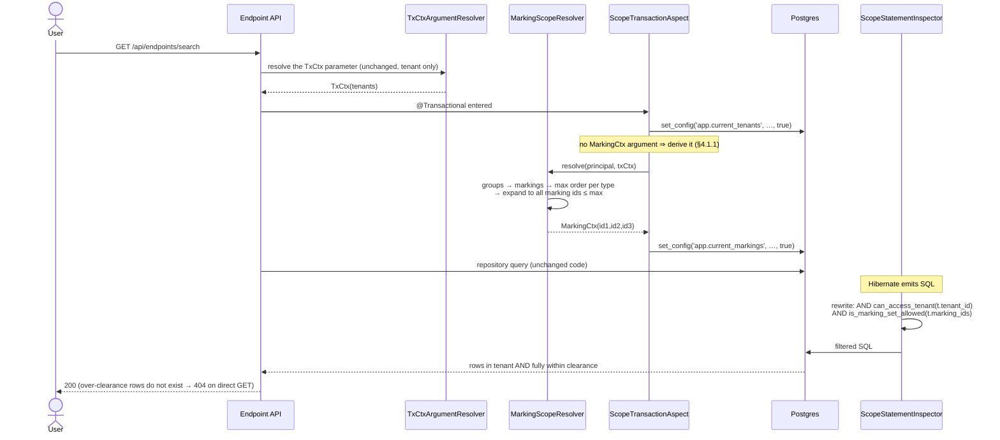
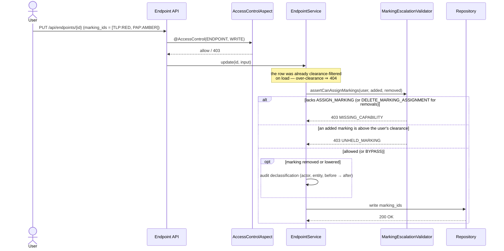

# Option C — Marking isolation "à la" tenant v2 (transparent statement rewrite)

**Parent doc**: [tech-design.md](./tech-design.md) — Option C
**Decision of record**: [ADR-007](../../adr/ADR-007-Marking-based-access-control.md) — the reviewed summary of this design
**Type**: Full Stack (backend-heavy)
**Estimation**: XL (PoC: M)
**Status**: design proposal / PoC scoping
**Companion doc**: [implementation-plan-option-c.md](./implementation-plan-option-c.md) — delivery plan, step-by-step status and PoC definition of done

**Marking cardinality: many-to-many.** An entity carries **zero, one or many** markings
(STIX `object_marking_refs` semantics). This is the decision this document is built on, and it drives most
of the design below. *How* that set is stored physically is a separate, argued choice — see section 3.

---

## 1. Goal

Enforce marking-based visibility the **same way tenant isolation v2** is enforced today: **transparently**, at
the SQL level, driven by a per-transaction scope channel — so that onboarding a new table to marking is a
**configuration change plus one migration**, not a rewrite of every repository method or service layer.

Target developer experience:

```properties
# adding a table to marking isolation = 1 line + 1 migration
openaev.marking.active-tables=assets,asset_groups,secret_references
```

---

## 2. Why the tenant v2 mechanism is the right shape to reuse

The v2 tenant stack has exactly the four properties marking needs:
* **Transparent** for the developer: `TenantStatementInspector` rewrites the SQL Hibernate emits => ✅ identical need for marking
* **Fail-closed** when the GUC is unset: `can_access_tenant()` returns false => ✅ identical need for marking
* **Per-request**: `TxCtxArgumentResolver` → `TenantScopeResolver` → `TxCtx` → `set_config('app.current_tenants', …, true)` => ✅ same shape (groups → markings)
* **Incrementally activatable**: `openaev.tenant.active-tables` allowlist, inert until a table is onboarded => ✅ same need

### 2.1 The hard constraint that shapes the whole design

Hibernate accepts **exactly one** `AvailableSettings.STATEMENT_INSPECTOR`
(`TenantFilteringConfig#tenantStatementInspectorCustomizer` installs it with `putIfAbsent`).

>  ⚠️ ⚠️ **Marking cannot be a second, independent inspector.** It must be folded into the existing rewrite as a
> second *scope dimension*, or it will silently displace tenant isolation.

This is the single most important architectural consequence of choosing Option C.

### 2.2 The design trick that keeps it cheap: resolve ordinality in Java, not in SQL

The naive reading of Option C says: tenant is a *set-membership* check
(`row_tenant_id = ANY(app.current_tenants)`) while marking is an *ordinal* check
(`row_marking_order <= my_clearance`), so the generic mechanism must support two comparison styles
(this is the concern raised in the parent doc's deep dive).

> 💡💡 **It does not have to.** Ordinality is resolved **once per request, in Java**, where the user's groups and
clearances are already loaded. In java we have a logic that flatten set of marking ids and resolve => `app.current_markings = "id1,id2,id3"` where for ex: `id1:TPL:clear, id2: TPL:green, id3: CUSTOM1:green`

### 2.3 What many-to-many changes

Tenant isolation compares a **scalar**: `t.tenant_id` against a list. Marking compares a **set** against a
set. That single difference — not the choice of schema — is what drives the rest of the design:

```
tenant  :  row's tenant_id   ∈  my tenants          membership
marking :  row's marking set ⊆  my clearance set    containment
```
**How containment is expressed in SQL depends on the schema shape — and §3.2 argues that choice.** Two
realisations, to make the difference concrete:

```sql
-- if the set lives in a column on the row (§3.2 Option 2 — Denormalized marking_id on each table subject to marking):
COALESCE(t.marking_ids, '{}') <@ COALESCE(:my_clearance, '{}')

-- if the set lives in a join table (§3.2 Option 1 — Join table<entity_markings>):
--   "visible if there is NO marking on this row that I do not hold"
NOT EXISTS (SELECT 1 FROM assets_markings am
             WHERE am.asset_id = t.asset_id
               AND is_marking_missing(am.marking_id))
```

---

## 3. Data model

### 3.1 What is marked, and where it lives

The epic scopes marking to four entity types. They do **not** map to four tables:

| Entity type | Table | Note |
|---|---|---|
| Endpoint | `assets` | single-table inheritance |
| Security platform | `assets` | same table as Endpoint |
| Asset group | `asset_groups` | |
| Credential | `secret_references` | |

**Three tables, not four** — and `assets` carries two of the four entity types, which is why it is the
table the PoC activates first (step 3). Marking is applied at the *table* level, so activating `assets`
marks Endpoints and Security platforms in one move; there is no way to mark one without the other, and
that is intended.

Scenario, simulation and atomic testing are explicitly **out of scope** for this epic.

### 3.2 Choosing the many-to-many shape — **two options, one decision**

> **Read this before §3.3.** §3.3 gives the concrete schema for **Option 2**, the shape chosen below, with
> **Option 1** retained as the fallback of record. The decision at the end of this section is *gated on a
> validation spike* (step 1.4) and states exactly what would reverse it.

This is the schema decision the whole option rests on, so it is argued rather than asserted.

| | Shape | Read predicate | FK integrity | Marks relationships? | Verdict |
|---|---|---|---|---|---|
| **1** | One join table per marked table | correlated anti-join | ✅ full | ❌ composite PK | 🛟 **fallback of record** if step 1.4 fails |
| **2** | `marking_ids text[]` column on the row | local `<@` test | ❌ none (§5.7) | ✅ | ✅ **chosen**, gated on step 1.4 |

The two differ only on **where the marking set is stored**: in a side table keyed by the row (1), inline on
the row (2). Everything else — AND semantics,
unmarked-visible, ordinal expansion — is identical across both, per §2.3.

#### Option 1 — one join table per marked table *(fallback of record — see the decision below)*

```sql
assets_markings(asset_id, marking_id)                        PK (asset_id, marking_id)
asset_groups_markings(asset_group_id, marking_id)            PK (asset_group_id, marking_id)
secret_references_markings(secret_reference_id, marking_id)  PK (secret_reference_id, marking_id)
```

| ✅ | Why it matters here |
|---|---|
| **Real FKs on both sides** | `ON DELETE CASCADE` removes an entity's markings declaratively. Orphans are *impossible*, not merely cleaned up. |
| **Best plans** | The composite PK is exactly the anti-join access path, and Postgres keeps per-table statistics. This predicate runs on **every query touching a marked table** — plan quality is a permanent runtime cost. |
| **Clean JPA** | A plain `@ManyToMany` + `@JoinTable`. No Hibernate-specific `@ManyToAny`. |
| **Tenant confinement is free** | Both sides are tenant-scoped and the FKs cascade, so the association is implicitly tenant-confined (§3.3) and needs no `tenant_id` of its own. |
| **The schema *is* the activation gate** | `MarkingFilteringConfig` derives `MarkedTable` from the presence of `<table>_markings`. A table not wired for marking cannot be allowlisted — startup fails. That safety net only exists because the join table is per-table. |
| **Matches repo convention** | `asset_groups_assets`, `injectors_contracts_attack_patterns`, `users_tenants`. |

| ❌ | Mitigation |
|---|---|
| One migration per marked table | Each is ~20 lines and templated — that is precisely what the step 4 skill automates. And **the current epic needs only 3 tables** (§3.1: Endpoint + Security Platform share `assets`). |
| Cross-entity queries need a `UNION` | Solved by a view, below — off the hot path. |


#### Option 2 — marking-set column on the marked table *(chosen — see the decision below)*

```sql
ALTER TABLE assets ADD COLUMN marking_ids text[];
CREATE INDEX assets_marking_ids_idx ON assets USING GIN (marking_ids);
```

```sql
-- the whole predicate, no join:
COALESCE(t.marking_ids, '{}') <@ COALESCE(string_to_array(current_setting('app.current_markings', true), ','), '{}')
```

`<@` is "is contained by", which **is** the AND semantics: *every* marking on the row must be in my
clearance. The two `COALESCE`s reproduce the anti-join's edge cases exactly — an unmarked row is `'{}'`,
and `'{}' <@ anything` is true, so it stays visible for free; with no clearance the right side is `'{}'`
and any marked row is denied.

| ✅ | ❌ |
|---|---|
| **No join at all** — a local column test, same cost class as the tenant check | **No referential integrity** — a garbage id is accepted on insert, and deleting a definition leaves dangling ids. Both make the row invisible to everyone, silently. See the verified transcript under the decision below |
| **Works on relationships unchanged** — composite PK is irrelevant when the marking is a column | **GIN** (Generalized *INverted* index — one index entry per array *element*, pointing back at the rows containing it) serves `@>`/`&&` well but is rarely picked for `<@`: a subset test has no element to start from and matches every unmarked row. In practice `<@` runs as a cheap in-memory Filter after other predicates have selected rows — **must be measured**, not assumed |
| Onboarding = `ADD COLUMN` + index. No cascade needed: the markings die with the row | Array mutation rewrites the whole column — irrelevant at this size, but it means no per-marking row-level audit trail |
| "Who is marked X?" is `marking_ids @> ARRAY['X']` — GIN-friendly, per table, and needs no `marking_usage` view | Only viable as the **sole** store: kept *alongside* join tables it would need trigger-syncing |
| **Already proven here** — `assets.asset_ips` and `asset_mac_addresses` are `text[]` mapped with `@Type(StringArrayType.class)`, on the very table the PoC activates | |

> **Do not "optimise" this into `NOT (marking_ids && :lacked)`.** Overlap-against-the-lacked-set is the
> GIN-friendly formulation and is therefore tempting — but the lacked set is *all markings minus mine*, so a
> marking definition created after the scope was resolved is absent from it, and rows carrying it become
> **visible**. That fails open. The `<@` held-set form fails closed on the same event. **The fast form and
> the correct form are different forms** — take the correct one; the arrays are tiny.

Adopted as the **sole** store — the join tables are never built. A trigger-maintained array kept *alongside*
join tables would be a pure §5.5 performance fix that preserves the FKs, but it buys performance only: it
still cannot mark a relationship, and it adds a sync invariant. Not worth the middle ground.

#### Also considered...
##### and rejected
**A single shared polymorphic table** (`object_markings(object_id, object_type, marking_id)`), with or
without `LIST` partitioning. Its one attraction is that onboarding needs no DDL at all. It was rejected
because a column cannot carry an FK to several tables, so it has **no referential integrity on the object
side** *and* needs cleanup triggers per marked table — reintroducing the per-table work imperatively, which
is strictly worse than a declarative `CASCADE`. It also needs its own `tenant_id` and filtering, forces
Hibernate's `@ManyToAny`, and makes every marked entity's writes contend on one hot relation. The partitioned
variant recovers plans but needs an `ATTACH PARTITION` per table, forfeiting the very pro that motivated it.
Recorded in one paragraph so it is not re-proposed.

##### for future Option 3 — interned marking sets *(Option 2 with the FK put back)*

**The difference in one picture.** Option 2 stores the set *inline on every row*; Option 3 stores each
distinct **combination once** and points rows at it — the database equivalent of interning a string:

```
Option 2 (chosen)                      Option 3 (interned)
─────────────────────────────          ──────────────────────────────────────────
assets                                 marking_sets / marking_set_members
  a1  {m_green, p_red}                   set_1 -> m_green, p_red
  a2  {m_green, p_red}   <- repeated     set_2 -> m_green
  a3  {m_green}                        assets
                                         a1  set_1
                                         a2  set_1        <- shared, stored once
                                         a3  set_2
```

```sql
marking_sets(marking_set_id, canonical_hash UNIQUE)   -- one row per distinct combination
marking_set_members(marking_set_id, marking_id REFERENCES marking_definitions)
ALTER TABLE assets ADD COLUMN marking_set_id varchar REFERENCES marking_sets;
```

Java resolves, per request, which set ids are fully covered by the clearance, and the predicate becomes a
single-column test:

```sql
can_access_marking_set(t.marking_set_id)   -- reads app.current_marking_sets, exactly like can_access_tenant
```
**Why it is not chosen.** It buys back integrity at the price of write complexity and a new hot-path join on
the display side — while §5.7's two mitigations close the same gap for roughly ten lines, using machinery the
design already needs. The trade is real but not favourable *yet*.

**Revisit it if** the §5.7 reconciliation query ever finds genuine drift in production, or if find-or-create
turns out to be needed anyway for some other reason. It is a strictly local change: `MarkingDimension`
returns a different one-line predicate, and the marked tables swap one column for another.


#### Decision: **Option 2** for the PoC


**The objection: using machinery the design already requires:**

- **Insert side is free.** The §4.3 write guard must answer *"do you hold the marking you are assigning?"*,
  which means loading the definition. The existence check is a by-product — a garbage id cannot reach the
  database through the service layer.
- **Delete side is ~10 lines, generated from the registry that already drives the inspector**, so it cannot
  drift out of sync with the allowlist:

  ```java
  for (MarkedTable t : tables.all())
    jdbc.update("UPDATE " + t.table() + " SET marking_ids = array_remove(marking_ids, ?)", markingId);
  ```

  This is exactly the work `ON DELETE CASCADE` performed — written once instead of declared per table.


#### The orphan problem, stated precisely

Under Option 2 a dangling id is not untidy — it is **silent data loss**, and the mechanism is worth pinning
down because it motivates the write guard. Verified in Postgres on temp tables:

```
INSERT a garbage marking id
  join table  ->  ERROR: violates foreign key constraint      rejected
  array       ->  INSERT 0 1                                  accepted silently

DELETE FROM marking_definitions WHERE id = 'm_green'
  join table  ->  0 rows left for asset1        (ON DELETE CASCADE)
  array       ->  marking_ids still {m_green}   (nothing happened)

...and then, for an admin holding EVERY marking that still exists:
  join table  ->  visible = true    row became unmarked, readable
  array       ->  visible = false   invisible to everyone, permanently
```

The reason it is total rather than partial: the predicate is **pure set membership against the GUC** — it
never consults `marking_definitions`, so it cannot distinguish "deleted" from "exists but you do not hold
it". Verified against the real function:

```
clearance = m_green,m_warm
  m_green   (held)              -> missing = false
  m_red     (exists, not held)  -> missing = true
  m_deleted (orphan)            -> missing = true     <- indistinguishable from m_red
```

And a deleted definition can never enter *anyone's* clearance, because deleting it cascades `groups_markings`
away too. So the row is hidden from the **entire platform, permanently**, with no error raised.

Note the asymmetry that makes this tractable: deleting the *marked row* is safe (the array dies with the
row — no cascade needed, simpler than Option 1). Only deleting the *definition* needs the scrub above.
Q11b records the archive-rather-delete policy that avoids needing it at all.

---

### 3.3 Concrete schema — **Option 2 as chosen in §3.2**

```sql
-- Task 1 (prerequisite): marking definitions, tenant-scoped
marking_definitions(
  marking_id          varchar PK,
  marking_type        varchar   NOT NULL,   -- TLP, PAP, custom
  marking_definition  varchar   NOT NULL,   -- TLP:RED
  marking_order       int       NOT NULL,   -- 1..10, 10 = highest
  marking_color       varchar,
  tenant_id           varchar   NOT NULL REFERENCES tenants,
  UNIQUE (marking_definition, tenant_id)    -- composite, per multi-tenancy conventions
)

-- Task 2 (prerequisite): group clearance
groups_markings(
  group_id   varchar REFERENCES groups(group_id)                       ON DELETE CASCADE,
  marking_id varchar REFERENCES marking_definitions(marking_id)        ON DELETE CASCADE,
  PRIMARY KEY (group_id, marking_id)
)

-- Task 3 (this design): one marking-set column per marked entity table
ALTER TABLE assets              ADD COLUMN marking_ids text[];
ALTER TABLE asset_groups        ADD COLUMN marking_ids text[];
ALTER TABLE secret_references   ADD COLUMN marking_ids text[];

CREATE INDEX idx_assets_marking_ids ON assets USING GIN (marking_ids);
-- GIN serves "what is marked X?" (marking_ids @> ARRAY['X']).
-- The read predicate is `<@`, which GIN rarely serves; step 1.4 measures whether the index
-- is worth keeping on the read path or exists purely for admin/impact queries.
```

**Convention (load-bearing)**: the column is named `marking_ids`, type `text[]`, on the marked table itself.
Its *presence* is what lets `MarkingFilteringConfig` derive `MarkedTable` from `information_schema` instead
of requiring a hand-maintained mapping — exactly how tenant tables are derived from the presence of a
`tenant_id` column. `MarkedTable` therefore needs **no PK column, no join table, no FK column**; it degenerates
to `(table, markingColumn)`, which is why composite-PK tables and relationships work unchanged.

**Tenant scoping**: `marking_ids` lives on the marked row, which is already tenant-scoped. There is no second
table to confine, so nothing to flag for the multi-tenancy reviewer beyond the row itself.

**No FK — the two compensations** (argued in §3.2):
- *Writes*: the §4.3 guard resolves each marking definition to check the user holds it, so existence is
  verified as a by-product. Enforced at the service layer, not the schema.
- *Definition deletion*: a generated `array_remove` scrub over `MarkedTables`, or the archive-not-delete
  policy of Q11b.

**`text[]` is proven in this codebase** — `assets.asset_ips` and `assets.asset_mac_addresses` are `text[]`
mapped with `@Type(StringArrayType.class)`; 19+ such columns exist. The marking column reuses that pattern
verbatim.

#### `groups_markings` is a clearance **grant**, not a marking attachment

Two different relationships join groups to markings, and the shared vocabulary invites confusion:

| Relation | Question it answers | Role |
|---|---|---|
| `groups_markings(group_id, marking_id)` | *What can members of this group see?* | clearance **grant** — an input to authorization (Task 2) |
| `groups.marking_ids` | *Who is allowed to see this group?* | marking **attachment** — an output of authorization |

**`groups_markings` stays a join table under Option 2.** It is not a marked table and never gets a
`marking_ids` column. Three reasons:

- It is read by the **Java resolver** (groups → markings → ordinal expansion, §2.2), never by the SQL
  predicate, so denormalising it buys nothing on the hot path.
- It is authorization data and wants **real FKs**: `groups_markings.marking_id → marking_definitions` keeps a
  genuine `ON DELETE CASCADE`, so Q11b's archive policy concerns only the `marking_ids` arrays.
- §3.2 chose how *marked entities* store their markings. It says nothing about how *clearance* is modelled.

Marking the `groups` table itself, if ever wanted, is therefore just
`ALTER TABLE groups ADD COLUMN marking_ids text[]` — sitting **beside** `groups_markings`, not replacing it.

## 4. Runtime architecture

### 4.1 Class diagram



The `ScopeDimension` interface is the whole generalization: the inspector stops knowing *what* a tenant or
a marking is and only asks each dimension for a boolean SQL predicate on a table alias.

#### 4.1.1 What activating a table on marking requires — compared to tenant v2

Activating a table on tenant v2 costs the developer **two** things at every entry point: the method must be
`@Transactional`, **and** it must take a `TxCtx` parameter. Marking needs the first but **not** the second.

| | tenant v2 | marking |
|---|---|---|
| `@Transactional` on the entry point | ✅ required | ✅ **required** |
| a `Ctx` parameter on the REST method | ✅ required (`TxCtx`) | ❌ **not required** |

**Why `@Transactional` is still required.** The scope travels as a *transaction-local* Postgres setting
(`set_config(…, true)`). The aspect that writes it runs `@Before` a `@Transactional` method, i.e. *inside*
an already-open transaction. Outside a transaction there is nothing to attach the setting to, the GUC stays
unset, and every marked row is hidden — fail-closed, but silently. This is identical to tenant v2 and is not
negotiable.

**Why no `MarkingCtx` parameter is needed.** `TxCtx` is a parameter because a tenant scope is a *caller
choice*: a user who belongs to three tenants must say which one they are acting in (`X-Tenant-Ids`, a path
variable, or a job passing one explicitly). It is not derivable from the authenticated principal, and v2's
whole correction over v1 was to stop smuggling that choice through a thread-local.

A **clearance is not a choice**. There is no "act at TLP:GREEN today" selector: it is a pure function of
*(authenticated user, selected tenant)* → groups → markings → expanded id set. Everything that function
needs is already at hand when the aspect runs — the principal in the security context, the tenant in the
`TxCtx` argument that is *already there*. So the aspect resolves it itself:

```
ScopeTransactionAspect#applyScope(joinPoint):
  1. an explicit MarkingCtx argument, if the method has one   → run-as / impersonation, tests
  2. otherwise MarkingScopeResolver.resolve(principal, txCtx) → every HTTP handler, no signature change
  3. otherwise MarkingCtx.Missing                             → empty GUC, fail-closed
```

The practical consequence for step 3: **activating `assets` on marking changes no controller signature.**
The endpoints already carry `TxCtx` and `@Transactional` from tenant v2, and that is enough.

Note what this list does **not** cover. The aspect triggers on `@Transactional`, and background code is
forbidden from using `@Transactional` — it opens transactions through the `TenantScopedTransaction`
primitive instead. So none of the three branches ever runs off the request thread, and branch 3 is not the
background story. §4.1.3 is.

#### 4.1.2 The two dimensions are independent, not layered

`ScopeStatementInspector` holds a `List<ScopeDimension>`. For each table it asks **every** dimension two
questions — *do you cover this table?* and if so *what is your predicate?* — and `AND`s whatever comes back.
No dimension knows the others exist.

So the two allowlists, `openaev.tenant.active-tables` and `openaev.marking.active-tables`, are genuinely
independent, and all four combinations are legal:

| tenant v2 | marking | Result |
|---|---|---|
| ✅ | ✅ | `can_access_tenant(t.tenant_id) AND is_marking_set_allowed(t.marking_ids)` |
| ✅ | ❌ | today's behaviour, unchanged |
| ❌ | ✅ | **marking alone** — the table keeps tenant v1 `@Filter`, or is not tenant-scoped at all |
| ❌ | ❌ | inert |

Row 3 is the one worth stating explicitly, because it is not obvious and it is load-bearing for the rollout:
**a table can be marking-activated while its tenant isolation is still v1 `@Filter`, or while it has no
tenant dimension at all.** Marking does not wait for the v2 tenant migration to reach a table. §6.1 (Q10)
proves the v1 coexistence case specifically — the marking predicate adds **zero bind parameters**, so it
cannot disturb the positional placeholders a Hibernate `@Filter` relies on.

The one place the dimensions *do* meet is the resolver, not the inspector: which markings a user holds
depends on their groups **in the selected tenant**, so `MarkingScopeResolver` reads the tenant from `TxCtx`.
That is a dependency of the clearance *computation*, not of the SQL rewrite.

#### 4.1.3 Background jobs — worked example: `InjectsExecutionJob`

Take the question directly: Quartz fires `InjectsExecutionJob.execute()`, it picks up an inject whose target
is a **marked asset**. Does the job see that asset?

**There is no user, so there is no clearance to derive.**

**The answer: the job runs at system clearance, assigned by the primitive.** With the change specified in
[step 2.3 of the plan](./implementation-plan-option-c.md) — `setScope` writing `app.current_markings`
alongside `app.current_tenants`, defaulting to all markings of the tenant in scope and refusing to open
unset — `tenantTx.execute(TxCtx.forTenant(t), …)` also writes *every marking of tenant `t`* into
`app.current_markings`. `ARRAY['tlp-red'] <@ ARRAY['tlp-clear','tlp-green','tlp-amber','tlp-red',…]` → true.
The job sees every asset of its tenant, exactly as it does today, and **activating `assets` is a no-op for it**.

> ⚠️ Note the asymmetry with tenant: the job is *narrowed* to one tenant because that is a real boundary it must
> respect, but it is *widened* to all markings because marking is a boundary between **users**, and a
> scheduler is not a user. It is the `isAdminOrBypass()` equivalent, expressed in the primitive.

A second reason to **assign** rather than derive here: `InjectsExecutionJob` runs on the shared
`ForkJoinPool.commonPool`, which borrows the calling thread (see the javadoc on `executeInTenant`). Any
principal-derived clearance would be a thread-local, and a borrowed thread could hand the job whatever
clearance the borrower happened to have — non-deterministic, and occasionally *less* than the job needs.
Explicit assignment removes the question.

> ⚠️ [OUT OF SCOPE of this POC] **But the job also writes.** It creates `InjectExpectation` rows against those
> marked assets, and those rows are later read by real users on the HTTP path. Seeing every asset obliges it
> to **re-apply the marking on the way out** — an expectation naming a `TLP:RED` endpoint must itself be
> `TLP:RED`, or the job has laundered the marking through a table nobody thought to activate. This
> generalises, and it is bigger than it looks: see **§5.8**, where marking propagates transitively along every
> write the system makes on a marked row. §5.2 is the other instance — the ES sync legitimately indexes every
> marked row, so the **index** must carry `marking_ids` and the query side must filter on it. Same for
> anything that emails, exports or renders a digest.


### 4.2 Sequence — read path (transparent)



### 4.3 Sequence — write path (explicit guard)

**Reads are filtered structurally; writes are guarded explicitly.** The rewrite answers *"which row am I
touching?"*. It cannot answer *"which value am I writing?"* — the predicate tests the row's **pre-image**,
and the markings being written are in the `SET`/`VALUES` clause, which no `WHERE` can see.

The attack this leaves open, in one line: a `TLP:GREEN` user loads a `TLP:GREEN` asset (✅ visible), sets it
to `TLP:RED`, and the `UPDATE … WHERE is_marking_set_allowed(marking_ids)` still passes — because the row is
*still GREEN at that instant*. After commit it is invisible to them and to every colleague at their level,
and they cannot undo it.

> This is not a gap peculiar to marking. Tenant v2 has the same one and resolves it the same way: the
> inspector guards `INSERT … SELECT` only, and explicitly leaves ordinary ORM writes to the application
> (*"VALUES inserts cannot be distinguished from ORM-generated ones at the SQL level, so their scope
> assignment stays an application concern"* — `ScopeStatementInspector#rewriteInsert`). §5.6 argues where
> the marking guard belongs and why.

Three independent layers apply on write:

| Layer | Question | Mechanism | Failure |
|---|---|---|---|
| 1 | May I modify this entity type? | `@AccessControl(ENDPOINT, WRITE)` | 403 |
| 2 | May I manage marking assignments at all? | `ASSIGN_MARKING` capability — `DELETE_MARKING_ASSIGNMENT` for removals | 403 |
| 3 | May I write *these* markings? | `MarkingEscalationValidator` clearance check | 403 |

Layer 2 comes from the **"Assign marking"** capability chain (Task 1/US1 AC1) — `Access marking assignment`
→ `Assign marking` → `Delete marking assignment` — independent from the "Marking definitions" chain. Per
AC4, `BYPASS` overrides layers 2 and 3.

The check itself is one containment test, the same one the read uses: **every marking being written must be
one the user holds.** Two properties fall out of that single rule, with no special cases:

- **No self-lockout.** A user can never raise a row above their own clearance, so they can never make a row
  invisible to themselves. Worth an explicit test.
- **Declassification is allowed.** Lowering or removing a marking yields a subset of the clearance, so it
  passes. That is correct — a `TLP:GREEN` user may mark a `TLP:GREEN` asset `TLP:CLEAR` — but it *widens*
  visibility, so it is gated by the separate `DELETE_MARKING_ASSIGNMENT` capability and audited.




### 4.4 SQL function and the generated predicate

Both schema shapes of §3.2 implement the **same** invariant — *a row is visible when every marking it
carries is one I hold* — and both must reproduce this truth table, which is shape-independent. It is the
acceptance criterion for either implementation.

Clearance **TLP:WARM** (order 2, between GREEN and RED), expanded in Java to `m_clear,m_green,m_warm`:

| asset | markings | visible | why |
|---|---|---|---|
| `a1` | `m_green` | ✅ | GREEN ≤ WARM |
| `a2` | `m_red` | ❌ | RED > WARM |
| `a3` | `m_green` + `p_red` | ❌ | GREEN held, but `p_red` is not — **AND**, not OR |
| `a4` | *(none)* | ✅ | nothing to lack ⇒ visible for free |

`a3` and `a4` are the two rows that separate a correct implementation from a plausible-looking one. The
naive positive form — *"keep rows carrying a marking I hold"* — gets **both** wrong: it shows `a3` (one held
marking was enough ⇒ a PAP:RED asset leaks to a TLP:WARM user) and hides `a4` (an unmarked asset becomes
invisible to everyone). Every predicate below is built around that.

> **Step 1 happens in Java, before any SQL runs.** "WARM ≥ GREEN" is expanded once per request into
> `m_clear,m_green,m_warm` and written to `set_config('app.current_markings', …, true)`. After that,
> ordinality no longer exists: SQL only ever does set membership (§2.2).

---

#### 4.4.1 Option 2 — `marking_ids text[]` column *(chosen, implemented)*

```sql
CREATE OR REPLACE FUNCTION is_marking_set_allowed(row_marking_ids text[])
RETURNS boolean
LANGUAGE sql STABLE PARALLEL SAFE AS $$
  SELECT COALESCE(row_marking_ids, '{}'::text[])
         <@ COALESCE(
              string_to_array(NULLIF(current_setting('app.current_markings', true), ''), ','),
              '{}'::text[])
$$;
```

Generated by `MarkingDimension#readPredicate("assets", "t")`:

```sql
is_marking_set_allowed(t.marking_ids)
```

That is the entire predicate. Postgres's `<@` ("is contained by") **is** the AND semantics, so all four rows
of the truth table fall out of one operator with no special cases.

**Both `COALESCE`s are load-bearing**, and each guards a different row of the table:
- `NULL <@ x` is `NULL`, which a `WHERE` drops — without the left one, an **unmarked row would vanish**
  (`a4`).
- `x <@ NULL` is also `NULL` — without the right one, a user with **no clearance would see nothing at all**,
  including unmarked rows. Fail-closed here means "no marked row", not "no row".

> 🔴 **Do not "optimise" this to `NOT (marking_ids && :lacked)`.** It is GIN-friendly and tempting, but
> `:lacked` is *"all markings minus mine"*, computed when the clearance was resolved. A marking definition
> created **after** that moment is in neither set, so rows carrying it match neither side and become
> visible — it **fails open**. Pinned by a regression test (`FailOpenTrap`).

**Measured, not assumed** (200k rows, real `EXPLAIN (ANALYZE)`, step 1.4):

```
is_marking_set_allowed(marking_ids)   →  94.9 ms   Parallel Seq Scan
  Filter: (COALESCE(marking_ids,'{}') <@ COALESCE(string_to_array(NULLIF(current_setting(…),''),','),'{}'))
marking_ids <@ '{tlp_green}'::text[]  →  43.6 ms   Seq Scan
```

The `Filter:` line is the finding: the function is a single-statement SQL function, so the planner
**inlines** it and sees a real `<@` operator rather than a black box. Residual cost ≈ **0.25 µs/row**, all of
it GUC parsing — the same price tenant v2 already pays. See §5.5 for what this does and does not settle.

#### 4.4.2 Option 1 — join table + anti-join *(fallback of record)*

Retained because it is the shape to fall back to if Option 2's missing FK (§5.7) proves unacceptable. It was
implemented and green before the flip (commit `7056fd6a32`), so this is a description of working code, not a
sketch.

```sql
CREATE OR REPLACE FUNCTION is_marking_missing(row_marking_id text)
RETURNS boolean
LANGUAGE sql STABLE PARALLEL SAFE AS $$
  SELECT CASE
    -- no clearance ⇒ every marking is missing ⇒ every MARKED row denied (unmarked rows unaffected)
    WHEN current_setting('app.current_markings', true) IS NULL
      OR current_setting('app.current_markings', true) = '' THEN true
    ELSE COALESCE(
           NOT (row_marking_id = ANY (
             string_to_array(current_setting('app.current_markings', true), ','))),
           true)
  END
$$;
```

```sql
NOT EXISTS (SELECT 1
              FROM assets_markings t_mk
             WHERE t_mk.asset_id = t.asset_id
               AND is_marking_missing(t_mk.marking_id))
```

**The function is named — and returns — negatively, on purpose.** `is_marking_missing(m)` is true when the
caller does *not* hold `m`. A positively named `can_access_marking()` reads like a row-level visibility test,
which invites `EXISTS (… AND can_access_marking(…))` — precisely the positive form that breaks `a3` and
`a4`. Named this way it cannot be mistaken for one, and the generated SQL loses a double negative.
Fail-closed therefore means returning `true`, and `COALESCE(…, true)` is load-bearing: `NULL = ANY(…)` is
`NULL`, which would drop the row from the inner `WHERE`, make `EXISTS` false, and expose the marked row.

**Why "anti-join".** The inner query hunts for *problems*, not permissions: it keeps only the markings on the
row that the caller **lacks**. Zero left over ⇒ `NOT EXISTS` ⇒ visible. Postgres names the node literally and
does not run it as a per-row loop — it scans the join table once, keeps the missing rows, hashes them, and
subtracts them from `assets` in a single pass:

```
 Hash Right Anti Join
   Hash Cond: (a_mk.asset_id = a.asset_id)
   ->  Seq Scan on assets_markings a_mk
         Filter: CASE WHEN (current_setting('app.current_markings', true) IS NULL OR … = '')
                      THEN true ELSE COALESCE((marking_id <> ALL (string_to_array(…, ','))), true) END
   ->  Hash
         ->  Seq Scan on assets a
```

Two costs Option 2 does not have: the predicate must know the marked table's **primary key** (so a
composite-key relationship table needs a special case, §3.2), and the join table is itself a table the
inspector must be told to filter — otherwise reading a row's markings leaks the markings of rows the caller
cannot see.


---

## 5. Risks and open technical points

### 5.1 🔴 Regressing tenant isolation
Change #3 touches the class that is the *sole* enforcement point of multi-tenancy v2. Mitigation: refactor
in a dedicated commit with **zero behaviour change** (marking dimension absent), prove it green on the
whole existing tenant test suite (`TenantStatementInspector*`, `*TenantIsolationTest`,
`*HttpIsolationTest`, ArchUnit tenant rules), and only then add the marking dimension in a second commit.

### 5.2 🔴 Elasticsearch / OpenSearch reads bypass the inspector entirely
Any read served from the search engine (indexed entities, dashboards, findings) never goes through
Hibernate and is therefore **not** marking-filtered. The ES path needs its own filter (a `terms` clause on
an indexed `marking_ids` array, which the M2M model maps to naturally) or the marked entity types must be
kept off ES-served endpoints. **Must be scoped before go-live**; out of scope for the PoC.

### 5.3 🟠 Background jobs
Jobs open transactions through `TenantScopedTransaction` with a `TxCtx`, never a user, so they have no
clearance. Left as-is, activating a table would make every background reader silently blind — see **§4.1.3**
for the worked example and the answer. The resolution: `setScope` writes `app.current_markings` alongside
`app.current_tenants`, defaulting to all markings of the tenant(s) in scope, and **refuses to open unset** the
way `requireScope` already refuses `TxCtx.Missing`. Three details it must respect — "all markings" resolves
*per tenant* (`marking_definitions` is tenant-scoped, so `forEachTenant` re-resolves inside each transaction);
`marking_definitions` itself must never be marking-activated, on the same circularity grounds as
`groups_markings` (§3.3); and `executeNew` must re-set **both** GUCs, since `set_config(…, true)` is
transaction-local. Specified as **step 2.3** of the plan.

An explicit `MarkingCtx` override stays available but the list of callers is short and closed: run-as /
on-behalf-of jobs (a scheduled export produced *for a named user* must see what that user sees), tests, and
impersonation. Everything else — collectors, executors, ES sync, expectation expiry — takes the default.

The residual risk this leaves is the one §4.1.3 ends on, §5.2 owns and §5.8 generalises: a job reading at
system clearance and writing somewhere unfiltered launders marked content past the boundary.

### 5.4 🟠 Cache invalidation
The expanded id set (§2.2) derives from *(user → groups → group markings)* and *(marking definitions and
their order)*. It must be evicted on: group membership change, group-marking assign/remove, marking
definition create/update (**order change!**)/delete. `TenantMembershipCacheManager` is the pattern to follow.

### 5.5 🟡 Predicate cost and planner behaviour
Measured on 200k rows at step 1.4 (§4.4.1): **94.9 ms** with the predicate against **43.6 ms** for a bare
inlined `<@`, i.e. ≈ **0.25 µs/row**, all of it GUC parsing — the same price tenant v2 already pays. Two
findings that contradicted the pre-spike assumption, and one that did not:

- **The function is inlined.** Being a single-statement SQL function, the planner expands its body and sees
  a real `<@` operator. It is not a black box.
- **A GIN index was available and correctly skipped** — on selectivity grounds (99.9 % of rows matched), not
  opacity. Adding one is not the lever it looks like.
- 🟠 **Row estimates are unreliable**: 1 000 estimated, 199 800 returned, because the clearance is not a
  planning-time constant. Do not let a marked table sit on the inner side of a nested loop chosen from these
  estimates. Escape hatch if it ever bites: inline the resolved clearance array into the emitted SQL instead
  of reading the GUC, restoring planning constants at plan-cache cost.

Step 5.5 validates this against a pre-activation baseline on real `assets` volumes.

### 5.6 🟡 Where the write guard belongs — and why not the repository layer
The inspector guards `INSERT … SELECT` but deliberately not ordinary ORM writes: *"VALUES inserts cannot be
distinguished from ORM-generated ones at the SQL level, so their scope assignment stays an application
concern"* (`ScopeStatementInspector#rewriteInsert`). Marking inherits that limit — and a deeper one: a
`WHERE` predicate can only test a row's **pre-image**, never the value in `SET`/`VALUES` (§4.3). *No* amount
of statement rewriting can express "may this user write these markings".

So the question is not *rewrite vs service*, it is **which non-rewrite layer**. Four were considered:

| Layer | Mechanism | Verdict |
|---|---|---|
| Statement rewrite | extend `ScopeStatementInspector` | ❌ **impossible** — cannot see the post-image |
| Repository / ORM | Hibernate `PreInsert`/`PreUpdateEventListener` on marked entities | 🟡 possible, insufficient alone |
| Service | `MarkingEscalationValidator` | ✅ **chosen for the PoC** |
| Database | `BEFORE INSERT OR UPDATE` trigger calling `is_marking_set_allowed(NEW.marking_ids)` | ✅ **recommended backstop for go-live** |

**Why not the repository/ORM layer as the primary guard.** A Hibernate event listener is attractive — it
cannot be forgotten, it covers cascades, and it mirrors the existing `TenantBaseListener`. But it fires deep
in the flush, so a violation surfaces as an opaque `PersistenceException` at commit rather than a 403 naming
the offending marking; the domain distinctions that make this policy (BYPASS override, the separate
`DELETE_MARKING_ASSIGNMENT` capability, declassification auditing) are not available there; and it still
misses every write that does not go through the ORM. It buys defence, not diagnosis — and it is strictly
dominated by the trigger below, which catches the same writes *plus* raw JDBC.

**Why the database trigger is worth adding.** Note that the guard predicate is *literally the read
predicate*: "every marking written is one I hold" is `is_marking_set_allowed(NEW.marking_ids)`. The same
function, no new logic. That makes a trigger cheap, and it closes the one hole nothing else covers — the
**raw-JDBC writers** that §5.7 identifies as the residual exposure once Option 2 dropped the FK. It also
gets declassification right for free: removing a marking yields a subset, which passes.

Two costs, both real and both manageable: a violation arrives as a `SQLException` that needs mapping to a
403, and any writer with no clearance in the GUC — migrations, and background jobs that have not set one —
would fail closed, so they need the §5.3 "all markings of the tenant" scope or an explicit exemption.

**Conclusion**: service layer for the *policy* (403, capability distinction, audit), database trigger for
*totality*. **Reads are structural; writes are an explicit, auditable decision** — the same split as
`PrivilegeEscalationValidator` today. Document the asymmetry so a reviewer does not read it as a hole. The
trigger is not PoC work; it belongs with 5.6 go-live hardening.

---

### 5.7 🟠 Option 2 removes the database's guard on marking-id validity
Under Option 1 an FK rejects a nonexistent `marking_id` outright. Under Option 2 nothing does: a bad id is
accepted silently and makes the row **invisible to everyone, permanently and without error** (§3.2).

Three mitigations, the first two already required for other reasons — but they must be treated as
load-bearing rather than incidental:
- **Writes**: the §4.3 `MarkingEscalationValidator` resolves every marking definition to check the user holds
  it, so a nonexistent id cannot pass. This is now a *correctness* requirement, not only a policy one.
- **Deletion**: the generated `array_remove` scrub over `MarkedTables`, or Q11b's archive-not-delete policy.
- **Raw JDBC**: the §5.6 database trigger is the only mitigation that reaches writers bypassing the ORM.

The residual exposure until that trigger exists is precisely those **raw-JDBC writers**, which the FK used to
catch and now nothing does. Hence the step-4 skill's Phase 0 gate screens for raw-JDBC *writers*, not only
readers. A periodic reconciliation query (`marking_ids` elements not present in `marking_definitions`) is a
cheap safety net worth adding with **step 5.6**.

### 5.8 🟠 Derived data and aggregates — marking propagates past the four entity types

**Deferred out of this epic, deliberately.** Recorded here because the PoC surfaces it and the next epic
inherits it.

§4.1.3 grants two things that are individually correct and jointly incomplete: a user browsing a simulation
must not see assets they lack clearance for, and `InjectsExecutionJob` must nonetheless execute against
*every* asset, marked ones included. Both hold. But the job **writes** while running at system clearance, and
`TechnicalInjectExpectation` carries `@JoinColumn(name = "asset_id")` straight to `assets`, with the asset's
name denormalised into `inject_expectation_name`. So an uncleared user opening that simulation reaches a fork
this design does not resolve:

| | Consequence |
|---|---|
| `injects_expectations` **not** marking-activated | The user gets a row naming a `TLP:RED` endpoint — a leak. And an *accidental* one: `ExerciseRepository.rawAll()` uses `LEFT JOIN injects_expectations`, so the row survives with nulls, while an inner join elsewhere would silently drop it. Behaviour would depend on join type, which is not a design |
| `injects_expectations` **activated**, marking inherited from the asset at write time | Rows filter correctly, but the **scores go per-viewer** |

The second row is the substantive problem. Simulation aggregates are `nativeQuery = true` (`array_agg`,
counts, in `ExerciseRepository` and `ScenarioRepository`), and — unlike `@Filter` — the statement inspector
rewrites *final SQL*, so **native aggregate queries are rewritten too**. The count would silently recompute
under each viewer's clearance. Neither option is obviously right:

- **Per-viewer aggregates** — internally consistent (the number matches the rows you can see), but two users
  see two different success rates for the same simulation and neither is "the" result.
- **System-clearance aggregate** — one true number, but it contradicts the visible rows: *"60% detected"*
  over eight visible targets that are all green.

The general shape: marking does not stop at the four entity types the epic scopes. It **propagates
transitively** along every write the system performs on a marked row — asset → expectation → inject status →
ES document → score. Each hop is a table someone must decide to activate, and each aggregate is a place where
"filtered rows" and "one number" disagree.

Two consequences for the current work, both cheap:

- The step-4 `activate-marking-table` skill must include a **downstream trace**: for the table being
  activated, which tables hold an FK to it *and* denormalise any of its content, and which native aggregates
  read those. That inventory is the input to the next epic's decision, and it is much easier to produce while
  activating than afterwards.
- Until that decision is made, **do not activate `injects_expectations`**. Leaving it unactivated is the
  status quo (today no user is filtered at all), whereas activating half the chain produces the join-type
  fragility above.

---

## 6. Decisions

| # | Question | Decision |
|---|---|---|
| Q1 | One marking per entity or many? | **Many** (settled; drives §2.3, §4.4). *How* the set is stored is Q11, not this question |
| Q2 | Multi-marking semantics | **AND** — user must hold every marking on the row |
| Q3 | Unmarked entity visible to all? | **Yes** (US5/AC3); `allowUnmarked` kept as a per-table switch |
| Q4 | Does `BYPASS` override marking? | **Yes** — consistent with `PrivilegeEscalationValidator` and Task 1/US1 AC4 |
| Q5 | Background jobs see all markings? (§5.3) | **Yes** |
| Q6 | Over-clearance direct GET → 404 or 403? | **404** — the row does not exist for that transaction; a 403 would itself leak the object's existence |
| Q7 | Can a user assign a marking they do not hold? | **No** (§4.3) |
| Q8 | Which capability gates marking assignment? | The **"Assign marking"** chain from Task 1/US1 AC1: `Access marking assignment` → `Assign marking` → `Delete marking assignment`. Removal requires the L3. Independent from the "Marking definitions" chain |
| Q9 | Can a user remove or lower a marking they hold? | **Yes, but audited** (§4.3) — gated by `DELETE_MARKING_ASSIGNMENT`, and every widening event is logged (actor, entity, before → after) |
| Q10 | Must a table be on tenant **v2** before marking can be activated on it? | **No** — a table can stay on tenant **v1** (`@Filter`) and be marking-active at the same time. Verified empirically (§6.1); `MarkingCoexistsWithTenantV1Test` pins it |
| Q11 | How is the many-to-many stored — side table, inline column, or interned set? | **A `marking_ids text[]` column on the marked table** (§3.2 Option 2), **gated on the step 1.4 spike**. Reverses an earlier choice of per-table join tables: four of that option's six claimed advantages collapsed on inspection (`text[]` is already used on `assets` itself via `StringArrayType`, so JPA mapping and "repo convention" are neutral, not risks). Only FK integrity survived, and both halves of it are recoverable from machinery the design already needs (§5.7). Decisive factor: the PoC's deliverable is the **activation skill**, and a skill built on join tables is discarded the first time a relationship needs marking — 63 tables have composite PKs. **Option 1 is retained as the fallback of record** if 1.4 fails |
| Q11b | Are marking definitions ever hard-deleted? | **Archive, do not hard-delete.** Under Option 2 this is promoted from *recommended* to *the default policy*: there is no FK, so a hard delete leaves ids that nobody can hold, hiding the row from the entire platform with no error (§3.2). If hard delete is shipped anyway it **must** call the generated `array_remove` scrub over `MarkedTables` — the work `ON DELETE CASCADE` used to do for free |
| Q12 | Do Task 1 / Task 2 ship fully before the PoC? | **No — skimmed** (step 2.1): `marking_definitions` CRUD + `groups_markings` + assign endpoint, with **no capabilities and no RBAC**. The PoC needs a clearance to read, not a governed product. Un-skimmed at 5.6 |
| Q13 | Is the clearance source itself marking-activated? | **No, not until after step 3** — and note the distinction (§3.3): `groups_markings` is a clearance *grant* and is never a marked table. The live question is whether **`groups`** gets a `marking_ids` column. It must not yet: the resolver reads `groups` to compute the clearance, so filtering it would make the resolver depend on a clearance that does not exist, failing closed to "no clearance" for everyone. Doing it later requires a marking-exempt resolver context. Revisited as a deliberate decision at 5.6 |
| Q14 | Which table is marking-activated first? | **`assets`** (step 3) — the largest and most-joined of the three, so it is the honest test of the fail-closed blast radius (§5.1) and the predicate cost (§5.5). The activation procedure is then captured as the `activate-marking-table` skill (step 4.1) before it is repeated |

### 6.1 Q10 — tenant v1 and marking v2 on the same table

The two mechanisms act at different layers and do not interact:

| | tenant v1 | marking v2 |
|---|---|---|
| Acts at | Hibernate SQL **generation** (filter condition on the entity alias) | final SQL **string** rewrite |
| Input | the entity mapping | the parsed statement |
| Bind parameters added | one per filter parameter | **zero** — the clearance travels in a GUC |

The last row is load-bearing. The marking wrap is inserted in the `FROM`, which precedes the `WHERE` in
the text; a `?` inside it would shift every later placeholder and break positional binding. There is none,
so `params in == params out`. The v1 condition survives verbatim in the outer `WHERE` and the two simply
AND together — the wrapper is a `SELECT *`, so `tenant_id` is still projected for the outer condition to
resolve against:

```sql
-- tenant v2 INACTIVE on documents, marking ACTIVE
SELECT d.doc_id FROM (
    SELECT * FROM documents d
     WHERE is_marking_set_allowed(d.marking_ids)
) AS d WHERE d.tenant_id = ? AND d.name = ?   -- ← the v1 @Filter condition, untouched
```

`MarkingDimension` declares no `writeAttributionColumn()`, so it adds no `INSERT` validation either: a
plain `INSERT ... VALUES` passes through byte-identical and v1's tenant assignment on write is unaffected.

**Consequences to accept, none of them a conflict:**

1. 🔴 **The fail-closed blast radius is paid now.** Activating marking on a table pulls *every* statement
   touching it into parse-and-rewrite; an unsupported shape throws instead of running. For `assets`
   (`SINGLE_TABLE` across Endpoint + SecurityPlatform, joined from everywhere) this is the risk to measure
   — and it is the same cost whether the table is onboarded through tenant v2 or through marking.
2. 🟠 **Marking ends up stricter than tenant on that table.** v1 `@Filter` applies to neither bulk HQL
   updates nor native queries; the inspector applies to both. The table is then marking-isolated on paths
   where it is *not* tenant-isolated. Worth a comment on the entity so an incident reader is not surprised.
3. 🟠 **`app.current_markings` is still required** (step 2.3), even though no `can_access_tenant` is
   emitted and no `TxCtx` plumbing is needed. A transaction without it sees zero *marked* rows while
   unmarked rows still come through — a silent, partial failure rather than an obvious empty result.

**Why this matters for planning**: `assets` and `asset_groups` are not on the tenant v2 allowlist today,
and getting them there is its own project. Q10 means step 3 does not have to wait for it.

---

## 7. Where the plan lives

The delivery plan (tracks, steps, dependencies, per-step status) and the PoC definition of done live in
**[implementation-plan-option-c.md](./implementation-plan-option-c.md)**. This document stays the *design*:
what the mechanism is and why it is shaped this way. That one is the *plan*: what has been built, what is
next, and how we will know the PoC succeeded.
