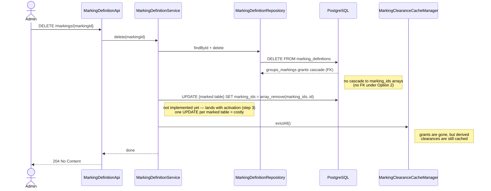
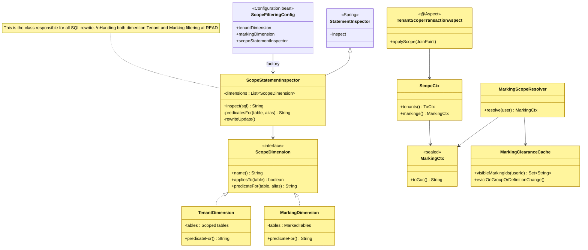
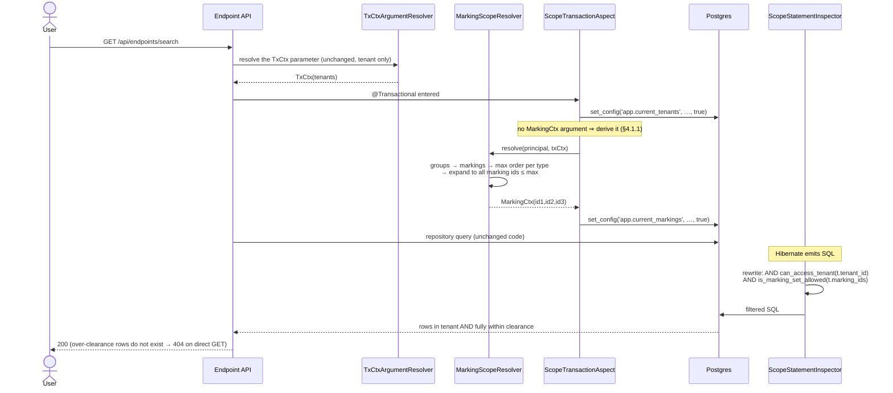

# Option C — Marking isolation "à la" tenant v2 

**Marking cardinality: many-to-many.** An entity carries **zero, one or many** markings
(STIX `object_marking_refs` semantics). This is the decision this document is built on, and it drives most
of the design below. *How* that set is stored physically is a separate, argued choice — see section 3.

---

## 1. Goal

Enforce marking-based visibility the **same way tenant isolation v2** is enforced today: **transparently**, at
the SQL level, driven by a per-transaction scope channel — so that onboarding a new table to marking is a
**configuration change plus one migration**, not a rewrite of every repository method or service layer.

Target developer experience:

```properties
# adding a table to marking isolation = 1 line + 1 migration
openaev.marking.active-tables=assets,asset_groups,secret_references
```

---

## 2. Why the tenant v2 mechanism is the right shape to reuse

The v2 tenant stack has exactly the four properties marking needs:
* **Transparent** for the developer: `TenantStatementInspector` rewrites the SQL Hibernate emits => ✅ identical need for marking
* **Fail-closed** when the GUC is unset: `can_access_tenant()` returns false => ✅ identical need for marking
* **Per-request**: `TxCtxArgumentResolver` → `TenantScopeResolver` → `TxCtx` → `set_config('app.current_tenants', …, true)` => ✅ same shape (groups → markings)
* **Incrementally activatable**: `openaev.tenant.active-tables` allowlist, inert until a table is onboarded => ✅ same need

### 2.1 The hard constraint that shapes the whole design

Hibernate accepts **exactly one** `AvailableSettings.STATEMENT_INSPECTOR`
(`TenantFilteringConfig#tenantStatementInspectorCustomizer` installs it with `putIfAbsent`).

>  ⚠️ ⚠️ **Marking cannot be a second, independent inspector.** It must be folded into the existing rewrite as a
> second *scope dimension*, or it will silently displace tenant isolation.

This is the single most important architectural consequence of choosing Option C.

### 2.2 The design trick that keeps it cheap: resolve ordinality in Java, not in SQL

The naive reading of Option C says: tenant is a *set-membership* check
(`row_tenant_id = ANY(app.current_tenants)`) while marking is an *ordinal* check
(`row_marking_order <= my_clearance`), so the generic mechanism must support two comparison styles.

> 💡💡 **It does not have to.** Ordinality is collapsed **in Java**, by `MarkingScopeResolver`: take the
> **highest order granted per type**, then expand it back into every id of that type at or below it. What
> reaches the database is a flat set of ids, so the SQL predicate stays a plain containment test —
> `app.current_markings = "id1,id2,id3"` where e.g. `id1: TLP:CLEAR, id2: TLP:GREEN, id3: CUSTOM1:GREEN`.

**What `<@` is for.** `<@` is Postgres's array operator for *"is contained by"*: `A <@ B` is true when **every**
element of `A` is also in `B`. The predicate `row.marking_ids <@ my_clearance` therefore reads *"is every
marking on this row inside my clearance?"*. With clearance `{green, amber}`:

| Row's `marking_ids` | `<@ {green,amber}` | Visible? | Why |
|---|---|---|---|
| `{}` (unmarked) | true | ✅ | the empty set is contained in everything — unmarked rows are visible for free |
| `{green}` | true | ✅ | held |
| `{green, amber}` | true | ✅ | both held |
| `{green, red}` | **false** | ❌ | `red` is not held — **one miss denies the whole row** |
| `{red}` | false | ❌ | not held |

That fourth row is the point: `<@` gives **AND semantics** for free — you need *all* of a row's markings, not
any of them. Using `&&` (overlap, "any") instead would make `{green, red}` visible to someone holding only
green: a leak. And with no clearance the right side is `{}`, so every marked row is denied while unmarked
rows still pass — fail-closed with no extra flag.

Three details the implementation adds to that sentence:

- **Per type, independently.** Types are separate scales: holding `TLP:RED` says nothing about `PAP`, and a
  type the caller was granted nothing on contributes nothing (it does not silently grant that type's lowest
  level).
- **Resolved per (user, tenant, bypass) and cached**, not recomputed on every request —
  `MarkingClearanceCacheManager` caches it with a 5-minute TTL. Eviction is therefore a **correctness**
  requirement: a stale clearance that is larger than current data fails **open**.
- **Bypass resolves to the whole tenant scale**, expanded into an explicit id list rather than a wildcard, so
  no wildcard ever enters the GUC channel on the HTTP path.

### 2.3 What many-to-many changes

Tenant isolation compares a **scalar**: `t.tenant_id` against a list. Marking compares a **set** against a
set. That single difference — not the choice of schema — is what drives the rest of the design:

```
tenant  :  row's tenant_id   ∈  my tenants          membership
marking :  row's marking set ⊆  my clearance set    containment
```

**Flattening (§2.2) does not make marking scalar.** It removes *ordinality* from the clearance side, not
*cardinality* from the row side: a row can still carry `{TLP:GREEN, PAP:AMBER}` — two markings from two
scales — so there is no single value to compare. Both sides stay sets, which is why the predicate is `<@`
(containment) and not `= ANY(...)` (membership). What flattening buys is that the SQL never has to know
about `order` or `type`.

## 3. Data model

### 3.1 Choosing the many-to-many shape — two options, one decision

Both options store the same thing (a set of markings per row). They differ only on **where** that set lives.

| | Shape | Read predicate |
|---|---|---|
| **Option 1** | one join table per marked table (`assets_markings`, …) | correlated anti-join |
| **Option 2** | `marking_ids text[]` column on the marked table | local `<@` containment test |

#### Option 1 — join table

```sql
assets_markings(asset_id, marking_id)                        PK (asset_id, marking_id)
asset_groups_markings(asset_group_id, marking_id)            PK (asset_group_id, marking_id)
secret_references_markings(secret_reference_id, marking_id)  PK (secret_reference_id, marking_id)
```

| ✅ Pros | ❌ Cons |
|---|---|
| Real FKs both sides → `ON DELETE CASCADE`, no orphans possible | One migration per marked table |
| Composite PK is exactly the anti-join access path (good plans) | Cannot mark tables whose PK is composite (relationships) |
| Plain JPA `@ManyToMany` + `@JoinTable` | Cross-entity queries need a `UNION` |

#### Option 2 — `marking_ids text[]` column *(chosen for the PoC)*

```sql
ALTER TABLE assets ADD COLUMN marking_ids text[];
CREATE INDEX assets_marking_ids_idx ON assets USING GIN (marking_ids);
```

```sql
-- the whole predicate, no join:
COALESCE(t.marking_ids, '{}') <@ COALESCE(string_to_array(current_setting('app.current_markings', true), ','), '{}')
```

`<@` is "is contained by", which **is** the AND semantics: *every* marking on the row must be in my
clearance. An unmarked row is `'{}'`, and `'{}' <@ anything` is true, so it stays visible for free; with no
clearance the right side is `'{}'` and any marked row is denied.

| ✅ Pros | ❌ Cons |
|---|---|
| No join at all — same cost class as the tenant check | No referential integrity: a garbage id is accepted, a deleted definition leaves a dangling id |
| Works on relationships unchanged (composite PK irrelevant) | `<@` is rarely served by GIN — must be measured, not assumed |
| Onboarding = `ADD COLUMN` + index; markings die with the row | No per-marking audit trail (array mutation rewrites the column) |
| Proven pattern here (`assets.asset_ips` is already `text[]`) | Only viable as the **sole** store; alongside join tables it would need trigger-syncing |

> **Do not "optimise" this into `NOT (marking_ids && :lacked)`.** The lacked set is *all markings minus
> mine*, so a definition created after the scope was resolved is absent from it and its rows become
> **visible** — fail-open. The `<@` held-set form fails closed. Take the correct form; the arrays are tiny.

#### Decision: **Option 2** for the PoC

Chosen because the read predicate is a local column test and it marks relationships unchanged. The price is
the lost FK, paid back with machinery the design already requires:

- **Insert side is free.** The §4.3 write guard already loads each marking definition to answer *"do you hold
  it?"*, so existence is verified as a by-product — a garbage id cannot pass the service layer.
- **Delete side is explicit.** See §3.2.

### 3.2 Deletion without a cascade

Option 2 has no FK, so nothing cascades. Three cases must be distinguished, and only one is a problem:

| What is deleted | What happens to the markings | Needs work? |
|---|---|---|
| A **marked row** (asset, asset group, secret reference) | the array dies with the row | ❌ nothing — simpler than Option 1 |
| A **marking removed from a row** (declassification) | the id is dropped from that row's array | ❌ nothing beyond the write guard — see below |
| A **marking definition** | `groups_markings` grants cascade, but `marking_ids` arrays keep the dead id | ✅ scrub + cache eviction |

**Removing a marking from an asset needs nothing extra**, and the reason is worth stating because it looks
like it should. The predicate is `is_marking_set_allowed(marking_ids)`: the row's array is a function
*argument*, re-read on every query, while only the *clearance* lives in the cached GUC. So
`AssetMarkingsService.updateAssetMarkings` deliberately does **not** evict the clearance cache — evicting on a
row write would be a no-op that *looks* like protection. Eviction belongs only where a **clearance shrinks**
(group membership, grant removal, definition delete, order lowered).

Two consequences fall out for free:
- **Self-lockout is impossible.** The write guard enforces `requested ⊆ your clearance`, and a row is visible
  iff `row_markings ⊆ clearance` — so you can always still read what you just marked.
- **Declassification is the only direction worth auditing.** Adding a marking narrows visibility; removing one
  widens it, so removals are logged (`logDeclassification`).

**Deleting a definition permanently hides data — this is a real bug, not untidiness.** Once the definition
row is gone, its id survives inside `marking_ids` arrays. The read predicate is pure set membership against
the GUC and never consults `marking_definitions`, so it cannot tell *"deleted"* from *"exists but you do not
hold it"* — both simply deny. And the deleted id can never re-enter anyone's clearance, because its grants
cascaded away with it. Result: **every row carrying that id becomes invisible to the entire platform,
permanently, with no error raised** — not even to an admin holding every marking that still exists.

```
clearance = m_green,m_warm
  m_green   (held)              -> allowed
  m_red     (exists, not held)  -> denied
  m_deleted (orphan)            -> denied     <- indistinguishable from m_red
```

#### What the PoC code does today

`MarkingDefinitionService.delete(id)` performs the hard delete and evicts every cached clearance. The
`marking_ids` scrub is **deliberately not there yet**: no table is marking-activated, so no array can hold
the id. The scrub lands with activation (step 3), generated from the same `MarkedTables` registry that drives
the inspector, so it cannot drift out of sync with the allowlist:

```java
for (MarkedTable t : markedTables.all())
  jdbc.update("UPDATE " + t.table() + " SET marking_ids = array_remove(marking_ids, ?)", markingId);
```

**And this is the cost Option 2 pays for losing the FK.** `ON DELETE CASCADE` would have touched only the
rows that actually reference the marking, via an index. The scrub instead issues one `UPDATE` **per marked
table**, and each one is a **full-table scan and rewrite** of every row it touches — the array is a plain
column, so Postgres has no cheap way to find "rows containing this id" unless the GIN index is used, and it
must still rewrite each matching row. Cost therefore grows with the *size of every marked table*, not with
the number of rows carrying the marking. On `assets` — the largest and most-joined of the three — that is a
noticeable write burst inside the delete transaction.

Three mitigations, in order of preference:

1. **Do not hard-delete**: archive the definition instead. This works because the row still exists, so
   the id in `marking_ids` is never dangling — but it only works under one **load-bearing condition**: the
   clearance resolver must keep seeing archived definitions. Clearance is computed from
   `marking_definitions` (the tenant scale) joined with `groups_markings` (the grants), so as long as the
   archived row and its grants survive, whoever held it still holds it and the marked rows stay readable.
   An archive that also strips the grants — or a resolver that filters on `archived = false` — reproduces
   the hard-delete bug exactly: the id becomes unholdable and the rows vanish platform-wide. Archiving
   changes the id from *unholdable* to *still holdable but no longer assignable*; that is the whole trick.
2. **Narrow the scan** with `WHERE marking_ids @> ARRAY[?]` so the GIN index can select candidate rows
   (`@>` is the containment direction GIN serves well), instead of rewriting blindly.
3. **Move it off the request** — run the scrub asynchronously if hard delete is ever shipped for large
   tenants, accepting a short window where the id is dangling.



The archive-rather-delete policy above is what avoids needing the scrub at all.

### 3.3 Concrete schema

```sql
-- Task 1 (prerequisite): marking definitions, tenant-scoped
marking_definitions(
  marking_id          varchar PK,
  marking_type        varchar   NOT NULL,   -- TLP, PAP, custom
  marking_definition  varchar   NOT NULL,   -- TLP:RED
  marking_order       int       NOT NULL,   -- 1..10, 10 = highest
  marking_color       varchar,
  tenant_id           varchar   NOT NULL REFERENCES tenants,
  UNIQUE (marking_definition, tenant_id)    -- composite, per multi-tenancy conventions
)

-- Task 2 (prerequisite): group clearance
groups_markings(
  group_id   varchar REFERENCES groups(group_id)                       ON DELETE CASCADE,
  marking_id varchar REFERENCES marking_definitions(marking_id)        ON DELETE CASCADE,
  PRIMARY KEY (group_id, marking_id)
)

-- Task 3 (this design): one marking-set column per marked entity table
ALTER TABLE assets              ADD COLUMN marking_ids text[];
ALTER TABLE asset_groups        ADD COLUMN marking_ids text[];
ALTER TABLE secret_references   ADD COLUMN marking_ids text[];

CREATE INDEX idx_assets_marking_ids ON assets USING GIN (marking_ids);
-- GIN serves "what is marked X?" (marking_ids @> ARRAY['X']).
-- The read predicate is `<@`, which GIN rarely serves; step 1.4 measures whether the index
-- is worth keeping on the read path or exists purely for admin/impact queries.
```

**Convention (load-bearing)**: the column is named `marking_ids`, type `text[]`, on the marked table itself.
Its *presence* is what lets `MarkingFilteringConfig` derive `MarkedTable` from `information_schema` instead
of a hand-maintained mapping — exactly how tenant tables are derived from `tenant_id`. `MarkedTable` therefore
needs **no PK column, no join table, no FK column**, which is why composite-PK tables and relationships work
unchanged.

**Tenant scoping**: `marking_ids` lives on the marked row, which is already tenant-scoped. There is no second
table to confine.

#### `groups_markings` is a clearance **grant**, not a marking attachment

| Relation | Question it answers | Role |
|---|---|---|
| `groups_markings(group_id, marking_id)` | *What can members of this group see?* | clearance **grant** — an input to authorization (Task 2) |
| `groups.marking_ids` | *Who is allowed to see this group?* | marking **attachment** — an output of authorization |

**`groups_markings` stays a join table under Option 2.** It is read by the Java resolver (groups → markings →
ordinal expansion, §2.2), never by the SQL predicate, so denormalising it buys nothing on the hot path; and as
authorization data it wants real FKs, keeping a genuine `ON DELETE CASCADE`.

Marking the `groups` table itself, if ever wanted, is just `ALTER TABLE groups ADD COLUMN marking_ids text[]`
— sitting **beside** `groups_markings`, not replacing it.


## 4. How to adjust Tenant API v2 to fit Marking

### 4.1 Class diagram



The `ScopeDimension` interface is the whole generalization: the inspector stops knowing *what* a tenant or
a marking is and only asks each dimension for a boolean SQL predicate on a table alias.

#### 4.1.1 What activating a table on marking requires — compared to tenant v2

Activating a table on tenant v2 costs the developer **two** things at every entry point: the method must be
`@Transactional`, **and** it must take a `TxCtx` parameter. Marking needs the first but **not** the second.

| | tenant v2 | marking |
|---|---|---|
| `@Transactional` on the entry point | ✅ required | ✅ **required** |
| a `Ctx` parameter on the REST method | ✅ required (`TxCtx`) | ❌ **not required** |

**Why `@Transactional` is still required.** The scope travels as a *transaction-local* Postgres setting
(`set_config(…, true)`). The aspect that writes it runs `@Before` a `@Transactional` method, i.e. *inside*
an already-open transaction. Outside a transaction there is nothing to attach the setting to, the GUC stays
unset, and every marked row is hidden — fail-closed, but silently. This is identical to tenant v2 and is not
negotiable.

**Why no `MarkingCtx` parameter is needed.** `TxCtx` is a parameter because a tenant scope is a *caller
choice* wheereas a **clearance is not a choice**. The practical consequence: **activating `assets` on marking changes no controller signature.**

#### 4.1.2 The two dimensions are independent, not layered

`ScopeStatementInspector` holds a `List<ScopeDimension>`. For each table it asks **every** dimension two
questions — *do you cover this table?* and if so *what is your predicate?* — and `AND`s whatever comes back.
No dimension knows the others exist.

So the two allowlists, `openaev.tenant.active-tables` and `openaev.marking.active-tables`, are genuinely
independent, and all four combinations are legal:

| tenant v2 | marking | Result |
|---|---|---|
| ✅ | ✅ | `can_access_tenant(t.tenant_id) AND is_marking_set_allowed(t.marking_ids)` |
| ✅ | ❌ | today's behaviour, unchanged |
| ❌ | ✅ | **marking alone** — the table keeps tenant v1 `@Filter`, or is not tenant-scoped at all |
| ❌ | ❌ | inert |


#### 4.1.3 Background jobs — worked example: `InjectsExecutionJob`

Take the question directly: Quartz fires `InjectsExecutionJob.execute()`, it picks up an inject whose target
is a **marked asset**. Does the job see that asset?

**There is no user, so there is no clearance to derive.**

**The answer: the job runs at system clearance, assigned by the primitive.** 
The job sees every asset of its tenant, exactly as it does today, and **activating `assets` is a no-op for it**.

> ⚠️ [OUT OF SCOPE of this POC] **But the job also writes.** It creates `InjectExpectation` rows against those
> marked assets, and those rows are later read by real users on the HTTP path. Seeing every asset obliges it
> to **re-apply the marking on the way out** — an expectation naming a `TLP:RED` endpoint must itself be
> `TLP:RED`, or the job has laundered the marking through a table nobody thought to activate. This
> generalises, and it is bigger than it looks: marking propagates transitively along every
> write the system makes on a marked row. Elasticsearch is the other instance — the ES sync legitimately indexes every
> marked row, so the **index** must carry `marking_ids` and the query side must filter on it. Same for
> anything that emails, exports or renders a digest.


### 4.2 Sequence — read path (transparent)


