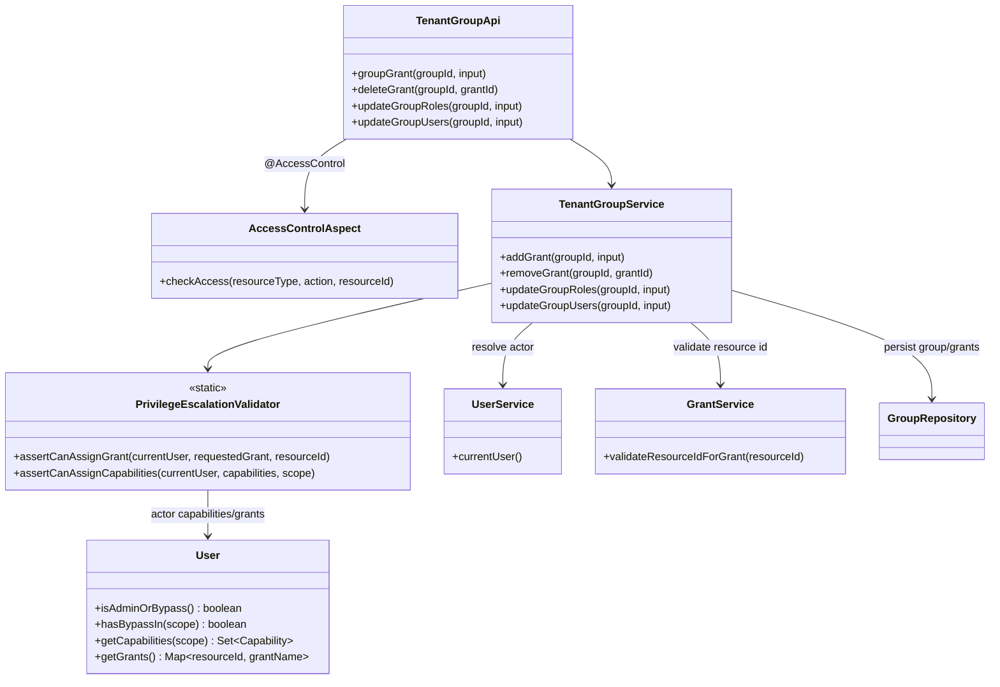
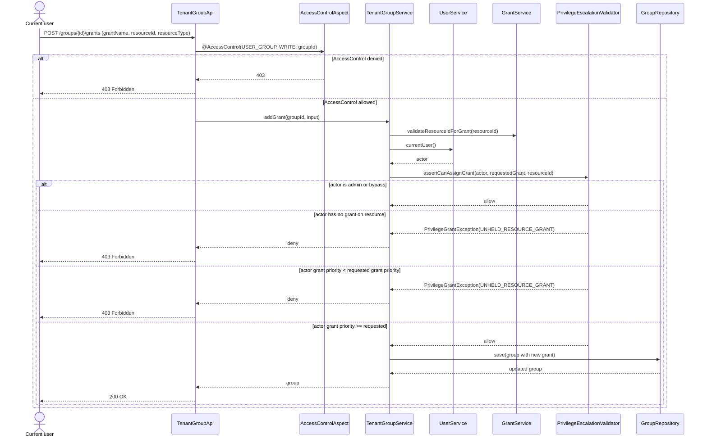
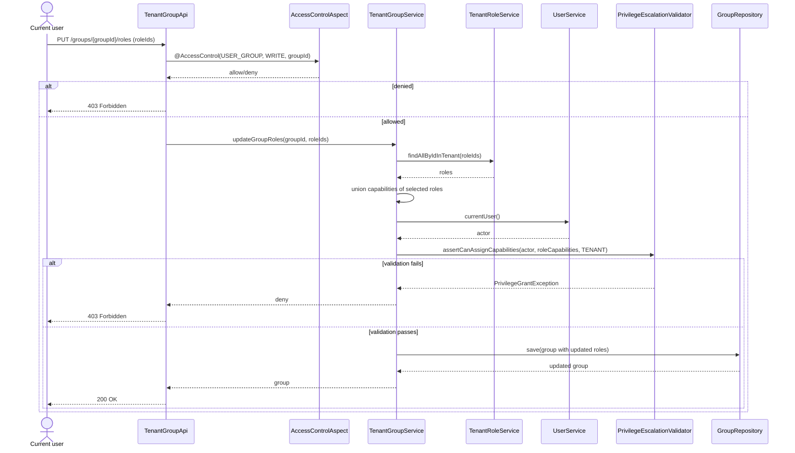
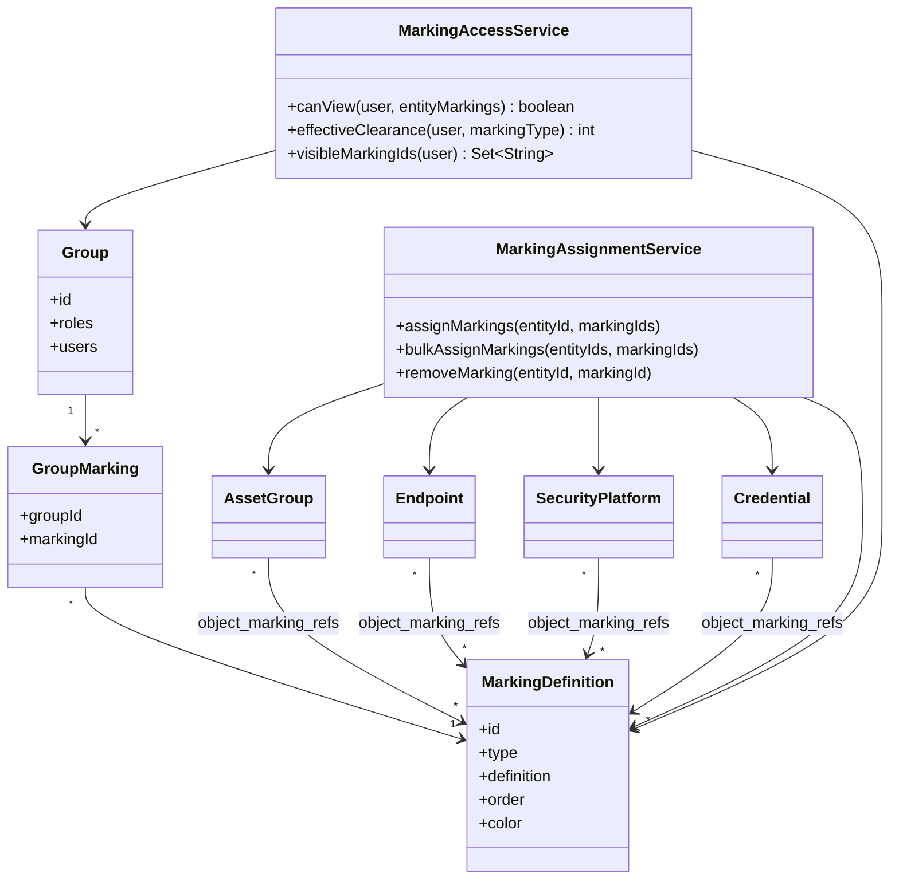
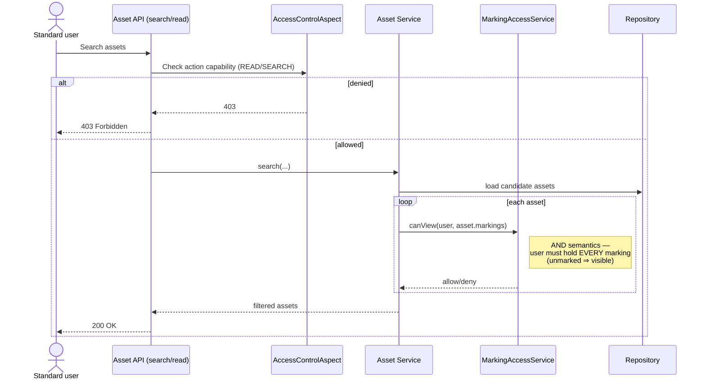

# Feature: [Feature Name]

**Issue**: #[number] (if applicable)
**Type**: Full Stack
**Estimation**: [S | M | L | XL]

---

## 📋 Context

### Problem to Solve
Capability:
OAEV has a way to grant access to resources using either Group/role/capabilitites. if a user is part of a group with an associated role that contain the capability to READ/WRITE/DELETE a resource, the user can perform those actions.
With the recent implementation of bypass and grant escalation prevention, a user can not grant access to a capability he has not access to.

Grant:
A user can access a scenario/simulation/atomic testing either through a specific grant, or globally if their group has the ASSESSMENT capability — and having the ASSESSMENT capability overrides individual grants (i.e., gives full access regardless of what grants are or aren't set).
How Grants Work in OpenAEV
Grants in OpenAEV are the fine-grained, resource-level permission layer that sits on top of the global RBAC (Roles → Capabilities). While Roles/Capabilities control what a user can do platform-wide (e.g., "can create scenarios"), Grants control access to specific individual resources (e.g., "this one simulation").
Grants are always managed at the group level — you don't grant access to an individual user directly, you grant it to a group, and members inherit it.

Problem: we need to specify each similation/scenario/atomic testing with a specific grant. We don't have a way to specify.
We want marking to allow a filtering of access from order 1 to 10 (10 being highest). If a resource type if flagged with marking TPL:READ (highest) if my user has a group which has access to TPL:READ level I can see it.
If a resource type if flagged with marking TPL:READ (highest) if my user has a group which has access to TPL:WARM (one level below) level I can't see it.

### Use Cases
[Who will use this feature and why?]

### Integration in Architecture
Atm Grant/Capability are implemented

## 🎯 Existing design
This section reverse-engineers the **current implementation** (which now uses
`PrivilegeEscalationValidator`) for grant/capability no-escalation checks.

### Authorization flow overview (current state)

1. `@AccessControl` in API validates operation-level permission (resource/action).
2. Service layer performs no-escalation checks via `PrivilegeEscalationValidator`:
   - `assertCanAssignCapabilities(...)` for role/group capability propagation.
   - `assertCanAssignGrant(...)` for group grant add/remove.
3. Persistence occurs only when both checks pass.

### Class diagram — grant & no-escalation validation path

### Sequence diagram — add grant (`POST /groups/{groupId}/grants`)

### Sequence diagram — add group capability (`PUT /groups/{groupId}/roles`)

## 🎯 Functional Specifications

### Expected Behavior

#### Happy Path
1. [Step 1]
2. [Step 2]
3. [Result]

#### Edge Cases
- **Case 1**: [Description] → [Expected behavior]
- **Case 2**: [Description] → [Expected behavior]

### User Interface (if applicable)

#### Wireframe / Mockup
[Link to design or textual description]

#### Navigation
- **Entry point**: [Where in the UI?]
- **URL**: `/admin/[path]`
- **Breadcrumb**: [Breadcrumb trail]

---

## ✅ Proposed answers (Marking design - revised scope)

### Feature metadata
- **Feature Name**: Marking-based Access Control for Assets
- **Type**: Full Stack
- **Estimation**: L
- **Issue**: N/A

### Scope (current epic)
- In scope: **Asset Group, Endpoint, Security Platform, Credential**.
- Out of scope for this epic: **Scenario, Simulation, Atomic Testing** (next epic).

### Use Cases
1. **Administrator with the right capability** manages group markings and group membership so users inherit effective marking access.
2. **User with the right capability** assigns/removes markings on Asset Group, Endpoint, Security Platform, and Credential.
3. **User with the right capability** assigns/updates/removes markings on assets via bulk edit.
4. **Standard user** can only view assets within their authorized marking scope.

### Integration in Architecture
- Keep **Capabilities/Roles/Groups** as-is for action authorization.
- Add a **Marking level** attribute on markable assets: Asset Group, Endpoint, Security Platform, Credential.
- Add **group-level marking clearance** for each marking domain (for example `TPL`), inherited by users through groups.
- Effective read access for those asset types becomes:
  - User has required capability for the asset type **and**
  - Asset marking level is `<=` user effective clearance for that domain.
- Marking is an additional visibility guard, layered on top of existing RBAC/capability checks.

### Existing design fit (RBAC + Capability/Role/Group)
- **RBAC remains the action layer**: "what user can do".
- **Grant/asset-access rules remain resource-scoping layer**: "which assets user may target".
- **Marking becomes sensitivity layer**: "which marked assets user can see".
- Final decision model:
  1. Capability check (action allowed?)
  2. Grant/global access check (asset in scope?)
  3. Marking clearance check (classification allowed?)
- A deny at any step denies access.

### Proposed implementation design

#### Class diagram (target architecture)

#### Sequence diagram (read visibility check)

### Implementation options (with pros/cons)

1. **Option A (Recommended): Service-layer marking filter with shared `MarkingAccessService`**
   - **How**: Keep repositories mostly unchanged; apply marking visibility in service methods for Asset Group, Endpoint, Security Platform, Credential. Reuse one shared resolver for effective clearance.
   - **Pros**: Fastest delivery for this epic, explicit logic, easy to test, low migration risk.
   - **Cons**: Requires discipline to call filter in every read path; potential duplication if not centralized.

2. **Option B: Repository-level filtering, explicitly wired per query**
   - Both sub-options require explicitly wiring marking clearance into every repository/query path
     that reads a marked asset type (e.g. adding a `findByMarkingClearance(...)`-style method, or
     joining marking + group membership manually in each Specification/query). Nothing enforces
     this automatically — it is on the developer to remember to add it to every new query.

   - **B1 — Explicit repository filtering (Specifications/queries join marking + group membership)**
     - **How**: Push visibility checks into DB queries so only authorized assets are returned (join marking + group membership at query time, computed fresh on every read).
     - **Pros**: Strong consistency when applied (harder to forget than a service-layer check once written), better performance on large result sets than filtering in-memory.
     - **Cons**: Higher implementation complexity, query maintenance cost, more tenant/scoping edge cases, must be duplicated across every repository method.

   - **B2 — Explicit repository filtering + precomputed/cached effective clearance**
     - **How**: Same explicit repository wiring as B1, but user effective marking clearance per domain is precomputed (cache/table) whenever group memberships/markings change, and reused by the repository queries instead of recomputing joins/subqueries every time.
     - **Pros**: Best runtime efficiency for heavy search traffic, simpler read-time query shape than B1.
     - **Cons**: Highest complexity of the explicit options, invalidation/sync risks for the cache, heavier rollout for the current epic.

3. **Option C: Reuse the tenant-filter transparent rewrite mechanism ("à la" `TenantStatementInspector` / `can_access_tenant`)**
   - **How**: Extend the existing statement-inspector rewrite (used today for `tenant_id` via `app.current_tenants` + `can_access_tenant(...)`) to also inject a marking predicate on marked tables, driven by a per-transaction session variable (`app.current_markings`) derived from the current user's effective group clearance. Because markings are many-to-many, the injected predicate is a correlated anti-join on the entity's markings join table.
   - **Pros**: Fully transparent to developers — no per-repository/query changes needed (unlike B1/B2), consistent with the existing tenant isolation pattern, hard to forget (fail-closed by design like tenant filtering), single enforcement point, onboarding a new table costs one migration + one property entry.
   - **Cons**: Higher upfront complexity (SQL rewrite logic, session variable management), couples marking enforcement to the Hibernate/JDBC layer, harder to reason about/debug than an explicit repository predicate, the M2M anti-join is heavier than tenant's single-column check, and it means modifying the sole enforcement point of multi-tenancy v2 (regression risk), heavier testing surface (matches `TenantStatementInspector`'s own complexity). Does **not** cover Elasticsearch-served reads.

#### Deep dive — generalizing the tenant mechanism for Option C

Today's tenant isolation (v2, statement-inspector based) is built from three cooperating pieces (all in `openaev-api`/`openaev-model`):

| Component | Current responsibility (tenant-only) |
|---|---|
| `TenantFilteringConfig` | Derives `TenantTables` from the DB schema (`tenant_id` column presence + nullability), installs `TenantStatementInspector` as Hibernate's `STATEMENT_INSPECTOR`. |
| `TenantTables` | Static registry of which tables are scoped and how (`STRICT` vs `DUAL`), keyed off a single column name (`tenant_id`). |
| `TenantStatementInspector` | Parses every SQL statement and rewrites FROM/JOIN/UPDATE/DELETE/INSERT so each scoped table gets `can_access_tenant(tenant_id, ...)` in its WHERE — this is what makes it *transparent* (no repository code needed). |
| `TenantScopeTransactionAspect` + `can_access_tenant()` (SQL function) | Writes the per-transaction scope (`app.current_tenants`, sourced from `TxCtx`, i.e. the current user's tenant memberships) into a Postgres session GUC that the SQL function reads. |

To generalize this for marking, each piece would become **scope-kind aware** instead of tenant-specific:

1. **`TenantTables` → `ScopedTables`**: keyed by a `ScopeKind` enum (`TENANT`, `MARKING`, ...), each kind carrying its own metadata — a column name (`tenant_id`) for the tenant kind, and per-table join metadata (PK column, `<table>_markings` join table, FK column) for the marking kind, since markings are many-to-many and are not a column on the filtered row. A table can be registered under multiple kinds at once (e.g. `asset_groups` is both tenant-scoped and marking-scoped) — the inspector would then AND both predicates instead of only one.

2. **`TenantStatementInspector` → generic `ScopeStatementInspector`**: same SQL-rewrite skeleton, but instead of hardcoding `can_access_tenant`, it asks each active scope dimension for a predicate on the table alias and ANDs them, e.g. `can_access_tenant(t.tenant_id) AND <marking predicate>`. Two differences make the marking dimension shaped differently from the tenant one: (a) marking clearance is *ordinal* while tenant scope is *set-membership*, and (b) marking is **many-to-many** (an entity carries zero, one or many markings via a join table), so the predicate cannot read a local column. Both are solvable — see [tech-design-option-c.md](./tech-design-option-c.md), which resolves ordinality in Java (expanding a clearance into a flat set of marking ids, restoring plain set-membership in SQL) and expresses the M2M check as a correlated anti-join.

3. **`can_access_tenant()` → add `is_marking_missing(row_marking_id)`**: a new Postgres function reading a new GUC (`app.current_markings`), fail-closed the same way as the tenant one. It is deliberately **negative** — true means "the caller does not hold this marking" — because markings live in a join table and visibility is decided by a `NOT EXISTS (...)` **anti-join**: "visible if there is no marking on this row that I do not hold". Naming it for the missing half keeps the generated SQL free of a double negative and stops it being mistaken for a row-level visibility test (the positive form leaks — see Option C §4.4). The shape also makes unmarked entities visible for free (Case 2), with no `allow_unmarked` flag needed.

4. **`TenantScopeTransactionAspect` → generalize `TxCtx`**: today `TxCtx` only carries tenant scope. It would need to also carry the current user's effective markings, so the aspect can `set_config('app.current_markings', ..., true)` alongside `app.current_tenants` in the same `@Before` advice — one shared "scope context" object instead of one purely tenant-shaped one.

**Why this is a bigger lift than it first looks**: the tenant mechanism was designed around one invariant (row belongs to exactly one tenant, checked by set membership on a local column). Marking is ordinal, per-type, and many-to-many, so the "generic" mechanism isn't a drop-in reuse — it's a *second, parallel scope dimension* bolted onto the same rewrite skeleton. It is architecturally sound (same fail-closed, transparent philosophy) but is realistically a multi-sprint investment (schema derivation, inspector rewrite logic, new SQL function, GUC/aspect changes, and a full regression pass on `TenantStatementInspector`'s existing test suite so generalizing it doesn't regress tenant isolation). **Detailed design, risks and PoC plan: [tech-design-option-c.md](./tech-design-option-c.md).**

### Making Options A / B generic and reusable as more entities are onboarded

Options A and B are opt-in by construction: enforcement happens where a developer *remembers* to call it.
They can still be made significantly more reusable — the goal is to reduce the per-entity cost from
"write a marking predicate for every query" to "declare the entity as markable", and to make the
remaining human step **impossible to forget silently**.

1. **A single `Markable` contract on the model side.** `interface Markable { Set<MarkingDefinition> getMarkings(); }`
   implemented by `Asset` (covers Endpoint + Security Platform), `AssetGroup`, `CredentialSecretReference`.
   Everything below keys off this interface instead of enumerating entity types.

2. **One shared predicate, not one per repository.** A single
   `MarkingSpecifications.visibleTo(user)` returning a reusable `Specification<T extends Markable>`.
   Because markings are **many-to-many**, the predicate is a "no marking I don't hold" check — in JPA
   Criteria a correlated `NOT EXISTS` subquery on the join, *not* a naive `join.get("id").in(clearedIds)`
   (which would silently give OR/union semantics and leak). Adding an entity adds **zero** new predicate code.

3. **Hook it into the pagination choke point.** Every paginated search endpoint funnels through
   `PaginationUtils.buildPaginationJPA(...)` / `buildPaginationCriteriaBuilder(...)`, which already
   composes `filterSpecifications.and(searchSpecifications)`. `.and(markingSpecification)` can be added
   there once, applied automatically to any `Markable` entity class. This makes **Option B transparent for
   the search/list paths**, which is the bulk of the read surface — the single highest-leverage change for
   reusability.

4. **A shared read guard for the non-paginated paths (Option A).** Single-entity `findById`, "related
   objects" lookups and export paths do not go through pagination. Cover them with one `@MarkingFiltered`
   AOP advice on service methods returning `Markable` (or `Collection<Markable>` / `Page<Markable>`) that
   post-filters generically via the interface — one aspect, N entities, no per-service code.

5. **A registry + a build-time guardrail.** A `MarkingActiveEntities` registry (the A/B analogue of
   `openaev.marking.active-tables`) plus an **ArchUnit rule** that fails the build when a repository method
   returning a registered `Markable` type is called from a service without a marking specification or
   `@MarkingFiltered`. This mirrors the existing tenant ArchUnit guardrails and is the *only* mechanism that
   makes A/B safe at scale.

6. **One write guard for all of them.** `MarkingEscalationValidator.assertCanAssignMarking(user, markingId)`,
   modeled on `PrivilegeEscalationValidator`, called from every write path regardless of entity type.

**The honest trade-off**: items 1–4 make A/B *centralized*, and item 3 makes the search paths effectively
transparent — but enforcement remains **opt-in per query**. A new native `@Query`, a new custom repository
method, or a new join added by someone unaware of marking will silently return over-clearance rows. Item 5
converts that from a silent leak into a build failure, which is as close to safe as A/B can get. Option C
is the only option where forgetting is *structurally impossible*, because the enforcement point is below
the code a developer writes.

### Proposed direction

- Start with **Option A** for the current epic scope (Asset Group, Endpoint, Security Platform, Credential),
  built from day one on the `Markable` + shared-specification + ArchUnit-guardrail skeleton above, so the
  work is not thrown away.
- Keep service API boundaries stable so we can evolve to **Option B (B1 then B2 if needed)** or **Option C**
  later without frontend contract changes.
- **Option C is the only option that stays cheap as more tables are onboarded** (one join table + one
  property entry per table). Its detailed design, risks and PoC plan are in
  [tech-design-option-c.md](./tech-design-option-c.md).

### Marking cardinality

Markings are **many-to-many**: an entity carries zero, one or many markings (STIX `object_marking_refs`),
stored in a per-entity join table (e.g. `assets_markings`). Visibility uses **AND semantics** — a user must
hold *every* marking on an entity to see it, so adding a marking can only ever reduce visibility.

### Expected Behavior

#### Happy Path
1. A user with the right capability adds or removes one or more markings on Asset Group, Endpoint, Security Platform, or Credential, either from the asset update form or via bulk edit. They may only assign markings they themselves hold.
2. Admin assigns marking clearance to a group (per marking type, e.g. TLP up to AMBER).
3. User in that group sees an asset only if, for every marking on that asset, the user's clearance in that marking's type is at or above it; assets carrying any higher marking are hidden.

#### Edge Cases
- **Case 1**: User belongs to multiple groups with different clearances → use highest effective clearance per marking type.
- **Case 2**: Asset has no marking configured → keep visible by default (as defined in Task 3) until stricter policy is introduced.
- **Case 3**: User has required asset capability but insufficient marking clearance → access denied (marking still applies).
- **Case 4**: User can access asset type globally, but clearance is below one of the asset's markings → access denied.
- **Case 5**: Unknown marking value → reject write with validation error; never silently fallback.
- **Case 6**: Asset carries markings of several types (e.g. TLP + PAP) → user must be cleared for **all** of them; a user with no clearance at all in one of those types is denied.
- **Case 7**: User tries to assign a marking above their own clearance → rejected (403), preventing self-lockout and view laundering.
- **Case 8**: User removes or lowers a marking they hold → allowed (requires the `Delete marking assignment` capability) but **audited**, since widening visibility leaves no trace in the data afterwards.
- **Case 9**: User has the asset write capability but not `Assign marking` → may edit the asset, but marking fields are hidden/rejected (Task 1/US1 AC3).

### User Interface

#### Wireframe / Mockup (textual)
- On each asset edit page (Asset Group / Endpoint / Security Platform / Credential), add a **Markings**
  multi-select (chips), one marking per type at most (e.g. one TLP + one PAP):
  - Only markings the current user holds are selectable (Case 7)
  - Empty = unmarked = visible to everyone
- Add **bulk edit markings** action in asset list views for users with the right capability:
  - Select multiple assets
  - Add, replace, or remove markings in a single operation
  - Warn that adding a marking can only reduce who can see the selected assets
- On group administration page, add **Marking Clearances** matrix:
  - Rows: marking types (TLP, PAP, custom)
  - Value: max allowed marking per type

#### Navigation
- **Entry point**: 
  - Asset marking: asset edit forms and asset list bulk edit action
  - Clearance config: Admin > Groups > Group detail > Marking
- **URL**:
  - `/admin/assets/groups/:id` (markings field)
  - `/admin/assets/endpoints/:id` (markings field)
  - `/admin/assets/security-platforms/:id` (markings field)
  - `/admin/assets/credentials/:id` (markings field)
  - `/admin/groups/:id/markings` (clearance management)
- **Breadcrumb**:
  - `Administration > Groups > {Group} > Marking`
  - `Assets > {Asset Type} > {Asset} > Edit`