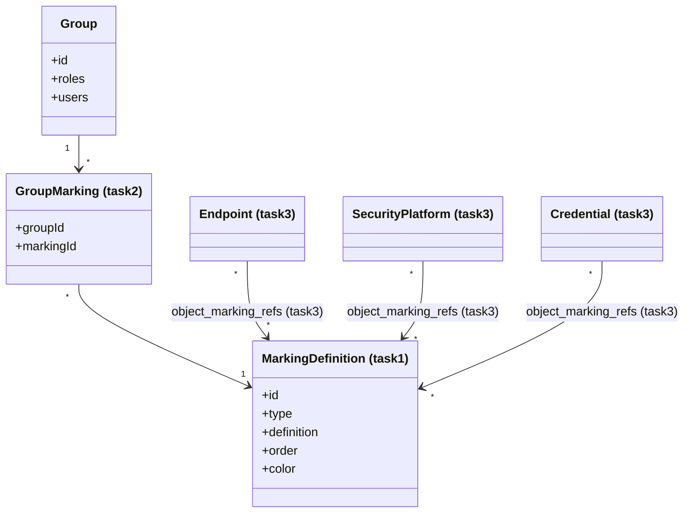
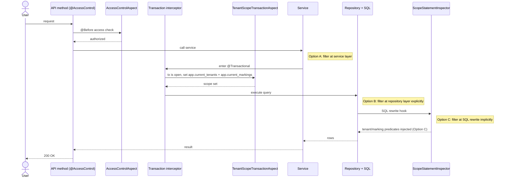

# Feature: Marking-based Access Control for Assets - Phase 1

**Issue**: #[number] (if applicable)
**Type**: Full Stack
**Estimation**: [S | M | L | XL]

---

## 📋 Context

### Problem to Solve
Capability:
OAEV has a way to grant access to resources using either Group/role/capabilitites. if a user is part of a group with an associated role that contain the capability to READ/WRITE/DELETE a resource, the user can perform those actions.
With the recent implementation of bypass and grant escalation prevention, a user can not grant access to a capability he has not access to.

Grant:
A user can access a scenario/simulation/atomic testing either through a specific grant, or globally if their group has the ASSESSMENT capability — and having the ASSESSMENT capability overrides individual grants (i.e., gives full access regardless of what grants are or aren't set).
How Grants Work in OpenAEV
Grants in OpenAEV are the fine-grained, resource-level permission layer that sits on top of the global RBAC (Roles → Capabilities). While Roles/Capabilities control what a user can do platform-wide (e.g., "can create scenarios"), Grants control access to specific individual resources (e.g., "this one simulation").
Grants are always managed at the group level — you don't grant access to an individual user directly, you grant it to a group, and members inherit it.

**Problem: access does not scale, because it has to be granted one resource at a time.**

Grants are per-resource. To let a team see thirty simulations, someone assigns thirty grants — and
assigns thirty more next month. The only alternative on offer is the `ASSESSMENT` capability, which
overrides grants entirely and gives access to *everything*. So the choice today is between
per-resource bookkeeping that nobody keeps up with, and all-or-nothing.

Neither expresses what people actually mean, which is rarely "this user may see resource #4471". It is
almost always **"this is sensitive, and only people cleared for that level should see it"** — a
property of the resource, not a list of who may open it.

**What we want: sensitivity as a label on the resource, and a clearance on the group.**

A resource carries a marking; a group is granted a clearance. A user sees a resource when their
clearance covers the marking it carries. Nobody maintains a list.

- Resource marked **TLP:RED**, my group is cleared **TLP:RED** → I see it.
- Resource marked **TLP:RED**, my group is cleared only **TLP:AMBER** (one level below) → I do not.

Markings are **ordered** (1 to 10, highest last), and a clearance **expands downward**: cleared for
TLP:RED means cleared for RED and everything beneath it, so the same user also sees TLP:AMBER
resources. Only the resource's own marking is ever compared against the clearance.

Two consequences worth stating up front, because the rest of this document depends on them:

- **Unmarked means visible.** Adding markings changes nothing until something is actually marked, so
  the feature ships without a backfill and is inert until first use.
- **A marking can only ever reduce visibility, never widen it.** Marking is a filter layered *on top
  of* RBAC — it never grants access that capabilities and grants have already denied.

## Design options

### Scope (current epic)
- In scope: **Asset (Endpoint, Security Platform), Credential**.
- Out of scope for this epic: **Asset Group**, and **Scenario, Simulation, Atomic Testing** (next epic).

### Use Cases
1. **Administrator with the right capability** manages group markings and group membership so users inherit effective marking access.
2. **User with the right capability** assigns/removes markings on Endpoint, Security Platform, and Credential.
3. **User with the right capability** assigns/updates/removes markings on assets via bulk edit.
4. **Standard user** can only view assets within their authorized marking scope.

### Integration in Architecture
- Keep **Capabilities/Roles/Groups** as-is for action authorization.
- Add a **Marking level** attribute on markable assets: Endpoint, Security Platform, Credential.
- Add **group-level marking clearance** for each marking domain (for example `TLP`), inherited by users through groups.
- Effective read access for those asset types becomes:
  - User has required capability for the asset type **and**
  - Asset marking level is `<=` user effective clearance for that domain.
- Marking is an additional visibility guard, layered on top of existing RBAC/capability checks.

### Existing design fit (RBAC + Capability/Role/Group)
- **RBAC remains the action layer**: "what user can do".
- **Grant/asset-access rules remain resource-scoping layer**: "which assets user may target".
- **Marking becomes sensitivity layer**: "which marked assets user can see".
- Final decision model:
  1. Capability check (action allowed?)
  2. Grant/global access check (asset in scope?)
  3. Marking clearance check (classification allowed?)
- A deny at any step denies access.

### 💡Changes in the Domain model

This is the data model the feature needs. It is the same whichever enforcement mechanism is chosen
below — what changes between the options is only **where the visibility check runs**, never what a
marking *is* or how a user comes to hold one.



Two invariants follow from this model alone, and every option below must satisfy them:

- A user's **clearance** is derived from their groups' markings, never assigned directly — the same
  rule already used for roles and grants.
- An entity carries **zero or more** markings (STIX `object_marking_refs`), so a user can view it only
  if the user's allowed markings include **all** markings attached to that entity; this is not a
  single-level comparison.

### 🔓 RBAC + different options for Marking filtering

RBAC is the first gate. Marking enforcement happens only after RBAC allows the call.



**AOP order to remember**
- `@AccessControl` (`AccessControlAspect`) runs at API method entry and can stop the call early with
  403 (no transaction or query work when denied).
- `@Transactional` opens the transaction around service/repository work.
- `TenantScopeTransactionAspect` then writes transaction-local scope (`set_config(..., true)`) inside
  that open transaction.
- `ScopeStatementInspector` applies when Hibernate emits SQL, so filtering is enforced at query time.

### Implementation options (with pros/cons)

1. **Option A — Service-layer marking filter with shared `MarkingAccessService`** — *evaluated, not chosen*
   - **How**: Keep repositories mostly unchanged; apply marking visibility in service methods for Endpoint, Security Platform, Credential. Reuse one shared resolver for effective clearance.
   - **Pros**: Fastest delivery for this epic, explicit logic, easy to test, low migration risk.
   - **Cons**: Requires discipline to call filter in every read path; potential duplication if not centralized.

   - **What it looks like**: one read-filter service (`MarkingAccessService`) plus one write-side
     marking CRUD service (`MarkingAssignmentService`), and a per-row check on the way out of the
     service layer.

     ```mermaid
     classDiagram
         class MarkingAccessService {
           +canView(user, entityMarkings) boolean
           +effectiveClearance(user, markingType) int
           +visibleMarkingIds(user) Set~String~
         }
         class MarkingAssignmentService {
           +assignMarkings(entityId, markingIds)
           +bulkAssignMarkings(entityIds, markingIds)
           +removeMarking(entityId, markingId)
         }
         MarkingAccessService --> Group
         MarkingAccessService --> MarkingDefinition
         MarkingAssignmentService --> MarkingDefinition
         MarkingAssignmentService --> Endpoint
         MarkingAssignmentService --> SecurityPlatform
         MarkingAssignmentService --> Credential
     ```

     `MarkingAssignmentService` here is write-side (assign/remove), equivalent in intent to Option
     C's `AssetMarkingsService`; it is not the read-filtering mechanism.

     Note what the service-side loop implies: the repository returns rows the user may not see, and correctness
     depends on the service remembering to filter them. It also breaks pagination — a page of 50
     rows can come back with 30 after filtering. Both are the core objection to this option.

2. **Option B — Repository-level filtering, explicitly wired per query** — *evaluated, not chosen*
   - Both sub-options require explicitly wiring marking clearance into every repository/query path
     that reads a marked asset type (e.g. adding a `findByMarkingClearance(...)`-style method, or
     joining marking + group membership manually in each Specification/query). Nothing enforces
     this automatically — it is on the developer to remember to add it to every new query.

   - **B1 — Explicit repository filtering (Specifications/queries join marking + group membership)**
     - **How**: Push visibility checks into DB queries so only authorized assets are returned (join marking + group membership at query time, computed fresh on every read).
     - **Pros**: Strong consistency when applied (harder to forget than a service-layer check once written), better performance on large result sets than filtering in-memory.
     - **Cons**: Higher implementation complexity, query maintenance cost, more tenant/scoping edge cases, must be duplicated across every repository method.

   - **B2 — Explicit repository filtering + precomputed/cached effective clearance**
     - **How**: Same explicit repository wiring as B1, but user effective marking clearance per domain is precomputed (cache/table) whenever group memberships/markings change, and reused by the repository queries instead of recomputing joins/subqueries every time.
     - **Pros**: Best runtime efficiency for heavy search traffic, simpler read-time query shape than B1.
     - **Cons**: Highest complexity of the explicit options, invalidation/sync risks for the cache, heavier rollout for the current epic.

   ```mermaid
   sequenceDiagram
      actor U as User
      participant API as API method (@AccessControl)
      participant RBAC as AccessControlAspect
      participant SVC as Service
      participant CLR as Clearance resolver/cache
      participant REPO as Repository query (explicit)
      participant DB as PostgreSQL

      U->>API: request
      API->>RBAC: @Before access check
      RBAC-->>API: authorized
      API->>SVC: call service
      SVC->>CLR: resolve effective markings
      CLR-->>SVC: allowed marking ids
      SVC->>REPO: search(criteria, allowedMarkings)
      Note right of REPO: Option B: filter at repository layer explicitly
      REPO->>DB: SQL with explicit marking predicate/join
      DB-->>REPO: already-filtered rows
      REPO-->>SVC: rows
      SVC-->>API: result
      API-->>U: 200 OK
   ```

   In Option B, correctness depends on every read path using a repository method that includes the
   marking predicate.

3. **Option C — Reuse the tenant-filter transparent rewrite mechanism ("à la" `TenantStatementInspector` / `can_access_tenant`)** — ✅ **chosen**
   - **How**: Extend the existing statement-inspector rewrite (used today for `tenant_id` via `app.current_tenants` + `can_access_tenant(...)`) to also inject a marking predicate on marked tables, driven by a per-transaction session variable (`app.current_markings`) derived from the current user's effective group clearance. Because markings are many-to-many, the injected predicate is a correlated anti-join on the entity's markings join table.
   - **Pros**: 
     - Fully transparent to developers — no per-repository/query changes needed (unlike B1/B2), 
     - consistent with the existing tenant isolation pattern, 
     - hard to forget (fail-closed by design like tenant filtering), 
     - single enforcement point, onboarding a new table costs one migration + one property entry.
   - **Cons**: 
     - Higher upfront complexity (SQL rewrite logic, session variable management), couples marking enforcement to the Hibernate/JDBC layer, 
     - harder to reason about/debug than an explicit repository predicate, 
     - modifying the sole enforcement point of multi-tenancy v2 (regression risk), heavier testing surface (matches `TenantStatementInspector`'s own complexity). Does **not** cover Elasticsearch-served reads.

   ```mermaid
   sequenceDiagram
       participant C as Client
       participant R as TxCtx resolver
       participant H as "@Transactional handler"
       participant A as TenantScopeTransactionAspect
       participant M as HttpMarkingScopeSupplier
       participant K as MarkingClearanceCacheManager
       participant DB as PostgreSQL
       C->>R: GET /api/tenants/t1/assets
       R->>H: TxCtx = [t1]
       H->>A: transaction opens
       A->>M: resolve caller effective markings
       M->>K: findClearance(user, t1)
       K-->>M: marking ids
       M-->>A: marking scope (ids)
       A->>DB: set_config('app.current_tenants', 't1', true)
       A->>DB: set_config('app.current_markings', 'm1,m2,...', true)
       H->>DB: queries (rewritten with tenant + marking predicates)
       DB-->>C: only rows in tenant scope and marking scope
   ```


### Making Options A / B generic and reusable as more entities are onboarded

Options A and B are opt-in by construction: enforcement happens where a developer *remembers* to call it.
They can still be made significantly more reusable — the goal is to reduce the per-entity cost from
"write a marking predicate for every query" to "declare the entity as markable", and to make the
remaining human step **impossible to forget silently**.

1. **A single `Markable` contract on the model side.** `interface Markable { Set<MarkingDefinition> getMarkings(); }`
   implemented by `Asset` (covers Endpoint + Security Platform) and `CredentialSecretReference`.
   Everything below keys off this interface instead of enumerating entity types.

2. **One shared predicate, not one per repository.** A single
   `MarkingSpecifications.visibleTo(user)` returning a reusable `Specification<T extends Markable>`.
   Because markings are **many-to-many**, the predicate is a "no marking I don't hold" check — in JPA
   Criteria a correlated `NOT EXISTS` subquery on the join, *not* a naive `join.get("id").in(clearedIds)`
   (which would silently give OR/union semantics and leak). Adding an entity adds **zero** new predicate code.

3. **Hook it into the pagination choke point.** Every paginated search endpoint funnels through
   `PaginationUtils.buildPaginationJPA(...)` / `buildPaginationCriteriaBuilder(...)`, which already
   composes `filterSpecifications.and(searchSpecifications)`. `.and(markingSpecification)` can be added
   there once, applied automatically to any `Markable` entity class. This makes **Option B transparent for
   the search/list paths**, which is the bulk of the read surface — the single highest-leverage change for
   reusability.

4. **A shared read guard for the non-paginated paths (Option A).** Single-entity `findById`, "related
   objects" lookups and export paths do not go through pagination. Cover them with one `@MarkingFiltered`
   AOP advice on service methods returning `Markable` (or `Collection<Markable>` / `Page<Markable>`) that
   post-filters generically via the interface — one aspect, N entities, no per-service code.

5. **A registry + a build-time guardrail.** A `MarkingActiveEntities` registry (the A/B analogue of
   `openaev.marking.active-tables`) plus an **ArchUnit rule** that fails the build when a repository method
   returning a registered `Markable` type is called from a service without a marking specification or
   `@MarkingFiltered`. This mirrors the existing tenant ArchUnit guardrails and is the *only* mechanism that
   makes A/B safe at scale.

6. **One write guard for all of them.** `MarkingEscalationValidator.assertCanAssignMarking(user, markingId)`,
   modeled on `PrivilegeEscalationValidator`, called from every write path regardless of entity type.

**The honest trade-off**: items 1–4 make A/B *centralized*, and item 3 makes the search paths effectively
transparent — but enforcement remains **opt-in per query**. A new native `@Query`, a new custom repository
method, or a new join added by someone unaware of marking will silently return over-clearance rows. Item 5
converts that from a silent leak into a build failure, which is as close to safe as A/B can get. Option C
is the only option where forgetting is *structurally impossible*, because the enforcement point is below
the code a developer writes.

### Direction — Option C

**Decided: Option C.** Recorded in [ADR-007](../../adr/ADR-007-Marking-based-access-control.md);
detailed design, risks and PoC plan in [tech-design-option-c.md](./tech-design-option-c.md).

The deciding argument is not cost, and it is not performance — it is that **A and B are opt-in by
construction**. In both, enforcement happens where a developer remembers to put it, so a new native
`@Query`, a new custom repository method, or a join added by someone who has never heard of markings
returns over-clearance rows and nothing complains. 

Section
[Making Options A / B generic](#making-options-a--b-generic-and-reusable-as-more-entities-are-onboarded)
sets out how far that can be mitigated: a `Markable` contract, one shared specification, a hook in
the pagination choke point, and an ArchUnit rule that turns a forgotten filter into a build failure.
That is genuinely close to safe — but it is still a list of things that must not be forgotten.

Option C is the only option where forgetting is **structurally impossible**, because the enforcement
point sits below the SQL a developer writes. That is the same reason multi-tenancy v2 works, and
marking is the second dimension on the same mechanism rather than a parallel invention.

What was accepted in exchange, honestly:

- **Slower to first delivery than Option A.** Accepted on the argument above.
- **Higher upfront complexity** — statement rewriting, a new SQL function, GUC and transaction-scope
  management — and it means touching the single enforcement point of multi-tenancy v2, so the
  existing tenant isolation suite has to stay green throughout.
- **Does not cover Elasticsearch-served reads.** Out of PoC scope
