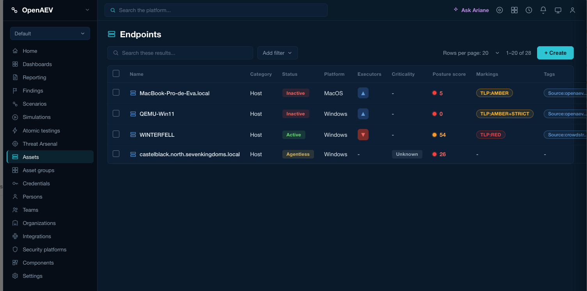
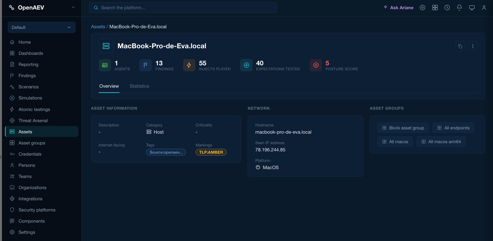

> # 🛑 THIS FILE IS NOT THE SOURCE OF TRUTH 🛑
>
> ## The source of truth for these user stories is **Notion**.
>
> **EPIC — Marking based access control:**
> <https://app.notion.com/p/2c58fce17f2a803081dcf80b5a591db9>
>
> | Task | Notion ID | Title |
> |---|---|---|
> | Task 1 | **590** | Create & Manage marking definitions |
> | Task 2 | **591** | Assign markings to users |
> | Task 3 | **592** | Assign markings to assets |
>
> ⚠️ **What this file actually is:** a point-in-time *export* of the above, kept in the repository
> so the technical design documents next to it can quote acceptance criteria without sending the
> reader to another tool. It is a convenience copy and nothing more.
>
> ⚠️ **It is already known to be stale.** Task 2 appears **twice** below (lines ~317 and ~523), and
> the two copies are **not identical** — the second carries an "⚠️ Important Flags" section the
> first lacks. That is the drift you get from a manual copy, and it is exactly why this banner
> exists.
>
> ⚠️ **Do not edit acceptance criteria here.** Edits made in this file are invisible to PM and
> stakeholders, will not be reviewed, and will be silently overwritten by the next export. **Change
> Notion, then re-export.**
>
> ✅ If a statement here disagrees with Notion, **Notion wins** — treat the difference as a bug in
> this file, not as a decision.

---

# Task 1 — Create & Manage

## Properties

- **Task ID:** 590
- **Status:** Business Refinement needed
- **Status 1:** Not started
- **Verticals:** #3 Easy-to-Use & consistent platform
- **EPIC:** https://app.notion.com/p/2c58fce17f2a803081dcf80b5a591db9
- **Sub-tasks:**
    - US1 — Assign "Manage Marking Definitions" Capability to a Role
    - US2 — Navigate to Marking Definition
    - US3 — Create a Marking Definition
    - US4 — Edit a Marking Definition
    - US5 — Delete a Marking Definition
    - US6 — Default TLP Markings are Pre-loaded on Platform Initialization ( nice to have )

## AI Summary

- 📌 Develop a marking-definition feature (TLP only) to let admins grant “Manage marking definitions” capability and users create, edit, or delete TLP markings.
- 🚀 Provide default TLP markings (CLEAR, GREEN, AMBER, AMBER+STRICT, RED) and integrate them into the RBAC system for future role, group, and asset assignments.

## Sub-task: US1 — Assign "Manage Marking Definitions" Capability to a Role

* Properties

- **Task ID:** 596
- **Status:** Business Refinement needed
- **Status 1:** Not started
- **Parent-task:** Task 1 — Create & Manage
- **Verticals:** #3 Easy-to-Use & consistent platform

* AI Summary

- 🎯 Assign “Manage marking definitions” and “Assign marking” capabilities to roles for independent access control.
- 🔧 Ensure capability cascades (Access → Manage/Assign → Delete) and respects Bypass overrides.

* User story

**As an** administrator,  
**I want** to assign the **"Manage marking definitions"** and/or **"Assign marking"** capabilities to a role,  
**So that** users with that role can access and manage marking definitions, and/or assign/remove markings on groups and assets, independently of each other.

* Acceptance criteria

- **AC1** — Given I am editing a role in Settings → Security → Roles, When I view the capability list, Then **"Marking"** appears as a new top-level capability group, containing two independently assignable chains — **"Marking definitions"** (Access → Manage → Delete) and **"Assign marking"** (Access → Assign → Delete) — neither nested under "Manage credentials" or any other existing category.

- **AC2** — Given I enable **"Manage marking definitions"** for a role and save, When a user assigned to that role refreshes their session (re-login or permission refresh), Then they gain access to the **Marking Definitions** entry under Settings → Security.

- **AC2b** — Given I enable **"Assign marking"** for a role and save, When a user refreshes their session, Then they can assign/remove markings on Groups and Assets (Manage Markings action becomes available), independently of whether "Manage marking definitions" is also granted.

- **AC3** — Given a user's role has neither "Manage marking definitions" nor "Assign marking" enabled, When they navigate to Settings → Security, Then the **Marking Definitions** entry is **hidden** from the menu (not merely disabled), and marking-assignment actions on Groups/Assets are hidden as well.

- **AC4** — Given a user's role has the **Bypass** capability enabled, When they navigate to Settings → Security or to a Group/Asset, Then they can access Marking Definitions and assign/remove markings regardless of whether "Manage marking definitions" or "Assign marking" is explicitly granted.

- **AC5** — Given each capability sits in a strict L1→L2→L3 chain (Access → Manage/Assign → Delete), When an admin enables **Manage marking definitions** or **Delete marking definitions**, Then **Access marking definitions** is automatically enabled as its parent — and symmetrically, enabling **Assign marking** or **Delete marking assignment** auto-enables **Access marking assignment**. *(Confirmed 2026-08-11: cascade behavior verified in the mock-up; both chains behave identically to existing capability categories.)*

## Sub-task: US2 — Navigate to Marking Definition

* Properties

- **Task ID:** 599
- **Status:** Business Refinement needed
- **Status 1:** Not started
- **Parent-task:** Task 1 — Create & Manage
- **Verticals:** #3 Easy-to-Use & consistent platform

* AI Summary

- 📌 Navigate to **Settings > Security > Marking Definitions** to manage all marking definitions in one place.
- ✅ Users with the “Manage marking definitions” capability see the list, can create, search, and filter markings; others receive an access-denied response.

* User story

> As a user with the "Manage marking definitions" capability, I want to navigate to Settings > Security > Marking Definitions so that I can manage all markings in one dedicated place.

* Acceptance criteria

- **AC1** — Given I am logged in as a user with the "Manage marking definitions" capability, When I navigate to Settings > Security, Then I see a "Marking Definitions" entry in the left navigation menu.
- **AC2** — Given I click on "Marking Definitions", When the page loads, Then I see a list of existing markings with columns: Type, Definition, Color, Order, Creation date.
- **AC3** — Given I am on the Marking Definitions page, When the page loads, Then a "Create Marking Definition" button is visible.
- **AC4** — Given I am logged in as a user without the "Manage marking definitions" capability, When I try to access Settings > Security > Marking Definitions, Then the page is not accessible or I see an access denied message.
- **AC5** — Given I am on the Marking Definitions page, When I use the search field, Then I can search existing marking definitions by Type, Definition, Color, Order, and Creation date.
- **AC6** — Given I am on the Marking Definitions page, When I apply filters, Then I can filter the list by Type, Definition, Color, Order, and Creation date.

## Sub-task: US3 — Create a Marking Definition

* Properties

- **Task ID:** 595
- **Status:** Business Refinement needed
- **Status 1:** Not started
- **Parent-task:** Task 1 — Create & Manage

* AI Summary

- 📌 Create a new marking definition via a modal with required fields (Type, Definition, Color, Order).
- ✅ Validate required inputs and save the marking, making it instantly visible in the list.

* User story

> As a user with the "Manage marking definitions" capability, I want to create a new marking definition so that I can classify assets and payloads with the appropriate sensitivity level.

* Acceptance criteria

- **AC1** — Given I am on the Marking Definitions page, When I click "Create Marking Definition", Then a creation modal opens with the following fields mirroring OpenCTI's model:
    - Type (required, e.g. TLP / PAP / custom)
    - Definition (required, e.g. TLP:RED)
    - Color (color picker, e.g. #cc0000)
    - Order (required numeric, e.g. TLP:CLEAR=1, TLP:GREEN=2, TLP:AMBER=3, TLP:RED=4)

- **AC2** — Given the creation modal is open, When I fill in Type, Definition, Color and Order and click "Create", Then the new marking is saved and immediately visible in the list.

- **AC3** — Given the creation modal is open, When I submit the form without filling in Type, Definition or Order, Then a validation error is shown on the missing required fields and the form cannot be submitted.

## Sub-task: US4 — Edit a Marking Definition

* Properties

- **Task ID:** 597
- **Status:** Business Refinement needed
- **Status 1:** Not started
- **Parent-task:** Task 1 — Create & Manage

* AI Summary

- ✏️ Edit existing marking definitions directly from the list (via the action menu).
- 📄 Pre-filled edit form with current values, allowing quick updates and immediate save reflection.

* User story

> As a user with the "Manage marking definitions" capability, I want to edit an existing marking definition so that I can update its details if needed.

* Acceptance criteria

- **AC1** — Given I am on the Marking Definitions page, When I click the action menu (⋮) on a marking row, Then I see an "Edit" option.
- **AC2** — Given I click "Edit" on a marking, When the edit form opens, Then all existing values are pre-filled.
- **AC3** — Given I update one or more fields and click "Save", When the save is confirmed, Then the changes are reflected immediately in the list.

## Sub-task: US5 — Delete a Marking Definition

* Properties

- **Task ID:** 598
- **Status:** Business Refinement needed
- **Status 1:** Not started
- **Parent-task:** Task 1 — Create & Manage

* AI Summary

- 🗂️ Delete unwanted marking definitions to keep the list clean.
- ✅ Confirm deletion and warn if the marking is in use.

* User story

> As a user with the "Manage marking definitions" capability, I want to delete a marking definition that is no longer relevant so that I can keep the list clean.

* Acceptance criteria

- **AC1** — Given I am on the Marking Definitions page, When I click the action menu (⋮) on a marking row, Then I see a "Delete" option.
- **AC2** — Given I click "Delete" on a marking, When the confirmation dialog appears, Then I must confirm before the deletion is executed.
- **AC3** — Given the marking is currently assigned to an asset, payload, or group, When I attempt to delete it, Then the system warns me that this marking is in use (block vs. warn — to be decided).

## Sub-task: US6 — Default TLP Markings are Pre-loaded on Platform Initialization ( nice to have )

* Properties

- **Task ID:** 628
- **Status:**
- **Status 1:** Not started
- **Parent-task:** Task 1 — Create & Manage

* AI Summary

- 📥 Auto-load the five standard TLP markings (CLEAR, GREEN, AMBER, AMBER+STRICT, RED) during platform initialization.
- 🛠️ Enables administrators and users to apply TLP classifications instantly without manual setup.

* User story

> As a platform administrator, I want the standard TLP marking definitions to be automatically available when the platform is initialized, so that users can immediately apply markings without requiring manual setup.

* Acceptance criteria

- **AC1 — Pre-loaded markings** — Given the platform has just been initialized, When I navigate to Settings > Marking Definitions, Then the following 5 TLP markings are already present and visible:

| Name | Type | Order |
|---|---|---:|
| TLP:CLEAR | TLP | 1 |
| TLP:GREEN | TLP | 2 |
| TLP:AMBER | TLP | 3 |
| TLP:AMBER+STRICT | TLP | 4 |
| TLP:RED | TLP | 5 |

# Task 2 — Assign Markings to users

## Properties

- **Task ID:** 591
- **Status:** Business Refinement needed
- **Status 1:** Not started
- **Verticals:** #3 Easy-to-Use & consistent platform
- **EPIC:** https://app.notion.com/p/2c58fce17f2a803081dcf80b5a591db9
- **Sub-tasks:**
    - US1 — View markings assigned to a group
    - US2 — Assign a marking to a group
    - US3 — Remove a marking from a group
    - US4 — Access control based on group marking .
    - US5 — Highest marking applies when user belongs to multiple groups

## AI Summary

- 📌 Assign marking definitions to groups in OpenAEV, letting users inherit the highest marking from their groups.
- 🛠️ Admins can view, add, edit, or remove group markings and manage group membership to control object access.

## User stories for task 2

- US1 — View markings assigned to a group
- US2 — Assign a marking to a group
- US3 — Remove a marking from a group
- US4 — Assigning to default group

## Sub-task: US0 — View markings assigned to a group
Finish Sub-task: US1 — Assign "Manage Marking Definitions" Capability to a Role
The “Assign marking” capabilities to roles for independent access control part was not completed in Task1, we need to have it to do task 2
> **NOTE: this part was descoped from Task1 original PR but need to be added in Task2**
## Sub-task: US1 — View markings assigned to a group

* Properties

- **Task ID:** 602
- **Status:** Business Refinement needed
- **Status 1:** Not started
- **Parent-task:** Task 2 — Assign Markings to users
- **Verticals:** #3 Easy-to-Use & consistent platform

* AI Summary

- 📋 View the list of markings assigned to a group on the group detail page.
- ✅ Shows each marking’s name and color; displays an empty state if no markings are assigned.

* User story

> *As a user with the right capability, I want to view the list of markings assigned to a group, so that I can understand what marking levels are accessible to members of that group.*

* Acceptance criteria

- **AC1** — Given I am on the group detail page, When I open a group, Then I see a "Markings" section listing all markings currently assigned to that group.
- **AC2** — Given no markings are assigned to the group, When I open the Markings section, Then I see an empty state.
- **AC3** — Given markings are assigned, When I view the Markings section, Then each marking is displayed with its name and color.

### Sub-task: US2 — Assign a marking to a group

* Properties

- **Task ID:** 601
- **Status:** Business Refinement needed
- **Status 1:** Not started
- **Parent-task:** Task 2 — Assign Markings to users
- **Verticals:** #3 Easy-to-Use & consistent platform

* AI Summary

- 📋 **User story:** Enable users with proper permissions to assign a marking to a group, allowing group members to access objects tagged with that marking.
- ✅ **Acceptance criteria:** Add a marking via a selector on the group detail page, ensure selected markings are saved, prevent already-assigned markings from appearing again, and display the new marking in the Markings list.

* User story

> *As a user with the right capability, I want to assign a marking to a group, so that members of that group can access objects with that marking.*

* Acceptance criteria

- **AC1** — Given I am on the group detail page, When I click to add a marking, Then a selector opens showing available markings.
- **AC2** — Given I select a marking from the list, When I confirm, Then the marking is added to the group.
- **AC3** — Given a marking is already assigned to the group, When I open the selector, Then that marking does not appear as an option.
- **AC4** — Given the assignment is saved, When I view the Markings section, Then the new marking appears in the list.

---

### Sub-task: US3 — Remove a marking from a group

* Properties

- **Task ID:** 604
- **Status:** Business Refinement needed
- **Status 1:** Not started
- **Parent-task:** Task 2 — Assign Markings to users
- **Verticals:** #3 Easy-to-Use & consistent platform

* AI Summary

- 📌 User story: Enable users with proper rights to remove a marking from a group, restricting marking levels for group members.
- ✅ Acceptance criteria: Show remove action per marking, confirm before deletion, and ensure the marking disappears after confirmation.

* User story

> *As a user with the right capability, I want to remove a marking from a group, so that I can restrict what marking levels are accessible to members of that group.*

* Acceptance criteria

- **AC1** — Given I am on the group detail page, When I view the Markings section, Then I see a remove action next to each assigned marking.
- **AC2** — Given I click remove on a marking, When the action is triggered, Then a confirmation is shown before deletion.
- **AC3** — Given I confirm the removal, When it is saved, Then the marking no longer appears in the group's Markings section.

### Sub-task: US4 - Assigning to default group

* AI summary
- 📌 Define default TLP assignments for groups (Admin → RED, Manager → AMBER, Observer → GREEN) to standardize access levels.
- ⚙️ Implement this feature in OpenAEV to ensure consistent platform security across default groups.

  | Group | Default TLP (Allowed Marking) | Why |
  | --- | --- | --- |
  | Admin | TLP:RED | Highest order , covers all levels below it |
  | Manager | TLP:AMBER | Operational visibility, excludes most restricted tier |
  | Observer | TLP:GREEN | Lowest-trust, broadly shareable content only |

# Task 3 — Assign Markings to users

Task 3 focuses on assigning marking definitions to <b>assets</b> in OpenAEV.

Once markings are set on assets:

- Only users whose group holds a marking of the same Type as the asset, at an Order equal to or higher than the asset's Order for that Type, can see it. A group with no marking of the asset's Type has no access to it, regardless of Order.
- Assets with <b>no marking</b> remain visible to everyone. <b>CONFIRM:</b> is this a final decision or still open? If open, move to Decisions Log as pending, not stated as settled behavior.

## User stories for task 3
### sub-task US1 — Assign a marking to an Asset

* User story

> <i>As a user with the right capability, I want to assign a marking to an asset , so that access to that asset is restricted to users with the matching marking.</i>

* Mockup

* Acceptance criteria

- AC1 — Given I am on the Asset detail page, When I click Update, Then I see a marking field where I can select a marking
- AC2 — Given I select a marking and save, When I view the Asset , Then the assigned marking is displayed
- AC3 — Given a marking is already assigned, When I click Update, Then I can change or remove the existing marking

### sub-task US2 — search or filter assets per marking

* User story

> <i>As a user, I want to see markings in the Assets list and be able to search and filter assets by marking, so that I can quickly find assets based on their assigned access classification.</i>

* Acceptance criteria

- AC1 — Given I am on the Assets list, When the list is displayed, Then I see a new <b>Marking</b> entry/column for each asset showing the marking assigned to that asset.
- AC2 — Given I am on the Assets list, When I use the filter options, Then I can filter assets based on their assigned marking.
- AC3 — Given I select one or more markings in the filter, When the filter is applied, Then the Assets list displays only assets matching the selected marking(s).
- AC4 — Given I am on the Assets list, When I use the search input with a marking name, Then assets with a matching assigned marking are returned in the results.
- AC5 — Given an asset has no marking assigned, When the Assets list is displayed or filtered, Then this asset is handled consistently with the existing “no value” behavior for list columns and filters.

### sub-task US3 — Bulk edit (must have)

* User story

> <i>As a user with the right capability, I want to filter and select multiple assets across asset types at once, so that I can assign or change a marking on all of them in a single bulk action instead of updating each asset individually.</i>

* Acceptance criteria

- AC1 — Given I am on an asset list view, when I apply filters (type, name, tag, existing marking, etc.), then the list updates to show only matching assets.
- AC2 — Given a filtered list is displayed, when I choose "select all," then <b>all assets matching the current filter are selected, including those beyond the currently loaded/visible page</b> — not just the rows rendered on screen. Individual row selection via checkboxes is also supported.
- AC3 — Given one or more assets are selected, when I choose "Assign marking" from a bulk action menu, then I can pick a single marking to apply to all selected assets at once, <b>regardless of asset type</b> — a single bulk action can span Asset Groups, Endpoints, and Security Platforms together in one operation.
- AC4 — Given I confirm the bulk marking assignment, when the action completes, then all selected assets are updated with the new marking and I see a confirmation summarizing how many assets were updated.
- AC5 — Given some selected assets fail to update (e.g. due to insufficient capability on a subset), when the bulk action completes, then I see which assets succeeded and which failed, rather than a silent partial failure.

### sub-task US4 — Access control based on group marking

* User story

> <i>As a user belonging to a single group, I want my access to groups, to be restricted to the markings assigned to my group, so that I only see what I am allowed to access.</i>

* Acceptance criteria

- AC1 — Given my group holds a marking of Type X at Order N, when access is evaluated on an object marked with Type X, then I can access it only if its Order is ≤ N.
- AC1b — Given my group holds no marking of Type Y at all, when access is evaluated on an object marked with Type Y, then I cannot access it, regardless of its Order value.

### sub-task US5 — Only users with the matching marking can see assets

* User story

> <i>As a user, I want to only see assets whose marking matches or is below my group's assigned marking, so that I cannot access assets I am not allowed to see.</i>

* Acceptance criteria

- AC1 — Given an asset has a marking of Type X at Order N, when I browse assets, then I only see it if my group holds a marking of Type X at Order ≥ N. If my group holds no marking of Type X, I cannot see the asset regardless of Order.
- AC2 — Given an asset has a marking I do not have access to, When I try to access it, Then access is denied
- AC3 — Given an asset has no marking assigned, When I browse assets, Then it is visible to all users

### sub-task US6 — Highest marking applies when user belongs to multiple groups

* User story

> <i>As a user belonging to multiple groups, I want my access level to reflect the highest marking across all my groups, so that I am not unnecessarily restricted.</i>

* Acceptance criteria

- AC1 — For each Type held by any of my groups, my effective Order for that Type is the highest Order among my groups holding that Type. I can access an object of Type X at Order N only if my effective Order for Type X is ≥ N. For any Type held by none of my groups, I have no access to objects of that Type.
- AC2 — Given I am removed from a group, When access is recalculated, Then my access reflects only my remaining groups' markings

### sub-task US8 — Markings are enforced as a first layer of access control

* User story

> <i>As a user, I want access to assets to be denied if I do not have the matching marking, regardless of my capabilities or grants, so that markings are always the first gate of access control.</i>

* Acceptance criteria

- AC1 — Given an asset has a marking assigned, When I do not have the matching marking, Then I cannot see or access it even if I have the relevant capability
- AC2 — Given an asset has a marking assigned, When I have the matching marking, Then my capabilities and grants determine what I can do with it
- AC3 — Given an asset has no marking assigned, When I access it, Then only my capabilities and grants apply
- AC4 — Given no marking is assigned to an asset, When I interact with it, Then my capabilities and grants behave exactly as before
- AC5 — Given a marking is assigned and I have the matching marking, When I interact with the asset, Then my capabilities and grants behave exactly as before
- AC6 — Given markings are introduced on the platform, When existing users access assets with no marking, Then no regression is observed on their permissions