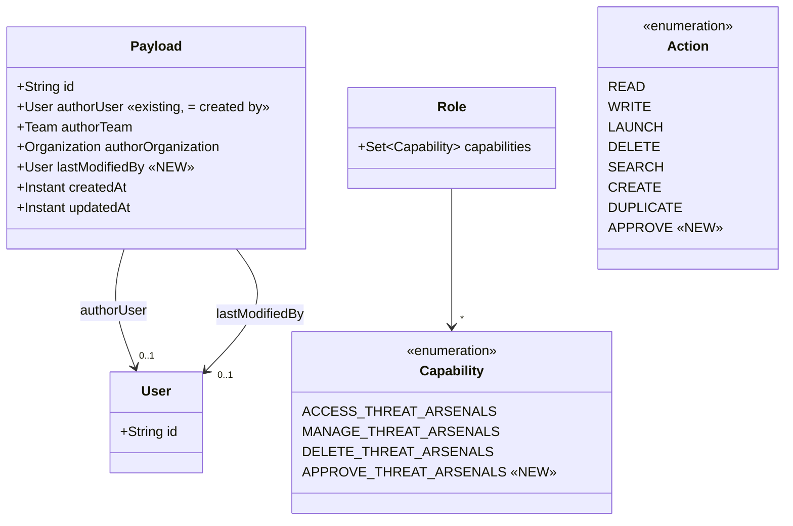
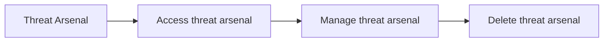
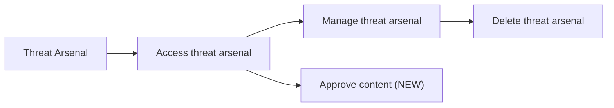

# Payload approval: Task 0 handoff (Notion PMF-774)

> Payload approval POC: design and delivery notes for Task 0 (issue #8350, PR #8353).

## References

| Item | Value |
|---|---|
| Issue | https://github.com/OpenAEV-Platform/openaev/issues/8350 |
| PR | https://github.com/OpenAEV-Platform/openaev/pull/8353 (**merged**, squash `8f284c15d` into `feature/approval-prototype`) |
| Final PR | https://github.com/OpenAEV-Platform/openaev/pull/8366 (**draft, not to be merged now**; `feature/approval-prototype` → `main`, labels `filigran team`, `vibe-coded`). Says "Closes #8350, closes #8354, closes #8356": the issue's Development sidebar now shows #8366 |
| Staging | https://feat-8366-approval-p.oaev.staging.filigran.io (deployed 2026-10-08 14:36 UTC, commit `f34533971`; redeployed on every new commit while the box is ticked) |
| Branch | `feature/approval-prototype-task0` (deleted on merge) |
| Parent branch | `feature/approval-prototype` (pushed, = `main` at `f1a2d2d3c`) |
| Commit | `62dd2e422288196336b3667556fa57a9f57905bc`, signed (SSH, ED25519), **Verified on GitHub** |
| Commit title | `feat(threat-arsenal): add the approve content capability and last modified by on payloads (#8350)` |

### Status

- [x] Issue created (#8350)
- [x] Commit created and signed locally
- [x] Push `feature/approval-prototype-task0` (commit Verified on GitHub)
- [x] PR into `feature/approval-prototype`: #8353 "POC — Relates to #8350" (opened as draft, now ready for review)
- [x] Merged (squash) into `feature/approval-prototype` as `8f284c15d` (2026-10-08), after an initial merge failure (only squash merges are allowed on the repository)

## Test results (branch rebased on `feature/approval-prototype`)

| Suite | Result |
|---|---|
| Backend: new and related tests (`ThreatArsenalLastModifiedByTest`, `CapabilityTreeBuilderTest`, `TenantRoleApiTest`, `PlatformRoleApiTest`, `ThreatArsenalApi*Test`, `ThreatArsenalMapperTest`, `PayloadApi*Test`, `PayloadCollectorTypeScopeTest`, `PayloadServiceTenantAttributionTest`, `PermissionServiceTest`, `InjectorContractAuthorshipTest`, `ImportBundleAttributionTest`, `ExecutableInjectServiceTest`, all `io.openaev.architecture` tests) | **396 run, 0 failures, 0 errors, 3 skipped** (the 3 skipped are already disabled on `main`, in `PayloadApiTest`) |
| Frontend type check (`yarn check-ts`) | pass |
| Frontend lint (changed files, `--max-warnings 0`) | pass |
| Frontend unit tests (Threat Arsenal, settings, `useCapabilities`) | **41 passed** (5 files) |
| i18n checker | pass |

## Mapping to the Notion user stories

| User story | Status | What was built |
|---|---|---|
| **US0.1** Approve Content capability | Done | New tenant capability *Approve content* (`APPROVE_THREAT_ARSENALS`, new `Action.APPROVE`) under *Threat Arsenal → Access threat arsenal*, sibling of *Manage*. Assignable in the role capability matrix. Not enforced yet (Task 1). |
| **US0.2** Track creator / last editor | Done | "Created by" = the existing payload author. New `payload_last_modified_by`: set on create, update, duplicate and import, null for collector and system writes. Shown as "Last modified by" in the action drawer and exposed in the API. |
| **US0.3** Migration of existing roles | Done, by decision | **No existing role receives the capability.** Holders of *Bypass* have it implicitly. Approvers are assigned on purpose. |
| **US0.4** Enable / disable approval | Not built (placeholder) | No platform-wide switch in this POC. To be designed with Task 1 / Task 2 if needed. |

## Decisions and rules

1. *Approve content* is a **content decision** ("is this payload trusted to exist and be used?"), separate from *Launch assessment*, which covers **execution decisions** (launching, or approving the launch of an IOC validation).
2. Child of *Access threat arsenal*, sibling of *Manage threat arsenal*: an approver does not need to be an author. Ticking it auto-ticks *Access*.
3. Tenant scope only: it never appears on platform roles.
4. Not behind a preview feature flag (it was considered, not built).
5. "Created by" reuses the author rather than adding a second column with the same meaning.
6. "Last modified by" is never exported (environment-local, like the author). Existing payloads start empty ("unknown"), no backfill.
7. Collector upserts and system writes are not attributed to a user (null).
8. Customer requirement wording in public artifacts: "customer maker-checker requirement" (no customer name).

## Files changed (31)

**Backend**
- `openaev-model/src/main/java/io/openaev/database/model/Action.java`: `APPROVE`
- `openaev-model/src/main/java/io/openaev/database/model/Capability.java`: `APPROVE_THREAT_ARSENALS`
- `openaev-model/src/main/java/io/openaev/database/model/Payload.java`: `lastModifiedBy`
- `openaev-api/src/main/java/io/openaev/rest/payload/service/PayloadCreationService.java`, `PayloadUpdateService.java`, `PayloadUpsertService.java`, `PayloadService.java`: stamp `lastModifiedBy`
- `openaev-api/src/main/java/io/openaev/api/payload/PayloadImportService.java`, `service/threat_arsenal/ThreatArsenalImportService.java`: stamp the importer
- `openaev-api/src/main/java/io/openaev/api/threat_arsenal/dto/ThreatArsenalActionFullOutput.java`, `utils/mapper/ThreatArsenalMapper.java`: `action_last_modified_by(_name)`
- `openaev-api/src/main/java/io/openaev/rest/payload/output/PayloadOutput.java`, `utils/mapper/PayloadMapper.java`: `payload_last_modified_by`

**Frontend**
- `openaev-front/src/utils/permissions/types.ts`: `ACTIONS.APPROVE`
- `openaev-front/src/admin/components/threat_arsenal/ThreatArsenalActionOverview.tsx`, `ThreatArsenalInformationDrawer.tsx`: "Last modified by"
- `openaev-front/src/utils/api-types.d.ts`: generated types (only this change's lines)
- `openaev-front/src/utils/lang/{de,en,es,fr,it,ja,ko,ru,zh}.json`: 2 labels

**Migration**
- `openaev-api/src/main/java/io/openaev/migration/V6_20261007120000000__Add_payload_last_modified_by.java`

**Tests**
- `openaev-api/src/test/java/io/openaev/api/threat_arsenal/ThreatArsenalLastModifiedByTest.java` (new, 5 cases)
- `openaev-api/src/test/java/io/openaev/api/capabilities/CapabilityTreeBuilderTest.java` (+1 case)
- `openaev-api/src/test/java/io/openaev/rest/role/TenantRoleApiTest.java` (+1 case)

**Docs**
- `docs/docs/administration/users-and-rbac.md`: "Approve content" row

## Diagrams (Mermaid sources)

**Class diagram**

**Capability tree: before**

**Capability tree: after**

## How to test

1. Run this branch (or a later one, or the staging environment) with a database you can reset, and log in as an administrator.
2. **Capability:**5. **Capability:** log in as admin, open *Settings → Security → Roles → This tenant*, open a role, then the *Capabilities* tab. *Threat Arsenal → Access threat arsenal → Approve content* is listed. Tick it: *Access threat arsenal* is ticked too. Save, then reopen: it is kept. A platform role does not offer it. Hard-reload if the old tree shows: `/api/capabilities` is cached for one day.
3. **Last modified by:** create a role with *Access + Manage threat arsenal*, a group with that role, and a second user in it. As admin, create a command action: in its drawer, *Author* and *Last modified by* show admin. As the second user, edit the action: *Last modified by* changes, *Author* does not. Duplicate it as the second user: the copy shows the second user.
4. **API:** `GET /api/threat_arsenals/{id}` returns `action_last_modified_by` and `action_last_modified_by_name`. The export (`/{id}/export`) does not contain `payload_last_modified_by`.
