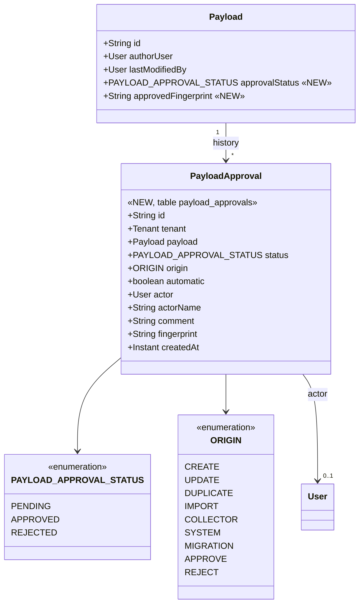
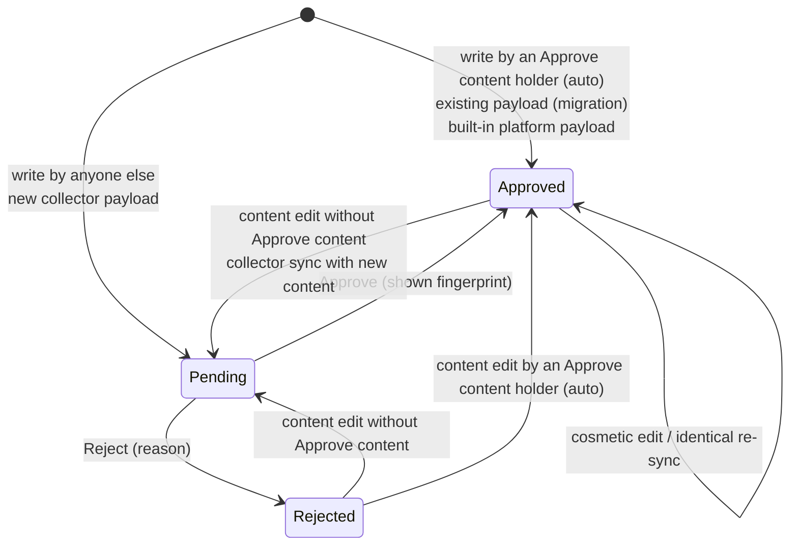
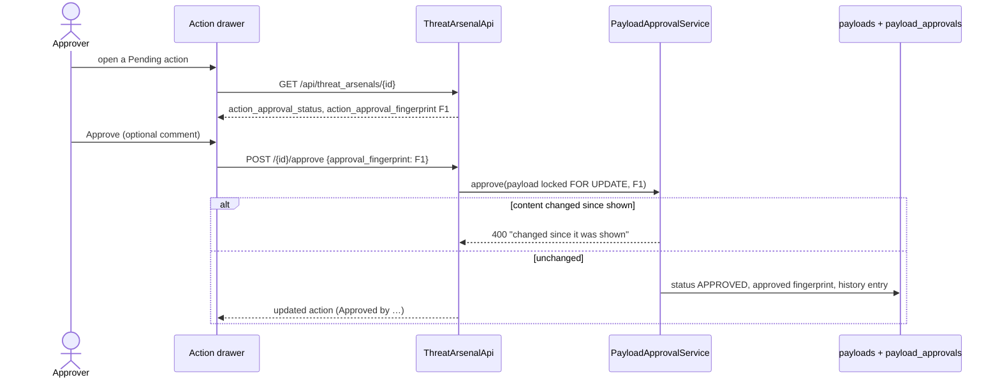

# Payload approval: Task 1 handoff (Notion PMF-788)

> Payload approval POC: design and delivery notes for Task 1 (issue #8354, PR #8355). Sources: `PR-PLAN.md`, `BRIEF.md`.

## References

| Item | Value |
|---|---|
| Issue | https://github.com/OpenAEV-Platform/openaev/issues/8354 |
| PR | https://github.com/OpenAEV-Platform/openaev/pull/8355 (**merged**, squash `f34533971` into `feature/approval-prototype`, after the conflict fix `95e7bde2d`; carries Task 2 too) |
| Final PR | https://github.com/OpenAEV-Platform/openaev/pull/8366 (**draft, not to be merged now**; `feature/approval-prototype` → `main`, labels `filigran team`, `vibe-coded`). Says "Closes #8350, closes #8354, closes #8356": the issue's Development sidebar now shows #8366 |
| Staging | https://feat-8366-approval-p.oaev.staging.filigran.io (deployed 2026-10-08 14:36 UTC, commit `f34533971`; redeployed on every new commit while the box is ticked) |
| Branch | `feature/approval-prototype-task1` (deleted on merge) |
| Commit | `392f865e80779fe6f6701c6fe3b5dd8931af8fc5` `feat(threat-arsenal): approve or reject payloads with an approval status and history (#8354)`, signed, **Verified on GitHub** |
| Depends on | Task 0: issue #8350, PR #8353 (merge into `feature/approval-prototype` blocked by a GitHub 500, see `PR-PLAN.md` status log) |

### Status

- [x] Built locally (backend, migration, UI, docs)
- [x] Backend and frontend tests green (see below)
- [x] Issue draft written
- [x] PO browser test (local instance on its own database)
- [x] Issue created (#8354)
- [x] Commit (signed, Verified), push `feature/approval-prototype-task1`
- [x] Draft PR #8355 into `feature/approval-prototype-task0`
- [x] Retargeted to `feature/approval-prototype` and merged (squash) as `f34533971` (2026-10-08)

## Test results (local, before commit)

| Suite | Result |
|---|---|
| Backend: new `PayloadFingerprintTest` (19), `PayloadApprovalServiceTest` (15), `ThreatArsenalApprovalApiTest` (10), plus all Task 0 tests and the related suites (`ThreatArsenalApi*Test`, `ThreatArsenalMapperTest`, `PayloadApi*Test`, `PayloadCollectorTypeScopeTest`, `PayloadServiceTenantAttributionTest`, `PermissionServiceTest`, `TenantRoleApiTest`, `PlatformRoleApiTest`, `InjectorContract*Test`, `ImportBundleAttributionTest`, `ExecutableInjectServiceTest`, `AuditLogger*Test`, `AccessControlAuditLogAspect*Test`, `TenantFilteringConfigTest`, all `io.openaev.architecture` tests) | **554 run, 0 failures, 0 errors, 3 skipped** (the 3 skipped are already disabled on `main`) |
| Frontend type check (`yarn check-ts`) | pass |
| Frontend lint (changed files, `--max-warnings 0`) | pass |
| Frontend unit tests (Threat Arsenal incl. new `ThreatArsenalApprovalSection.test.tsx`, settings, permissions, `useCapabilities`) | **46 passed** (6 files) |
| i18n checker | pass |

## Mapping to the Notion user stories

| User story | Mockup | Status | What was built |
|---|---|---|---|
| **US1.1** Payload approval status | `option2-us1.1-payload-approval-status.html` | Done | Status `Pending` / `Approved` / `Rejected` on every payload, computed server-side on every write. Status chip and *Approval* section in the action drawer (latest decision, comment / reason, history). Existing payloads **Approved** by the migration. |
| **US1.2** Approve / reject a payload | `option2-us1.2-approve-reject-payload.html` | Done | *Approve* (optional comment) and *Reject* (reason required) in the drawer, guarded by *Approve content*. Disabled with "Permission required" for others. Approval bound to the content fingerprint the approver saw. Approval history and audit log. |
| **US1.3** (PMF-791) Approval column + filter in the payload list | `option2-us1.3-payload-list-approval-filter.html` | Done | AC1: *Approval* column (status chip) in the Threat Arsenal list view. AC2: filter by one or more statuses, both in the *Approval* sidebar facet (Pending / Approved / Rejected with live counts) and in the toolbar **Add filter → Approval** menu (chip "Approval = …", multi-value). Payload-less built-in actions show "-". |

## Rules and decisions

**Rules** (BRIEF.md rules 1–8, decisions log, issue draft):

1. **Create, edit, duplicate or file import** by a user holding *Approve content* → **Approved** (auto-approved). The history records it as an automatic approval with the author as approver, for auditability.
2. The same writes by a user without *Approve content* → **Pending**, including when the payload was Approved or Rejected (rule 8).
3. Only a change of the **executable content** counts: command, executor, arguments, prerequisites, cleanup, platforms, architecture, elevation, files, DNS hostname, network-traffic fields, AI attack fields. Editing the name, description, tags, attack patterns or domains keeps the status.
4. **Collector** payloads are **Pending** when new or when their content changed (decided 2026-10-07). An identical re-sync keeps the status (no churn). **Confirmed (2026-10-08)**: they stay Pending. Collectors import scripts written by third parties, which is what maker-checker must review; the principle below only covers content the platform generates itself. Trusting specific collectors is a possible later improvement.

**PO principle (2026-10-08)**: only **human-generated** content goes to Pending. **System-generated** content is **Approved**, recorded with origin **SYSTEM** in the approval history, unless a human later edits its executable content (then the normal rules apply).
5. **Built-in platform payloads** (the dynamic DNS resolution template) are **Approved**. The file-drop payload built from an external security-coverage document is **Pending** (external content).
6. Only a **Pending** payload can be approved or rejected, only by *Approve content* holders (admins and tenant *Bypass* included). Per-action grants (Access / Manage+Delete) never allow approval: grants control who can **use** an action, approval controls whether its content is **trusted**.
7. A **Rejected** payload stays rejected until it is edited (then Pending) and approved (rule 3).
8. The approval is bound to a **fingerprint of the content the approver saw**: if the payload changed meanwhile, the approval is refused and the new content must be reviewed. SHA-256 of the executable content only; a guard test fails when a new payload field is not classified as executable or cosmetic (fail-closed).
9. Approve / reject decisions are written to the **audit log**.
10. The approval status and history are **never exported**: an imported payload is approved in its target environment.
11. Enforcement is **server-side**: UI and API apply the same rules (rule 5). **Nothing is blocked yet**: blocking is Task 2.

**Decisions:**

- Reject reason: **mandatory** (variant B, mockup US1.2), max 2000 characters.
- Approval history table is payload-specific (`payload_approvals`), a generic approvals table is deferred until scenario approval exists.
- The fingerprint to approve comes back on the normal action read (`action_approval_fingerprint`); no separate preview endpoint.
- Difference from `PR-PLAN.md`: the runtime migration that would backfill the fingerprint of existing payloads is **not built**. Existing payloads are Approved without a stored fingerprint; Task 2's "changed after approval" check has to handle that.
- Customer requirement wording in public artifacts: "customer maker-checker requirement" (no customer name).

## Open questions (with recommendation)

| # | Question | Recommendation |
|---|---|---|
| Q-A | Do cosmetic edits (name, description, tags, attack patterns, domains) by a non-approver keep the payload Approved? | **Yes** (built this way): only the executable content counts. |
| ~~T1-1~~ | The security-coverage file drop starts **Pending**. Keep it, or treat it as system-generated (Approved)? | **Decided 2026-10-08 (PO principle)**: system-generated → **Approved**, recorded with origin **SYSTEM**; a later human edit of its content follows the normal rules. Today: `PayloadService.createFileDropPayload` calls `onWrite(…, ORIGIN.IMPORT, null)` → Pending. **Delivered in Task 4 (#8378, US4.1)**. |
| BRIEF | Does payload-level approval satisfy the customer maker-checker requirement? What gap remains (exercise composition is not reviewed)? | Answer with the customer after Task 2; the composition gap is the main open point. |

### Delivered in Task 4 (2026-10-08)

T1-1 is delivered in **Task 4** ([#8378](https://github.com/OpenAEV-Platform/openaev/issues/8378), user story **US4.1**), not as a follow-up PR on #8354 (delivery changed by the PO). The security-coverage file drop is created as **Approved** with origin **SYSTEM**. Existing pending file drops that no human ever wrote are approved as SYSTEM when the coverage reuses them. See `NOTION-task4.md`.

## Diagrams (Mermaid sources)

**Impacted entities**

**Approval status**

**Approve with the shown fingerprint**

## Endpoints

| Method | Endpoint | Capability | Request → response |
|---|---|---|---|
| POST | `/api/threat_arsenals/{actionId}/approve` (+ tenant prefix) | *Approve content* (`APPROVE` on `THREAT_ARSENAL`) | `{approval_fingerprint*, approval_comment?}` → action. 400 if not Pending, payload-less, or content changed since shown. |
| POST | `/api/threat_arsenals/{actionId}/reject` | *Approve content* | `{approval_reason*}` (max 2000) → action. 400 if not Pending, payload-less, or no reason. |
| GET | `/api/threat_arsenals/{actionId}/approvals` | Access threat arsenal | History, newest first (status, origin, automatic, actor, comment, date) |
| GET | `/api/threat_arsenals/{actionId}` | unchanged | + `action_approval_status`, `action_approval_fingerprint`, `action_approval_latest` |
| POST | `/api/threat_arsenals/search`, `/facet-counts` | unchanged | rows: `action_payload.payload_approval_status`; counts: `approvals`; filter `action_payload_approval_status` |
| GET/POST | `/api/payloads/{id}`, `/api/payloads/upsert` … | unchanged | + `payload_approval_status` (server-set, never from the client) |

## Migration

`V6_20261007130000000__Add_payload_approval` (idempotent):

- `payloads` + `payload_approval_status VARCHAR(32) NOT NULL DEFAULT 'APPROVED'` (backfills existing rows, rule 4), then `SET DEFAULT 'PENDING'` (fail-closed); + `payload_approved_fingerprint VARCHAR(64)`; index `(tenant_id, payload_approval_status)`.
- New table `payload_approvals` (FK tenants `CASCADE`, FK payloads `CASCADE`, FK users `SET NULL`, index on every FK), one `MIGRATION` history entry per existing payload.
- `payload_approvals` is a v2 tenant-active table (`openaev.tenant.active-tables`), guarded in `TenantActiveTableAccessArchTest` (only `PayloadApprovalService` may use its repository).

## Files changed

**Backend**
- `openaev-model/.../model/Payload.java` (approval status + fingerprint), `PayloadApproval.java` (new), `InjectorContract.java` (approval status for filtering)
- `openaev-model/.../repository/PayloadApprovalRepository.java` (new), `PayloadRepository.java` (row lock `findByIdForUpdate`)
- `openaev-api/.../service/payload_approval/PayloadApprovalService.java`, `PayloadFingerprint.java` (new)
- `openaev-api/.../rest/payload/service/PayloadCreationService.java`, `PayloadUpdateService.java`, `PayloadUpsertService.java`, `PayloadService.java`; `api/payload/PayloadImportService.java`; `service/threat_arsenal/ThreatArsenalImportService.java` (status on every write path)
- `openaev-api/.../api/threat_arsenal/ThreatArsenalApi.java`, `service/threat_arsenal/ThreatArsenalService.java`; DTOs `ThreatArsenalApproveInput.java`, `ThreatArsenalRejectInput.java`, `PayloadApprovalOutput.java` (new), `ThreatArsenalActionFullOutput.java`, `ThreatArsenalFacetCountsOutput.java`
- `openaev-api/.../rest/injector_contract/InjectorContractService.java` (list projection, approval facet counts), `utils/ThreatArsenalFilterUtils.java` (filter key), `utils/mapper/ThreatArsenalMapper.java`, `utils/mapper/PayloadMapper.java`, `rest/payload/output/PayloadOutput.java`, `PayloadSimple.java`
- `openaev-api/.../service/PermissionService.java` (static `holdsCapability` helper)
- `openaev-api/.../aop/audit_log/AuditEventScope.java`, `AuditLogger.java` (`APPROVE` audited)
- `openaev-api/src/main/resources/application.properties` (`payload_approvals` active table)

**Frontend**
- `openaev-front/src/admin/components/threat_arsenal/approval/ApprovalStatusChip.tsx`, `ThreatArsenalApprovalSection.tsx`, `approvalStatusUtils.ts` (new)
- `ThreatArsenalInformationDrawer.tsx`, `ThreatArsenal.tsx`, `ThreatArsenalListRow.tsx`, `threatArsenalListConfig.ts`, `ThreatArsenalSidebar.tsx`, `useThreatArsenalFacetCounts.ts`
- `openaev-front/src/actions/threat_arsenals/threatArsenal-actions.ts`, `utils/api-types.d.ts` (only this change's types), `utils/lang/*.json` (23 labels × 9 languages)

**Migration**
- `openaev-api/src/main/java/io/openaev/migration/V6_20261007130000000__Add_payload_approval.java`

**Tests**
- New: `PayloadFingerprintTest`, `PayloadApprovalServiceTest`, `ThreatArsenalApprovalApiTest`, `ThreatArsenalApprovalSection.test.tsx`
- Updated: `TenantActiveTableAccessArchTest` (new table guard), `ThreatArsenalMapperTest` (constructor)

**Docs**
- `docs/docs/usage/build/threat-arsenals/threat-arsenals.md`: "Approval of payloads"

## How to test

1. Run this branch (or a later one, or the staging environment) and log in as an administrator. Use two browser sessions (for example a normal and a private window) for the author and the approver.
2. **Users** (admin, *Settings → Security → This tenant*; without an Enterprise licence there is no Platform / This tenant switch):
   - Roles: **Author** = Access + Manage threat arsenal (no *Approve content*); **Approver** = Access + Manage threat arsenal + **Approve content**.
   - Groups: *Authors* (role Author), *Approvers* (role Approver).
   - Users: `author@example.com` in Authors, `approver@example.com` in Approvers. Complete their account setup with the email sent by the instance.
3. **Scenarios** (Threat Arsenal):

| # | Who | Do | Expected |
|---|---|---|---|
| 1 | Author | *+ Create* a command action, open it | *Approval*: **Pending approval**; Approve / Reject greyed out ("Permission required"); list column Pending |
| 2 | Approver | Open it → **Approve** with a comment | **Approved**; "Approved · Approver User · date"; comment shown; list row updated |
| 3 | Author | Edit the description only | Stays **Approved** |
| 4 | Author | Edit the command | **Pending** |
| 5 | Approver | **Reject** with an empty reason | Inline error "A reason is required to reject a payload." |
| 6 | Approver | **Reject** with a reason | **Rejected**, reason shown |
| 7 | Author | Edit the rejected command | **Pending** |
| 8 | Approver | Open it → *Approval history* | Every step, newest first |
| 9 | Approver | *+ Create* an action | **Approved** right away, "Auto-approved · Created" |
| 10 | Author | Duplicate an approved action | Copy **Pending** |
| 11 | Either | Sidebar **Approval** facet | List filtered, live counts; payload-less built-ins never match |
| 12 | Approver + Author | Approver opens a Pending action; author edits its command; approver clicks Approve without reopening | Refused: "The content of this payload changed since it was shown…" |
