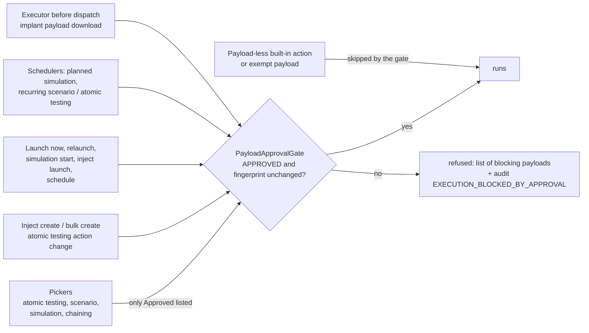
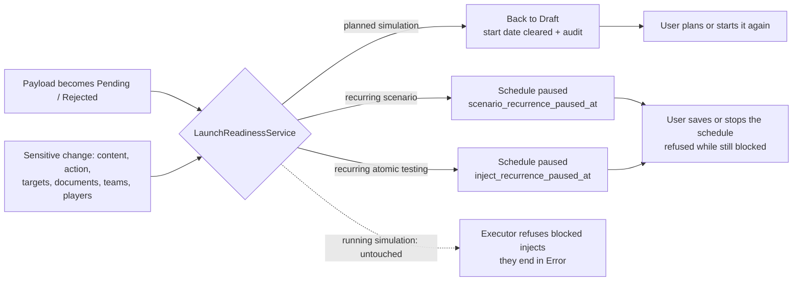
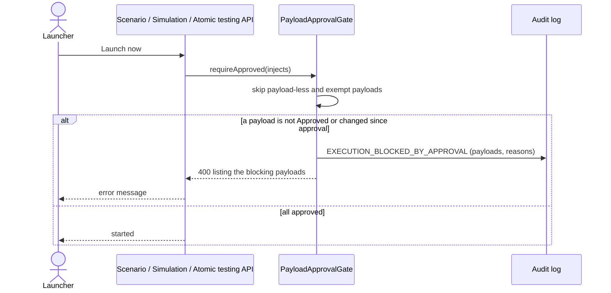
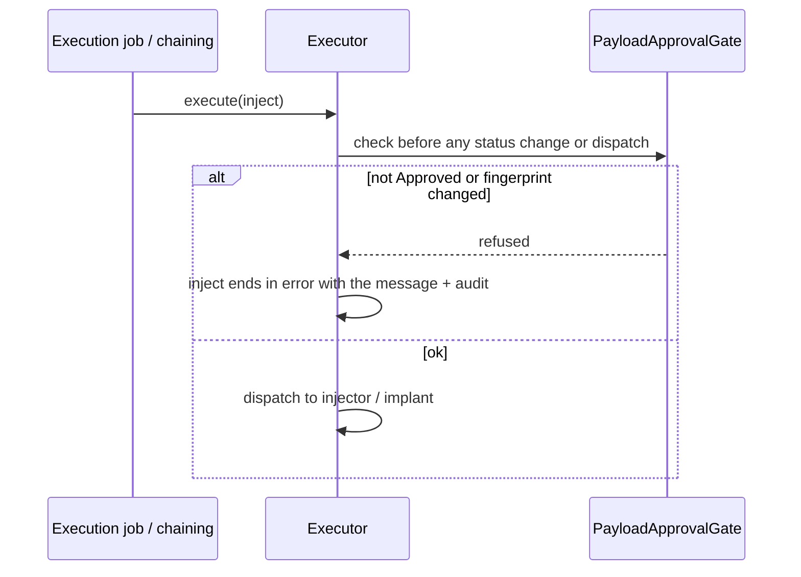

# Payload approval: Task 2 handoff (Notion PMF-776)

> Payload approval POC: design and delivery notes for Task 2 (issue #8356, PR #8357). Sources: `PR-PLAN.md` (PR 3), `BRIEF.md`.

## References

| Item | Value |
|---|---|
| Issue | https://github.com/OpenAEV-Platform/openaev/issues/8356 |
| PR | https://github.com/OpenAEV-Platform/openaev/pull/8357 (**merged**, squash `ee7b4ae1f` into the task1 branch, then into `feature/approval-prototype` with #8355) |
| Final PR | https://github.com/OpenAEV-Platform/openaev/pull/8366 (**draft, not to be merged now**; `feature/approval-prototype` → `main`, labels `filigran team`, `vibe-coded`). Says "Closes #8350, closes #8354, closes #8356": the issue's Development sidebar now shows #8366 |
| Staging | https://feat-8366-approval-p.oaev.staging.filigran.io (deployed 2026-10-08 14:36 UTC, commit `f34533971`; redeployed on every new commit while the box is ticked) |
| Branch | `feature/approval-prototype-task2` (deleted on merge) |
| Commits | `70f2b5625` (build + US2.4, 2026-10-07) and `b71c82267` (edit dialog fix, polish, follow-up, paused schedules, 2026-10-08), signed (SSH, ED25519) |
| PR title | `feat(threat-arsenal): block the use and launch of payloads that are not approved (#8356)` |
| Depends on | Task 0 (#8350, PR #8353) and Task 1 (#8354, PR #8355) |

### Status

- [x] Planned in `PR-PLAN.md` (PR 3)
- [x] Q-C and Q-D decided (Notion US2.1 / PMF-785)
- [x] Built locally
- [x] Tests green (see below)
- [x] Q-E, Q-F, T2-2 decided by the PO (2026-10-08); T2-1 built as recommended
- [x] T2-2 moved to Task 4 (#8378)
- [x] Issue #8356 body updated to the final state (2026-10-08)
- [x] PO additions (US2.4 warning before impact, US2.1 AC4 status display, US2.2 AC2): design approved and built
- [x] PO browser test (OK on 2026-10-07)
- [x] Issue #8356, signed commit, push, draft PR #8357
- [x] 2026-10-08 rounds (edit dialog fix, polish, follow-up, decisions 1 and 2 + atomic list fix): built, tested, committed and pushed; PR body updated to the final state

## Scope change announced (staff feedback, 2026-10-09)

**Payload versioning (Task 5)** keeps an approved payload's approved version in use while an edit is pending as a new version, applied only when approved. As a result, Task 2's behaviours will only apply to payloads that **never had an approved version**:
- launch blocking;
- *Pending* / *Rejected* chips and *Draft* display;
- paused schedules and back to Draft;
- the edit warning (US2.4).

The change is delivered by a new Task 5 PR, not by editing Task 2. **Task 6** adds notifications to approvers when a payload or a new version goes Pending.

## Mapping to the Notion user stories

The US2.2 / US2.3 titles are not written in the sources; this mapping follows BRIEF.md iteration 3 and PR-PLAN PR 3. **To confirm against Notion.**

| User story | Status | What was built |
|---|---|---|
| **US2.1** (PMF-785) Only Approved payloads selectable | Built | AC1: the inject picker (atomic testing, scenario, simulation) and the chaining *Add action* list show **only actions whose payload is Approved**, plus payload-less built-ins (hidden, variant A). Server side: adding a non-approved payload to an inject is refused. AC3: **"Payload pending approval" / "Payload rejected"** chip next to the inject title. **AC4: until the inject runs**, the scenario / simulation inject lists show the compact *Pending* / *Rejected* chip in the status column; the atomic testing list and page show **Draft** with the chip (same status in both). Computed on read, never stored; once run, the execution status shows. Picker filter counts use the picker's scope. |
| **US2.2** Launch blocked on every path, with a clear message | Built | Atomic testing launch / relaunch / schedule, scenario launch now (classic and chaining) / schedule, simulation start, inject launch: refused **server-side** with one error listing every blocking payload and why. Every refusal is audited (`EXECUTION_BLOCKED_BY_APPROVAL`). **AC2 (final): *Launch now* / *Relaunch now* / *Start now* / *Launch* are disabled with the tooltip "Can't launch: A is pending approval, B is rejected +N"**; reasons computed when the page loads (`*_launch_blocked_by`). What runs on its own waits for a deliberate action: planned simulation back to **Draft**, recurring scenario / atomic testing schedule **paused** (persisted), on a blocked payload or a sensitive change. Running simulations are not stopped (blocked injects end in Error). |
| **US2.3** Executor check (last line of defence) | Built | Right before dispatch, an inject is refused when its payload is not Approved or its content changed since its approval: the inject ends in error, nothing is sent. The implant payload download is checked too (403). |
| **US2.4** (new) Warning before impact | Built | **Reject dialog**: "This payload is used in N atomic testings, M scenarios, K simulations. Rejecting it blocks their launch." with links. **Edit** of the executable content of an approved payload in use by a user without *Approve content*: "Saving will send this payload back to Pending approval and block the launch of N … until it is approved again." with *Save anyway*. The action stays possible (409 → dialog → *Save anyway* resends; *Cancel* keeps the form). Counted: atomic testings, scenarios, simulations still to run (draft, planned, running, paused, with an inject not run yet); **counts are the same for every viewer**; names and links (max 20 per type) only for users who can open them. |

## Rules and decisions

1. A payload runs only when it is **Approved** and its executable content is still the approved one (Task 1 fingerprint).
2. **Payload-less built-in actions** are always allowed.
3. All enforcement points go through one service, `PayloadApprovalGate`.
4. Approval applies to **every edition**: the check runs before the Enterprise licence shortcut of the existing launch checks.
5. Editing other fields of an inject whose payload went back to Pending stays allowed; its launch is blocked and it shows the chip.
6. **IOC validation payloads** (PR #8272) are never blocked: extension point `PayloadApprovalExemption`, glue added by whichever of #8272 / Task 2 merges second. No code imported from #8272.
7. Enforcement is **server-side**; the UI only hides what the server refuses.

**Additions decided by the PO (2026-10-07), built:**

8. **Warning before impact** (US2.4), the action stays possible after the warning:
   * the **Reject** dialog shows "This payload is used in N atomic testings, M scenarios, K simulations. Rejecting it blocks their launch.", with the list or links when feasible;
   * when a user **without** *Approve content* edits the executable content of an **approved** payload that is used: "Saving will send this payload back to Pending approval and block the launch of N … until it is approved again."
9. **Inject status display** (US2.1 AC4): in the inject lists of scenarios, simulations and atomic testings, an inject that has **not run yet** and whose payload is not approved shows *Payload pending approval* or *Payload rejected* in its status column. This is a display **computed on read** from the payload approval status; it is never written into the stored inject execution status. Once executed, the normal execution status shows.
10. **Kept as is**: the chip next to the inject title; no new status or filter on atomic testings, scenarios or simulations (approval filtering stays in the Threat Arsenal). ~~Launch buttons stay enabled~~: replaced on 2026-10-08 by rule 12.
11. **Usage counted**: atomic testings, scenarios, and simulations still to run; names and links only for users who can open them; counts never depend on the viewer (PO decisions 2026-10-07 and 2026-10-08).

**Decisions of 2026-10-08, built:**

12. **Launch buttons disabled** with a "Can't launch: …" tooltip (3 names, then "+N"); no confirm dialog. The server check stays.
13. **Planned simulation back to Draft** (start date cleared, audited) when a payload becomes pending / rejected or an inject changes. **Running simulation not stopped**: blocked injects end in **Error**; no new inject status.
14. **Persisted pause** of recurring scenarios **and** recurring atomic testings (`scenario_recurrence_paused_at`, `inject_recurrence_paused_at`): the schedule is kept, nothing runs until a user saves or stops it; saving is refused while blocked. *Paused* chip with the reason. No reason column: the reason is computed when the page loads.
15. **Option A, pause on sensitive change**: inject content, action, targeted assets / asset groups / teams / *all teams*, documents, scenario or simulation teams and players. Not sensitive: title, description, tags, delay. Manual launch after a change stays possible.
16. **Atomic testings list = detail page**: *Draft* + chip when blocked.

## Open questions (built as recommended, to confirm)

| # | Question | What was built |
|---|---|---|
| ~~Q-C~~ | Picker: hide or grey out non-approved payloads? | **Decided: A, hidden.** |
| ~~Q-D~~ | Indicator on an existing inject whose payload went back to Pending? | **Decided: B, required.** |
| ~~Q-E~~ | Scheduled simulation hitting a non-approved payload? | **Decided 2026-10-08**: back to Draft (not canceled), audited; recurring schedules paused (rules 13, 14). |
| ~~Q-F~~ | IOC exemption through the extension point + glue by the PR that merges second? | **Decided 2026-10-08**: IOC validation payloads are system-generated and exempt; **no message to send**. Generic `PayloadApprovalExemption` only, no implementation, works without #8272 (tested in `PayloadApprovalGateTest`). Gap: the exemption itself is not recorded anywhere, so the glue must also create IOC payloads with origin **SYSTEM** (Approved, visible in the history). |
| T2-1 | Payloads approved by the Task 1 migration have no stored fingerprint: how does the "changed after approval" check treat them? | **Trusted as approved, nothing written** (a launch check should not write). Any later content change makes them Pending through the Task 1 write rules, so the gap only concerns direct database edits. |
| ~~T2-2~~ | Automatic inject generation can still pick an action whose payload is not approved. Should it skip them? | **Decided 2026-10-08 (changed)**: automatic selection picks **only approved payloads plus payload-less built-ins**, like the user pickers. **Delivered in Task 4 (#8378, US4.2–US4.4)**. |
| ~~BRIEF~~ | Should the checker also review the simulation composition (targets, arguments, schedule)? | **Decided 2026-10-08: out of scope of this POC** (BRIEF decisions log). |

### Delivered in Task 4 (2026-10-08)

T2-2 is delivered in **Task 4** ([#8378](https://github.com/OpenAEV-Platform/openaev/issues/8378), user stories **US4.2 to US4.4**), not as a follow-up PR on #8356 (delivery changed by the PO):
- inject assistant and security coverage (US4.2);
- bulk add to scenario(s) (US4.3);
- AI orchestrator and chaining steps (US4.4).

Spreadsheet import (US4.5) was dropped: it stays unchanged, like JSON import.

See `NOTION-task4.md`. Issue #8356's body was updated to the final state on 2026-10-08, with T2-2 marked "delivered in Task 4 (#8378)".

## Diagrams (Mermaid sources)

**Enforcement points**

**What runs on its own waits for a deliberate action (2026-10-08)**

**Launch of a scenario with non-approved payloads**

**Executor check (content edited after launch)**

## Endpoints and migration

- **Migration** `V6_20261008120000000__Add_recurrence_paused_at`: `scenarios.scenario_recurrence_paused_at` and `injects.inject_recurrence_paused_at` (nullable, additive, no backfill). No reason column.
- One new endpoint: `GET /api/threat_arsenals/{id}/usage` (US2.4).
- Detail GETs carry `scenario_launch_blocked_by`, `exercise_launch_blocked_by`, `inject_launch_blocked_by` (list of `{id, name, approval_status, reason}`) and `scenario_recurrence_paused_at` / `inject_recurrence_paused_at`.
- `PUT /api/threat_arsenals/{id}?check_approval_impact=true` (used by the UI): **409** with the usage, nothing saved, when the edit would send an approved payload in use back to Pending; without the parameter, unchanged.
- The scenario / simulation inject list fills `inject_sent_at` (US2.1 AC4).
- New request flag `approved_payloads_only` on `POST /api/injector_contracts/search` and `POST /api/threat_arsenals/search` (and `/search/non-tabletop`).
- Existing endpoints answer **400 with the list of blocking payloads** for launches and for inject creation with a non-approved payload. The implant payload download answers 403.
- Atomic testing list rows now carry `payload_status` and `payload_approval_status`.

## Files changed

**Backend**
- `openaev-api/.../service/payload_approval/PayloadApprovalGate.java`, `PayloadApprovalExemption.java`, `BlockedPayloadsException.java` (new)
- `openaev-api/.../executors/Executor.java`, `rest/inject/service/ExecutableInjectService.java` (executor and implant download checks)
- `rest/inject/service/InjectService.java`, `service/scenario/ScenarioService.java`, `rest/scenario/ScenarioApi.java` (chaining launch), `rest/exercise/service/ExerciseService.java`, `service/AtomicTestingService.java` (launch and inject creation checks)
- `scheduler/jobs/InjectsExecutionJob.java` (scheduled simulation canceled + audited; start sweep in one cross-tenant transaction)
- `rest/injector_contract/input/InjectorContractSearchPaginationInput.java`, `rest/injector_contract/InjectorContractApi.java`, `service/threat_arsenal/ThreatArsenalService.java`, `openaev-model/.../specification/InjectorContractSpecification.java` (picker flag)
- `service/InjectSearchService.java` (payload status and approval status in the atomic testing list)
- `aop/audit_log/AuditEventScope.java` (`EXECUTION_BLOCKED_BY_APPROVAL`)
- US2.4: `service/payload_approval/PayloadUsageService.java`, `PayloadUsage.java`, `PayloadApprovalImpactException.java` (new); `api/threat_arsenal/dto/ThreatArsenalActionUsageOutput.java`, `ThreatArsenalActionUsageItem.java`, `ThreatArsenalApprovalImpactOutput.java` (new); `api/threat_arsenal/ThreatArsenalApi.java` (usage endpoint, `check_approval_impact`, 409); `rest/payload/service/PayloadUpdateService.java` (opt-in check); `openaev-model/.../repository/InjectRepository.java` + `raw/RawPayloadUsageItem.java` (usage queries)
- US2.1 AC4: `service/InjectSearchService.java` (`inject_sent_at` in the scenario / simulation inject list)
- 2026-10-08: `service/readiness/LaunchReadinessService.java`, `InjectSensitiveFields.java`, `rest/payload/output/LaunchBlockerOutput.java`, migration `V6_20261008120000000__Add_recurrence_paused_at.java` (new); `Scenario.java` / `Inject.java` (paused at); `ScenarioRepository`, `InjectRepository`, `ExerciseRepository` (paused / planned queries, usage of unrun injects); `ScenarioService`, `ScenarioApi`, `AtomicTestingService`, `InjectService`, `ExerciseService`, `ExerciseApi` (blockers on GET, pause hooks, re-enable); `ScenarioExecutionJob`, `AtomicTestingExecutionJob`, `InjectsExecutionJob` (skip paused / blocked, Draft); `InjectorContractService` / `InjectorContractApi` (facet counts in the picker scope); `PayloadUsageService` (viewer-independent counts, 20 names cap)

**Frontend**
- `admin/components/payloads/PayloadApprovalWarningChip.tsx` (new)
- `admin/components/common/injects/Injects.tsx`, `admin/components/atomic_testings/InjectResultList.tsx`, `admin/components/atomic_testings/atomic_testing/InjectHero.tsx` (chip)
- `admin/components/common/injects/create/InjectContractPicker.tsx`, `admin/components/chaining/logic/drawer/AddActionList.tsx` (picker flag)
- US2.4: `admin/components/threat_arsenal/approval/PayloadUsageWarning.tsx` (new), `ThreatArsenalApprovalSection.tsx` (Reject dialog), `admin/components/threat_arsenal/ThreatArsenalActionPopover.tsx` (edit confirmation), `actions/threat_arsenals/threatArsenal-actions.ts`
- US2.1 AC4: `admin/components/payloads/payloadApprovalDisplay.ts` (new), `utils/statusUtils.ts` (2 display-only colours), status column in `Injects.tsx` and `InjectResultList.tsx`
- `utils/api-types.d.ts` (only the new fields and types), `utils/lang/*.json` (9 languages, ICU plurals)
- 2026-10-08: `payloads/LaunchBlockedTooltip.tsx` (new); `ScenarioHeader.tsx`, `Scenario.tsx`, `ExerciseHeader.tsx`, `AtomicTestingHeaderActions.tsx` (disabled launch + tooltip, *Paused* chip); `InjectHero.tsx`, `InjectResultList.tsx`, `AtomicTestings.tsx` (Draft); `PayloadUsageWarning.tsx` (Alert, grouped capped lists); `ThreatArsenalActionPopover.tsx` + `threatArsenal-actions.ts` (409 → dialog); `ThreatArsenalCard.tsx`, `ThreatArsenalActionOverview.tsx` (approval over Verified); `Home.tsx`, `DefaultHomeDashboard.tsx` (no access-denied toasts); `InjectContractPicker.tsx`, `EndpointsPicker.tsx` (filters)

**Tests**
- New (US2.4): `ThreatArsenalApprovalImpactApiTest` (7: usage counts and names, counts only without access, finished simulations not counted, 409 with usage and nothing saved, no 409 without the parameter / for a cosmetic edit / an unused payload / an approver); frontend `PayloadUsageWarning.test.tsx` (3), `ThreatArsenalApprovalSection.test.tsx` (+2: Reject dialog warning)
- New (US2.1 AC4): `PayloadApprovalEnforcementApiTest` (+1: inject list carries the approval status and no sent date), frontend `payloadApprovalDisplay.test.ts` (2)
- New: `PayloadApprovalGateTest` (10), `PayloadApprovalEnforcementApiTest` (6: picker flag on both searches, inject creation refused / allowed, scenario launch refused listing both payloads, atomic testing launch refused), `ExecutorTest` (+1: refused before any status change or dispatch), `InjectsExecutionJobTest` (+1: scheduled simulation canceled + audited), `PayloadApprovalWarningChip.test.tsx` (3)
- New (2026-10-08): `ThreatArsenalApprovalImpactApiTest` (EditWarning, SameUsage, LaunchState, PausedSchedules, admin vs manager counts), `PayloadApprovalEnforcementApiTest` (+facet counts), `ScenarioExecutionJobTest` (+pending payload, +paused scenario), `InjectsExecutionJobTest` (Draft); frontend `ThreatArsenalActionPopover.test`, `AtomicTestingHeaderActions.test`, `ExerciseHeaderButtons.test`, `InjectContractPicker.test`, atomic testings list tests, `payloadApprovalDisplay.test`
- Adjusted: `PayloadFixture` (test payloads default to Approved), unit tests building the changed services, `ExerciseServiceUnitTest` (licence shortcut no longer skips the approval check)

**Docs**
- `docs/docs/usage/build/threat-arsenals/threat-arsenals.md` ("Only approved payloads can run", final state), `docs/docs/usage/evaluate/atomic-testing/atomic-testing.md` (note + paused schedule), `docs/docs/usage/build/scenario/scenario.md` ("Payload approval and paused schedules"), `docs/docs/usage/evaluate/simulation/simulation.md` (note)

## How to test

Run this branch (or a later one, or the staging environment) and log in as an administrator.

1. Roles: **Author** (Access + Manage threat arsenal), **Approver** (+ Approve content), **Launcher** (Access threat arsenal + access / launch atomic testings, scenarios, simulations).
2. As *Author*, create command actions **A** and **B**; as *Approver*, approve **A**.
3. **Picker**: in an atomic testing or scenario, **A** is listed, **B** is not; a payload-less built-in action is listed; the filter counts match the list.
4. Using **A**, create a scenario with a recurring schedule, a simulation planned for later and a recurring atomic testing.
5. **Edit warning**: as *Author*, edit **A**'s command: the dialog names where **A** is used; *Cancel* keeps it approved; *Save anyway* → **A** Pending.
6. **Effects**: scenario schedule *Paused*; simulation *Draft*; atomic testing *Draft* + *Pending* chip in the list and on its page, schedule paused; launch buttons disabled with "Can't launch: A is pending approval".
7. **Reject** as *Approver*: the dialog lists the same usage (same counts for every user).
8. **Approve again**: labels disappear, launch works; the scenario schedule stays paused until you save it.
9. **Sensitive change**: change the targets of an inject of the recurring scenario → paused; change only its title → not paused.
10. **Running simulation**: start a simulation, then send **A** back to Pending: the simulation keeps running, **A**'s injects end in Error.
