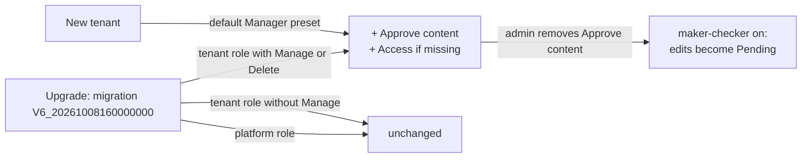

# Payload approval: Task 3 handoff (Notion PMF-795, US3.1)

> Payload approval POC: design and delivery notes for Task 3 (issue #8376, PR #8377). Sources: `BRIEF.md` (decisions log).

## References

| Item | Value |
|---|---|
| Issue | https://github.com/OpenAEV-Platform/openaev/issues/8376 |
| PR | https://github.com/OpenAEV-Platform/openaev/pull/8377 (merged into `feature/approval-prototype`, labels `filigran team`, `vibe-coded`) |
| Branch | `feature/approval-prototype-task3` (from `f34533971`; merged as `49c5a2316`) |
| Commit | `e4a1b4a24`, signed (SSH, ED25519), pushed |
| Final PR | https://github.com/OpenAEV-Platform/openaev/pull/8366 (draft into `main`, not to be merged now): "closes #8376" added |
| Staging | https://feat-8366-approval-p.oaev.staging.filigran.io: redeployed once Task 3 is merged into `feature/approval-prototype` |

### Status

- [x] Design approved by the PO (2026-10-08), including the Manager preset (AC9)
- [x] Issue #8376 created
- [x] Built locally, tests green (see below)
- [x] PO review of the diff and tests (OK 2026-10-08, with the bound tenant parameter tidy-up)
- [x] Signed commit, push, draft PR #8377, "closes #8376" on #8366
- [x] Merged into `feature/approval-prototype` as `49c5a2316`

## User story US3.1 and acceptance criteria

**Decision (PO, 2026-10-08, replaces Task 0 US0.3 "no existing role receives the capability")**: at upgrade, every tenant role that has *Manage threat arsenal* also receives *Approve content* (plus *Access threat arsenal* if missing). Existing authors are auto-approved and nothing changes for them; maker-checker becomes opt-in by removing the capability from a role.

| AC | Built |
|---|---|
| AC1 tenant roles with Manage get Approve content | Migration; *Delete* (implies Manage) is matched too, and *Access* is added if missing |
| AC2 roles without Manage don't | Filter on `MANAGE_THREAT_ARSENALS` / `DELETE_THREAT_ARSENALS` |
| AC3 platform roles untouched | `roles.tenant_id IS NOT NULL` |
| AC4 roles created / edited after the upgrade not auto-ticked | No change to role creation or editing; *Approve content*'s parent is *Access*, not *Manage* |
| AC5 idempotent | `ON CONFLICT DO NOTHING` on `(role_id, capability)`; a second run inserts nothing |
| AC6 traceable | One upgrade log line: "Approve content granted to N tenant role(s) that can manage the threat arsenal: name (id …, tenant …), …" / "no tenant role to update" |
| AC7 removing it makes edits Pending | Task 1 rules, unchanged; covered end to end |
| AC8 docs and release note | *Users and RBAC* (row + note), *Threat Arsenal* ("Who approves by default"); release-note line in the PR description |
| AC9 default Manager role of new tenants includes Approve content | `PresetTenantData.DEFAULT_ROLES` (Manager) |

## Diagram

## What changed

**Backend**
- `openaev-api/.../migration/V6_20261008160000000__Grant_approve_content_to_threat_arsenal_managers.java` (new): Flyway Java migration, same pattern as `V6_20260818100000000__Grant_tenant_users_groups_and_roles_capabilities`; `INSERT … SELECT … WHERE r.tenant_id IS NOT NULL AND rc.capability IN (MANAGE, DELETE) ON CONFLICT DO NOTHING RETURNING role_id`, then the log line.
- `openaev-api/.../processor/datapack/PresetTenantData.java`: *Approve content* in the Manager preset (AC9). It also keeps the startup alignment of the default tenant's Manager role working, because that alignment only completes roles that hold nothing outside the preset.

**Tests**
- New `GrantApproveContentToThreatArsenalManagersMigrationTest`: Manage → granted; Delete only → granted + Access; Access only → unchanged; platform role → unchanged; second run → nothing; log lists the roles, then "no tenant role to update".
- `TenantRoleApiTest`: a role created, or edited, with Manage gets no Approve content (AC4).
- `ThreatArsenalApprovalApiTest` (end to end): an upgraded author is auto-approved; after an admin removes Approve content from the role, the author's content edit makes the action Pending (AC1 + AC7).
- `PresetTenantDataTest`: the Manager preset includes Approve content (AC9).

**Docs**
- `docs/docs/administration/users-and-rbac.md`: *Approve content* row and the note "Approve content after an upgrade".
- `docs/docs/usage/build/threat-arsenals/threat-arsenals.md`: "Who approves by default".

**Release note**: "Existing roles that can manage the threat arsenal, and the default Manager role of new tenants, now also have *Approve content*: their payloads stay approved. To require a second person's approval, remove *Approve content* from those roles."

## Test results

- New `GrantApproveContentToThreatArsenalManagersMigrationTest`: 6 pass.
- Targeted classes (migration, `PresetTenantDataTest`, `TenantRoleApiTest`, `ThreatArsenalApprovalApiTest`, `V20261001_Default_tenant_roles_and_groupsTest`): 57 run, 0 failures.
- Regression (role, group, permission, capability, data pack, tenant, threat arsenal, payload, all migration and architecture tests): **1271 run, 0 failures, 4 skipped** (already disabled). `spotless:check` clean.

## How to test

1. Start from a database with an existing tenant role that has *Manage threat arsenal* but not *Approve content* (e.g. created before the upgrade).
2. Upgrade (start the new version): the log shows "Approve content granted to … tenant role(s)…" naming it. *Settings → Security → Roles*: the role now has *Approve content*.
3. As a member of that role, create or edit an action: it is **Approved** (auto-approved).
4. Remove *Approve content* from the role, then edit the action's command as that member: it becomes **Pending**.
5. Create a new role with *Manage threat arsenal*: *Approve content* is not ticked.
6. Restart: nothing changes (Flyway runs the migration once; a forced re-run inserts nothing and logs "Approve content: no tenant role to update").
