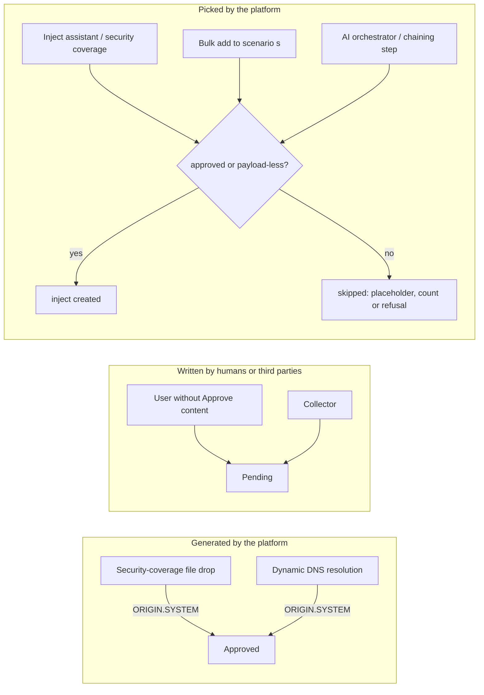

# Payload approval: Task 4 handoff (Notion "Option 2 — Task 4 — Edge cases: system-generated payloads and automatic selection")

> Payload approval POC: design and delivery notes for Task 4 (issue #8378, PR #8379). Sources: `BRIEF.md` (decisions log).

## References

| Item | Value |
|---|---|
| Issue | https://github.com/OpenAEV-Platform/openaev/issues/8378 |
| PR | https://github.com/OpenAEV-Platform/openaev/pull/8379 (merged into `feature/approval-prototype`, labels `filigran team`, `vibe-coded`) |
| Branch | `feature/approval-prototype-task4` (from `49c5a2316`, which includes Task 3; merged as `e6e301579`) |
| Commit | `79ef4f0b0`, signed (SSH, ED25519), pushed |
| Final PR | https://github.com/OpenAEV-Platform/openaev/pull/8366 (draft into `main`): "closes #8378" added |
| Staging | https://feat-8366-approval-p.oaev.staging.filigran.io: redeployed once Task 4 is merged into `feature/approval-prototype` |

### Status

- [x] Delivery decided by the PO (2026-10-08): one task, one issue, one PR (instead of follow-ups on #8354 / #8356)
- [x] Issue #8378 created; issue #8356 body updated (T2-2 delivered in Task 4)
- [x] US4.1 to US4.4 built locally, tests written
- [x] US4.5 (spreadsheet import) dropped by the PO (2026-10-08): reverted; spreadsheet import stays as today, like JSON import
- [x] PO review of the diff and test results (OK 2026-10-08)
- [x] Signed commit `79ef4f0b0`, push, draft PR #8379, "closes #8378" on #8366
- [x] Merged into `feature/approval-prototype` as `e6e301579` (2026-10-09)

## Principle and decisions (2026-10-08)

- **Principle**: only **human-generated** content goes to *Pending*. **System-generated** content is **Approved**, recorded with origin **SYSTEM**, unless a human later edits its executable content (then the normal rules apply).
- **Automatic selection** follows the pickers' rule: only approved payloads, plus payload-less built-ins.
- **Collector payloads: decided, they stay Pending.** Collectors import scripts written by third parties, which is exactly what maker-checker must review. The principle only covers content the platform generates itself. Trusting specific collectors is a possible later improvement.
- **Exercise composition review**: out of scope of this proof of concept.
- **IOC validation payloads (#8272)**: no code. The glue added with #8272 must create them with origin SYSTEM, so the exemption is visible.

## User stories

| US | What | Built |
|---|---|---|
| **US4.1** System-generated payloads are approved | Security-coverage file drop: Approved, SYSTEM. An existing pending one that no human wrote is approved as SYSTEM on reuse. A human-written one is untouched. A non-approver editing its content makes it Pending | `PayloadService.createFileDropPayload` (`ORIGIN.SYSTEM`); `getFileDropPayloadByDocument` → `approveIfStillSystemGenerated` (Pending and no "last modified by") |
| **US4.2** Automatic inject generation only picks approved payloads | TTP inject assistant and security coverage (attack patterns, vulnerabilities, indicators, files); manual placeholder when nothing matches; payload-less built-ins still picked | Approval filter in `InjectorContractRepositoryHelper.searchInjectorContractsByAttackPatternAndEnvironment` (before the random pick) and `InjectorContractRepository.findInjectorContractsByVulnerabilityIdIn` (payload join, before the per-vulnerability cut); `InjectAssistantService.searchRunnableContracts` + vulnerability post-filter (`isRunnable`: fingerprint, exemptions); `SecurityCoverageInjectService` skips a fixed payload that cannot run |
| **US4.3** Bulk "add to scenario(s)" skips non-approved actions | Approved-only scope forced server-side; no 400 for the whole bulk; skipped count shown | `InjectService.createInjectsFromInjectorContractInput` forces the scope; `countActionsWithoutApprovedPayload`; header `X-OpenAEV-Skipped-Actions` on POST / PUT `/api/scenarios/with-injector-contracts`; UI toast "N selected actions were not added: their payload is not approved" |
| **US4.4** AI orchestrator | Candidates exclude non-runnable payloads; a chaining step (AI or user) with a non-approved payload is refused | `CapabilityResolverService.buildIndex` skips them; `InjectExecutionStep.stepData` → `requireApproved` (400, audited) |
| ~~US4.5~~ Spreadsheet import | **Dropped (PO, 2026-10-08)** | Unchanged, like JSON import: the inject is imported, shows the approval chip, and its launch is blocked (Task 2) until the payload is approved |

**Known limitation**: on a security coverage re-sync, an existing inject whose payload became Pending still counts as covering its attack pattern or vulnerability. No approved replacement is generated, and its launch stays blocked.

## Diagram

## Files changed

- **Backend**:
  - `rest/payload/service/PayloadService.java`
  - `rest/inject/service/InjectAssistantService.java`
  - `service/stix/SecurityCoverageInjectService.java`
  - `rest/inject/service/InjectService.java`
  - `service/scenario/ScenarioService.java`
  - `rest/scenario/ScenarioApi.java`
  - `service/autonomous/CapabilityResolverService.java`
  - `api/chaining/InjectExecutionStep.java`
  - in `openaev-model`: `InjectorContractRepositoryHelper.java`, `InjectorContractRepository.java`
- **Frontend**:
  - `threat_arsenal/bulk/notifySkippedActions.ts` (new)
  - `ThreatArsenalScenarioCreationComponent.tsx`, `ThreatArsenalScenarioUpdateComponent.tsx`
  - `utils/lang/*.json`: 1 label, 9 languages
- **Docs**: `threat-arsenals.md` (system-generated payloads, "Actions picked by the platform", imports unchanged).
- **Tests**:
  - `ThreatArsenalApprovalApiTest` (+4, US4.1)
  - new `AutomaticSelectionApprovalTest` (4: assistant approved only, placeholder, vulnerability query, AI candidates)
  - `ScenarioApiTest` (+1, US4.3)
  - `InjectExecutionStepTest` (+1, US4.4)
  - frontend `notifySkippedActions.test.ts` (3)

## Test results

- **New and touched classes**:
  * `ThreatArsenalApprovalApiTest`: 15 run, including 4 for US4.1.
  * `AutomaticSelectionApprovalTest`: 4 run.
  * `ScenarioApiTest`: US4.3.
  * `InjectExecutionStepTest`: 54 run, including US4.4.
  * All pass.
- **Backend regression** (after US4.5 was dropped):
  * Suites: threat arsenal, payload, scenario, inject, STIX, security coverage, import, chaining, step, workflow, autonomous, capability, mapper, atomic testing, and all architecture tests.
  * Result: **2,488 run, 0 failures, 1 error, 4 skipped** (already disabled).
  * The error, `StepServiceGraphCopyIntegrationTest` ("/ by zero" in `BatchQueueService.publish`), is **pre-existing and order-dependent**: the same suites on the base branch without Task 4 give the same error (2,478 run, 1 error). It only appears in the full run; the chaining, step and workflow tests alone pass (546).
- **Frontend**: `yarn check-ts`, eslint and the i18n checker are clean; **89 files, 937 tests** (including the new `notifySkippedActions.test.ts`). Four timeouts in two unrelated hook tests happened while the backend ran in parallel; those two files pass alone (25).
- `spotless:check` clean.
- **No existing test expected the file drop to be Pending**, so none had to change.

## How to test

1. **US4.1**: run a security coverage with a file (artifact). The generated file drop action is **Approved**, and its history shows a *System* entry. As a user without *Approve content*, change its file: it becomes **Pending**.
2. **US4.2**: give one attack pattern two actions, one approved and one pending. Generate injects with the inject assistant: only the approved action is used. With only the pending one, a manual placeholder inject is created.
3. **US4.3**: in the Threat Arsenal, select an approved and a pending action, then *Add to scenario*. The scenario gets only the approved one, and a message says "1 selected action was not added: its payload is not approved".
4. **US4.4**: adding a chaining step with a pending action is refused with the reason.
5. **Imports (unchanged)**: import a spreadsheet whose mapper maps a row type to a pending action. The inject is imported, shows the *Pending* chip, and its launch is blocked until the action is approved.
