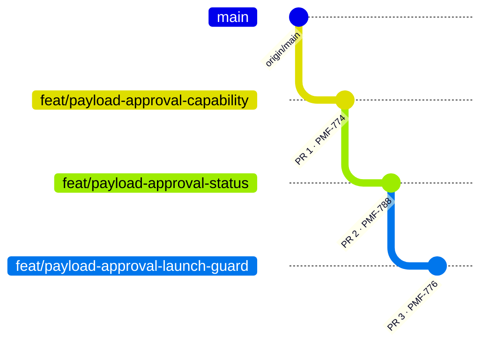

# Payload approval: PR plan (EPIC "Approval Workflow for Exercise Launch", Option 2)

> **Status:** delivered. This is the original delivery plan with its status log; see `README.md` for the final state of each task.
> **Decisions applied:** BRIEF.md "Decisions log". PR #8272 is **not** merged; it was only read as a reference. No code is imported from it.

## Status log

| Date | Event |
|---|---|
| 2026-10-07 | Parent branch `feature/approval-prototype` reset to `main` (`f1a2d2d3c`) and pushed. |
| 2026-10-07 | Task 0: issue #8350 created; commit `62dd2e422` signed and Verified on GitHub; draft PR #8353 opened into `feature/approval-prototype`, then marked ready for review. |
| 2026-10-07 | Task 0 merge **blocked** at first: the repository only allows squash merges, and a merge-commit push was rejected by GitHub with an HTTP 500. Resolved on 2026-10-08 (PRs squash-merged, see below); `main` was never touched. |
| 2026-10-07 | Task 1 (Notion US1.3 / PMF-791): Approval filter added to the Threat Arsenal "Add filter" menu (multi-value, alongside the sidebar facet and the list column). Task 2 decisions from Notion US2.1 / PMF-785: picker lists only Approved payloads (variant A); indicator on existing injects whose payload became Pending or Rejected is required (variant B). |
| 2026-10-07 | Decision: until Task 0 is merged, the Task 1 PR targets `feature/approval-prototype-task0`; it is retargeted to `feature/approval-prototype` once Task 0 is merged. |
| 2026-10-07 | Task 2 built (branch `feature/approval-prototype-task2` from Task 1 `392f865e8`): gate, picker flag, inject chip, launch / scheduler / executor checks, docs. Q-E (whole scheduled run canceled + audited), Q-F (extension point only), T2-1 (no fingerprint = trusted, no write) built as recommended; new T2-2 (automatic inject generation not filtered). Bug found and fixed on the way: the scheduled start sweep read lazy injects outside a transaction; it now runs in one cross-tenant transaction. Nothing committed or pushed. |
| 2026-10-07 | Task 2 PO additions built (US2.4 warning before impact, US2.1 AC4 status column, US2.2 AC2 launch buttons unchanged) and tested by the PO. Issue #8356 created; commit `70f2b5625` signed and Verified; draft PR #8357 opened into `feature/approval-prototype-task1`. Regression: 1932 tests, 0 failures. |
| 2026-10-08 | Task 2 final rounds (edit dialog fix, polish, follow-up, persisted pause + option A + atomic list Draft): commit `b71c82267` signed and pushed to `feature/approval-prototype-task2`; PR #8357 body updated to the final state. Migration `V6_20261008120000000__Add_recurrence_paused_at`. Regression: 2102 tests, 0 failures after the fix (171 rerun). |
| 2026-10-08 | Merged by the PO: #8357 (squash `ee7b4ae1f` into task1), #8353 (squash `8f284c15d` into `feature/approval-prototype`), then #8355 after the conflict fix (signed merge `95e7bde2d` on task1, tree unchanged) as `f34533971`. `feature/approval-prototype` = final Task 2 tree. Task branches auto-deleted. Next: `feature/approval-prototype → main` PR with "Closes #8350, #8354, #8356". |
| 2026-10-08 | Final draft PR #8366 (`feature/approval-prototype → main`, not to be merged) opened with "Closes #8350, #8354, #8356"; conflicts with `main` (2 i18n files + Spring Boot 4 upgrade pending). Staging deployed: https://feat-8366-approval-p.oaev.staging.filigran.io (14:36 UTC, `f34533971`). |
| 2026-10-08 | Task 3 (#8376) merged as #8377 (`49c5a2316`). Task 4 (#8378, US4.1–US4.4; US4.5 dropped): commit `79ef4f0b0` signed and pushed, draft PR #8379 into `feature/approval-prototype`; #8366 now also closes #8376 and #8378. |
| 2026-10-09 | Task 4 merged as #8379 (`e6e301579`). |

## Overview

| PR | Notion task | Branch | Base | Draft PR title |
|---|---|---|---|---|
| 1 | Task 0, **PMF-774** | `feature/approval-prototype-task0` | `feature/approval-prototype` | `feat(threat-arsenal): add the approve content capability and last modified by on payloads (#8350)`: issue #8350, draft PR #8353 (ready for review, merge blocked, see Status log) |
| 2 | Task 1, **PMF-788** | `feature/approval-prototype-task1` | `feature/approval-prototype-task0` (stacked until Task 0 is merged, then retargeted to `feature/approval-prototype`) | `feat(threat-arsenal): approve or reject payloads with an approval status and history (#8354)` |
| 3 | Task 2, **PMF-776** | `feature/approval-prototype-task2` | `feature/approval-prototype-task1` (stacked) | `feat(threat-arsenal): block the launch of injects whose payload is not approved (#8356)` |



---

## PR 1: Task 0 (PMF-774): "Approve content" capability + "last modified by"

**Goal.**
- A new capability, **Approve content** (`APPROVE_THREAT_ARSENALS`), appears in the Threat Arsenal group of the role capability matrix and can be assigned.
- Payloads record **who last modified them**. "Created by" reuses the existing **Author** field.
- **No approval logic.** The capability is not used by any endpoint yet.

### Files

| File | Change |
|---|---|
| `openaev-model/src/main/java/io/openaev/database/model/Action.java` | + `APPROVE` |
| `openaev-model/src/main/java/io/openaev/database/model/Capability.java` | + `APPROVE_THREAT_ARSENALS(ACCESS_THREAT_ARSENALS, pair(THREAT_ARSENAL, APPROVE))`: tenant scope and group inherited from the parent, sibling of Manage (as in mockup `option2-us0.1`) |
| `openaev-model/src/main/java/io/openaev/database/model/Payload.java` | + `lastModifiedBy` (`payload_last_modified_by`, `@ManyToOne(LAZY)`, `MonoIdSerializer`, `@Queryable(filterable, dynamicValues)`, `@IncludeOption("exclude from payload export")`, the same pattern as `authorUser`) |
| `openaev-api/src/main/java/io/openaev/migration/V6_<ts>__Add_payload_last_modified_by.java` | new column, FK `users(user_id) ON DELETE SET NULL`, index, `IF NOT EXISTS` |
| `openaev-api/src/main/java/io/openaev/rest/payload/service/PayloadCreationService.java` | stamp `lastModifiedBy` = creator (next to the author) |
| `openaev-api/src/main/java/io/openaev/rest/payload/service/PayloadUpdateService.java` | stamp `lastModifiedBy = currentUserOrNull()` |
| `openaev-api/src/main/java/io/openaev/rest/payload/service/PayloadUpsertService.java` | `lastModifiedBy = null` on collector create/update ("system") |
| `openaev-api/src/main/java/io/openaev/rest/payload/service/PayloadService.java` | `duplicate()`: stamp `lastModifiedBy` |
| `openaev-api/src/main/java/io/openaev/api/payload/PayloadImportService.java` | stamp `lastModifiedBy` = importer (author unchanged, as today) |
| `openaev-api/src/main/java/io/openaev/api/threat_arsenal/dto/ThreatArsenalActionFullOutput.java`, `openaev-api/src/main/java/io/openaev/utils/mapper/ThreatArsenalMapper.java` | + `action_last_modified_by`, `action_last_modified_by_name` |
| `openaev-api/src/main/java/io/openaev/rest/payload/output/PayloadOutput.java` | + `payload_last_modified_by` (API parity) |
| `openaev-front/src/utils/permissions/types.ts` | + `ACTIONS.APPROVE` (the RBAC parser drops unknown actions) |
| `openaev-front/src/utils/lang/{en,fr,de,es,it,ja,ko,ru,zh}.json` | `APPROVE_THREAT_ARSENALS`: "Approve content", "Last modified by" |
| `openaev-front/src/utils/api-types.d.ts` | regenerated (`yarn generate-types-from-api`) |
| `openaev-front/src/admin/components/threat_arsenal/ThreatArsenalActionOverview.tsx` | "Last modified by" field under Author |
| `docs/docs/administration/users-and-rbac.md` | + row "Approve content" in the Threat Arsenal capability table |

### Migration

`V6_<YYYYMMDDHHmmss000>__Add_payload_last_modified_by`. The timestamp must be after the newest migration on `origin/main` at build time (today `V6_20261005105200000`; `.github/actions/migrations-guard`).
- It is additive and idempotent, with no backfill: existing rows get `NULL`, shown as "-".
- No data migration for roles: **no existing role receives the capability**. Admins with Bypass have it implicitly. This is still an open question in BRIEF.md; say if you want otherwise.

### Tests

| Kind | Tests |
|---|---|
| New / extended (backend) | `CapabilityTreeBuilderTest` (node under Threat Arsenal → Access, tenant tree only, absent from the platform tree); `TenantRoleApiTest` (a role can hold it, the parent is auto-added, a platform role refuses it); `ThreatArsenalApiTest` (create, update, duplicate and import stamp `last_modified_by`; the client cannot set it); `PayloadApiTest` (collector upsert leaves it null); `PayloadApiExporterTest` (not exported) |
| Existing, re-run (backend) | `PermissionServiceTest`, `ThreatArsenalMapperTest`, `InjectorContractAuthorshipTest`, `ImportBundleAttributionTest`, `ThreatArsenalImporterTest`, `PayloadApiTenantIsolationTest`, `ThreatArsenalApiTenantIsolationTest`, `PlatformRoleApiTest` |
| Front | `yarn lint`, `yarn check-ts`, `vitest` on `useCapabilities.test.tsx` and the Threat Arsenal tests |
| Format | `mvn spotless:apply` |

### PR description

```markdown
### Proposed changes

* Capability: add **Approve content** (`APPROVE_THREAT_ARSENALS`, new `Action.APPROVE`) in the Threat Arsenal group, as a sibling of *Manage threat arsenal* under *Access threat arsenal*, tenant scope only. It shows in the role capability matrix and can be assigned. No endpoint uses it yet: it prepares payload approval (PMF-788).
* Payloads: record who last modified them (`payload_last_modified_by`). It is set on create, update, duplicate and import; it is null for collector and system writes, and excluded from exports like the author. "Created by" reuses the existing author.
* API: `action_last_modified_by(_name)` on the Threat Arsenal action, `payload_last_modified_by` on the payload output.
* UI: "Last modified by" in the action overview; i18n for the capability label.
* Docs: capability table in *Users and RBAC*.

### Testing Instructions

1. Start the dev stack and the backend (`mvn clean install -DskipTests -Pdev`, then run the API), and the frontend (`yarn start`).
2. As an admin, open *Settings → Security → Roles*, edit a tenant role, then open the *Capabilities* tab: *Threat Arsenal → Access threat arsenal → Approve content* is listed. Tick it: *Access threat arsenal* is ticked automatically. Save, then reopen: it is kept.
3. Open a platform role: *Approve content* is not offered.
4. Log in as a user with *Manage threat arsenal*, create an action, then open it: *Author* and *Last modified by* show that user. Log in as another user, edit it: *Last modified by* changes, *Author* does not.
5. `GET /api/threat_arsenals/{id}` returns `action_last_modified_by`; exporting the action does not include it.
6. Migration: on an existing database, the backend starts and existing payloads show "-" for *Last modified by*.

### Related issues

* Related #8350 (Notion PMF-774, Task 0)

### Checklist

- [ ] I consider the submitted work as finished
- [ ] I tested the code for its functionality
- [ ] I wrote test cases for the relevant uses case
- [ ] I added/update the relevant documentation (either on github or on notion)
- [ ] Where necessary I refactored code to improve the overall quality
- [ ] For bug fix -> I implemented a test that covers the bug

### Deployment

- [ ] 🚀 Deploy this branch to a staging environment <!-- feature-deploy -->

### Further comments

First of three stacked PRs for EPIC "Approval Workflow for Exercise Launch", Option 2 (PMF-774 → PMF-788 → PMF-776).
- *Approve content* is a **content** decision. It is deliberately separate from *Launch assessment*, which covers execution decisions, including the IOC validation approval of #8272. This PR does not depend on #8272.
- Out of scope: approval status and enforcement (next PRs); granting the capability to existing roles.
- "Created by" reuses `payload_author_user` rather than adding a second column with the same meaning.
```

---

## PR 2: Task 1 (PMF-788): approval status, approve/reject, history, list

**Goal.**
- Every payload has an **approval status**, Pending, Approved or Rejected, computed by the BRIEF rules.
- Holders of *Approve content* can approve or reject a payload.
- Every change of status is kept in an **approval history**, including the "auto-approved, approver = author" record.
- Users see a status chip and Approve/Reject buttons on the action, and an Approval column, facet and filter in the Threat Arsenal list.
- All existing payloads are **Approved** after the migration.
- **Nothing is blocked yet** (PR 3). Payload-less built-in Filigran actions are out of scope and have no status.

### Status rules (server-side, in `PayloadApprovalPolicy`)

| Event | Actor holds *Approve content* | Actor does not |
|---|---|---|
| Create (UI / API) | **Approved**, history "auto-approved, approver = author" | **Pending** |
| Edit that changes the executable content | **Approved** (auto, recorded) | **Pending** (rule 8; also from Rejected, rule 3) |
| Edit of cosmetic fields only (name, description, tags, attack patterns, domains) | unchanged | unchanged *(Q-A)* |
| Duplicate | **Approved** (auto, recorded) | **Pending** |
| File import | **Approved** (auto, recorded) | **Pending** |
| Collector upsert: new payload, or changed content | **Pending** (decided) | **Pending** |
| Collector upsert: same content | unchanged | unchanged |
| Built-in system payloads created by the server (file drop, dynamic DNS) | **Approved** (system) | **Approved** (system) |
| Existing payloads at migration | **Approved** (history origin `MIGRATION`) | **Approved** (history origin `MIGRATION`) |
| Approve / Reject | only from **Pending**; requires *Approve content* | 403 |

"Executable content" is captured by a **content fingerprint**: a SHA-256 over canonical JSON. It covers type, platforms, architecture, executor, command, arguments, prerequisites, cleanup, document references, DNS hostname and network-traffic fields.
- It is **fail-closed**: every field counts except an explicit cosmetic denylist, so a field added to `Payload` later counts by default.
- PR 2 stores it on every approval. PR 3 uses it for the "changed after approval" check.
- The approver approves **the fingerprint they saw**. If the payload changed meanwhile, the approval is refused with 400. The idea comes from #8272 and is reimplemented here.

### Files

| File | Change |
|---|---|
| `openaev-model/.../model/Payload.java` | + `approvalStatus` (`payload_approval_status`, nested enum `PAYLOAD_APPROVAL_STATUS`, Java default `PENDING`, `@Queryable(filterable, sortable)`), + `approvedFingerprint` (`payload_approved_fingerprint`, `@JsonIgnore`); both excluded from export |
| `openaev-model/.../model/PayloadApproval.java` | **new** history entity, table `payload_approvals` |
| `openaev-model/.../repository/PayloadApprovalRepository.java` | **new** history by payload, newest first |
| `openaev-model/.../model/InjectorContract.java` | + `getPayloadApprovalStatus()` `@Queryable(path = "payload.approvalStatus")`, the same pattern as `getPayloadStatus()`; `null` for payload-less contracts |
| `openaev-api/.../migration/V6_<ts>__Add_payload_approval.java` | columns, history table, indexes, backfill (see Migrations) |
| `openaev-api/.../processor/core/V<date>_Backfill_payload_approved_fingerprints.java` | **new** runtime migration (Java, per tenant, batches of 1000): computes the fingerprint of the existing Approved payloads |
| `openaev-api/src/main/resources/application.properties` | + `payload_approvals` in `openaev.tenant.active-tables` (v2 tenancy, like `payloads`) |
| `openaev-api/.../service/payload_approval/PayloadApprovalService.java` | **new**: `approve(payload, decider, shownFingerprint, comment)`, `reject(payload, decider, reason)`, `history(payload)`, `record(...)`; row lock (`SELECT … FOR UPDATE`) on decide |
| `openaev-api/.../service/payload_approval/PayloadApprovalPolicy.java` | **new**: the status rules table above |
| `openaev-api/.../service/payload_approval/PayloadFingerprint.java` | **new**: canonical fingerprint |
| `PayloadCreationService`, `PayloadUpdateService`, `PayloadUpsertService`, `PayloadService` (duplicate + built-ins), `PayloadImportService` | call the policy; record history |
| `openaev-api/.../api/threat_arsenal/ThreatArsenalApi.java` | + `POST /{actionId}/approve`, `POST /{actionId}/reject` (`@AccessControl(actionPerformed = APPROVE, resourceType = THREAT_ARSENAL)`), `GET /{actionId}/approvals` (READ) |
| `openaev-api/.../api/threat_arsenal/dto/ThreatArsenalApproveInput.java`, `ThreatArsenalRejectInput.java`, `PayloadApprovalOutput.java` | **new** DTOs: `approval_fingerprint*`, `approval_comment?` / `approval_reason*` (max 2000) / history row |
| `ThreatArsenalAction.java`, `ThreatArsenalActionFullOutput.java`, `ThreatArsenalMapper.java`, `ThreatArsenalFacetCountsOutput.java`, `ThreatArsenalService.java` | + `action_approval_status`, `action_approval_fingerprint`, last decision (who, when, reason); approval facet counts |
| `openaev-api/.../rest/payload/output/PayloadOutput.java` | + `payload_approval_status` |
| `openaev-api/.../aop/audit_log/AuditEventScope.java`, `AuditLogger.java` | map `APPROVE` → `STATUS_CHANGE` and **audit** it. Today `AuditLogger.shouldSkip` skips every action it does not list, so approvals would not be logged. |
| `openaev-front/src/components/approval/ApprovalStatusChip.tsx` | **new**: design-system `Chip` with a severity per status (the same family as the IOC validation chip of #8272, reimplemented) |
| `openaev-front/src/admin/components/threat_arsenal/ThreatArsenalApprovalActions.tsx` | **new**: Approve / Reject buttons. A disabled button with a "permission required" tooltip when the user lacks *Approve content*. Dialog: Approve (optional comment), Reject (**reason required**), via `DialogConfirmation`. Same patterns as #8272. |
| `ThreatArsenalInformationDrawer.tsx`, `ThreatArsenalActionOverview.tsx` | chip in the header, actions, an "Approval" card (decision, who, when, reason) and the history |
| `ThreatArsenalListRow.tsx`, `threatArsenalListConfig.ts`, `ThreatArsenalSidebar.tsx`, `useThreatArsenalFacetCounts.ts` | Approval column, APPROVAL facet with counts, filter "Approval = …" (mockup us1.3) |
| `openaev-front/src/actions/threat_arsenals/threatArsenal-actions.ts` | approve, reject and history calls |
| `openaev-front/src/utils/lang/*.json` (9), `api-types.d.ts` | labels; regenerated types |
| `docs/docs/usage/build/threat-arsenals/threat-arsenals.md` | new section "Approval of payloads" (rules, who can approve, statuses) |

### Migrations

1. **`V6_<ts>__Add_payload_approval`** (Flyway, Java, idempotent):
   - `payloads`:
     - `+ payload_approval_status VARCHAR(32) NOT NULL DEFAULT 'APPROVED'`, which backfills rule 4. The default is then changed with `SET DEFAULT 'PENDING'`, so that from then on a write without a decision is fail-closed.
     - `+ payload_approved_fingerprint VARCHAR(64)`
     - index `(tenant_id, payload_approval_status)`
   - `payload_approvals`:
     - Columns: `payload_approval_id` PK, `tenant_id` (FK tenants `ON DELETE CASCADE`), `payload_id` (FK payloads `ON DELETE CASCADE`), `payload_approval_status`, `payload_approval_fingerprint`, `payload_approval_origin`, `payload_approval_auto` (boolean), `payload_approval_actor` (FK users `SET NULL`), `payload_approval_actor_name`, `payload_approval_comment`, `payload_approval_created_at`.
     - `payload_approval_origin` is one of CREATE, UPDATE, DUPLICATE, IMPORT, COLLECTOR, APPROVE, REJECT, MIGRATION or SYSTEM.
     - An index on every FK.
     - One `MIGRATION` history row per existing payload, inserted set-based in batches.
2. **Runtime migration** `V<date>_Backfill_payload_approved_fingerprints`. The fingerprint is Java logic, so it runs after boot, per tenant, in batches. It is idempotent: it only touches rows with a `NULL` fingerprint.

The table name `payload_approvals` is payload-specific on purpose, to keep the PR focused. A generic approvals table can come later if Option 1 (scenario approval) is built.

### Tests

| Kind | Tests |
|---|---|
| New | `PayloadApprovalPolicyTest` (every row of the rules table); `PayloadFingerprintTest` (one case per payload type: executable change ⇒ new fingerprint, cosmetic change ⇒ same); `ThreatArsenalApprovalApiTest` (approve/reject 403 without the capability; 400 if not Pending; 400 if the fingerprint changed since shown; reject requires a reason; history incl. auto-approved record; grants never allow approve; tenant isolation per `add-tenant-isolation-test`); migration test (existing rows Approved, new rows default Pending); runtime migration test |
| Existing, re-run | everything from PR 1, plus `ThreatArsenalApiNonAdminIsolationTest`, `PayloadApiNonAdminIsolationTest`, `PayloadCollectorTypeScopeTest`, `PayloadApiSearchTest`, `PayloadAtomicTestingAuditLogLifecycleTest`, `ThreatArsenalPrimitiveTypesApiTest`, audit log tests |
| Front | `yarn lint`, `yarn check-ts`; new vitest tests for `ApprovalStatusChip` and `ThreatArsenalApprovalActions` (buttons hidden or disabled without the capability; Reject disabled while the reason is empty) |

### PR description

```markdown
### Proposed changes

* Payload approval status (`Pending`, `Approved`, `Rejected`), computed server-side on every write: a holder of *Approve content* is auto-approved on create, edit, duplicate and file import (recorded as "auto-approved, approver = author"); anyone else gets *Pending*; new or changed collector payloads always start *Pending*; built-in server payloads are *Approved*.
* Approve / reject endpoints on Threat Arsenal actions, guarded by *Approve content* (`Action.APPROVE` on `THREAT_ARSENAL`). An approval is bound to the content fingerprint the approver saw (400 if the payload changed meanwhile). Reject requires a reason.
* Approval history (`payload_approvals`) for auditability; decisions are written to the audit log (`APPROVE` is now an audited action).
* Threat Arsenal UI: status chip and Approve/Reject on the action, Approval card and history, Approval column, facet and filter in the list.
* Migration: every existing payload is *Approved* (history origin `MIGRATION`); a runtime migration computes their fingerprints.
* Docs: "Approval of payloads" in the Threat Arsenal page.

### Testing Instructions

1. Start the dev stack, backend and frontend. Create three tenant roles: *Author* (Access + Manage threat arsenal), *Approver* (Access + Approve content), *Launcher* (Access assessment + Launch assessment), each with one group and one user.
2. Existing database: after the boot, every action in *Threat Arsenal* shows **Approved**, and the APPROVAL facet counts all of them as Approved.
3. As *Author*, create a command action: it is **Pending**. *Approve / Reject* are disabled, with a "permission required" tooltip.
4. As *Approver*, open it, click *Approve* (optional comment): it is **Approved**, and the Approval card shows who and when. As *Author*, change its command: back to **Pending**. Change only its description: it stays as it was.
5. As *Approver*, *Reject* with an empty reason: the button stays disabled. Enter a reason, then reject: it is **Rejected**, with the reason shown.
6. As *Approver*, create an action: it is **Approved**, and the history shows "auto-approved, approver = author".
7. Race: open a Pending action as *Approver* in two tabs, edit its command in one, approve from the other: refused, "content changed since it was shown".
8. In the list, filter *Approval = Pending*: only Pending actions remain. Built-in payload-less actions have no status and are not affected.
9. API: `POST /api/threat_arsenals/{id}/approve` as *Author* returns 403.

### Related issues

* Related #8354 (Notion PMF-788, Task 1)

### Checklist

- [ ] I consider the submitted work as finished
- [ ] I tested the code for its functionality
- [ ] I wrote test cases for the relevant uses case
- [ ] I added/update the relevant documentation (either on github or on notion)
- [ ] Where necessary I refactored code to improve the overall quality
- [ ] For bug fix -> I implemented a test that covers the bug

### Deployment

- [ ] 🚀 Deploy this branch to a staging environment <!-- feature-deploy -->

### Further comments

Stacked on #<PR1> (PMF-774). Nothing is blocked yet: enforcement comes in PMF-776.
- The UI follows the IOC validation approval patterns of #8272 (chip, buttons, reject dialog), so both feel like one family. It is reimplemented here: no dependency on #8272.
- The status is denormalised on `payloads` (list filter, facet counts, the future executor check without a join); the history table keeps every decision.
- Alternatives considered: computing the status from the history on read (rejected: too costly for the list); a generic approvals table (deferred until scenario approval exists).
```

---

## PR 3: Task 2 (PMF-776): only Approved payloads selectable, launch blocked everywhere

**Goal.**
- Pickers in Atomic testing, Scenario and Simulation **list only Approved payloads**: non-approved ones are hidden (Notion US2.1 / PMF-785 AC1, variant A).
- An **existing inject whose payload became Pending or Rejected shows a clear indicator** (Notion US2.1 / PMF-785 AC3, variant B of the timeline question).
- Every launch path is refused **server-side** with a clear error **listing the blocking payloads**, and the refusal is logged.
- A last-line **executor check** refuses to run an inject whose payload is not Approved, or whose content **changed after approval**. The idea comes from #8272 and is reimplemented independently.
- Payload-less built-in actions are always allowed. **IOC validation payloads (#8272) are never blocked by this check** (see "IOC exemption" below).

### Enforcement points

| Path | Where | Behaviour |
|---|---|---|
| Inject create/update, including bulk update and Threat Arsenal bulk "run test" | `InjectService` create/update, `ScenarioInjectApi.bulkUpdateInjectsForScenario`, `SimulationInjectApi.bulkUpdateInjectsForSimulation`, `ThreatArsenalAtomicTestCreationComponent` backend | 400 "payload X is not approved" |
| Atomic testing launch / relaunch | `AtomicTestingService.launch/relaunch` → `InjectService.throwIfInjectNotLaunchable` | 400 with the list |
| Scheduled atomic testing | `AtomicTestingExecutionJob.relaunchInTenant` (runs with `checkLaunchable=false` today) | skipped + audit entry |
| Scenario "launch now" and recurrence | `ScenarioService.throwIfScenarioNotLaunchable` | 400 with the list |
| Scheduled scenario | `ScenarioExecutionJob.createScheduledExercise` | whole run blocked + audit entry *(Q-E)* |
| Simulation start | `ExerciseService.throwIfExerciseNotLaunchable` (also via `changeExerciseStatus`) | 400 with the list |
| Single-inject execute / test, bulk test | `SimulationInjectApi.executeInject`, `ScenarioInjectTestApi` / `SimulationInjectTestApi.bulkTestInject` | 400 with the list |
| **Last line: any path** (scheduler, chaining, autonomous, API) | `executors/Executor.execute` (before any status change or dispatch) and `ExecutableInjectService` (before serving the command to the implant) | inject status ERROR "payload X is not approved / changed after approval" + audit entry |

All points go through one `PayloadApprovalGate.requireApproved(injects)`.
- It skips payload-less contracts and exempt payloads.
- It requires `APPROVED` **and** `fingerprint(payload) == approvedFingerprint`.
- It throws a single error naming every blocking payload and its status.
- It writes an audit entry (new `AuditEventScope.EXECUTION_BLOCKED_BY_APPROVAL`, rule 7).

**IOC exemption, without depending on #8272.** PR 3 adds an extension point: a `PayloadApprovalExemption` Spring interface (`boolean isExempt(Payload)`). The gate skips any payload that some implementation exempts. PR 3 ships **no** IOC-specific code.
- Whichever of #8272 or PR 3 merges **second** adds a 1-file implementation delegating to #8272's `PayloadService.isIocValidationPayload` (about 10 lines + 1 test).
- Before both are on `main`, the problem cannot occur: without #8272 there are no IOC payloads, and without PR 3 there is no check.
- This is written in PR 3's "Further comments" and will be raised with #8272's author *(Q-F)*.

### Files

| File | Change |
|---|---|
| `openaev-api/.../service/payload_approval/PayloadApprovalGate.java`, `PayloadApprovalExemption.java`, `BlockedPayloadsException.java` | **new** |
| `openaev-api/.../executors/Executor.java`, `.../rest/inject/service/ExecutableInjectService.java` | call the gate before dispatch |
| `InjectService.java`, `AtomicTestingService.java`, `ScenarioService.java`, `ExerciseService.java`, `ScenarioInjectApi.java`, `SimulationInjectApi.java`, `ScenarioInjectTestApi.java`, `SimulationInjectTestApi.java` | call the gate (table above) |
| `scheduler/jobs/ScenarioExecutionJob.java`, `scheduler/jobs/AtomicTestingExecutionJob.java` | gate + audit, no exception leaking out of the job |
| `openaev-api/.../aop/audit_log/AuditEventScope.java` | + `EXECUTION_BLOCKED_BY_APPROVAL` |
| `openaev-front/src/admin/components/common/injects/create/InjectContractPicker.tsx`, `openaev-front/src/components/InjectContractComponent.tsx`, `openaev-front/src/admin/components/chaining/logic/drawer/AddActionList.tsx` | picker: **variant A**, only Approved payload actions are listed (non-approved hidden; payload-less built-ins still listed), by adding an `action_payload_approval_status` filter to the picker search *(Q-C decided)* |
| `openaev-front/src/admin/components/common/injects/Injects.tsx`, `admin/components/atomic_testings/InjectResultList.tsx`, `admin/components/atomic_testings/atomic_testing/InjectHero.tsx` (next to the existing `PayloadDeprecatedChip`), new `ApprovalWarningChip` | **indicator on existing injects** whose payload is Pending or Rejected ("Payload pending approval" / "Payload rejected", with a tooltip saying the inject cannot run until the payload is approved) *(Q-D decided, required)* |
| backend inject outputs (`injector_contract_payload` in the inject output, `PayloadSimple`) | expose `payload_approval_status` on the inject's contract payload so the indicator needs no extra call |
| Launch buttons and error display (atomic testing header, scenario/simulation launch) | show the server's list of blocking payloads in an `Alert` |
| `openaev-front/src/utils/lang/*.json`, `api-types.d.ts` | labels, types |
| `docs/docs/usage/build/threat-arsenals/threat-arsenals.md`, `docs/docs/usage/evaluate/atomic-testing/atomic-testing.md` | "Launch is blocked until payloads are approved" |

### Migrations

`V6_20261008120000000__Add_recurrence_paused_at` (2026-10-08): `scenarios.scenario_recurrence_paused_at`, `injects.inject_recurrence_paused_at`, nullable, additive.

### Tests

| Kind | Tests |
|---|---|
| New | `PayloadApprovalGateTest` (Pending / Rejected / changed-after-approval blocked; payload-less allowed; exempt allowed; message lists every blocking payload); `ExecutorTest` and `ExecutableInjectServiceTest` (refused **before** any status change or dispatch); API tests for each enforcement point (atomic launch/relaunch, scenario launch, simulation start, execute, bulk test, inject create/update/bulk update); `ScenarioExecutionJob` scheduled-run test (blocked + audit); tenant isolation |
| Existing, re-run | `AtomicTestingApiTest`, `ScenarioApiTest`, `ExerciseApiTest`, `InjectApiTest`, `InjectServiceTest`, `ExecutorTest`, `ExecutableInjectServiceTest`, `InjectsExecutionJobTest`, `ScenarioExecutionJobTest`, `AtomicTestingExecutionJobTest`, chaining step tests (`InjectExecutionStepTest`), plus everything from PRs 1 and 2 |
| Front | `yarn lint`, `yarn check-ts`; vitest for the picker (non-approved not selectable) |

### PR description

```markdown
### Proposed changes

* Launch is blocked server-side on every path (atomic testing launch/relaunch and schedule, scenario launch now / recurrence / schedule, simulation start, single and bulk inject execute/test, API) when an inject uses a payload that is not *Approved*. The error lists every blocking payload and its status, and each refusal is written to the audit log.
* Executor check: right before dispatch, an inject is refused when its payload is not *Approved* or its content changed since it was approved (content fingerprint). This covers paths with no launch step (scheduler, chaining, autonomous runs).
* Inject create/update (including bulk) refuses a non-approved payload; pickers in atomic testings, scenarios, simulations and chaining list only Approved payload actions; existing injects whose payload became Pending or Rejected show a clear indicator.
* Payload-less built-in actions are always allowed. A `PayloadApprovalExemption` extension point lets other features exempt their own system payloads.
* Docs: launch blocked until payloads are approved.

### Testing Instructions

1. Same roles and users as PMF-788. As *Author*, create two command actions; approve one as *Approver* and leave the other *Pending*.
2. As *Launcher*, create an atomic testing: the Pending action is **not listed** in the picker; the approved one is.
2b. Open a scenario whose inject uses an action that went back to Pending (edit its command as *Author*): the inject shows the "Payload pending approval" indicator; reject it as *Approver*: "Payload rejected".
3. Create a scenario with the approved action, then (as *Author*) switch one inject to the Pending action through the API: refused with "payload … is not approved".
4. Approve the second action, build the scenario with both, then edit one command as *Author* (back to Pending). *Launch now* as *Launcher*: refused, and the alert lists that payload. The audit log contains the refusal.
5. Schedule the scenario a few minutes ahead with the Rejected payload: the scheduled run does not start, and the audit log records why.
6. Start a simulation with approved payloads, then edit a payload content while it runs (as *Approver* this auto-approves, so do it as *Author*): its next inject ends in error, "payload changed since approval / not approved".
7. A payload-less built-in action (e.g. *Send individual mails*) is still selectable and launches normally.

### Related issues

* Related #8356 (Notion PMF-776, Task 2)

### Checklist

- [ ] I consider the submitted work as finished
- [ ] I tested the code for its functionality
- [ ] I wrote test cases for the relevant uses case
- [ ] I added/update the relevant documentation (either on github or on notion)
- [ ] Where necessary I refactored code to improve the overall quality
- [ ] For bug fix -> I implemented a test that covers the bug

### Deployment

- [ ] 🚀 Deploy this branch to a staging environment <!-- feature-deploy -->

### Further comments

Stacked on #<PR2> (PMF-788). The executor check reuses the idea of #8272's dispatch guard (refuse what changed after approval) and is implemented independently.
- **Coordination with #8272:** IOC validation payloads must never be blocked here. Whichever PR merges second adds a `PayloadApprovalExemption` implementation delegating to `PayloadService.isIocValidationPayload` (one small file + test).
- Out of scope: approval of scenarios/atomic tests themselves (Option 1); reviewing exercise composition (open question from the customer maker-checker requirement).
```

---

## Open questions (answers needed before the PR they block)

| # | Question | My default if you don't answer | Blocks |
|---|---|---|---|
| P1 | GitHub issue numbers for PMF-774 / 788 / 776 | none, I can't open the PRs without them | PR 1 push |
| Q-A | Do cosmetic edits (name, description, tags, attack patterns, domains) by a non-approver keep the payload Approved? | Yes: only the executable content counts | PR 2 |
| ~~Q-B~~ | Duplicate / file import by an *Approve content* holder | **Decided 2026-10-07:** auto-Approved (rule 1, recorded); collectors stay Pending | — |
| ~~Q-C~~ | Picker: variant A (hide) or B (greyed out with a badge)? | **Decided 2026-10-07: A** (Notion US2.1 / PMF-785 AC1: the selector lists only Approved payloads) | — |
| ~~Q-D~~ | Inject whose payload went back to Pending: A (block at launch only) or B (also an indicator on the inject)? | **Decided 2026-10-07: B, required in Task 2** (Notion US2.1 / PMF-785 AC3: clear indicator on an existing inject whose payload became Pending or Rejected) | — |
| Q-E | Scheduled scenario hitting a non-approved payload: block the whole run, skip the inject, or notify? | Block the whole run + audit entry | PR 3 |
| Q-F | IOC exemption via the `PayloadApprovalExemption` extension point plus a small glue change by whichever PR merges second: OK? Shall I tell #8272's author? | Yes, I'll draft the message for you | PR 3 |
| Q-G | Existing roles receiving *Approve content* by migration | None (Bypass admins have it) | PR 1 |

## Reviewer quick start (all PRs)

```bash
git fetch origin && git switch <branch>
# start the development services as described in the repository (openaev-dev)
mvn clean install -DskipTests -Pdev              # backend; Flyway runs the migrations at boot
# run io.openaev.App
cd openaev-front && yarn install && yarn start   # frontend
```
