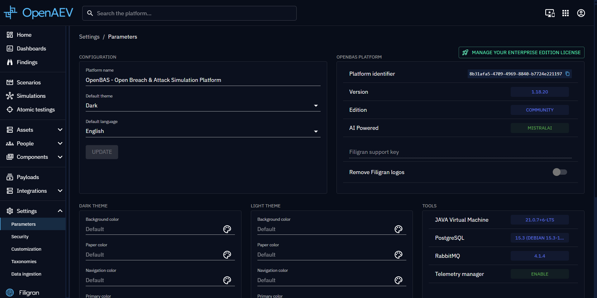
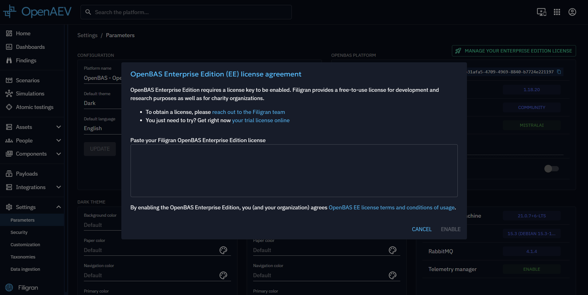

# Enterprise Edition

OpenAEV Enterprise Edition (EE) adds features on top of the Community Edition. This page explains how to activate it and lists the features it unlocks.

!!! tip "Filigran"

    [Filigran](https://filigran.io) is providing an [Enterprise Edition](https://filigran.io/offerings/openaev-enterprise-edition) of the platform, whether [on-premise](https://filigran.io/offerings/professional-support-packages) or in the [SaaS](https://filigran.io/offerings/software-as-a-service).

## What is OpenAEV EE?

OpenAEV Enterprise Edition (EE) is based on the open core concept. This means that the source code of OpenAEV EE remains open
source and included in the main GitHub repository of the platform but is published under a specific license. As
specified in the GitHub license file:

- The OpenAEV Community Edition is licensed under the Apache License, Version 2.0 (the "Apache License").
- The OpenAEV Enterprise Edition is licensed under the OpenAEV Enterprise Edition License (the "Enterprise Edition
  License").

The source files in this repository have a header indicating which license they are under. If no such header is
provided, this means that the file belongs to the Community Edition under the Apache License, Version 2.0.

## EE activation

Go to **Settings > Filigran Experience** and click **Try OpenAEV Enterprise Edition**.

Then you will need to put a valid OpenAEV EE license. If you don't have it, you
can [generate a trial license](https://filigran.io/enterprise-editions-trial/).

As a reminder:

- Filigran is the only company producing and providing OpenAEV Enterprise Edition license keys.
- Filigran can provide free-to-use OpenAEV Enterprise Edition licenses for development and research purposes (e.g. connector development, integrations with technical partners, etc.) as well as for non-governmental charity organizations.
- OpenAEV Enterprise Edition licenses are automatically provided to all Filigran SaaS customers.
- **For all other usages including on-premise deployments, OpenAEV Enterprise Edition is reserved to organizations that have signed a Filigran Enterprise agreement.**

### EE through an XTM license

OpenAEV is also in Enterprise Edition when it is registered with an XTM One instance whose XTM license
sub-licenses this platform (the license lists this platform's id, or `global`, for OpenAEV). Every Enterprise
Edition feature is then available, exactly as with an OpenAEV license. When both are valid, the OpenAEV license
takes precedence.

OpenAEV does not take XTM One's word for it: at every registration heartbeat (every 5 minutes), it verifies the
Filigran-signed XTM license certificate returned by XTM One against the Filigran certificate authority built into
OpenAEV, then applies the license validity dates (90 days of grace for standard, LTS and NFR licenses, none for trial
and CI licenses). A CI license ends at the earliest of three dates: 45 minutes after this OpenAEV instance was
created, 365 days after the start date of its certificate, and the expiration date of its certificate. The
instance creation date is recorded at the first start, in UTC, and is never reset afterwards, even when the
configured instance id changes; a CI license is refused while that date is
missing, unreadable or in the future. If the certificate is missing, does not verify or has expired, the platform is
back in Community Edition, unless it has its own OpenAEV license. While XTM One cannot be reached, the last verified certificate keeps
applying, within its validity dates.

The certificate is verified offline: it is not bound to the XTM One instance that returns it nor to a registration,
and OpenAEV cannot ask Filigran whether a sub-license is still in force. A sub-license revoked on XTM One therefore
ends when XTM One answers without the certificate, not while it cannot be reached. Likewise, a copy of a valid
certificate served from the XTM One URL configured on this platform keeps granting Enterprise Edition for as long
as its license is valid as described above: until its expiration date plus the grace period of its type, or, for a
CI license, until the earliest of its three end dates. A `global` certificate covers any OpenAEV platform.
Point the XTM One URL at a host you trust, over HTTPS. This requires XTM One 1.261001.0 or later, which returns the license certificate;
with an older XTM One, only the OpenAEV license applies and a warning is logged.

The Enterprise Edition card in **Settings > Filigran Experience** shows the license source: **XTM One license** (with the
customer, type and expiration date of the XTM license) or **OpenAEV license**.

## Available features

### Generative AI

Use AI to generate content such as emails and media pressure articles. This needs an AI provider (`ai.*` settings, see [Configuration](../reference/deployment/configuration.md)) or a connection to [XTM One](../integrations/xtm-suite/xtm-one.md).

### Executors

The following agents can execute implants as detached processes that then execute Threat Arsenal actions, according to the [OpenAEV architecture](../deployment/platform/overview.md#architecture):

- Tanium
- CrowdStrike Falcon
- SentinelOne
- Palo Alto Cortex
- Microsoft Defender for Endpoint (MDE)

See [Executors](../integrations/executors/executors.md) to set them up.

### Inject chaining workflows

Inject chaining orchestrates conditional, automated execution of injects within a scenario or simulation workflow. Creating or importing a chaining scenario or simulation requires an active Enterprise Edition license: without one, the platform rejects the operation with a license restriction error.

### Remediations in CVEs

More detail: [CVEs](taxonomies.md) and [Findings view](../usage/run-and-evaluate/findings/findings.md).

### Detection remediation in Threat Arsenal actions and Injects

More detail: [Detection remediations in Threat Arsenal Actions](../usage/build/threat-arsenals/action-properties.md#detection-remediation-properties)
and [Atomic testing remediations](../usage/run-and-evaluate/atomic-testing/atomic-testing.md).

## What's next?

- [Multi-tenancy](multi-tenancy.md) -- Host isolated Tenants on one platform (Enterprise Edition)
- [Executors](../integrations/executors/executors.md) -- Set up the executors listed above
- [Parameters](parameters.md) -- Remove Filigran logos and check the platform edition
