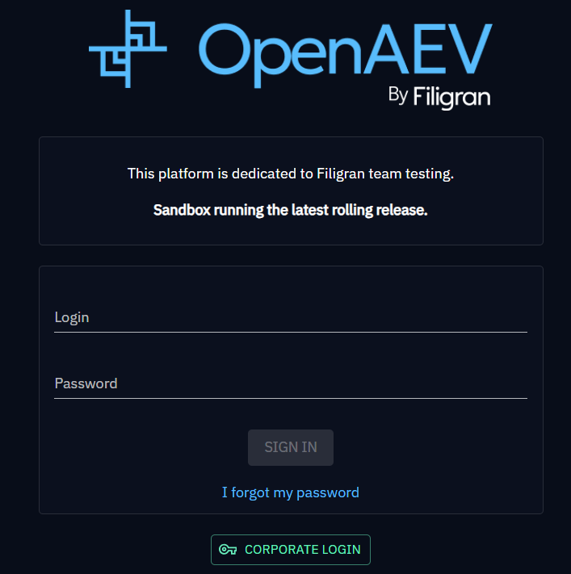
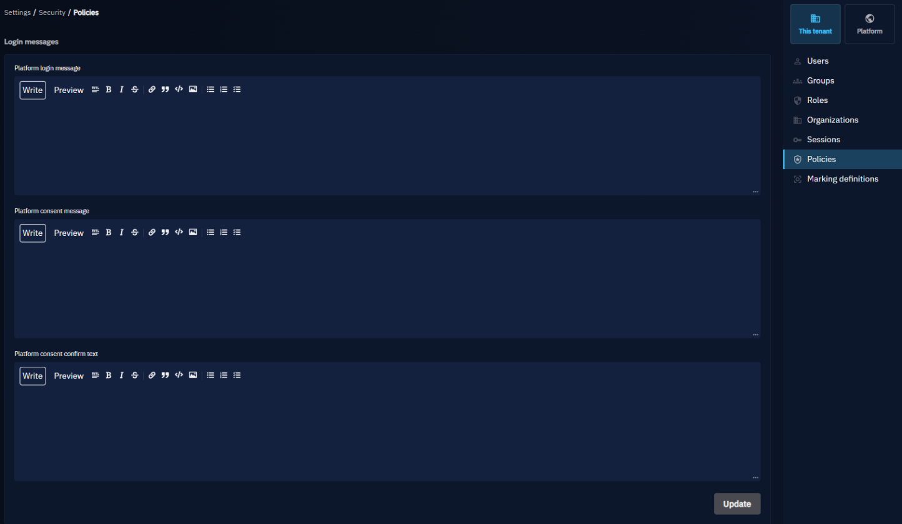

# Policies

This page explains how to configure security-related policies in OpenAEV, including login messages displayed to users during authentication.

## Login messages

In **Settings > Security > Policies**, the **Login messages** section sets three messages shown on the login page:

* **Platform login message**: shown above the login form, for announcements.
* **Platform consent message**: blocks the login form until users check a box to give their consent.
* **Platform consent confirm text**: the text next to the consent box.

<figure markdown="span">
  
</figure>

<figure markdown="span">
  
</figure>

## What's next?

- [Users and RBAC](users-and-rbac.md) -- Manage users, groups and roles
- [Authentication](../deployment/platform/authentication.md) -- Configure local, OpenID or SAML2 login
