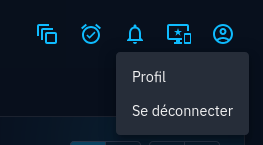
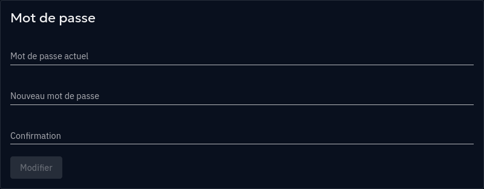
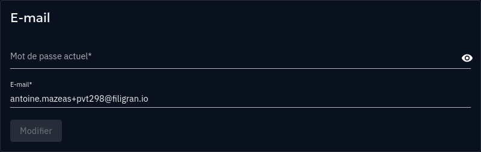

# Profile

OpenAEV gives you control over your profile and personal information.

## Accessing the profile page
Access the profile page by using the Profile menu in the top right corner of any OpenAEV screen and selecting "Profile",
or by navigating to the following URL: `https://<your_openaev_host>/admin/profile`.

<figure markdown="span">
  
</figure>

## Security sensitive profile information
The password and account email address are considered security sensitive. They require providing the current account's
password to be modified from the Profile page, to prevent possible account abuse.

Note that if the account was provisioned from an external system such as a Directory service, these sections are not
available.

### Changing the password

You may modify your password from the profile page, by scrolling down to the "Password" section. Both the new password
and its confirmation must match exactly for the password to be changed.

Once the change is applied, all opened OpenAEV sessions other than the one used for password change will be disconnected.

<figure markdown="span">
  
</figure>

### Changing the account email address

You may modify your account's email address from the profile page, by scrolling down to the "Email" section. After
filling the form with the current password and the desired new email address, the change will not immediately be
applied: the current email address will remain active, unchanged.

A confirmation email is despatched to the current email address to offer an email change confirmation, with a link
to OpenAEV. Following this link will confirm the request, and apply the account email change.   

Once the change is applied, all opened OpenAEV sessions other than the one used for account email address change will
be disconnected.

<figure markdown="span">
  
</figure>