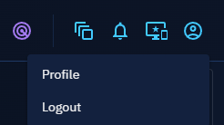
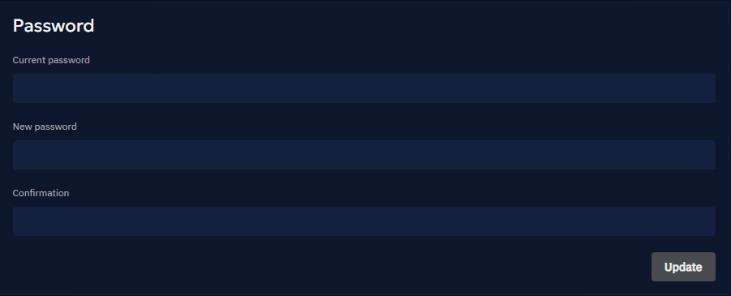
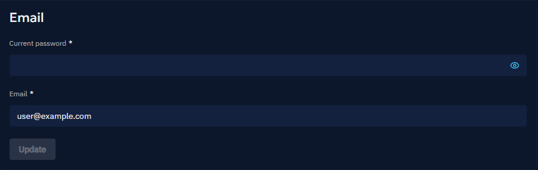

# Profile

This page explains how to manage your profile, including your password and email address.

## Accessing the profile page

Open the profile menu in the top right corner of any OpenAEV screen, then select **Profile**.

<figure markdown="span">
  
</figure>

## Security sensitive profile information

To change your password or email address, you must enter your current password.

These sections are not available if your account comes from an external identity provider (SSO).

### Changing the password

In the **Password** section, enter the new password twice. Once it is changed, all your other OpenAEV sessions are disconnected.

<figure markdown="span">
  
</figure>

### Changing the account email address

In the **Email** section, enter your current password and the new email address. The change is not applied right away:
OpenAEV sends a confirmation link to your current email address. Once you open the link, the new address is applied and
all your other OpenAEV sessions are disconnected.

<figure markdown="span">
  
</figure>

## What's next?

- [Users and RBAC](users-and-rbac.md) -- How administrators manage users
- [Notifications](../usage/run-and-evaluate/notifications/overview.md) -- Manage your notifications from your profile
