# Users

You can manage users in **Settings > Security > Users**. If you are using Single Sign-On (SSO), user accounts in OpenAEV are automatically created upon login.

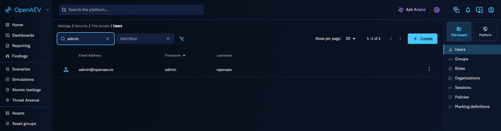

To create a user, click **Create**:

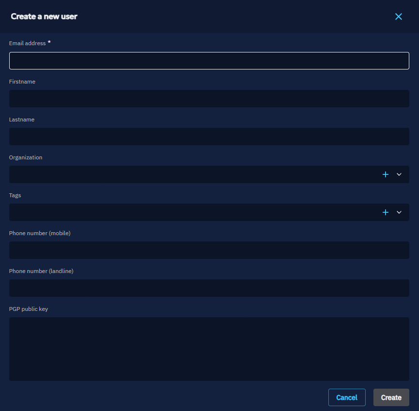
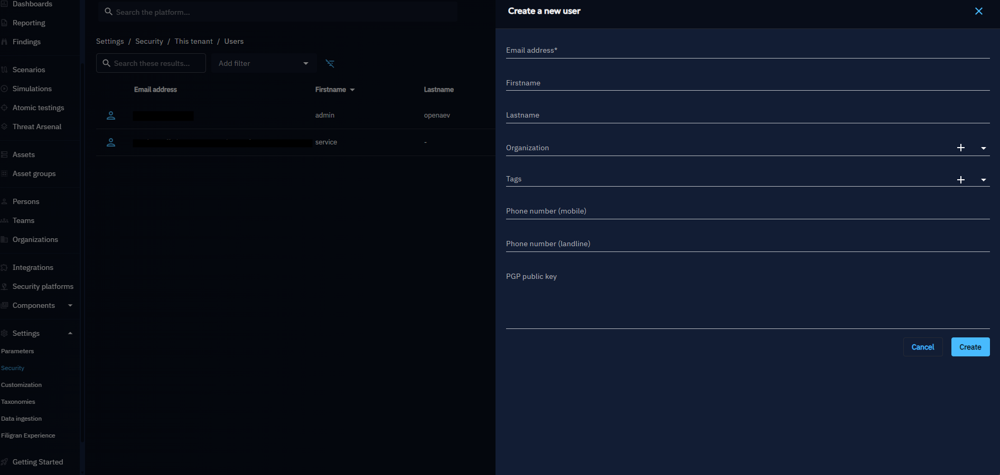

- If the user does not exist yet, OpenAEV creates the account and automatically sends a reset code
  by email so the user can choose their own password.
- If the user already exists, OpenAEV attaches that user to your tenant and keeps their current
  password unchanged.

The user can complete onboarding from the login reset screen in two ways:

1. Request a new code with **Send reset code**.
2. If they already received one, click **I already have a code** and enter it directly.

To update a user, click on the ellipsis menu:

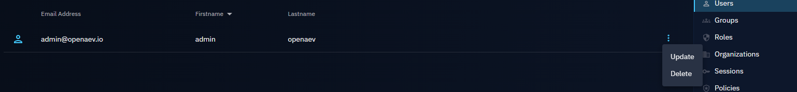

Here, you can modify parameters such as the organization, phone number, and PGP public key:

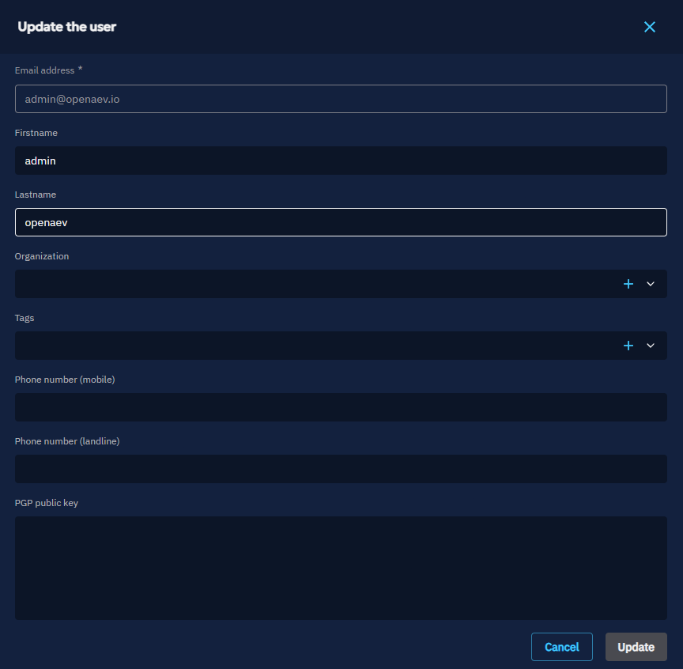

To delete a user:

You cannot delete the platform administrator account or your own account.

## User permissions

Role-Based Access Control (RBAC) is the way OpenAEV manages who can do what inside the platform.
Each user belongs to a group, and this group has one or more roles that define its **capabilities**.

Capabilities determine what features a user can access.
If a user does not have the right capability, the option will simply not be available to them.

In addition to general capabilities, OpenAEV also supports **grants**. Grants are more precise: they allow access to a specific resource, such as one particular Simulation, without giving the user access to all Simulations.

!!! warning "Default read access"

    Some elements in OpenAEV are always visible to all users, regardless of their assigned capabilities or grants.

    By default, the following features are open for everyone:

      - **Teams**
      - **Players**
      - **Taxonomies** (in the Settings)

    Users can view these elements without needing any specific capability, but additional rights are required if they want to manage them.

## How to create a role

To create a new role in OpenAEV:

1. Go to **Settings > Security > Roles**.
2. Click on **Create role**. Enter a **name** and an optional **description** for the role.
3. Select the **capabilities** that should be included in this role.
4. Save the role.

### Capabilities

Most capabilities come in three levels: **Access** (view), **Manage** (create and update) and **Delete**. Each level needs the one before it: selecting **Delete** also selects **Manage** and **Access**.

Platform settings, Tenants and the platform users, groups, roles and sessions capabilities belong to platform roles. The others belong to Tenant roles.

| Capability | Levels | Covers |
|:-----------|:-------|:-------|
| `Bypass (user has all rights)` | -- | All features, bypassing every capability check and data segregation |
| `Access dashboards` | Access, Manage, Delete | Dashboards |
| `Access reportings` | Access, Manage, Delete | Reports |
| `Access findings` | Access | Findings from Simulations and Atomic Tests |
| `Access assessment` | Access, Manage, Delete, Launch | Scenarios, Simulations and Atomic Tests; `Launch assessment` needs only Access |
| `Access threat arsenal` | Access, Manage, Delete | Threat Arsenal actions |
| `Access teams & persons` | Access, Manage, Delete | Teams and Players |
| `Access assets` | Access, Manage, Delete | Assets and asset groups |
| `Access security platforms` | Access, Manage, Delete | Security platform integrations |
| `Access documents` | Access, Manage, Delete | Documents |
| `Access channels` | Access, Manage, Delete | Channels |
| `Access phishing` | Access, Manage, Delete | Phishing landing pages and email templates |
| `Access challenges` | Access, Manage, Delete | Challenges |
| `Access lessons learned` | Access, Manage, Delete | Lessons learned |
| `Access platform settings` | Access, Manage | Platform-wide settings |
| `Access tenant settings` | Access, Manage, Delete | Tenant settings: tag rules, attack patterns, organizations, collectors, injectors, notifiers |
| `Access tenant users, groups and roles` | Access, Manage, Delete | The Tenant's users, groups and roles |
| `Manage tenant sessions` | -- | The Tenant's user sessions |
| `Access platform users, groups and roles` | Access, Manage, Delete | Platform users, groups and roles |
| `Manage platform sessions` | -- | Platform user sessions |
| `Install agent` | -- | Agent install command, installer token and agent binaries |
| `Access tags` | Access, Manage, Delete | Tags |
| `Access tenants` | Access, Manage, Delete | Tenants |

Once the role is created, it can be assigned to a **group**. All users in that group will automatically inherit the role's permissions.

## Delegating capabilities

A user can only grant what they hold themselves. This prevents privilege escalation: no one can widen their own reach, or someone else's, beyond their own capabilities. The rule is enforced by the API, and the interface shows it before anything is submitted.

Users with the `Bypass (user has all rights)` capability hold everything, so they never see these restrictions.

### In a role

When creating or updating a role, capabilities you do not hold are shown in grey with a padlock, and their checkbox is disabled. A capability group whose entire content is locked is greyed as a whole.

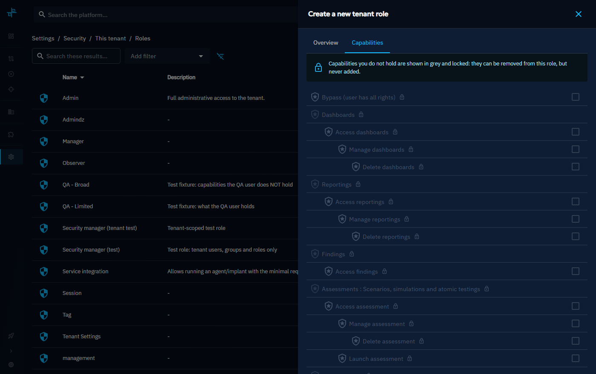

A locked capability that the role **already carries** stays removable: you can narrow an existing role even where you could not have created it. What you cannot do is add such a capability back. If a restricted capability is still selected when you save, the form refuses and lists the capabilities to remove.

!!! warning "Narrowing is possible, widening is not"

    Removing a capability you do not hold is allowed, and it is a one-way door: once removed and saved, you will not be able to put it back.

### In a group's roles

The same rule applies when attaching roles to a group. A role carrying at least one capability you do not hold is locked in the picker, and the **Update** button stays disabled while such a role is selected.

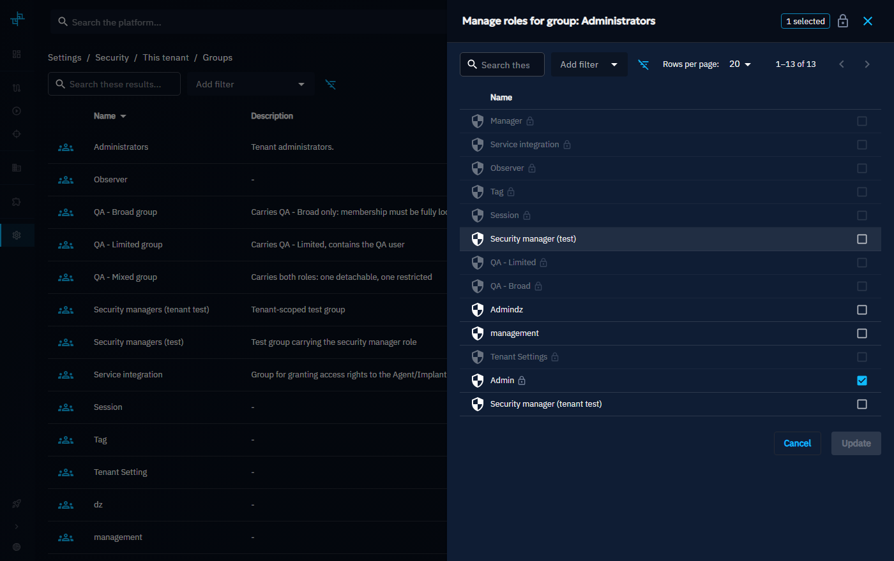

Here too, a restricted role already attached to the group can be detached, but not re-attached.

### In a group's members

Group membership is governed by the capabilities the group's own roles carry. If those roles include capabilities you do not hold, adding or removing a member would indirectly grant or revoke them, so the whole member list is frozen and a message names the missing capabilities.

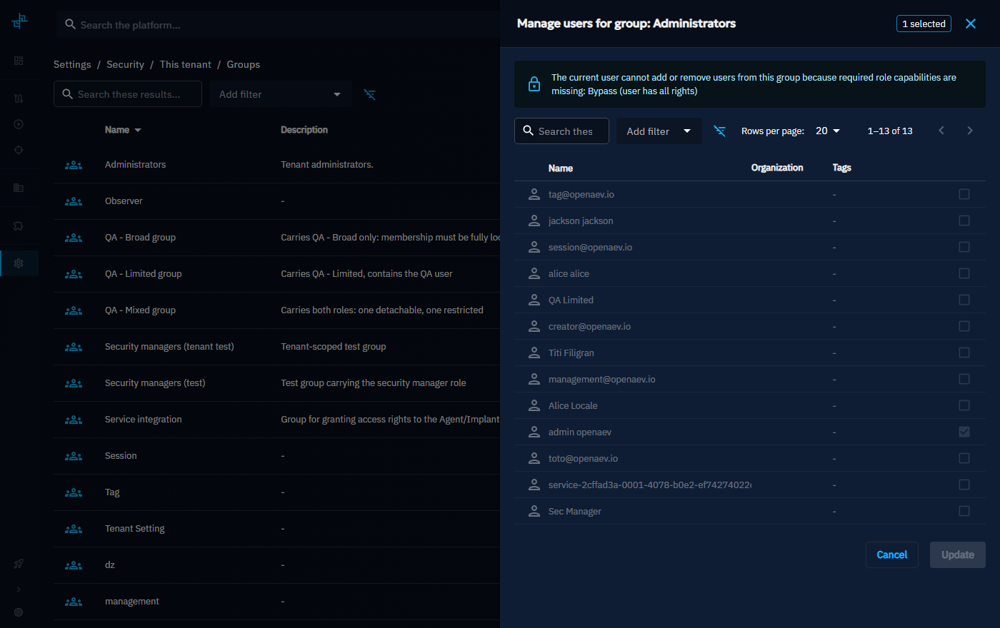

!!! tip "Getting access"

    These restrictions follow your own capabilities, not your seniority. To manage a role or a group you are locked out of, ask an administrator to grant you the missing capabilities listed in the message.

## Example: creating a scenario designer role

> Role: Scenario designer

**Context:** This user is in charge of designing crisis management content. Their role is to create **Scenarios** that can later be reused by other Teams to run Simulations.
For example, they might build an **"Earthquake Crisis Scenario"**.

**Capabilities:**

- **Security**: `Manage tenant users, groups and roles` to assign grants to groups
- **Assessments**: `Manage assessment` and `Launch assessment`

With this role, the user can design new Scenarios, and configure everything needed to prepare Simulations.
For instance, they may create a **"Earthquake Crisis Template"**, which becomes the foundation for future Simulations.

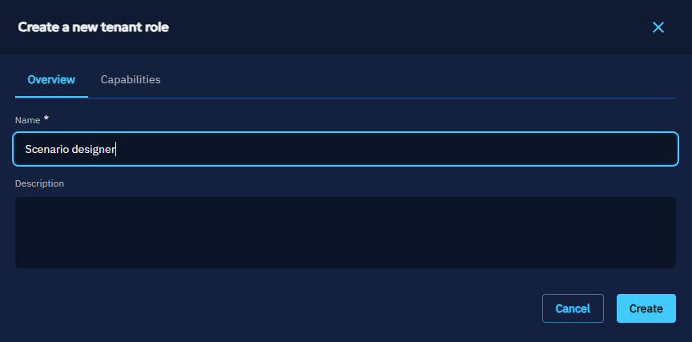
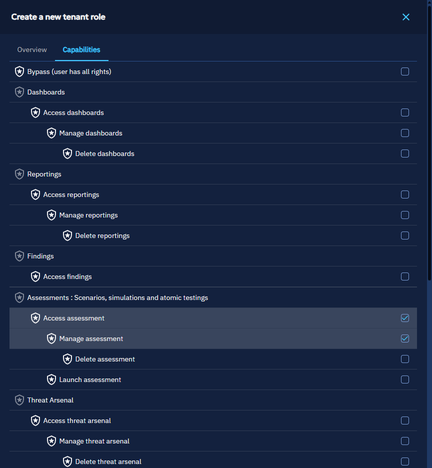

Then, the user will be able to create a Scenario, launch it and grant their group on this Simulation.

## Grants

### How to grant a Simulation to a user

Beyond global **capabilities** defined in roles, OpenAEV also allows assigning more precise **grants**. Grants define permissions on specific resources (for example, one Simulation), and they are always managed at the **group** level.

**To grant a Simulation to a user:**

1. Go to **Settings > Security > Groups**.
2. Click on **Manage grants** in the group options.
3. A drawer will open with the available resources:
    - Scenarios
    - Simulations
    - Atomic testings
    - Threat Arsenal
4. Select the specific items you want the group to access and assign the appropriate grant level.

   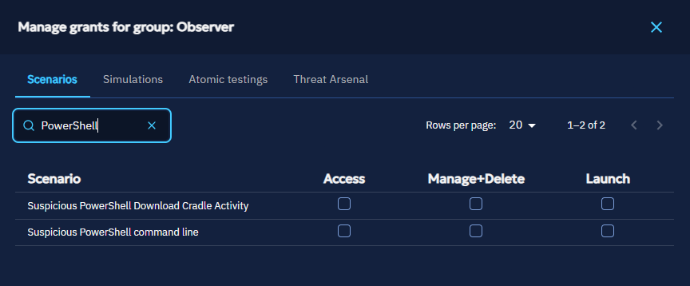

### Types of grants

There are three levels of granularity:

| Grant   | Rights included                       |
|---------|---------------------------------------|
| Access  | View only                             |
| Manage  | Access + edit and delete              |
| Launch  | Manage + ability to launch tests      |

### Example: local coordinator

> Role: Local coordinator

**Context:** This user is not a global content creator. Instead, they are trained locally to run a specific Simulation designed by the content creator.
They do not need all capabilities -- only access to the resources explicitly granted to them.

**Grants assigned through their group:**

- **Simulation** -- *Launch* on the Simulation based on the "Earthquake Crisis"

The content creator trains a local coordinator, who gets *Launch* on the Simulation built from the *Earthquake Crisis Scenario* and cannot see or modify other Simulations or Scenarios.

### Special cases

!!! tip "Simulations, Scenarios, and Atomic Tests"

    A user can access these either through specific **grants**, or globally if the group has the `Access assessment` capability (which overrides individual grants).

!!! tip "Threat arsenal actions"

    Access is given either through specific **grants**, or globally if the group has the `Access threat arsenal` capability.

## Capability dependencies

In some cases, performing an action in OpenAEV requires more than one capability.
If a required capability is missing, the action will be blocked and a warning message will explain which capability is missing.

### Example

- In **Scenarios**, when creating an article, the user also needs the capability to **access Channels**.
- If the user does not have this capability, the article cannot be created.
- A warning will be displayed, indicating that the necessary capability is missing.

  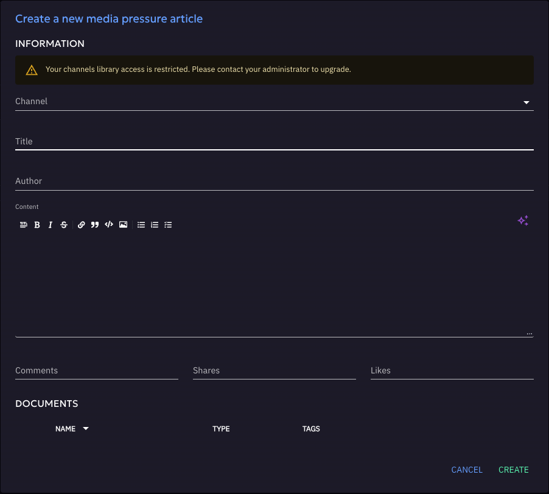

This mechanism ensures consistency across the platform: actions that depend on other features cannot be performed without the proper access.

## What's next?

- [Multi-tenancy](multi-tenancy.md) -- Manage Tenants and platform-level users, groups and roles
- [Policies](policies.md) -- Configure login messages and consent banners
- [Authentication](../deployment/platform/authentication.md) -- Set up SSO providers
