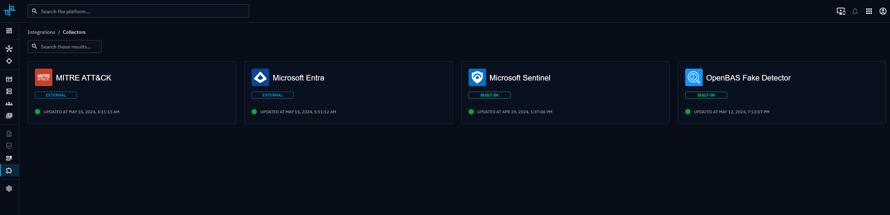

# Collectors

!!! tip "Tips"

      If you want to learn more about the concept and features of collectors, you can have more info [here](../../usage/environment/collectors.md).

!!! question "Collectors list"

    You are looking for the available collectors? The list is in the [OpenAEV Ecosystem](https://filigran.notion.site/OpenAEV-Ecosystem-30d8eb73d7d04611843e758ddef8941b).


## Installing a collector

There are multiple ways to deploy a collector from OpenAEV:

- Integration Manager (Recommended)
- Docker deployment
- Manual deployment

!!! info

    All collectors require access to the OpenAEV API. See [Configuration](#configuration) for required parameters.

### Integration Manager (recommended)
The easiest way to deploy collectors is through the Integration Manager, which allows automatic deployment directly from the OpenAEV interface.

See the [Integration Manager documentation](integration-manager/overview.md) for detailed instructions.


### Docker deployment
Several options are available for Docker deployment:

#### Add a collector to your existing deployment
For instance, to enable the MITRE ATT&CK collector, you can add a new service to your `docker-compose.yml` file:

```docker
  collector-mitre-attack:
    image: openaev/collector-mitre-attack:1.0.0
    environment:
      - OPENAEV_URL=http://localhost
      - OPENAEV_TOKEN=ChangeMe
      - COLLECTOR_ID=ChangeMe
      - "COLLECTOR_NAME=MITRE ATT&CK"
      - COLLECTOR_LOG_LEVEL=error
    restart: always
```
Note: Collector images and available versions can be found on Docker Hub.

#### Launch a standalone collector
To launch a standalone collector, you can use the `docker-compose.yml` file of the collector itself. Just download the latest [release](https://github.com/OpenAEV-Platform/collectors/releases) and start the collector:

```
$ wget https://github.com/OpenAEV-Platform/collectors/archive/{RELEASE_VERSION}.zip
$ unzip {RELEASE_VERSION}.zip
$ cd collectors-{RELEASE_VERSION}/mitre-attack/
```

Change the configuration in the `docker-compose.yml` according to the parameters of the platform and of the targeted service. Then launch the collector:

```
$ docker compose up
```

### Manual deployment
If you want to manually launch a collector without docker, you just have to install Python 3 and pip3 for dependencies:

```
$ apt install python3 python3-pip
```

Download the release of the collectors:

```
$ wget <https://github.com/OpenAEV-Platform/collectors/archive/{RELEASE_VERSION}.zip>
$ unzip {RELEASE_VERSION}.zip
$ cd collectors-{RELEASE_VERSION}/mitre-attack/src/
```

Install dependencies and initialize the configuration:

```
$ pip3 install -r requirements.txt
$ cp config.yml.sample config.yml
```

Change the `config.yml` content according to the parameters of the platform and of the targeted service.
For example :

```yaml

openaev:
  url: 'http://localhost:3001'
  token: 'ChangeMe'

collector:
  id: 'ChangeMe'
  name: 'MITRE ATT&CK'
  log_level: 'info'

```


Finally : launch the collector:

```
$ python3 openaev_mitre.py
```

### Configuration

All external collectors have to be able to access the OpenAEV API. To allow this connection, they have 2 mandatory configuration parameters, the `OPENAEV_URL` and the `OPENAEV_TOKEN`. In addition to these 2 parameters, collectors have other mandatory parameters that need to be set to make them work.

!!! info "Collector tokens"

    You can use your administrator token or [create a dedicated account](#create-a-dedicated-account-for-collectors) to put in your collectors. It is not necessary to have one dedicated user for each collector.

    When you deploy a collector from the Integration Manager, OpenAEV fills `OPENAEV_TOKEN` with the token of the user who creates the instance, and `OPENAEV_TENANT_ID` with the current Tenant.

Here is an example of a collector `docker-compose.yml` file:
```yaml
- OPENAEV_URL=http://localhost
- OPENAEV_TOKEN=ChangeMe
- COLLECTOR_ID=ChangeMe # Specify a valid UUIDv4 of your choice 
- "COLLECTOR_NAME=MITRE ATT&CK"
- COLLECTOR_LOG_LEVEL=error
```

Here is an example in a collector `config.yml` file:

```yaml
openaev:
  url: 'http://localhost:3001'
  token: 'ChangeMe'

collector:
  id: 'ChangeMe'
  name: 'MITRE ATT&CK'
  log_level: 'info'
```

### Run a collector outside the Integration Manager

You can run a collector on your own network, for example next to an on-premises SIEM when OpenAEV is hosted as SaaS.

The collector only opens outbound connections: to the OpenAEV URL and to the tool it collects from. OpenAEV never
connects to the collector, so the collector host needs no inbound port. Allow outbound HTTPS from this host to your
OpenAEV URL.

#### Create a dedicated account for collectors

1. Go to **Settings > Security > Users** and click `+`. Use an email address whose mailbox you can read: OpenAEV sends a
   reset code to this address to set the password.
2. Go to **Settings > Security > Groups** and add the user to a Group whose Role has the
   **Bypass (user has all rights)** capability, so the account has the same rights as an administrator token (see
   [Users and RBAC](../../administration/users-and-rbac.md)).
3. Log in with this account, open the [Profile](../../administration/profile.md) page, and copy the token from the
   **API access** section. Only the account owner sees this token.
4. Set `OPENAEV_URL`, `OPENAEV_TOKEN`, and `OPENAEV_TENANT_ID` in the collector configuration. The Tenant ID is the
   **Tenant identifier** shown in **Settings > Parameters**.
5. Start the collector with [Docker](#docker-deployment) or [manually](#manual-deployment).

!!! warning

    **RENEW** in the **API access** section replaces the token. Collectors that use the old token stop working until you update them.

## Collectors status

The Collector status can be displayed in the dedicated section of the platform available in **Integrations > Collectors**. You will be able to see the statistics of the RabbitMQ queue of the Collector:


