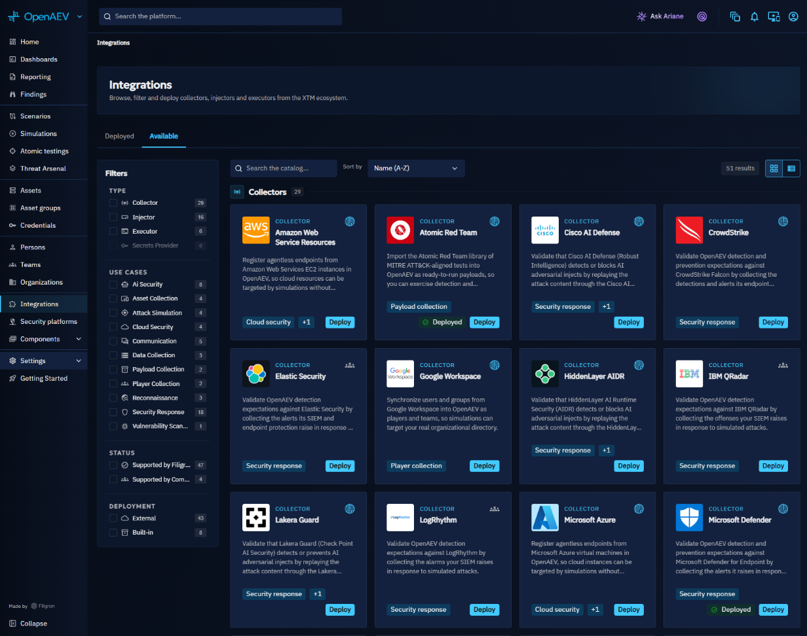
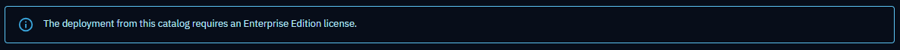
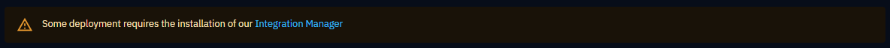
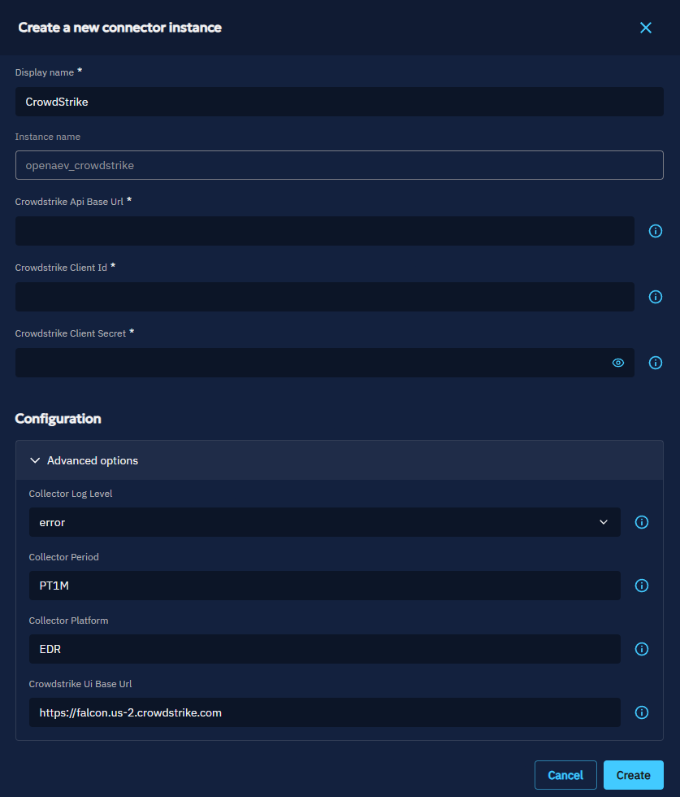

# Integration Manager

The Integration Manager (XTM Composer) deploys and manages **external** Collectors, Injectors and Executors from the OpenAEV UI. Built-in ones are part of the platform and do not need it.

## Architecture

To learn more about the XTM Composer architecture, refer to the [dedicated documentation](https://docs.opencti.io/latest/deployment/integration-manager/architecture/).

## How to use in OpenAEV

### Prerequisites

- An **Enterprise Edition license** is required to use this feature. Without it, the catalog is available in read-only mode. You can enter the license key from:
    - the **Deploy** action on a collector, injector, or executor card,
    - the collector, injector, or executor's detail view,
    - or the **Settings** page.

- The **Integration Manager** must be installed and operational to deploy collectors, injectors or executors.

!!! info "Built-in and external connectors"

    You will find two types of connectors in the platform:

    - **Built-in connectors**: Connectors which are internally implemented.  
      This category includes:
        - **Auto-start connectors**, which are natively integrated into the core platform — no additional deployment required. These connectors are automatically started and cannot be managed on the UI, even though they are still visible in the dedicated pages.
        - **Standard built-in connectors**, which are also automatically started but can be started and stopped by the user through the UI.
    - **External connectors**: These are deployed and configured by the user.
    In the catalog, only external connectors can be retrieved. The following sections focus on how to deploy, configure, and manage these **external** connectors.

## Browsing the catalog

- Open **Integrations** and the **Available** tab, which lists the catalog
- Use the search bar to find collectors, injectors and executors by name or description. You can also apply filters (e.g., by collector, executor or injector type).
- Deployed Collectors, Injectors and Executors are listed in the **Deployed** tab.

## Deploying a collector, injector or executor

1. Click the **Deploy** button on an external collector, injector or executor card or from the detail view. A form will appear with required configuration fields.
2. Fill in the required options (you can also expand **Advanced options** to configure additional settings)
   

    !!! note "Configuration information"
      
        - **Instance names**: Two instances can't share the same name
        - **Validation error**: If a duplicate name is detected, a blocking error will prevent deployment until a unique name is provided
        - **Log level**: the log level of the instance.
        - **Additional options**: collector, injector or executor specific configuration.

3. Click **Create**. Once the collector is created, you will be redirected to the collector instance view.

    !!! note "Instance created"
    
        Newly created external collectors, injectors or executors are not started automatically. 
        You can still update their configuration via the **Update** action.

4. When ready, click **Start** to run it.
5. From the instance view, you can also check the **Logs** tab. The displayed logs depend on the logging level configured.

## Migrating an existing connector

If you have a connector that was previously deployed manually (outside the Integration Manager), you can **migrate** it so that its settings are managed directly from the UI.

### Prerequisites

- An **Enterprise Edition license** is active
- The **Integration Manager** is running
- The user has the **Manage Platform Settings** permission
- The connector is **external** (not built-in) and has no existing managed instance

### Migration flow

1. Navigate to the connector's card in the Catalog or its detail page. A **Migrate** button is displayed when the conditions above are met.
2. Click **Migrate**. A drawer opens with the configuration form (same fields as a new deployment).
3. Fill in the required configuration options.
4. Click **Migrate** to confirm. The connector is re-registered under the Integration Manager, preserving its existing identifier.
5. You are redirected to the new managed instance view.

After migration, the connector can be fully managed from the UI: start/stop, update configuration, and view logs — just like any other deployed instance.

The initial connector may be shut down at this point. Remove the container, or contact your customer support if the OpenAEV instance is managed by a service provider.

## Managing the instances

- The catalog shows two types:
    - **External**: managed by the Integration Manager.
    - **Built-in**: part of the core platform, no deployment needed.
- Managed instances are either *Started* or *Stopped*.
- Only **managed instances** can be started/stopped from the UI. They are also the only ones that provide logs in the interface.
- Updating the configuration of a managed instance is possible. Changes will take effect after a short delay.
- For security reasons, API keys/tokens are encrypted when saved and never displayed in the UI afterward.

## What's next?

- [Quick start](quick-start.md) -- Install the Integration Manager in a few steps
- [Configuration reference](configuration.md) -- All Integration Manager parameters
