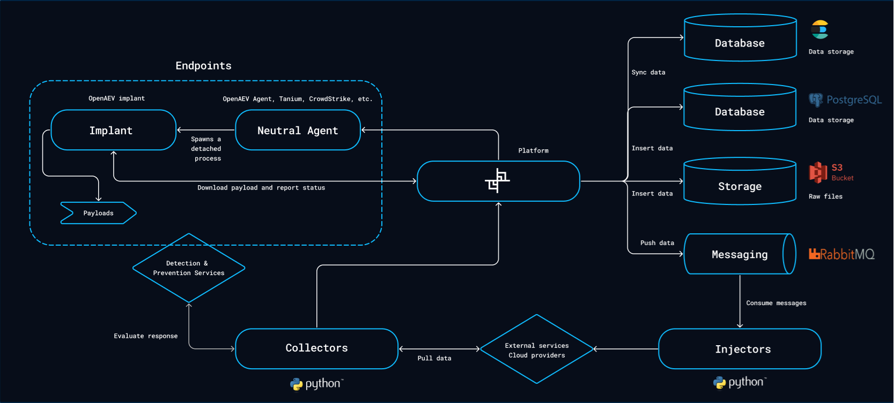

# Overview

This page describes the OpenAEV architecture, its dependencies and the minimum resources to run it in production.

!!! tip "Docker deployment"

    To deploy OpenAEV alone with Docker, use the [OpenAEV Docker repository](https://github.com/OpenAEV-Platform/docker). To deploy the full eXtended Threat Management (XTM) suite (OpenCTI, OpenAEV and XTM One), use the [XTM Docker repository](https://github.com/FiligranHQ/xtm-docker).

## Architecture

The OpenAEV platform relies on several external databases and services.

### Platform

The platform is the central component. Users configure Scenarios, Simulations, Atomic Tests and all the other components used to validate their security.

### Agents and Executors

Executors launch simulated attacks on endpoints. OpenAEV ships its own agent and also supports third-party agents. See [Executors](../../integrations/executors/executors.md).

### Injectors

Injectors interact with third-party applications or services (including execution on endpoints through Executors) during a Simulation or an Atomic Test. A few Injectors are built in, most are standalone Python processes. See [Deploy Injectors](../../integrations/injectors/deploy-injectors.md).

### Collectors

Collectors connect to security systems such as SIEM (Security Information and Event Management), EDR (Endpoint Detection and Response), XDR (Extended Detection and Response), firewalls or mail gateways. They check whether an Inject was detected or prevented. See [Deploy Collectors](../../integrations/collectors/deploy-collectors.md).

## Infrastructure requirements

### Dependencies

| Component     | Recommended version             | CPU     | RAM     | Disk type | Disk space |
|:--------------|:--------------------------------|:--------|:--------|:----------|:-----------|
| PostgreSQL    | ≥ 17.0                          | 2 cores | ≥ 8GB   | SSD       | ≥ 16GB     |
| ElasticSearch | ≥ 8.19                          | 2 cores | ≥ 8GB   | SSD       | ≥ 16GB     |
| RabbitMQ      | >= 4.3                          | 1 core  | ≥ 512MB | Standard  | ≥ 2GB      |
| S3 / Silo     | latest (Silo is a MinIO fork)   | 1 core  | ≥ 128MB | SSD       | ≥ 16GB     |

Please note that while the versions of these dependencies are the recommended ones, OpenAEV may still function with
earlier versions. However, we will not provide support for versions prior to the recommended ones.

Elasticsearch 9 is also supported: set `engine.engine-selector` to `elk9` (see [Configuration](../../reference/deployment/configuration.md)).

### Platform

| Component     | CPU     | RAM     | Disk type        | Disk space |
|:--------------|:--------|:--------|:-----------------|:-----------|
| OpenAEV Core  | 2 cores | ≥ 8GB   | None (stateless) | -          |
| Injector(s)   | 1 core  | ≥ 128MB | None (stateless) | -          |
| Collector(s)  | 1 core  | ≥ 128MB | None (stateless) | -          |

## What's next?

- [Installation](installation.md) -- Deploy OpenAEV with Docker or manually
- [Configuration](../../reference/deployment/configuration.md) -- Platform configuration parameters
