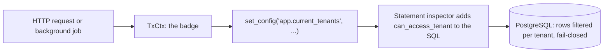
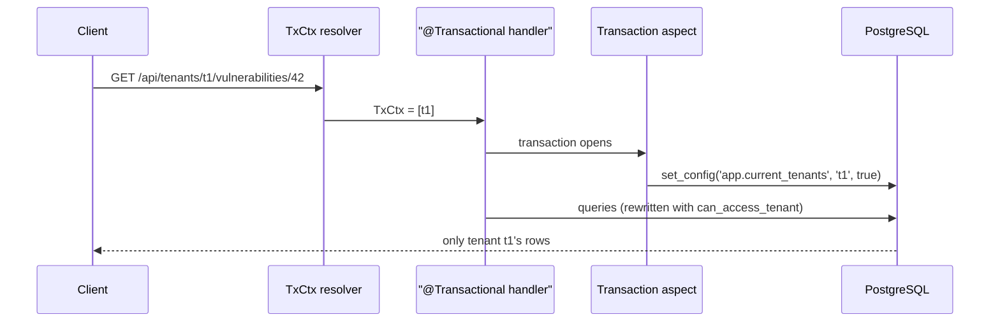
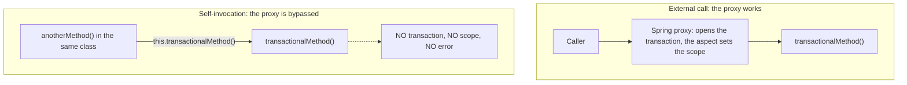
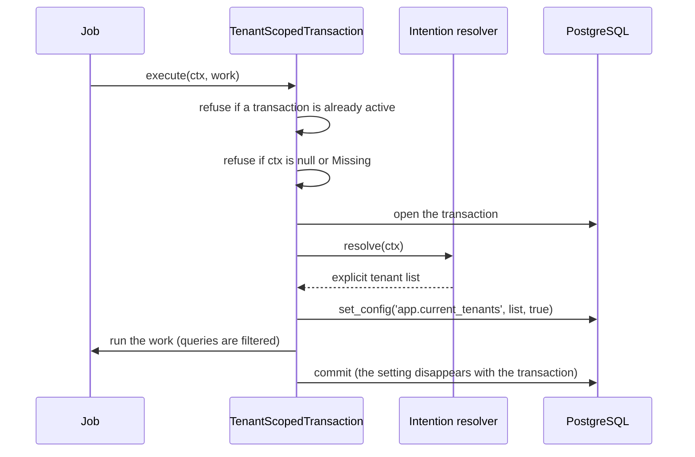
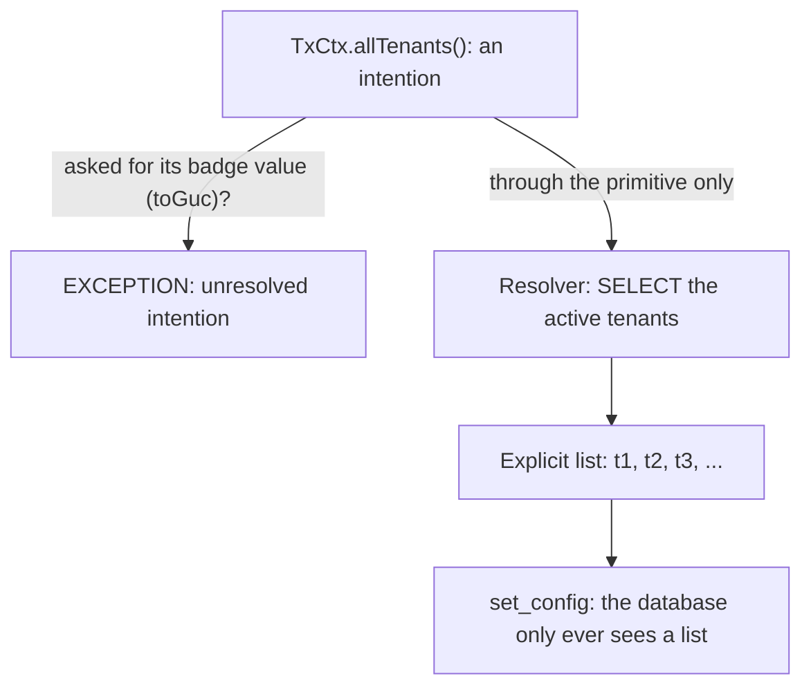
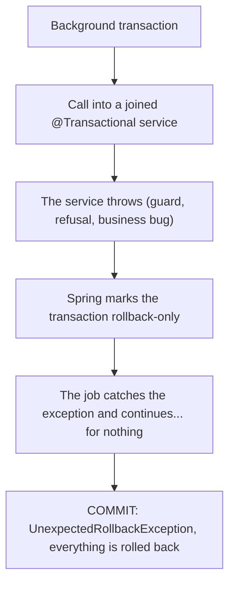
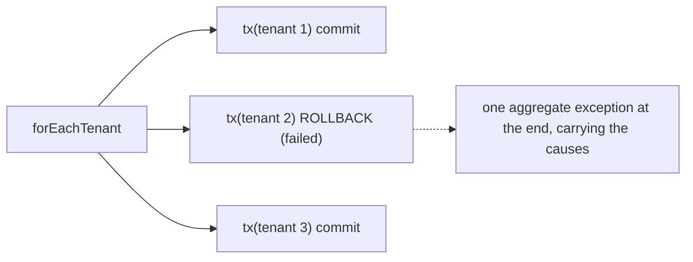

# Tenant isolation

OpenAEV can host several organizations, called tenants, in a single PostgreSQL database. The
security rule behind multi-tenancy is simple to state: a tenant must never see or modify another
tenant's data.

This page explains how the platform enforces that rule at the SQL layer, how a request or a
background job obtains its tenant scope, and what you need to know when you write code that touches
a tenant-isolated table.

!!! info "Who should read this"
    Anyone contributing to the OpenAEV backend. The isolation mechanism changes how you write
    controllers, services and background jobs, and the most common mistakes fail silently by
    design. Reading this page first will save you a debugging session.

## The idea in one paragraph

Think of the tenant scope as a badge. Every database transaction carries a badge that lists the
tenants it is allowed to see. The database checks the badge on every row of the activated tables.
No badge means no rows: the mechanism is **fail-closed**. When something is misconfigured, the
result is an empty result set rather than another tenant's rows.

Three components cooperate to make this work:

- **`TxCtx`** is the badge as a Java object. It says "this transaction may see tenants A and B".
  It is passed explicitly as a method parameter.
- **The transaction aspect** fires when a `@Transactional` method runs. It reads the `TxCtx`
  parameter and writes the badge into the database with
  `set_config('app.current_tenants', ..., true)`. This setting is transaction-local: it disappears
  at commit.
- **The statement inspector** (`TenantStatementInspector`) rewrites every SQL statement that
  touches an isolated table, adding a call to the SQL function `can_access_tenant(tenant_id)`.
  The function compares each row's tenant with the badge. A row outside the badge is invisible.



Isolation is activated table by table. The list of isolated tables lives in the
`openaev.tenant.active-tables` property. A table that is not in the list is not rewritten.

## How an HTTP request gets its scope

A request can name the tenants it wants to work with in two ways:

- the tenant path: `/api/tenants/{tenantId}/...`
- the `X-Tenant-Ids` header on the regular path

If the request names no tenant, the scope defaults to every tenant the caller is a member of.
Naming a tenant outside the caller's memberships is rejected.

The resolved scope becomes a `TxCtx` parameter on the controller handler. A dedicated argument
resolver (`TxCtxArgumentResolver`) builds it from the request; you never construct it yourself in
a controller:

```java
@Transactional
@GetMapping({VULNERABILITY_API + "/{id}", TENANT_VULNERABILITY_API + "/{id}"})
public VulnerabilityOutput getVulnerability(TxCtx ctx, @PathVariable String id) {
    // the handler body does not use ctx: the transaction aspect does
    return mapper.toOutput(service.findById(id));
}
```



!!! warning "The TxCtx parameter looks unused. It is not."
    The handler body never touches `ctx`. The aspect reads it from the method arguments when the
    transaction opens. If a refactoring removes the parameter, the endpoint silently loses its
    scope and every query on an isolated table returns nothing. An architecture test
    (`TenantScopedEntrypointsTxCtxArchTest`) fails the build when a registered endpoint loses its
    `TxCtx`.

Two details matter here:

- The aspect only fires on `@Transactional` methods. A `TxCtx` parameter on a method without the
  annotation is ignored, and the endpoint stays fail-closed.
- Once a transaction carries a scope, a nested `@Transactional` call must not redefine it. The
  aspect refuses a different `TxCtx` inside the same transaction.

## How the SQL is rewritten

The inspector parses every statement that mentions an isolated table and adds the tenant check.
A `SELECT` gets its table wrapped in a filtered sub-query:

```sql
-- before
SELECT * FROM cwes WHERE cwe_external_id = ?
-- after
SELECT * FROM (SELECT * FROM cwes cwes WHERE can_access_tenant(cwes.tenant_id)) AS cwes
WHERE cwe_external_id = ?
```

An `UPDATE` or `DELETE` gets the check added to its `WHERE` clause. An `INSERT ... SELECT` into an
isolated table must set `tenant_id` explicitly, and the inserted value is validated against the
scope. Plain `INSERT ... VALUES` statements are not blocked: assigning the tenant of a new row is
the application's job (see the next section).

The rewriting is fail-closed too. When the inspector meets a SQL shape it cannot parse or does not
cover, it refuses the statement with a `TenantFilteringException` rather than letting it run
unfiltered. This has one practical consequence for contributors:

!!! warning "Native queries on isolated tables must be exercised by a test"
    Native queries written through Hibernate (`@Query(nativeQuery = true)`,
    `entityManager.createNativeQuery(...)`) DO go through the inspector. If your hand-written SQL
    uses a shape the rewriter does not support, the query will break loudly once the table is
    activated. Cover every native query on an isolated table with an integration test so this
    surfaces in CI, not in production.

Raw JDBC (`JdbcTemplate`, direct `Connection` usage) bypasses Hibernate entirely, so the inspector
never sees it. An architecture test (`TenantNonOrmAccessArchTest`) forbids raw JDBC in production
code outside a small audited allowlist. Tenant data must be accessed through Hibernate.

## Writing data: one row, one tenant

Reading is filtered by the inspector. Writing needs one more step: a new row must be assigned to
exactly one tenant. The component responsible for this is `TenantWriteScopeResolver`:

```java
String tenantId = writeScopeResolver.tenantForWrite(ctx, null);
entity.setTenant(new Tenant(tenantId));
```

The resolver applies three rules:

- a single-tenant scope resolves to that tenant;
- a supplied tenant outside the scope is refused (HTTP 400);
- a multi-tenant scope with no explicit selector is refused (HTTP 400): the platform never guesses
  which tenant should own a new row.

### The find-or-create trap

Isolated tables use per-tenant unique keys: two tenants may both own a row with the same business
key (for example, two tenants each have their own `CWE-79` row). This breaks a common pattern.
A find-or-create that looks up by the bare business key can match one row per tenant in scope,
which either crashes or silently links another tenant's row.

The correct order is always:

1. resolve the write tenant first: `tenantForWrite(ctx, null)` fails fast on an ambiguous scope;
2. look up by the per-tenant unique key, business key plus tenant
   (`findByExternalIdAndTenantId(key, writeTenant)`);
3. create the row with that same tenant if nothing was found.

## Background work: the transaction primitive

Background code (scheduled jobs, queue consumers, startup tasks) does not receive HTTP requests,
so nothing resolves a scope for it. It also cannot safely rely on `@Transactional`, because of a
known Spring pitfall: the self-invocation trap.

### Why `@Transactional` is banned in background code

Spring implements `@Transactional` with a proxy that wraps the class. Only calls coming from
outside the class go through the proxy. When a method calls another `@Transactional` method of the
same class, the call stays internal: no proxy, no transaction, and for us no scope. Nothing fails.
The code simply runs without the badge.



A silent failure is unacceptable for a security mechanism. Background code therefore opens its
transactions through an explicit object that cannot be bypassed by accident:
`TenantScopedTransaction`.

### The primitive

```java
tenantTx.execute(TxCtx.forTenant(tenantId), () -> {
    // the transaction is open AND the scope is set
    return repository.count();
});
```



The primitive has two entry points. `execute()` opens a top-level transaction: this is the normal
door. `executeNew()` opens a nested `REQUIRES_NEW` transaction from inside an existing one, for
the rare cases where a failure must be isolated or a narrower scope is needed deliberately.

The primitive is strict on purpose. Each guard exists because the silent alternative was worse:

| Guard | Behavior | Why |
|---|---|---|
| `execute()` refuses an already active transaction | immediate exception | opening the primitive is a scope boundary; joining silently would make it unclear which badge applies |
| `executeNew()` refuses to run outside a transaction | exception pointing to `execute()` | otherwise it becomes a universal escape hatch around the first guard; nesting must be a deliberate choice |
| `null` and `Missing` scopes are refused | exception naming the reason | a scope-less background transaction would read zero rows silently; failing loudly at open is better than working for nothing |
| the scope is set before any work runs | always | no query of the work can execute without the badge |

A `@Transactional` service called from inside the primitive joins its transaction (standard Spring
`REQUIRED` propagation) and keeps the scope. The aspect finds no `TxCtx` argument and stays inert.
Existing services can be reused from background code without modification.

Choosing the right method:

| Your situation | Use |
|---|---|
| one unit of work, one known tenant scope | `execute(ctx, work)` |
| the same unit of work for every active tenant | `forEachTenant(work)` (see below) |
| per-tenant work in parallel, on the job's own executor | one `execute(TxCtx.forTenant(id), work)` per task; concurrent scoped transactions are isolated from each other, and the job must await every task before returning |
| one global bulk job (read / delete / update by predicate) spanning all tenants in one shared transaction | `execute(TxCtx.allTenants(), work)` |
| isolate a failure, or narrow the scope, inside a running transaction | `executeNew(ctx, work)` |

Where does the tenant id come from in a job? Usually from the data the job processes (an entity
carries its tenant), from the message that triggered it, or from the per-tenant loop below, which
hands each iteration a ready-made single-tenant scope.

### `allTenants()`: an intention, never a wildcard

Some jobs are genuinely global: a purge that scans every tenant, an indexing pass. They run as one
shared transaction with `tenantTx.execute(TxCtx.allTenants(), work)`. The important design
property: `allTenants()` is an intention, not a usable badge, and no wildcard value ever reaches
the database.



- Asking the intention for its badge value (`toGuc()`, the string written into the PostgreSQL
  setting) throws. Misusing it, for example passing it to an HTTP handler, fails loudly.
- Only the primitive resolves it, at the moment the transaction opens, into the explicit list of
  active tenants. A long job that chains short transactions re-resolves at each one, so tenants
  created in between become visible.
- Write attribution refuses it: a new row cannot belong to "all tenants".

### The poisoning rule

One behavior surprises everyone the first time. Inside a background transaction, any runtime
exception thrown by a joined `@Transactional` service marks the whole transaction rollback-only.
Catching the exception and carrying on does not help: the work continues, then the final commit
fails with `UnexpectedRollbackException` and everything is rolled back.



The practical rule: never catch-and-continue inside a single transaction. Recover around a
transaction boundary instead, either an `executeNew()` block (its `REQUIRES_NEW` transaction
isolates the failure) or one iteration of the per-tenant loop below.

### `forEachTenant`: the per-tenant loop

Most per-tenant jobs want the same thing: run a unit of work once for every active tenant, and do
not let one bad tenant take the others down. The primitive provides this as a flat loop:

```java
tenantTx.forEachTenant(ctx -> {
    // runs once per active tenant, in its OWN top-level transaction,
    // scoped to that tenant; ctx is ready for write attribution
    service.refreshSomething(ctx);
});
```



Because every tenant runs in its own top-level transaction, a failing tenant is rolled back alone
and cannot poison the others. Failures are collected and rethrown as one aggregate exception at
the end, never swallowed. Two semantics to keep in mind:

- the tenant list is a snapshot taken when the loop starts; a tenant created mid-loop is picked up
  by the next run of the job;
- the loop is serial and single-threaded, and if some tenants failed, the job as a whole is
  reported failed even though the other tenants committed. Read the per-tenant log entries and the
  aggregate's suppressed causes to see what actually happened.

## Activating a table

Isolation is rolled out table by table. A table starts on the legacy mechanism (a Hibernate
`@Filter` driven by a thread-local tenant) and moves to the inspector-based mechanism described on
this page. Activating a table means, in one reviewed change:

1. every code path that touches the table carries a scope (a `TxCtx` on the HTTP side, the
   primitive on the background side);
2. new-row attribution is explicit where needed;
3. the legacy `@Filter` is removed from the entity;
4. the table name is appended to `openaev.tenant.active-tables`;
5. the build-time guards are extended for the new table.

A step-by-step runbook for this procedure is maintained in the repository
(`.github/skills/activate-tenant-table/SKILL.md`), including the eligibility gates, the required
tests and the go-live checklist.

The list of currently isolated tables is the value of `openaev.tenant.active-tables` in
`openaev-api/src/main/resources/application.properties`.

Several architecture tests detect regressions over time:

| Guard | What it protects |
|---|---|
| `TenantScopedEntrypointsTxCtxArchTest` | a registered endpoint cannot silently lose its `TxCtx` parameter |
| `TenantActiveTableAccessArchTest` | only reviewed classes may access an isolated table's repository or lazy-load it through an association; activating a table without extending the guard fails the build |
| `TenantNonOrmAccessArchTest` | no raw JDBC outside the audited allowlist: tenant data goes through Hibernate so the inspector sees it |
| `TenantBackgroundTransactionArchTest` | background classes cannot use `@Transactional` or raw transaction plumbing; existing violations are frozen in a committed baseline, only new ones fail the build |
| `ScopeChannelSourceTripwireTest` | exactly two classes, the aspect and the primitive, may write the scope channel (`set_config('app.current_tenants', ...)`) |

## The frozen baseline: reading the tech debt, and avoiding new debt

`TenantBackgroundTransactionArchTest` locks its two rules (self-invocation, raw transaction
plumbing) against a baseline file per rule, committed under
`openaev-api/src/test/resources/archunit_store/`. The baseline is allowed to shrink, never to grow.
Every line already in it is real, unfixed architectural debt that predates a given activation;
the build refuses any line that is not already there.

### Reading an entry: three shapes, three different risks

| Shape | Example | Actual risk today |
|---|---|---|
| **A1 - dead inner annotation** | `UserService.changePassword` (already `@Transactional`) calls `this.user(...)`, itself `@Transactional(readOnly = true)` | none at runtime: the outer transaction is already open when the inner call happens, so the inner annotation never gets a chance to do anything on this path. The debt is that the code *looks* like `user()` carries its own transactional guarantee, which stops being true the moment someone calls it from a non-transactional context and copies the assumption |
| **A2/A3 - self-invocation from a non-transactional caller** | an HTTP handler or a job calls `this.someTransactionalMethod()` directly, with no other transaction open | a live bug: no transaction, no tenant scope, silently. Reads return zero rows, writes run unguarded |
| **B/C - `@Transactional` or raw plumbing in a job** | a scheduler job opens a raw `TransactionTemplate`, or is itself annotated `@Transactional` | no tenant scope is ever set for that transaction: any isolated-table query inside it reads nothing, silently, and the annotation gives no hint that the primitive was bypassed |

`UserService.changePassword` calling `this.user(...)` is an A1: safe today, still counted as debt
because nothing prevents a future caller of `user()` from relying on the annotation that does not
actually apply here.

### Best practices to follow from now on

1. **Never call your own `@Transactional` method through `this.method()` (or an unqualified
   call).** The Spring proxy that opens the transaction is bypassed for calls from inside the same
   class. If the method needs a real transactional boundary and is also called internally, either
   drop the inner annotation (if it never has to run standalone) or extract it into a separate
   Spring bean and call it through injection, so the proxy is back in the call path.
2. **Background code never uses `@Transactional` or a hand-built `TransactionTemplate` /
   `PlatformTransactionManager`.** Every job opens through `TenantScopedTransaction` (`execute`,
   `executeNew`, `forEachTenant`) — the only mechanism that also sets the tenant scope. See
   "Activating a background writer" above.
3. **A new violation fails the build immediately; the frozen store does not absorb it.** If
   `TenantBackgroundTransactionArchTest` throws `StoreUpdateFailedException` after your change, you
   introduced a new self-invocation or new raw plumbing. Fix the code — do not re-freeze the store
   to make the failure disappear.
4. **A merge from `main` can silently import someone else's new violation into your branch.** If a
   rebase or merge grows the baseline, check `git log` on the newly flagged method before folding
   it into your PR. Even if it is unrelated to your change, it is still a regression that landed in
   your history — report it or fix it, do not just re-freeze past it.
5. **Shrinking the baseline is opportunistic, not gated.** No CI step forces the list down. Use the
   `reduce-tx-baseline` skill (`.github/skills/reduce-tx-baseline/SKILL.md`) whenever you happen to
   touch a class that already has an entry: one class per PR, fix + test + re-freeze together.

## Troubleshooting

**A query on an isolated table returns nothing, with no error.** This is the fail-closed design
telling you a scope is missing. Check, in order: is the handler `@Transactional`? Does it declare
a `TxCtx` parameter? On the background side, does the code open its transaction through
`TenantScopedTransaction`? A repository called outside any scoped transaction reads zero rows by
design.

**A native query fails with `TenantFilteringException` after a table was activated.** The
inspector refused a SQL shape it cannot rewrite safely. Rewrite the query into a covered shape;
never work around the inspector with raw JDBC.

**An HTTP 400 with `TENANT_WRITE_SCOPE` on a create or import.** The request tried to create a
row under an ambiguous multi-tenant scope. Use the tenant path (`/api/tenants/{tenantId}/...`) or
a single-tenant selector so the platform knows which tenant owns the new row.

**A `UnexpectedRollbackException` at commit in a background job.** Something inside the
transaction threw and was caught. See the poisoning rule above: recover around an `executeNew()`
or a `forEachTenant` iteration, not inside the transaction.

## Key classes

| Class | Role |
|---|---|
| `io.openaev.context.TxCtx` | the scope (badge): `Missing`, `Restricted(list)` or the `AllTenants` intention |
| `io.openaev.context.TenantScopedTransaction` | the background primitive: `execute`, `executeNew`, `forEachTenant` |
| `io.openaev.config.TenantStatementInspector` | rewrites SQL, adds `can_access_tenant`, fail-closed on unknown shapes |
| `io.openaev.config.TenantWriteScopeResolver` | resolves the single tenant a new row belongs to |
| `openaev.tenant.active-tables` (property) | the list of isolated tables |
