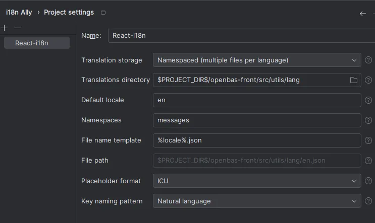
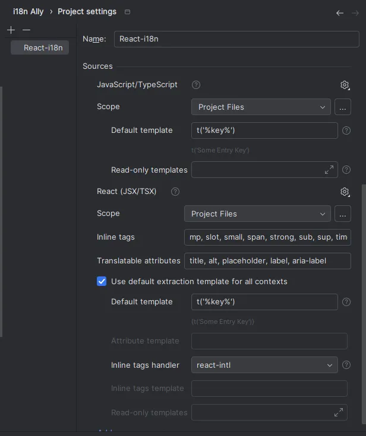
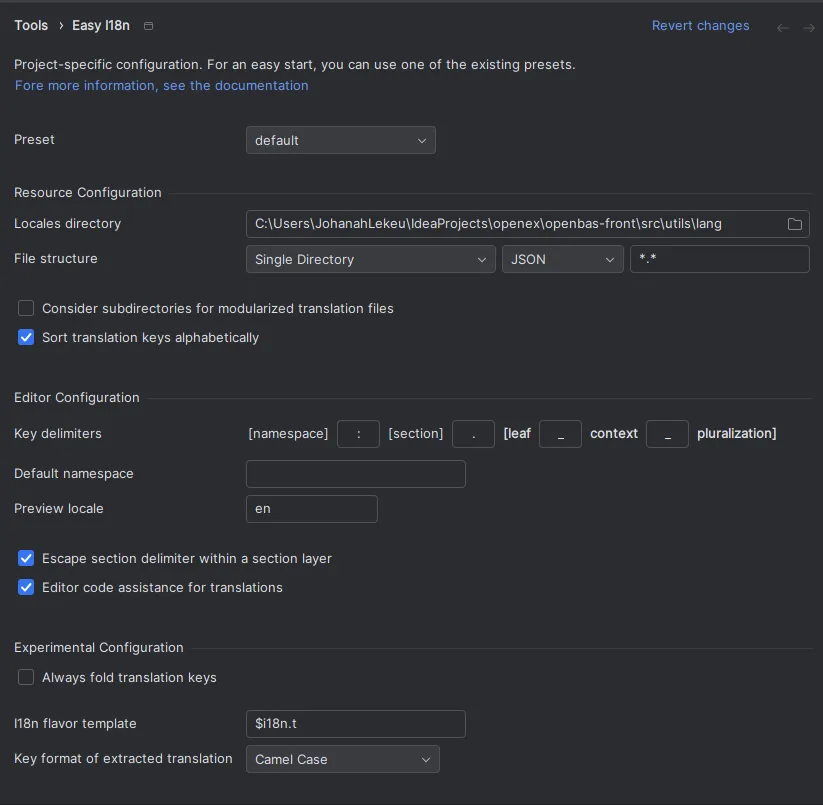
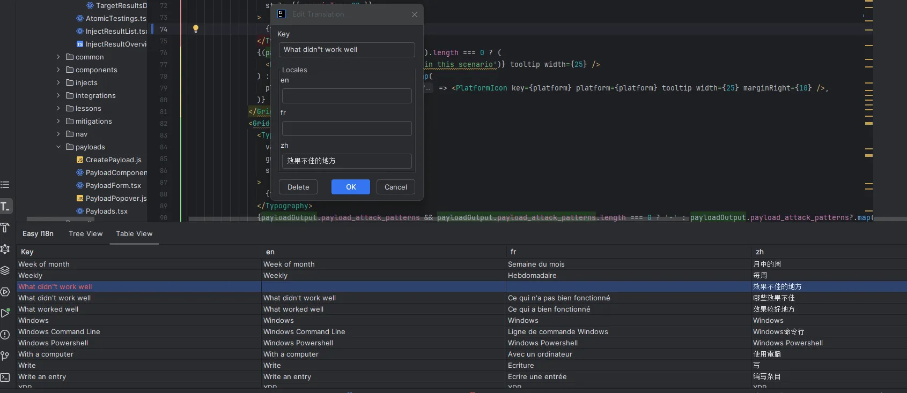

# Translations

This page explains how the OpenAEV front-end is translated, how to add or change a translation, and which checks the CI runs on the translation files.

## How translation works

The front-end translation files live in `openaev-front/src/utils/lang/`:

| File | Language |
|---|---|
| `en.json` | English, the reference file |
| `de.json`, `es.json`, `fr.json`, `it.json` | German, Spanish, French, Italian |
| `ja.json`, `ko.json`, `ru.json`, `zh.json` | Japanese, Korean, Russian, Chinese |

A translation key is the English text itself: the component calls `t('Add tags')`, and every file maps `"Add tags"` to its translation. All nine files contain the same keys, and every value is translated in every language.

!!! note "Messages sent by the backend"

    For `400` and `409` responses, the front-end displays the backend error through `t(error.message)`. The Java message must therefore match a key of `en.json` exactly, punctuation included. A message built by concatenation (`"Unknown scenario: " + id`) cannot be translated.

## How to add or change a translation

1. Wrap the text in `t()`: `t('Add tags')`, or `t('{count} injects', { count })` with a placeholder.
2. Add the key to `en.json`:

    ```bash
    cd openaev-front
    yarn extract-translation
    ```

    The script only detects literal `t('…')` calls in `.js`, `.jsx` and `.tsx` files. Add by hand the keys passed as a prop or an object property that a component translates later (`title="Import a scenario"`, `label: 'Seen'`).

3. Translate the new keys into the eight other languages with DeepL:

    ```bash
    SUBSCRIPTION_KEY=<your DeepL key> yarn auto-translation:all
    ```

    Only the keys missing from a language file are sent to DeepL: existing translations are never overwritten.

4. Review the diff of the language files. DeepL can mistranslate a word out of context, translate a field name, or add quotes. Fix these by hand (see [Translation rules](#translation-rules)).
5. Check the files:

    ```bash
    yarn i18n-checker
    ```

!!! warning "DeepL key"

    `auto-translation:all` uses a DeepL API Free key, limited to 500,000 characters per month. Pass it as an environment variable only: never commit it, and never write it in a file of the repository.

## Scripts

All scripts run from `openaev-front/`.

| Script | What it does |
|---|---|
| `yarn extract-translation` | Adds to `en.json` the keys of the literal `t('…')` calls that are missing. |
| `yarn auto-translation:all` | Translates with DeepL the keys missing from each language file, adjusts the case of the first letter to the source, then sorts the files. |
| `yarn sort-translation` | Sorts the keys of every language file. |
| `yarn i18n-checker` | Runs every check listed in [Checks run by the CI](#checks-run-by-the-ci). |

## Checks run by the CI

The `Frontend Quality & Unit Tests` job runs `yarn i18n-checker`. The job fails on any of these checks.

| Check | Fails when |
|---|---|
| Missing key | A `t('…')` call uses a key absent from a language file, placeholders and escaped quotes included. |
| Catalog parity | A key of `en.json` is absent from another language file. This also covers the keys that reach `t()` through a variable (labels sent by the backend), which the missing-key check cannot see. |
| Untranslated value | A value is identical to the English one, unless it only holds protected terms or is listed in `i18n-loanwords.json`. |
| Placeholders | A translation does not keep the same `{x}`, `{{x}}`, `${x}` and tags (`<a>`, `</a>`) as the English value, or contains a literal `undefined`. |
| Protected terms | A term of `i18n-glossary.json` present in the English value is missing from the translation. |

## Configuration files

The files live in `openaev-front/scripts/`.

| File | Content |
|---|---|
| `i18n-glossary.json` | `globalTerms`: brand names, acronyms and standards that are never translated (`OpenAEV`, `MITRE`, `Kubernetes`, `PowerShell`…). |
| `i18n-loanwords.json` | Values that are legitimately identical to English: `all` for every language, then one list per language (`"de": ["Dashboard"]`). |
## Translation rules

| Rule | Example |
|---|---|
| The case of the first letter follows the English source, in every language, German included. | `breached` → `compromis`, not `Compromis` |
| Protected terms stay as they are. | `Kubernetes 클러스터`, not `쿠버네티스 클러스터` |
| Field names, enum values and code identifiers are not translated. | `Au moins un élément parmi exercise ou scenario…` |
| No quotes are added when the source has none. | `action_execution_arch ist erforderlich`, not `„action_execution_arch“ ist erforderlich` |
| Placeholders and tags are kept unchanged. | `{count} injects`, `<a href='${url}'>${url}</a>` |

When a value is legitimately identical to English (a loanword such as `Dashboard` in German, or a technical name), add it to `i18n-loanwords.json` under its language instead of changing the translation.

## Using IntelliJ plugins

- **i18n Ally** manages the regex, checks missing translations and extracts keys.
  
  

- **Easy i18n** adds, edits, deletes, sorts and checks translations.
  
  

## What's next?

- [Building and running from source](build-from-source.md) -- Set up the front-end to run the translation scripts
- [Platform](platform.md) -- Understand the architecture of the platform
