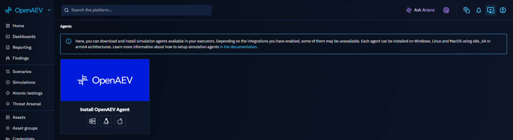
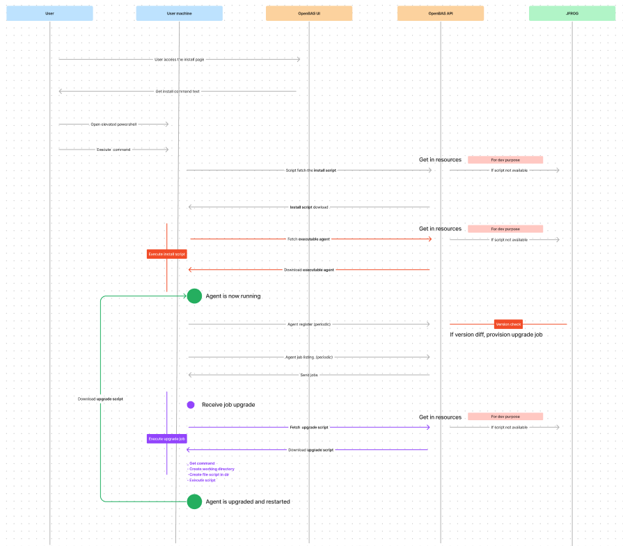

# OpenAEV agent overview

## Introduction

The OpenAEV Agent is an application whose primary role is to enroll an Asset on the OpenAEV platform, retrieve jobs or
scripts to be executed, and transmit this information to Implants for execution on the host Asset.

The Agent does **not perform direct actions** on the Asset itself, in order to remain neutral with respect to antivirus
solutions and ensure the full execution of Simulations.

The OpenAEV Agent is compatible with multiple operating systems (Windows, Linux, macOS) and is developed in **Rust**.

## Why use the OpenAEV Agent?

- Deploy a lightweight, open-source Executor on your endpoints without depending on third-party agents.
- Stay neutral to antivirus solutions — the Agent itself performs no attack actions, so it does not trigger detections.
- Support multiple installation modes (session, user service, system service) to match different privilege and persistence requirements.
- Enable automatic upgrades and health checks with minimal operational overhead.

## Installation

Depending on the operating system, several installation modes are available.
You can access them from OpenAEV with the **Install simulation agents** icon in the top bar:



To remove an agent, see [Uninstall an agent](#uninstall-an-agent).

!!! warning

    Antivirus exclusions described in this documentation are **mandatory** for OpenAEV to function correctly.
    
    Exclusions must apply **only** to the `runtimes` subfolder.  
    Threat Arsenal Actions are intentionally stored elsewhere so that detection and blocking remain possible when relevant.

!!! note "Required capability"

    Installing an agent from OpenAEV requires the **Install agent** capability, which can be granted in **Settings > Security > Roles** (see [Users and RBAC](../../administration/users-and-rbac.md#capabilities)).
    
    Users who do not have it cannot get the install command from the **Install simulation agents** page.

### Multiple agents on the same machine

Since agent release 1.14, you can install several OpenAEV agents on the same machine, to test different execution contexts and privilege levels. For example:

- install two agents with the standard installation, one as a standard user and one as an administrator;
- add a standard installation next to an advanced system installation, to compare filesystem access, environment variables and privileges.

The installation modes available on each OS are described below.

### Quick compatibility check

Before installing the OpenAEV Agent, ensure that **all** the following conditions are met:

* Supported CPU architecture: **x64 or ARM64 only**

* Supported service manager:

    * Windows: **Service Control Manager**
    * Linux: **systemd**
    * macOS: **launchd**

* Security requirements:
    * **TLS 1.2 or higher**
    * Administrative privileges (Administrator / root / sudo) for the advanced (service) installations

* Network access:
    * Outbound connectivity to the OpenAEV instance

If any of these requirements are not met, installation **will fail or behave unpredictably**.

#### Best effort support

“Best effort” support means that the OpenAEV Agent **may work**, but:

* the environment is not officially validated,
* stability and long-term support are not guaranteed,
* additional configuration may be required,
* environment-specific issues may not be prioritized.

### Install on your OS

The requirements and installation modes depend on the OS:

- [Windows](windows.md)
- [Linux](linux.md)
- [macOS](macos.md)

## Agent installation flow



## Proxy configuration

To use a proxy with the OpenAEV Agent, define both `HTTP_PROXY` and `HTTPS_PROXY` **before running the installer**.

You can configure them in either of the following ways:

- **Machine-wide (persistent):** set them as system environment variables so they are available globally.
- **Session-only (temporary):** set/export them in the same terminal session immediately before executing the installation script.

If the agent is installed as a service, make sure these variables are also available to the service account.

The agent uses these variables only if the platform has `openaev.with-proxy` set to `true` (see
[Configuration](../../reference/deployment/configuration.md)) when you copy the install command. Otherwise, the agent ignores the proxy.

## Uninstall an agent

The uninstall commands depend on the OS and the installation mode: see [Windows](windows.md#uninstall-the-agent), [Linux](linux.md#uninstall-the-agent) or [macOS](macos.md#uninstall-the-agent).

### Remove the Endpoint from OpenAEV

Uninstalling the agent does not remove the Endpoint from OpenAEV. A running agent registers again every two minutes and
recreates it, so uninstall the agent first.

1. Go to **Assets > Endpoints**.
2. Open the ellipsis menu of the Endpoint and click **Delete**.

You need the **Delete Assets** capability.

## Features

The main features of the OpenAEV Agent include:

* Agent registration on the OpenAEV platform
* Automatic agent upgrade (on startup and registration)
* Periodic job retrieval (every 30 seconds)
* Implant lifecycle management
* Execution cleanup in `runtimes` and `payloads` (see [Cleanup configuration](#cleanup-configuration))
* Health checks (heartbeat every 2 minutes)

### Cleanup configuration

The garbage collector thresholds can be customized in the agent's `openaev-agent-config.toml` file:

| Parameter                      | Description                                                                                                                             | Default value |
|--------------------------------|-----------------------------------------------------------------------------------------------------------------------------------------|---------------|
| `executing_max_time_minutes`   | Maximum time (in minutes) an `execution-*` directory can exist before processes are killed and the directory is renamed to `executed-*` | `10`          |
| `directory_max_time_minutes`   | Maximum time (in minutes) an `executed-*` directory can exist before it is permanently deleted                                          | `10`          |
| `cleanup_interval_seconds`     | Interval (in seconds) between cleanup cycles                                                                                            | `180`         |

Example configuration in `openaev-agent-config.toml`:

```toml
[cleanup]
executing_max_time_minutes = 10
directory_max_time_minutes = 10
cleanup_interval_seconds = 180
```

## Security

### Agent token scope and privilege isolation

OpenAEV enforces strict **segregation of duties** for agent token authentication.

The agent token has a deliberately narrow scope: it is only permitted to **retrieve jobs to execute**, **retrieve documents**, **send back results**, and **download the agent installer**. It cannot be used to perform any administrative action or access any resource outside of that execution flow.

This token belongs to the service account of the Tenant, which has the **Service integration** Role. With it, the agent
and its Implants download a Document only by its exact ID, for example the file of a File Drop or Executable Action. They
cannot list or search Documents.

### Signed agents

Every OpenAEV Agent executable (the agent binaries and the Windows installers) is signed when its release is
published. The installer and upgrade scripts verify this signature before they install or replace anything, so a
tampered or corrupted download is rejected.

How it works:

1. At release time, each executable receives a `.sig` file: the base64 **RSA/SHA-256** signature of its bytes.
2. When the agent is downloaded from OpenAEV, the platform returns the signature in the `X-Signature-Sha256-Rsa`
   response header, and the release version in the `X-Release-Version` header.
3. The installer script checks the signature against the 4096-bit RSA public key embedded in the script. It refuses to
   install if the signature is missing or invalid.
4. The version header lets the scripts refuse a downgrade to an older release.

!!! warning

    On Linux and macOS, the installer stops with an explicit error if `openssl` is missing. Install it with your package
    manager (for example `apt install openssl` on Debian and Ubuntu) before running the installation command.

!!! note

    Only the agent executables are signed. Scripts and implants are not signed for now.

### Rotating the installer token

The **Install agent** capability only grants read access: it lets a user fetch the install command and installer token, but not rotate or revoke them. If the token is suspected to have leaked, rotate it:

```http
POST /api/agent/installer/openaev/token/rotate
```

Rotating the token requires the **Manage tenant users, groups and roles** capability (see [Users and RBAC](../../administration/users-and-rbac.md#capabilities)), since the installer token belongs to the tenant's service account rather than to an individual user.

!!! warning

    Rotation immediately invalidates the token used by every already-installed Agent in the tenant. Reinstall or reconfigure those Agents with a fresh install command after rotating.

## Troubleshooting

Logs are in `openaev-agent.log` in the installation folder.

When an implant is deployed, a new directory `execution-<job ID>` is created under `runtimes`.
This directory contains:

* The implant executable
* Execution-specific logs

### Agent installed but not visible

The agent registers when it starts, then every two minutes. If its Endpoint does not appear in **Assets > Endpoints**,
check the following points:

1. **The agent runs.** Use the commands of the **Verification/Start/Stop agent** column for your installation mode, on the [Windows](windows.md), [Linux](linux.md) or [macOS](macos.md) page.
2. **The log shows no registration error.** Open `openaev-agent.log` in the installation folder and look for
   `Fail registering the agent`, followed by the cause.
3. **The URL is reachable.** The `url` value in `openaev-agent-config.toml` (installation folder) comes from
   `openaev.agent-url`, or `openaev.base-url` when it is not set (see [Configuration](../../reference/deployment/configuration.md)).
   The endpoint must reach this URL. If it is wrong, fix the platform setting and install again with a new command.
4. **You look in the right Tenant.** The `token` and `tenant_id` values come from the Tenant you were in when you copied
   the install command. The Endpoint appears in this Tenant only.
5. **The certificate is trusted.** If the endpoint does not trust the platform certificate (for example a self-signed
   one), set `openaev.unsecured-certificate` to `true` on the platform, then install again.
6. **The proxy is allowed.** Behind a proxy, follow [Proxy configuration](#proxy-configuration), including
   `openaev.with-proxy`.

An Endpoint whose agents stop communicating for one hour shows as inactive (see [Assets](../../usage/build/assets.md)).

## What's next?

- [Windows](windows.md), [Linux](linux.md), [macOS](macos.md) -- Install the agent on your OS
- [Executors](../executors/executors.md) -- Compare all available Executor types and their deployment options
- [Injectors](../injectors/injectors.md) -- Understand which Injectors require an Agent
- [Assets](../../usage/build/assets.md) -- Manage the Endpoints where Agents are installed