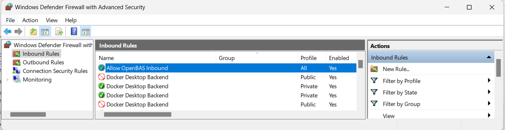
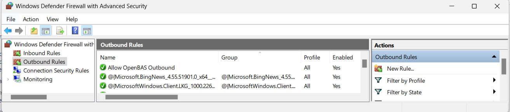

# OpenAEV Agent

## Introduction

The OpenAEV Agent is an application whose primary role is to enroll an Asset on the OpenAEV platform, retrieve jobs or
scripts to be executed, and transmit this information to Implants for execution on the host Asset.

The Agent does **not perform direct actions** on the Asset itself, in order to remain neutral with respect to antivirus
solutions and ensure the full execution of Simulations.

The OpenAEV Agent is compatible with multiple operating systems (Windows, Linux, macOS) and is developed in **Rust**.

## Why use the OpenAEV Agent?

- Deploy a lightweight, open-source Executor on your endpoints without depending on third-party agents.
- Stay neutral to antivirus solutions — the Agent itself performs no attack actions, so it does not trigger detections.
- Support multiple installation modes (session, user service, system service) to match different privilege and persistence requirements.
- Enable automatic upgrades and health checks with minimal operational overhead.

## Installation

Depending on the operating system, several installation modes are available.
You can access them from OpenAEV by clicking the blue icon in the top-right corner:


!!! note

    Since release **1.14**, multiple OpenAEV Agents can be installed on the same machine in order to test different execution contexts and privilege levels.
    
    Examples:

    - Install two agents using the **standard installation** with different privileges (standard user vs administrator).
    - If an agent was previously installed using the **advanced system installation** (pre-1.14 behavior), a standard installation can be added to compare behaviors such as filesystem access, environment variables, and privileges.
    
    **See the OS-specific sections below for details.**

!!! warning

    Antivirus exclusions described in this documentation are **mandatory** for OpenAEV to function correctly.
    
    Exclusions must apply **only** to the `runtimes` subfolder.  
    Threat Arsenal Actions are intentionally stored elsewhere so that detection and blocking remain possible when relevant.

!!! note "Required capability"

    Installing an agent from OpenAEV requires the **Install agent** capability, which can be granted in **Settings > Security > Roles** (see [Users and RBAC](../../administration/users-and-rbac.md#capabilities)).
    
    Users who do not have it cannot get the install command from the **Agents** page.

### Quick compatibility check

Before installing the OpenAEV Agent, ensure that **all** the following conditions are met:

* Supported CPU architecture: **x64 or ARM64 only**

* Supported service manager:

    * Windows: **Service Control Manager**
    * Linux: **systemd**
    * macOS: **launchd**

* Security requirements:
    * **TLS 1.2 or higher**
    * Administrative privileges (Administrator / root / sudo)

* Network access:
    * Outbound connectivity to the OpenAEV instance

If any of these requirements are not met, installation **will fail or behave unpredictably**.

#### Best effort support

“Best effort” support means that the OpenAEV Agent **may work**, but:

* the environment is not officially validated,
* stability and long-term support are not guaranteed,
* additional configuration may be required,
* environment-specific issues may not be prioritized.

### Windows

#### Operating system & architecture

| Architecture  | Support level     |
|---------------|-------------------|
| **x64**       | ✅ Supported       |
| **ARM64**     | ✅ Supported       |
| x86 (32-bit)  | ❌ Not supported   |
| ARM32         | ❌ Not supported   |

| Operating system              | Support level        | Notes               |
|-------------------------------|----------------------|---------------------|
| **Windows 10**                | ✅ Supported          |                     |
| **Windows 11**                | ✅ Supported          |                     |
| **Windows Server 2019**       | ✅ Supported          |                     |
| **Windows Server 2022**       | ✅ Supported          |                     |
| Windows 8 / 8.1               | ⚠️ Best effort       | No guaranteed fixes |
| Windows Server 2016           | ⚠️ Best effort       | No guaranteed fixes |
| Windows Server 2012 R2        | ⚠️ Best effort       | No guaranteed fixes |
| Windows 7 and earlier         | ❌ Not supported      |                     |
| Windows Server 2008 / 2008 R2 | ❌ Not supported      |                     |


#### Runtime & tooling

!!! note

    If the installation fails, try using PowerShell 7 or higher.

* TLS 1.2 or higher must be available
* The system `Path` environment variable must include: `%SYSTEMROOT%\System32\` and `%SYSTEMROOT%\System32\WindowsPowerShell\v1.0\`

#### Privileges & security

* Installation and execution require **local administrator privileges**
* For **Advanced installation as User (service)**:

    * The target user must have the **“Log on as a service”** policy enabled
    * See:
      [https://learn.microsoft.com/en-us/system-center/scsm/enable-service-log-on-sm](https://learn.microsoft.com/en-us/system-center/scsm/enable-service-log-on-sm)

#### Antivirus

* Antivirus exclusions are mandatory and must apply **only** to the `runtimes` directory

#### Installation mode

*[UserSanitized] in the table below means username without special character like "\", "/",...*

| Installation mode                             | Installation                                                                                                                                                                                                                 | Installation type                                                                                                                   | Execution agent and Threat Arsenal Action                                                                                   | Verification/Start/Stop agent                                                                                                                                                                                                                                                | Folder path                                                                                                                    | AV exclusions                                                                                                                                    | Uninstallation                                                                                       |
|:----------------------------------------------|:-----------------------------------------------------------------------------------------------------------------------------------------------------------------------------------------------------------------------------|:------------------------------------------------------------------------------------------------------------------------------------|:---------------------------------------------------------------------------------------------------------------|:-----------------------------------------------------------------------------------------------------------------------------------------------------------------------------------------------------------------------------------------------------------------------------|:-------------------------------------------------------------------------------------------------------------------------------|:-------------------------------------------------------------------------------------------------------------------------------------------------|:-----------------------------------------------------------------------------------------------------|
| **Standard installation (session)**           | Asset with GUI and terminal with standard privileges or admin privileges for the logged-in user                                                                                                                              | User session (standard privileges): start up app `WriteRegStr`<br/>OR<br/>User session (admin privileges): start up task `schtasks` | Background, only when user is logged in, with the user privilege from the powershell elevation and environment | `Get-Process openaev-agent \| Where-Object { $_.Path -eq "[FOLDER_PATH]\openaev-agent.exe" }`<br/>`Get-Process openaev-agent \| Where-Object { $_.Path -eq "[FOLDER_PATH]\openaev-agent.exe" } \| Stop-Process -Force`<br/>`Start-Process "[FOLDER_PATH]\openaev-agent.exe"` | `$HOME\.openaev\OAEVAgent-Session-[UserSanitized]`<br/>OR<br/>`$HOME\.openaev\OAEVAgent-Session-Administrator-[UserSanitized]` | `$HOME\.openaev\OAEVAgent-Session-[UserSanitized]\runtimes`<br/>OR<br/>`$HOME\.openaev\OAEVAgent-Session-Administrator-[UserSanitized]\runtimes` | See [Uninstall an agent](#uninstall-an-agent) |
| **Advanced installation as User (service)**   | Enable the "Service Logon" policy (see above)<br/>Terminal with admin privileges, replace params [USER] and [PASSWORD] in the<br/>bash snippet and in the following commands by the username with domain and password wanted | Service: `sc` (with user and password in service conf)                                                                              | Background, as soon as the machine powers on, with the user privilege and environment                          | `Get-Service -Name "OAEVAgent-Service-[UserSanitized]"`<br/>`Start-Service -Name "OAEVAgent-Service-[UserSanitized]"`<br/>`Stop-Service -Name "OAEVAgent-Service-[UserSanitized]"`                                                                                           | `$HOME\.openaev\OAEVAgent-Service-[UserSanitized]`                                                                             | `$HOME\.openaev\OAEVAgent-Service-[UserSanitized]\runtimes`                                                                                      | See [Uninstall an agent](#uninstall-an-agent) |
| **Advanced installation as System (service)** | Terminal with admin privileges for the authority system user                                                                                                                                                                 | Service: `sc`                                                                                                                       | Background, as soon as the machine powers on, with the root privilege and environment                          | `Get-Service -Name "OAEVAgentService"`<br/>`Start-Service -Name "OAEVAgentService"`<br/>`Stop-Service -Name "OAEVAgentService"`                                                                                                                                              | `C:\Program Files (x86)\Filigran\OAEV Agent`                                                                                   | `C:\Program Files (x86)\Filigran\OAEV Agent\runtimes`                                                                                            | See [Uninstall an agent](#uninstall-an-agent) |

### Linux

#### Operating system & architecture

| Architecture            | Support level      | Notes   |
|-------------------------|--------------------|---------|
| **x86_64**              | ✅ Supported        |         |
| **ARM64**               | ✅ Supported        |         |
| 32-bit architectures    | ❌ Not supported    |         |
| Other CPU architectures | ❌ Not supported    |         |

| Distribution type                                      | Support level     | Notes                       |
|--------------------------------------------------------|-------------------|-----------------------------|
| **systemd-based distributions** (Debian, Ubuntu, etc.) | ✅ Supported       | systemd required            |
| Non-systemd distributions                              | ❌ Not supported   | Installer relies on systemd |

#### Runtime & tooling

* **systemd must be installed and running**
* **curl** must be available
* **openssl** must be available, the installer uses it to [verify the agent signature](#signed-agents)
* TLS support must be enabled

#### Privileges & security

* Installation and execution require **root or sudo privileges**
* User-based services require permission to manage `systemctl --user`

| Installation mode                             | Installation                                                                                                                                            | Installation type                                          | Execution agent and Threat Arsenal Action                                                          | Verification/Start/Stop agent                                                                                                                        | Folder path                                 | AV exclusions                                        | Uninstallation                                                                                                                                                                                                             |
|:----------------------------------------------|:--------------------------------------------------------------------------------------------------------------------------------------------------------|:-----------------------------------------------------------|:--------------------------------------------------------------------------------------|:-----------------------------------------------------------------------------------------------------------------------------------------------------|:--------------------------------------------|:-----------------------------------------------------|:---------------------------------------------------------------------------------------------------------------------------------------------------------------------------------------------------------------------------|
| **Standard installation (session)**           | Asset with GUI and terminal with standard privileges for the logged-in user                                                                             | User service: `systemctl --user`                           | Background, only when user is logged in, with the user privilege and environment      | `systemctl --user enable openaev-agent-session`<br/>`systemctl --user start openaev-agent-session`<br/>`systemctl --user stop openaev-agent-session` | `$HOME/.local/openaev-agent-session`        | `$HOME/.local/openaev-agent-session/runtimes `       | See [Uninstall an agent](#uninstall-an-agent) |
| **Advanced installation as User (service)**   | Terminal with sudo privileges, replace params [USER] and [GROUP] in the bash<br/>snippet and in the following commands by the username and group wanted | Service: `systemctl` (with user and group in service conf) | Background, as soon as the machine powers on, with the user privilege and environment | `systemctl enable [USER]-openaev-agent`<br/>`systemctl start [USER]-openaev-agent`<br/>`systemctl stop [USER]-openaev-agent`                         | `$HOME/.local/openaev-agent-service-[USER]` | `$HOME/.local/openaev-agent-service-[USER]/runtimes` | See [Uninstall an agent](#uninstall-an-agent) |
| **Advanced installation as System (service)** | Terminal with sudo privileges                                                                                                                           | Service: `systemctl`                                       | Background, as soon as the machine powers on, with the root privilege and environment | `systemctl enable openaev-agent`<br/>`systemctl start openaev-agent`<br/>`systemctl stop openaev-agent`                                              | `/opt/openaev-agent`                        | `/opt/openaev-agent/runtimes`                        | See [Uninstall an agent](#uninstall-an-agent) |

!!! note

    To allow command Threat Arsenal Action execution without sudo password prompts, see:  
    [this tutorial](https://gcore.com/learning/how-to-disable-password-for-sudo-command/)

### macOS

#### Operating system & architecture

| Architecture              | Support level   | Notes           |
|---------------------------|-----------------|-----------------|
| **ARM64 (Apple Silicon)** | ✅ Supported     |                 |
| **x86_64 (Intel)**        | ⚠️ Best effort  | Limited testing |
| 32-bit architectures      | ❌ Not supported |                 |
| Other CPU architectures   | ❌ Not supported |                 |

| macOS version                                  | Support level    | Notes            |
|------------------------------------------------|------------------|------------------|
| **launchd-based macOS (10.4 Tiger and later)** | ✅ Supported      | launchd required |
| macOS Sonoma (14)                              | ⚠️ Best effort   | Latest version   |

#### Runtime & tooling

* **launchd must be available and running**
* **curl** must be available
* **openssl** must be available, the installer uses it to [verify the agent signature](#signed-agents)
* TLS support must be enabled
* The system must allow:

    * Execution of downloaded binaries
    * Write and execute permissions in the installation directory

#### Privileges & security

* Installation and execution require **administrator privileges**

!!! warning

    Temporary limitation: on macOS, **Standard installation (session)** and **Advanced installation as User (service)** are currently unavailable.
    Use **Advanced installation as System (service)**.

| Installation mode                             | Installation                                                                                                                                            | Installation type                                                          | Execution agent and Threat Arsenal Action                                                          | Verification/Start/Stop agent                                                                                                                                                                                                               | Folder path                                 | AV exclusions                                          | Uninstallation                                                                                       |
|:----------------------------------------------|:--------------------------------------------------------------------------------------------------------------------------------------------------------|:---------------------------------------------------------------------------|:--------------------------------------------------------------------------------------|:--------------------------------------------------------------------------------------------------------------------------------------------------------------------------------------------------------------------------------------------|:--------------------------------------------|:-------------------------------------------------------|:-----------------------------------------------------------------------------------------------------|
| **Standard installation (session)**           | Asset with GUI and terminal with standard privileges for the logged-in user                                                                             | User service: `launchctl user`                                             | Background, only when user is logged in, with the user privilege and environment      | `launchctl enable gui/$(id -u)/openaev-agent-session`<br/>`launchctl bootstrap gui/$(id -u) ~/Library/LaunchAgents/openaev-agent-session.plist`<br/>`launchctl bootout gui/$(id -u) ~/Library/LaunchAgents/openaev-agent-session.plist`     | `$HOME/.local/openaev-agent-session`        | `$HOME/.local/openaev-agent-session/runtimes`          | See [Uninstall an agent](#uninstall-an-agent) |
| **Advanced installation as User (service)**   | Terminal with sudo privileges, replace params [USER] and [GROUP] in the<br/>bash snippet and in the following commands by the username and group wanted | Service: `launchctl user` (as agent, with user and group in service plist) | Background, as soon as the machine powers on, with the user privilege and environment | `launchctl enable gui/[USER-ID]/[USER]-openaev-agent`<br/>`launchctl bootstrap gui/[USER-ID] /Library/LaunchAgents/[USER]-openaev-agent.plist`<br/>`launchctl bootout gui/[USER-ID] ~/Library/LaunchAgents/[USER]-openaev-agent.plist`      | `$HOME/.local/openaev-agent-service-[USER]` | `$HOME/.local/openaev-agent-service-[USER]/runtimes`   | See [Uninstall an agent](#uninstall-an-agent) |
| **Advanced installation as System (service)** | Terminal with sudo privileges                                                                                                                           | Service: `launchctl system`                                                | Background, as soon as the machine powers on, with the root privilege and environment | `launchctl enable system/io.filigran.openaev-agent`<br/>`launchctl bootstrap system /Library/LaunchDaemons/io.filigran.openaev-agent.plist`<br/>`launchctl bootout system /Library/LaunchDaemons/io.filigran.openaev-agent.plist`                                             | `/opt/openaev-agent`                        | `/opt/openaev-agent/runtimes`                          | See [Uninstall an agent](#uninstall-an-agent) |

!!! note

    To allow command Threat Arsenal Action execution without sudo password prompts, see:  
    [this tutorial](https://gcore.com/learning/how-to-disable-password-for-sudo-command/)

## Agent installation flow


## Network traffic

The installation creates two firewall rules:

**Inbound rule**


**Outbound rule**


## Proxy configuration

To use a proxy with the OpenAEV Agent, define both `HTTP_PROXY` and `HTTPS_PROXY` **before running the installer**.

You can configure them in either of the following ways:
- **Machine-wide (persistent):** set them as system environment variables so they are available globally.
- **Session-only (temporary):** set/export them in the same terminal session immediately before executing the installation script.

If the agent is installed as a service, make sure these variables are also available to the service account.

The agent uses these variables only if the platform has `openaev.with-proxy` set to `true` (see
[Configuration](../../reference/deployment/configuration.md)) when you copy the install command. Otherwise, the agent ignores the proxy.

Verify that your proxy is correctly configured and communicate well with your OpenAEV Agent installed.

## Uninstall an agent

The commands below use the default folders and service names. If you changed them at installation, use your values.

### Windows

1. For a **Standard installation (session)**, stop the agent:

    ```powershell
    Get-Process openaev-agent | Where-Object { $_.Path -eq "[FOLDER_PATH]\openaev-agent.exe" } | Stop-Process -Force
    ```

2. Run `uninstall.exe` from the installation folder (see the **Folder path** column above) and confirm.
   It stops and removes the service or the startup task, then deletes the folder. For the service modes, run it as administrator.
3. For an **Advanced installation as User (service)**, disable the **Log on as a service** policy for the user if it no
   longer needs it.

### Linux

**Standard installation (session)**:

```bash
systemctl --user stop openaev-agent-session
systemctl --user disable openaev-agent-session
systemctl --user daemon-reload
systemctl --user reset-failed
rm -rf $HOME/.local/openaev-agent-session
```

**Advanced installation as User (service)**, replace `[USER]` with the username:

```bash
sudo systemctl stop [USER]-openaev-agent
sudo systemctl disable [USER]-openaev-agent
sudo systemctl daemon-reload
sudo systemctl reset-failed
sudo rm -rf $HOME/.local/openaev-agent-service-[USER]
```

**Advanced installation as System (service)**:

```bash
sudo systemctl stop openaev-agent
sudo systemctl disable openaev-agent
sudo systemctl daemon-reload
sudo systemctl reset-failed
sudo rm -rf /opt/openaev-agent
```

### macOS

Only **Advanced installation as System (service)** is available on macOS:

```bash
sudo launchctl bootout system /Library/LaunchDaemons/io.filigran.openaev-agent.plist
sudo rm -f /Library/LaunchDaemons/io.filigran.openaev-agent.plist
sudo rm -rf /opt/openaev-agent
```

### Remove the Endpoint from OpenAEV

Uninstalling the agent does not remove the Endpoint from OpenAEV. A running agent registers again every two minutes and
recreates it, so uninstall the agent first.

1. Go to **Assets > Endpoints**.
2. Open the ellipsis menu of the Endpoint and click **Delete**.

You need the **Delete Assets** capability.

## Features

The main features of the OpenAEV Agent include:

* Agent registration on the OpenAEV platform
* Automatic agent upgrade (on startup and registration)
* Periodic job retrieval (every 30 seconds)
* Implant lifecycle management
* Execution cleanup and directory pruning (garbage collector running every **3 minutes**):
    * Directories matching `runtimes/execution-*` and `payloads/execution-*` older than **10 minutes** are processed: associated processes are killed, then the directories are renamed from `execution-*` to `executed-*`.
    * Directories matching `runtimes/executed-*` and `payloads/executed-*` older than **10 minutes** are permanently deleted.
* Health checks (heartbeat every 2 minutes)

### Cleanup configuration

The garbage collector thresholds can be customized in the agent's `openaev-agent-config.toml` file:

| Parameter                      | Description                                                                                                                             | Default value |
|--------------------------------|-----------------------------------------------------------------------------------------------------------------------------------------|---------------|
| `executing_max_time_minutes`   | Maximum time (in minutes) an `execution-*` directory can exist before processes are killed and the directory is renamed to `executed-*` | `10`          |
| `directory_max_time_minutes`   | Maximum time (in minutes) an `executed-*` directory can exist before it is permanently deleted                                          | `10`          |
| `cleanup_interval_seconds`     | Interval (in seconds) between cleanup cycles                                                                                            | `180`         |

Example configuration in `openaev-agent-config.toml`:

```toml
[cleanup]
executing_max_time_minutes = 10
directory_max_time_minutes = 10
cleanup_interval_seconds = 180
```

## Security

### Agent token scope and privilege isolation

OpenAEV enforces strict **segregation of duties** for agent token authentication.

The agent token has a deliberately narrow scope: it is only permitted to **retrieve jobs to execute**, **retrieve documents**, and **send back results**. It cannot be used to perform any administrative action or access any resource outside of that execution flow.

This token belongs to the service account of the Tenant, which has the **Service integration** Role. With it, the agent
and its Implants download a Document only by its exact ID, for example the file of a File Drop or Executable Action. They
cannot list or search Documents.

### Signed agents

Every OpenAEV Agent executable (the agent binaries and the Windows installers) is signed when its release is
published. The installer and upgrade scripts verify this signature before they install or replace anything, so a
tampered or corrupted download is rejected.

How it works:

1. At release time, each executable receives a `.sig` file: the base64 **RSA/SHA-256** signature of its bytes.
2. When the agent is downloaded from OpenAEV, the platform returns the signature in the `X-Signature-Sha256-Rsa`
   response header, and the release version in the `X-Release-Version` header.
3. The installer script checks the signature against the 4096-bit RSA public key embedded in the script. It refuses to
   install if the signature is missing or invalid.
4. The version header lets the scripts refuse a downgrade to an older release.

Verification tooling by operating system:

| Operating system | Requirement                                                              |
|------------------|--------------------------------------------------------------------------|
| Windows          | None, the script uses the cryptography built into .NET                   |
| Linux            | `openssl` must be installed and available in the `PATH`                  |
| macOS            | `openssl` must be installed and available in the `PATH`                  |

!!! warning

    On Linux and macOS, the installer stops with an explicit error if `openssl` is missing. Install it with your package
    manager (for example `apt install openssl` on Debian and Ubuntu) before running the installation command.

!!! note

    Only the agent executables are signed. Scripts and implants are not signed for now.

## Troubleshooting

Logs are available at the following locations (see installation tables for paths):

* Linux → `[FOLDER_PATH]/openaev-agent.log`
* macOS → `[FOLDER_PATH]/openaev-agent.log`
* Windows → `[FOLDER_PATH]\openaev-agent.log`

When an implant is deployed, a new directory is created under `runtimes`, named after the inject ID.
This directory contains:

* The implant executable
* Execution-specific logs

### Agent installed but not visible

The agent registers when it starts, then every two minutes. If its Endpoint does not appear in **Assets > Endpoints**,
check the following points:

1. **The agent runs.** Use the commands of the **Verification/Start/Stop agent** column for your installation mode.
2. **The log shows no registration error.** Open `openaev-agent.log` in the installation folder and look for
   `Fail registering the agent`, followed by the cause.
3. **The URL is reachable.** The `url` value in `openaev-agent-config.toml` (installation folder) comes from
   `openaev.agent-url`, or `openaev.base-url` when it is not set (see [Configuration](../../reference/deployment/configuration.md)).
   The endpoint must reach this URL. If it is wrong, fix the platform setting and install again with a new command.
4. **You look in the right Tenant.** The `token` and `tenant_id` values come from the Tenant you were in when you copied
   the install command. The Endpoint appears in this Tenant only.
5. **The certificate is trusted.** If the endpoint does not trust the platform certificate (for example a self-signed
   one), set `openaev.unsecured-certificate` to `true` on the platform, then install again.
6. **The proxy is allowed.** Behind a proxy, follow [Proxy configuration](#proxy-configuration), including
   `openaev.with-proxy`.

An Endpoint whose agents stop communicating for one hour shows as inactive (see [Assets](../../usage/build/assets.md)).

## What's next?

- [Executors](../executors/executors.md) -- Compare all available Executor types and their deployment options
- [Injectors](../injectors/injectors.md) -- Understand which Injectors require an Agent
- [Assets](../../usage/build/assets.md) -- Manage the Endpoints where Agents are installed