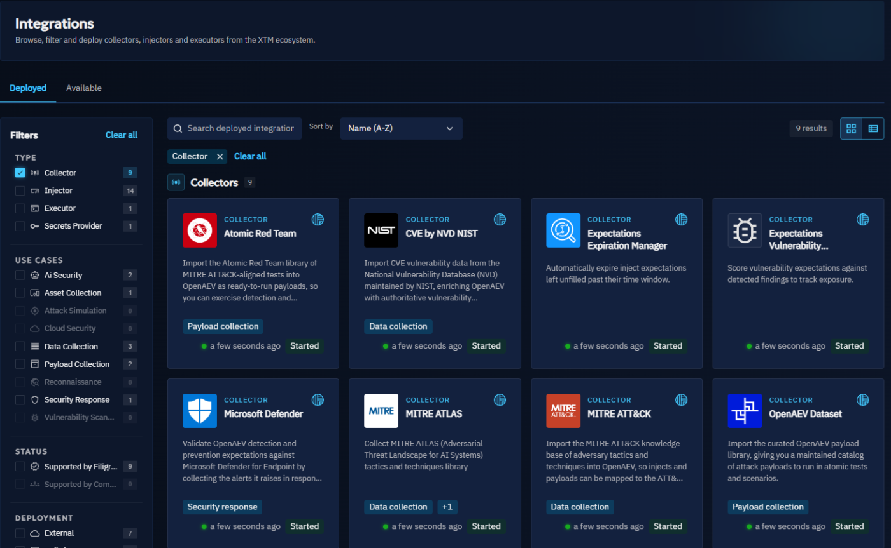

# Deploy Collectors

This page explains how to deploy and configure Collectors. To learn what Collectors do, see [Collectors](collectors.md).

## Installing a collector

You can deploy a Collector in three ways:

- with the Integration Manager (recommended);
- with Docker;
- manually.

!!! note

    Collectors must reach the OpenAEV API. See [Configuration](#configuration) for the required parameters.

### Integration Manager (recommended)

The Integration Manager deploys Collectors directly from the OpenAEV interface. See the [Integration Manager documentation](../../deployment/integration-manager/overview.md).

### Docker deployment

To add a Collector to your existing deployment, for example MITRE ATT&CK, add a service to your `docker-compose.yml` file:

```yaml
  collector-mitre-attack:
    image: openaev/collector-mitre-attack:latest
    environment:
      - OPENAEV_URL=http://localhost
      - OPENAEV_TOKEN=ChangeMe
      - COLLECTOR_ID=ChangeMe # a valid UUIDv4 of your choice
      - "COLLECTOR_NAME=MITRE ATT&CK"
      - COLLECTOR_LOG_LEVEL=error
    restart: always
```

Collector images and versions are on [Docker Hub](https://hub.docker.com/u/openaev).

To run a Collector on its own, use the `docker-compose.yml` file in its folder of the [collectors repository](https://github.com/OpenAEV-Platform/collectors), set its parameters, then run:

```bash
docker compose up -d
```

### Manual deployment

Manual deployment needs Python 3.14 or later and [Poetry](https://python-poetry.org/). Follow the **Manual deployment** section of the Collector's README: copy `config.yml.sample` to `config.yml`, set the values, then install and run the Collector with Poetry.

### Configuration

Collectors need `OPENAEV_URL` and `OPENAEV_TOKEN`, plus their own mandatory parameters, listed in each Collector's README.

!!! note "Collector tokens"

    You can use your administrator token or [create a dedicated account](#create-a-dedicated-account-for-collectors) to put in your collectors. It is not necessary to have one dedicated user for each collector.

    When you deploy a collector from the Integration Manager, OpenAEV fills `OPENAEV_TOKEN` with the token of the user who creates the instance, and `OPENAEV_TENANT_ID` with the current Tenant.

Example of `config.yml`:

```yaml
openaev:
  url: 'http://localhost:8080'
  token: 'ChangeMe'

collector:
  id: 'ChangeMe'
  name: 'MITRE ATT&CK'
  log_level: 'info'
```

### Run a collector outside the Integration Manager

You can run a collector on your own network, for example next to an on-premises SIEM when OpenAEV is hosted as SaaS.

The collector only opens outbound connections: to the OpenAEV URL and to the tool it collects from. OpenAEV never
connects to the collector, so the collector host needs no inbound port. Allow outbound HTTPS from this host to your
OpenAEV URL.

#### Create a dedicated account for collectors

1. Go to **Settings > Security > Users** and click `+`. Use an email address whose mailbox you can read: OpenAEV sends a
   reset code to this address to set the password.
2. Go to **Settings > Security > Groups** and add the user to a Group whose Role has the
   **Bypass (user has all rights)** capability, so the account has the same rights as an administrator token (see
   [Users and RBAC](../../administration/users-and-rbac.md)).
3. Log in with this account, open the [Profile](../../administration/profile.md) page, and copy the token from the
   **API access** section. Only the account owner sees this token.
4. Set `OPENAEV_URL`, `OPENAEV_TOKEN`, and `OPENAEV_TENANT_ID` in the collector configuration. The Tenant ID is the
   **Tenant identifier** shown in **Settings > Parameters**.
5. Start the collector with [Docker](#docker-deployment) or [manually](#manual-deployment).

!!! warning

    **RENEW** in the **API access** section replaces the token. Collectors that use the old token stop working until you update them.

## Collectors status

To see a Collector's status, open **Integrations** and the **Deployed** tab. Each card shows whether the Collector is started and when it was last seen. If the Integration Manager deployed it, select it to see its logs in the **Logs** tab.



## What's next?

- [Collectors](collectors.md) -- Main types of Collectors
- [Collector development](../../development/collectors.md) -- Build your own Collector
