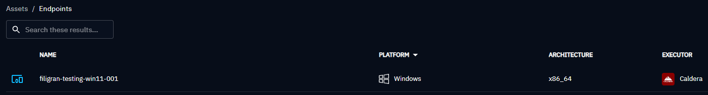

# Caldera Executor

The Caldera Executor runs OpenAEV implants through Caldera agents. Use it if you already run Caldera, or deploy it next to OpenAEV.

!!! note "Caldera already installed"

    If you already have a working Caldera installation, go to [OpenAEV configuration](#openaev-configuration).

## Deploy Caldera

Add a Caldera service to your `docker-compose.yml`, as in [docker-compose.caldera.yml](https://github.com/OpenAEV-Platform/docker/blob/master/docker-compose.caldera.yml):

```yaml
services:
  caldera:
    image: openaev/caldera-server:5.1.0
    restart: always
    ports:
      - "8888:8888"
    environment:
      CALDERA_URL: http://localhost:8888
    volumes:
      - type: bind
        source: caldera.yml
        target: /usr/src/app/conf/local.yml
```

Caldera reads its configuration from a file rather than environment variables. Download [caldera.yml](https://github.com/OpenAEV-Platform/docker/blob/master/caldera.yml), put it next to your `docker-compose.yml`, and change only the values marked **Change this**:

```yaml
users:
  red:
    red: ChangeMe                                                                     # Change this
  blue:
    blue: ChangeMe                                                                    # Change this
api_key_red: ChangeMe                                                                 # Change this
api_key_blue: ChangeMe                                                                # Change this
api_key: ChangeMe                                                                     # Change this
crypt_salt: ChangeMe                                                                  # Change this
encryption_key: ChangeMe                                                              # Change this
app.contact.http: http://caldera.myopenaev.myorganization.com:8888                    # Change this
app.contact.tunnel.ssh.user_password: ChangeMe                                        # Change this
```

Update your stack:

```bash
docker compose up -d
```

## OpenAEV configuration

Open **Integrations**, select the Caldera Executor and fill in its settings.

## Agents

### Deploy agents

The **Install simulation agents** page gives the command lines to deploy the Caldera agent on an endpoint.

!!! warning "Caldera AV (antivirus) detection"

    Antivirus tools detect and block the Caldera agent "Sandcat" by default. OpenAEV uses Caldera only as a neutral Executor, so add the AV exclusions shown on the OpenAEV screen.

### Checks

Endpoints with a Caldera agent installed with the OpenAEV command appear in **Assets > Endpoints**. On Windows, the agent starts at user logon. On Linux and macOS, it does not restart on its own: add it to `rc.local` or similar to make it persistent.



### Uninstallation

To uninstall the Caldera agent on Windows, run in an administrator PowerShell:

```powershell
schtasks /delete /tn OpenAEVCaldera
Stop-Process -Name oaev-agent-caldera
rm -force -Recurse "C:\Program Files (x86)\Filigran\OAEV Caldera"
```

## What's next?

- [Executors](executors.md) -- Compare Executors, implant cleanup and troubleshooting
- [Inject status](../../usage/run-and-evaluate/injects/inject-status.md) -- Understand Inject results and timeouts
