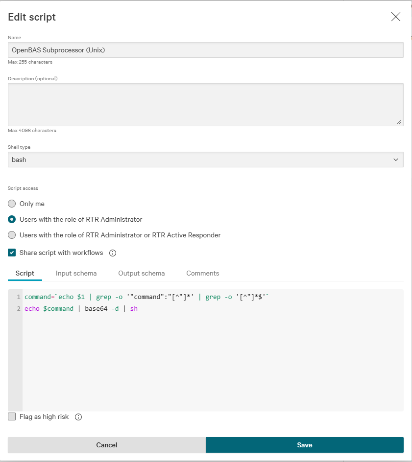
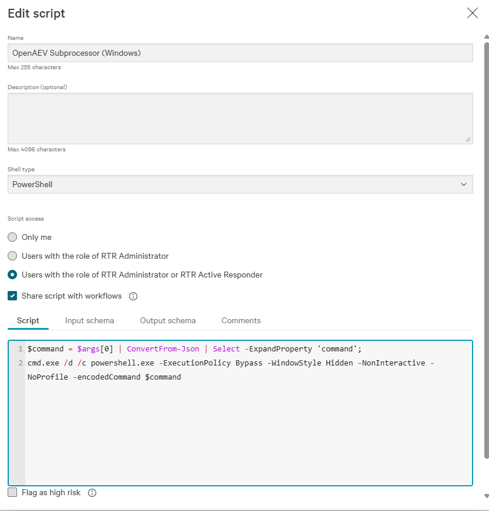
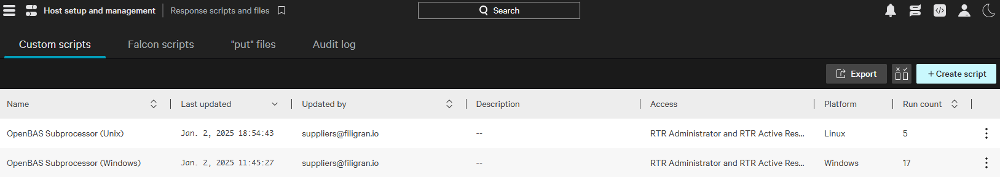
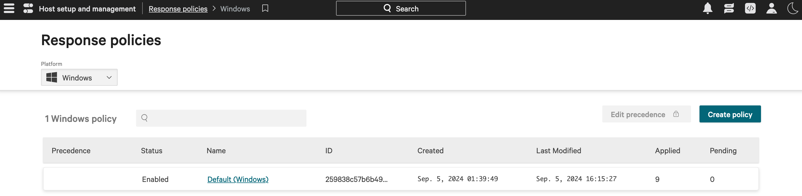
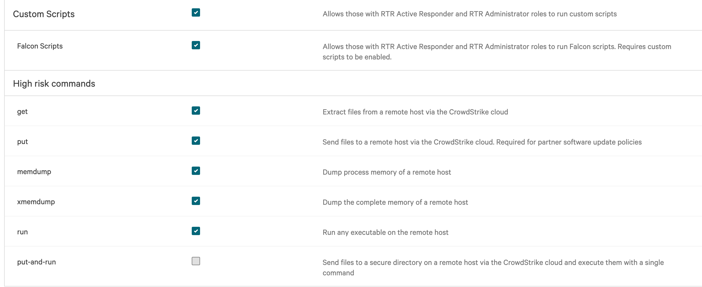
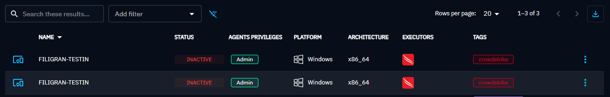

# CrowdStrike Falcon Executor

The CrowdStrike Falcon Executor runs OpenAEV implants through the Falcon agent already deployed on your endpoints, with Real Time Response scripts.

!!! tip "Enterprise Edition"

    This Executor requires an Enterprise Edition license. See [Executors](executors.md).

## Configure the CrowdStrike platform

### Upload OpenAEV scripts

Create two custom scripts, one for Windows and one for Unix (Linux and macOS), in **Host setup and management > Response and containment > Response scripts and files**. You can rename them: their names go in the OpenAEV configuration.

*Unix Script*

| Attribute             | Value                                                            |
|:----------------------|:-----------------------------------------------------------------|
| name                  | OpenAEV Subprocessor (Unix)                                      |
| shell type            | bash                                                             |
| script access         | Users with the role of RTR (Real Time Response) Administrator or RTR Active Responder |
| shared with workflows | yes                                                              |

Script:

```bash
command=`echo $1 | grep -o '"command":"[^"]*' | grep -o '[^"]*$'`
echo $command | base64 -d | sh
```

Input schema:

```json
{
  "$schema": "https://json-schema.org/draft/2020-12/schema",
  "properties": {
    "command": {
      "type": "string"
    }
  },
  "required": [
    "command"
  ],
  "type": "object",
  "description": "This generated schema may need tweaking. In particular format fields are attempts at matching workflow field types but may not be correct."
}
```



*Windows script*

| Attribute             | Value                                                            |
|:----------------------|:-----------------------------------------------------------------|
| name                  | OpenAEV Subprocessor (Windows)                                   |
| shell type            | PowerShell                                                       |
| script access         | Users with the role of RTR Administrator or RTR Active Responder |
| shared with workflows | yes                                                              |

Script:

```powershell
$command = $args[0] | ConvertFrom-Json | Select -ExpandProperty 'command';
cmd.exe /d /c powershell.exe -ExecutionPolicy Bypass -WindowStyle Hidden -NonInteractive -NoProfile -encodedCommand $command
```

Input schema:

```json
{
  "$schema": "https://json-schema.org/draft/2020-12/schema",
  "properties": {
    "command": {
      "type": "string"
    }
  },
  "required": [
    "command"
  ],
  "type": "object",
  "description": "This generated schema may need tweaking. In particular format fields are attempts at matching workflow field types but may not be correct."
}
```



Once created, your RTR scripts look like this:



### Create a host group with your targeted Assets

Go to **Host setup and management > Host groups**.

### Create or update response policies for your targeted platforms

OpenAEV runs implants as custom scripts, so your Assets need a response policy that allows them.

1. Go to **Host setup and management > Response policies**, choose a platform in the top left selector, then click **Create policy** or open an existing one.

    

2. Allow **Custom Scripts**, and **Falcon Scripts** if the option exists. Set the other options according to your security policy, then click **Save**.

    

3. In the **Assigned host groups** tab, add the host group created above. The policy can take a few minutes to apply: the **Pending** column shows 0 once it is applied.

## Configure the OpenAEV platform

!!! warning "CrowdStrike API Key"

    The CrowdStrike API key needs these permissions: API integrations, Hosts, Host groups, Real time response.

## Checks

Assets and asset groups from the selected host groups appear in OpenAEV:



## What's next?

- [Executors](executors.md) -- Compare Executors, implant cleanup and troubleshooting
- [Inject status](../../usage/run-and-evaluate/injects/inject-status.md) -- Understand Inject results and timeouts
