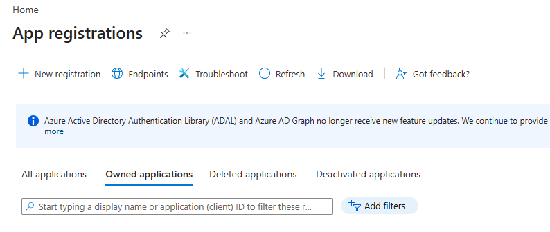
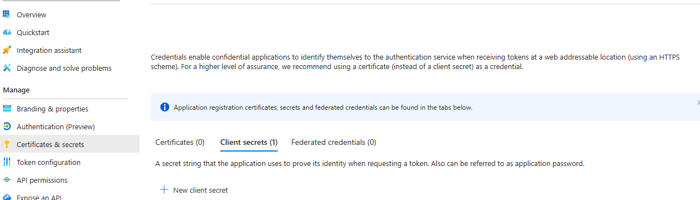
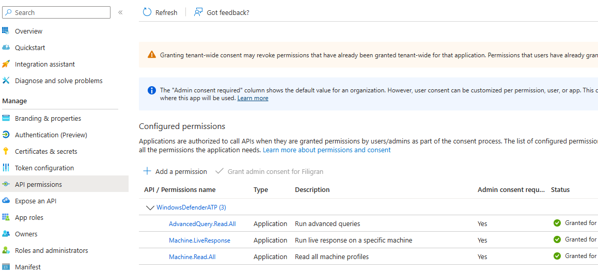
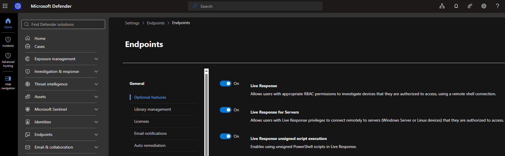
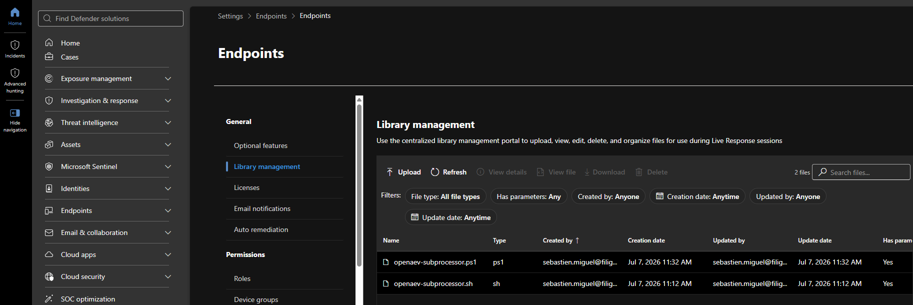
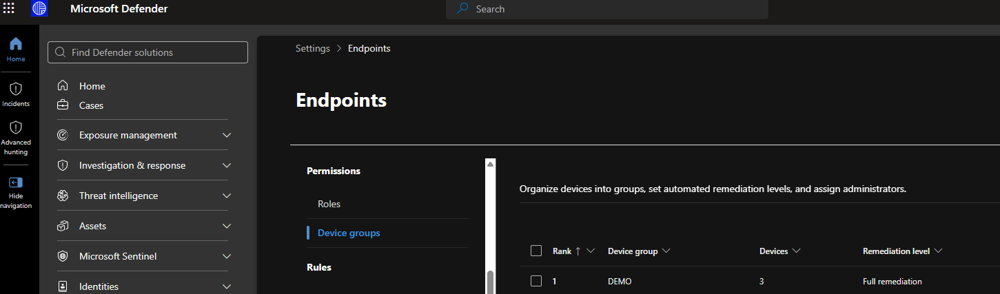
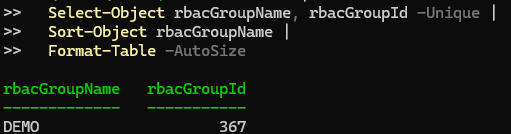
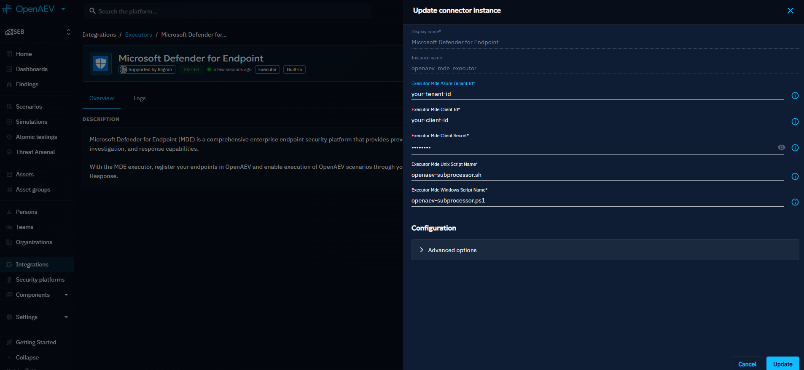
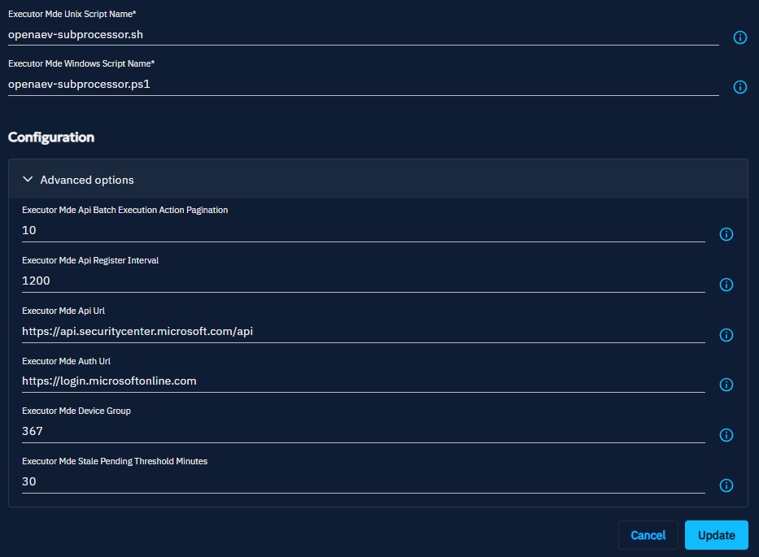
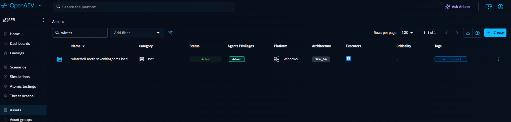

# Microsoft Defender for Endpoint (MDE) Executor

The MDE Executor runs OpenAEV implants through the Microsoft Defender for Endpoint sensor already deployed on your endpoints.

!!! tip "Enterprise Edition"

    This Executor requires an Enterprise Edition license. See [Executors](executors.md).

OpenAEV does **not** install a new agent: it reuses the **MDE sensor already deployed** on your endpoints and drives it
through the **Live Response** API. For each Inject, OpenAEV runs a small subprocessor script from the MDE Live Response
Library, which downloads and starts the OpenAEV implant.

!!! warning "Windows: detached scheduled task"

    On Windows, the MDE Live Response session terminates the whole process tree when the session ends. To let the implant
    survive and report its execution traces, OpenAEV launches it from a **detached SYSTEM scheduled task**
    (`OpenAEV-Inject-<inject>-Agent-<agent>`). This task **self-deletes** right after the implant finishes.

## Configure the Microsoft Defender platform

### Register an Azure (Entra ID) application

OpenAEV authenticates to the MDE API with the OAuth2 **client credentials** flow. Create an app registration in
**Microsoft Entra ID > App registrations > New registration**, then collect:

- **Directory (tenant) ID** → `Azure tenant ID` in OpenAEV
- **Application (client) ID** → `Client ID` in OpenAEV
- A **client secret** (`Certificates & secrets > New client secret`) → `Client secret` in OpenAEV





!!! warning "Required API permissions"

    Under **API permissions**, add the following **Application permissions** for *WindowsDefenderATP*, then click
    **Grant admin consent**:

    | Permission | Why |
    |------------|-----|
    | `Machine.Read.All` | List devices (and read their device-group name/id) and sync them into OpenAEV |
    | `Machine.LiveResponse.All` | Run the Live Response script that launches the implant |
    | `AdvancedQuery.Read.All` | Read near real-time device activity (Advanced Hunting) so only genuinely-reachable machines are marked active — the device inventory `lastSeen` lags by up to a day |

    Application permissions (not delegated) are mandatory because OpenAEV runs without a signed-in user.



### Enable Live Response in Microsoft Defender

In the **Microsoft Defender portal > Settings > Endpoints > Advanced features**, enable:

- **Live Response** (required)
- **Live Response for servers** (only if you target Windows Server / Linux server endpoints)
- **Live Response unsigned script execution** (**required** — the OpenAEV subprocessor scripts are not code-signed)

!!! danger "Unsigned script execution"

    If *Live Response unsigned script execution* is **disabled**, every inject fails at the Live Response step because
    MDE refuses to run the OpenAEV subprocessor script. This is the single most common misconfiguration.



### Upload the OpenAEV subprocessor scripts

Upload the two subprocessor scripts to the **MDE Live Response Library** (they decode the Base64 command sent by OpenAEV
and execute it). The file names must match what you configure in OpenAEV (defaults below).

*Windows script* (`openaev-subprocessor.ps1`):

[Download](assets/mde_subprocessor_windows.ps1)

*Unix script* (`openaev-subprocessor.sh`, covers Linux and macOS):

[Download](assets/mde_subprocessor_unix.sh)

!!! note "How the scripts work"

    OpenAEV passes the full command as a **single Base64 argument**. The Windows script decodes it and runs it with
    `Invoke-Expression`; the Unix script decodes it and pipes it to `sh`. Keep them as-is — reserved parameter names such
    as `param([string]$Args)` will break argument passing on PowerShell (`$args[0]` must be used).

!!! warning "Tick *Has parameters* when uploading each script"

    In the upload dialog, **enable the "parameters" option** for both scripts. OpenAEV always invokes the subprocessor
    with the Base64 command as an argument; if parameters are not enabled, MDE runs the script without it and every inject
    fails. Both scripts must show **Has parameters: Yes** in the library.



### Scope to a device group (optional)

To sync only a subset of devices, set the **device group ID** (`rbacGroupId`) in OpenAEV. Leave the field empty to
sync **all** devices.

!!! warning "The numeric `rbacGroupId` is not shown in the Microsoft Defender UI"

    The Defender portal (**Settings > Endpoints > Permissions > Device groups**) shows device group **names**, not the
    numeric `rbacGroupId` that OpenAEV needs. The MDE API also exposes no "list device groups" endpoint. The reliable way
    to map a group **name** to its **id** is to read it from the machines inventory, which returns both `rbacGroupName`
    and `rbacGroupId` for every device.



Run the following (PowerShell) against your tenant — it authenticates with the same Entra app registration and prints
the `name → id` mapping for every device group that has at least one machine:

```powershell
$tenant = '<TENANT_ID>'
$client = '<CLIENT_ID>'
$secret = '<CLIENT_SECRET>'

$token = (Invoke-RestMethod -Method Post `
  -Uri "https://login.microsoftonline.com/$tenant/oauth2/v2.0/token" `
  -Body @{
    grant_type    = 'client_credentials'
    client_id     = $client
    client_secret = $secret
    scope         = 'https://api.securitycenter.microsoft.com/.default'
  }).access_token

$machines = Invoke-RestMethod `
  -Uri 'https://api.securitycenter.microsoft.com/api/machines?$select=rbacGroupId,rbacGroupName' `
  -Headers @{ Authorization = "Bearer $token" }

$machines.value |
  Select-Object rbacGroupName, rbacGroupId -Unique |
  Sort-Object rbacGroupName |
  Format-Table -AutoSize
```

Example output:

```text
rbacGroupName   rbacGroupId
-------------   -----------
DEMO                    367
UnassignedGroup         366
```



Here, syncing only the **DEMO** group means setting the OpenAEV **Device group** field to `367`. Separate multiple IDs
with commas (for example `367,366`). `UnassignedGroup` is the default group for machines not assigned to any custom
group.

!!! note "The `$select` query above requires quoting"

    Keep the URI in **single quotes** so PowerShell does not interpret `$select` as a variable. The app registration
    needs `Machine.Read.All` (already granted when you registered the application). A group appears only once it contains at least one machine that
    MDE has seen.

## Configure the OpenAEV platform



| Field | Required | Description |
|-------|----------|-------------|
| **Azure tenant ID** | ✅ | Directory (tenant) ID of the Entra app registration |
| **Client ID** | ✅ | Application (client) ID |
| **Client secret** | ✅ | Client secret value |
| **Device group** | ❌ | One or more `rbacGroupId` separated by commas. Empty = all devices |
| **Windows script name** | ✅ | Must match the uploaded Windows script (default `openaev-subprocessor.ps1`) |
| **Unix script name** | ✅ | Must match the uploaded Unix script (default `openaev-subprocessor.sh`) |

!!! note "Advanced settings"

    Defaults rarely need changing: the API base URL (`https://api.securitycenter.microsoft.com/api`), the auth URL
    (`https://login.microsoftonline.com`), the register interval (device/agent sync, default **1200s**) and the Live
    Response batch pagination (**10 machines / 5s**, the MDE rate limit is stricter than CrowdStrike).



## Checks

After the first sync, the devices of the selected device groups appear in OpenAEV. Only devices whose MDE `onboardingStatus` is **Onboarded** are synced.



!!! note "How the agent active status is computed"

    At each sync, OpenAEV reads the latest activity of every device from **Advanced Hunting**, across the
    `DeviceInfo`, `DeviceEvents`, `DeviceNetworkEvents` and `DeviceProcessEvents` tables. `DeviceInfo` alone is only a
    snapshot written about once an hour, so it is not enough to tell whether a device is up.

    - Activity within the **tolerance** (70 minutes plus one register interval, so **90 minutes** with the default
      1200 s): the agent is considered seen at the time of the sync, so its **Last seen** shows the time of the latest
      sync rather than the exact time of the last event.
    - Older activity: **Last seen** keeps that real timestamp, and the agent turns inactive once it is more than one hour
      old.

    With the default register interval, a device that goes offline is therefore shown as inactive within about two
    hours. A healthy device stays active between two syncs. Keep the register interval under one hour: the agent active
    threshold is one hour, so a longer interval lets any agent age out between two syncs.

!!! note "Where to see executions on the Microsoft side"

    Each inject is an MDE **Live Response** action. You can review them in the Microsoft Defender portal:

    - **Assets > Devices > *device* > Timeline** and the device **Live response** session log
    - **Action center > History**, filtered on *Action type = Live response* / *Source = API*
    - **Advanced hunting** (KQL (Kusto Query Language) on `DeviceProcessEvents`) to see the scheduled task, the implant and the payload commands

## Troubleshooting

!!! tip "Inject is ERROR but I have execution traces (stdout/stderr)"

    This is expected: the inject status reflects the **payload's own exit code / stderr**, not an executor failure. If the
    payload command returns a non-zero exit code or writes to `stderr` (e.g. running `net localgroup "Administrators"` on a
    non-English Windows, or a test designed to fail off-domain), the trace is marked ERROR even though the executor
    delivered and ran it correctly. Check the `stdout`/`stderr`/`exit_code` in the execution trace to confirm.

!!! tip "Live Response fails immediately for every device"

    Verify **Live Response unsigned script execution** is enabled (see [Enable Live Response](#enable-live-response-in-microsoft-defender)), that both subprocessor scripts are in the
    Live Response Library with the **exact names** configured in OpenAEV, and that the app registration has
    `Machine.LiveResponse.All` with **admin consent granted**.

!!! tip "Devices are missing or show as inactive"

    OpenAEV filters devices by the configured **device group**, keeps only **Onboarded** devices, and marks
    an agent active from **near real-time Advanced Hunting activity** (see "How the agent active status is
    computed" above; the device inventory `lastSeen` lags by up to a day and is not reliable). If the app
    registration lacks `AdvancedQuery.Read.All`, OpenAEV falls back to the sensor `healthStatus` and logs a
    warning. Confirm the device group ID, that the machines are onboarded and reporting to MDE, and that
    `AdvancedQuery.Read.All` is granted.

!!! tip "An Inject times out on a device that looks active"

    Live Response only runs while the Defender sensor is connected. On an offline device, the action stays **Pending**
    and the Inject times out. Check the action in **Action center > History**.

## What's next?

- [Executors](executors.md) -- Compare Executors, implant cleanup and troubleshooting
- [Inject status](../../usage/run-and-evaluate/injects/inject-status.md) -- Understand Inject results and timeouts
