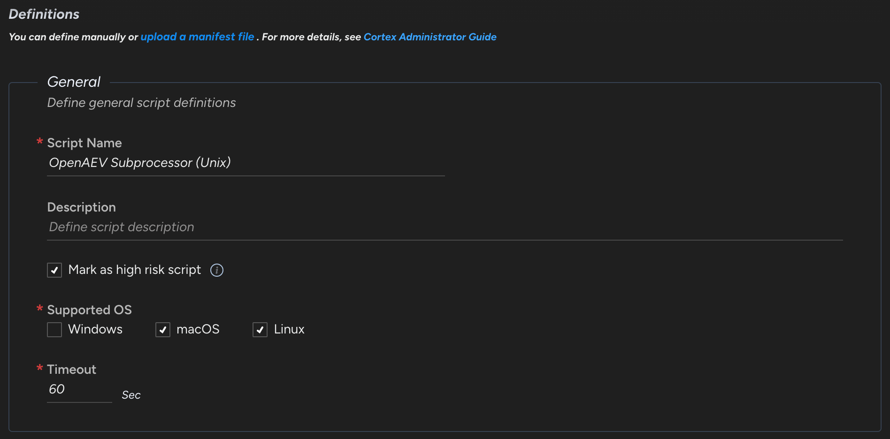
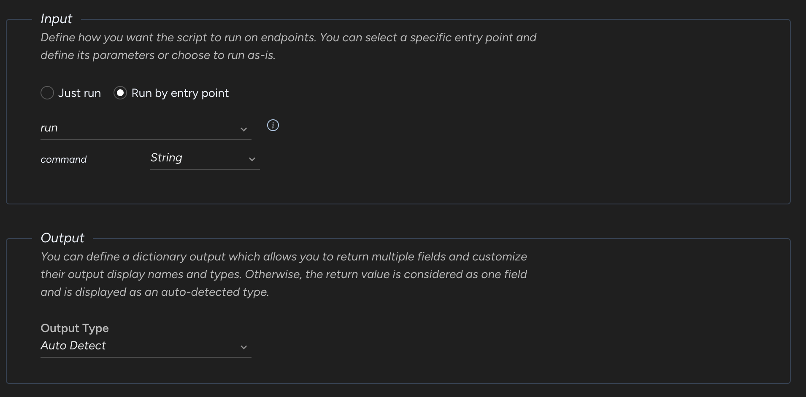
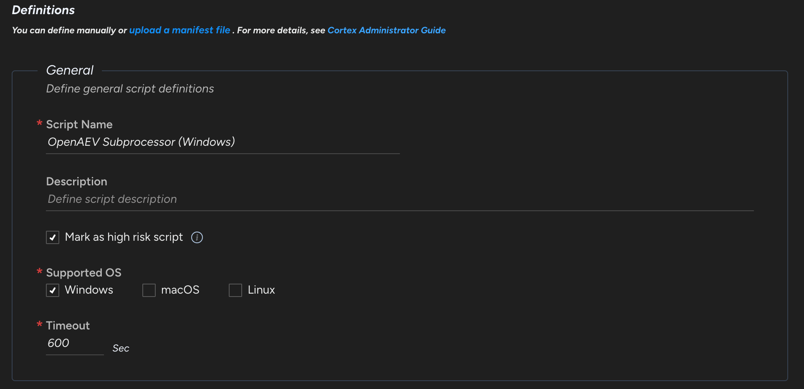
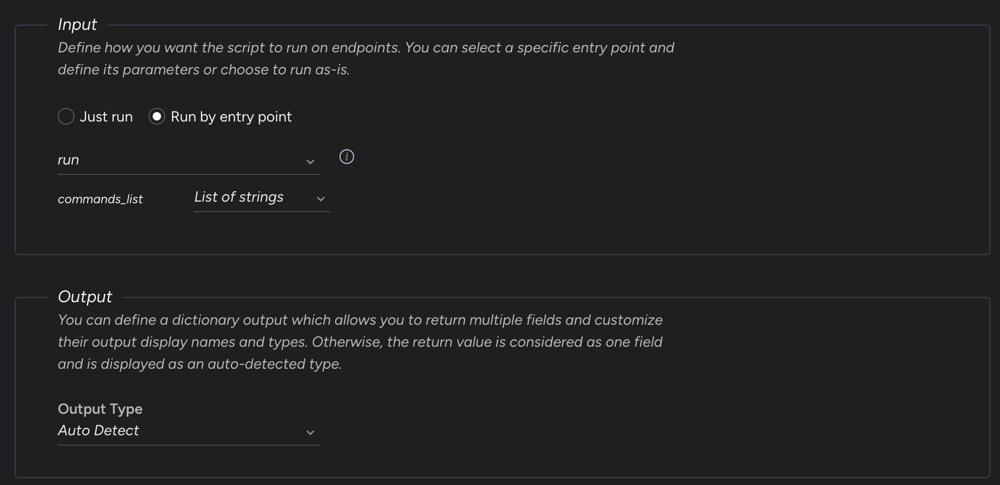
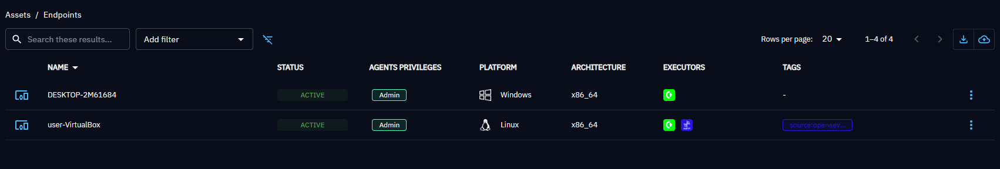

# Palo Alto Cortex Executor

The Palo Alto Cortex Executor runs OpenAEV implants through the Cortex agent already deployed on your endpoints, with scripts from the Agent Script Library.

!!! tip "Enterprise Edition"

    This Executor requires an Enterprise Edition license. See [Executors](executors.md).

On Windows, Palo Alto Cortex trusts its own process tree, so OpenAEV creates a scheduled task to detach the process that runs the Threat Arsenal Actions.

## Configure the Palo Alto Cortex platform

### Upload OpenAEV scripts

Create two custom scripts, one for Unix (Linux and macOS) and one for Windows, in **Investigation & responses > Action Center > Agent Script Library > + New Script**. You can rename them: their IDs go in the OpenAEV configuration. To see the IDs, add the **Script UID** column to the scripts list.

*Unix Script*

Upload this Python script:

[Download](assets/paloaltocortex_subprocessor_unix.py)

Input schema:

*Windows script*

Upload this Python script:

[Download](assets/paloaltocortex_subprocessor_windows.py)

Input schema:

### Create a group with your targeted Assets

Go to **Inventory > Endpoints > Groups**.

## Configure the OpenAEV platform

!!! warning "Palo Alto Cortex API Key"

    Create the API key in **Settings > Configurations > API Keys** with at least the "Instance Administrator" role and the "Standard" security level.

## Checks

Assets and asset groups from the selected groups appear in OpenAEV:

## What's next?

- [Executors](executors.md) -- Compare Executors, implant cleanup and troubleshooting
- [Inject status](../../usage/run-and-evaluate/injects/inject-status.md) -- Understand Inject results and timeouts
