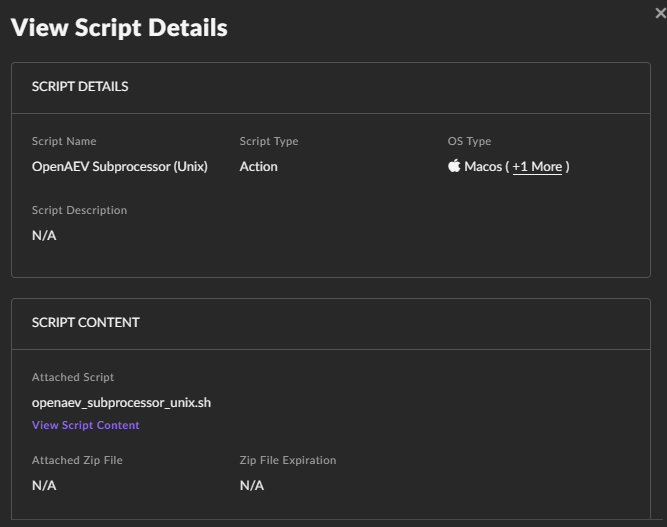
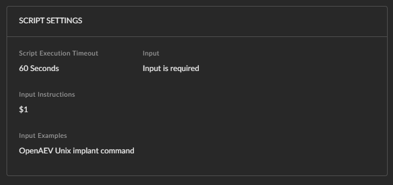
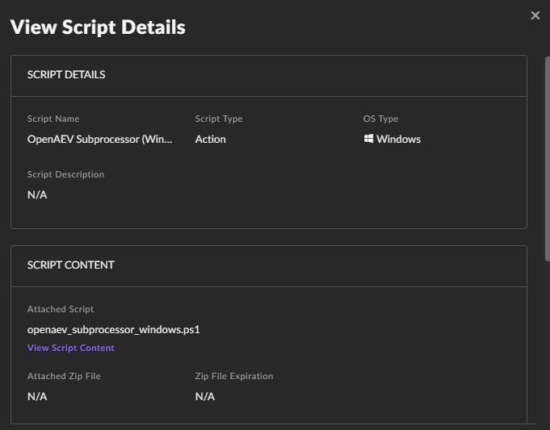
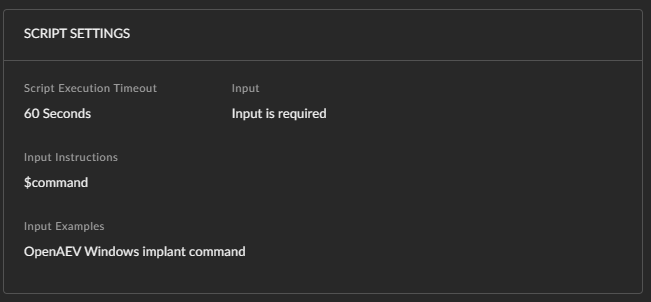
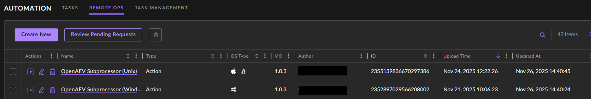
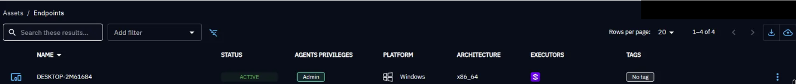

# SentinelOne Executor

The SentinelOne Executor runs OpenAEV implants through the SentinelOne agent already deployed on your endpoints, with Remote Ops scripts.

!!! tip "Enterprise Edition"

    This Executor requires an Enterprise Edition license. See [Executors](executors.md).

!!! warning "SentinelOne"

    The SentinelOne license needs the "remote script orchestration" add-on to run scripts from OpenAEV. See **SentinelOne > Settings > Configuration > Add-ons**.

## Configure the SentinelOne platform

### Upload OpenAEV scripts

Create two custom scripts, one for Windows and one for Unix (Linux and macOS), in **Automation > Remote Ops > Create new**. You can rename them: their IDs go in the OpenAEV configuration.

*Unix Script*

Upload the following script (encoded for Unix):

[Download](assets/sentinelone_subprocessor_unix.sh)

Input schema:

*Windows script*

Upload the following script (encoded for Windows):

[Download](assets/sentinelone_subprocessor_windows.ps1)

Input schema:

Once created, your Remote Ops scripts look like this:

### Create a wrapper with your targeted Assets

To create a wrapper (account, site or group), go to **Settings > Accounts/Sites**.

## Configure the OpenAEV platform

!!! warning "SentinelOne API Key"

    Create the API key in **Settings > Users > Service Users** with at least the "IR Team" role. Create the API key and the scripts with the same user and in the same account or site.

## Checks

Assets and asset groups from the selected accounts, sites or groups appear in OpenAEV:

## What's next?

- [Executors](executors.md) -- Compare Executors, implant cleanup and troubleshooting
- [Inject status](../../usage/run-and-evaluate/injects/inject-status.md) -- Understand Inject results and timeouts
