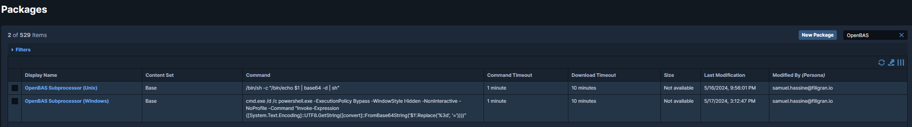
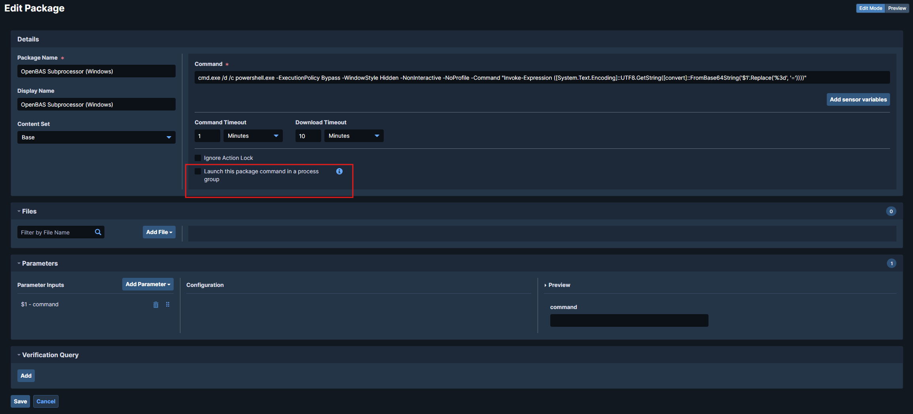
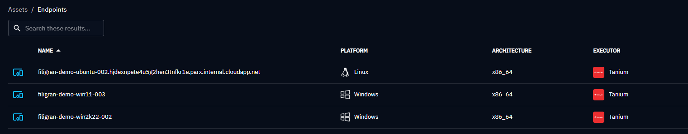

# Tanium Executor

The Tanium Executor runs OpenAEV implants through the Tanium agent already deployed on your endpoints.

!!! tip "Enterprise Edition"

    This Executor requires an Enterprise Edition license. See [Executors](executors.md).

## Configure the Tanium platform

Import the [two OpenAEV Tanium packages](https://github.com/OpenAEV-Platform/openaev/blob/master/openaev-api/src/main/java/io/openaev/executors/tanium/openaev-tanium-packages.json) into the Tanium platform.

!!! warning "Tanium package configuration"

    OpenAEV runs implants as detached processes, so uncheck
    **"Launch this package command in a process group"** in the package configuration:

    

!!! warning "Tanium Threat Response usage"

    If your endpoints use **Tanium Threat Response (TTR)**, use the **dedicated TTR package**. It works in all cases but performs more operations on the machine and generates **more noise and alerts**, so prefer the **standard package** without TTR.

    **Packages to import:**

    - [OpenAEV Tanium Windows & Unix package (TTR)](https://github.com/OpenAEV-Platform/openaev/blob/master/openaev-api/src/main/java/io/openaev/executors/tanium/openaev-tanium-packages-TTR.json)

    **Scripts to attach in the package configuration into files section:**

    - [Windows TTR script](https://github.com/OpenAEV-Platform/openaev/blob/master/openaev-api/src/main/java/io/openaev/executors/tanium/openaev-ttr.ps1)
    - [Linux & macOS TTR script](https://github.com/OpenAEV-Platform/openaev/blob/master/openaev-api/src/main/java/io/openaev/executors/tanium/openaev-ttr.sh)

| Package type                | Recommended use case                  | Characteristics                                            |
|-----------------------------|---------------------------------------|------------------------------------------------------------|
| **Standard Tanium package** | Default use with Tanium agent only    | Lightweight, minimal impact, recommended in most scenarios |
| **TTR package**             | Tanium agent + Tanium Threat Response | Enables additional operations, may generate more noise     |

Once the packages are imported, get their IDs from the URL `ui/console/packages/XXXXX/preview`.

!!! note "Common group IDs in Tanium"

    - **Computer Group ID**: identifies which endpoints will be queried.
    - **Action Group ID**: identifies where actions (like package execution) are allowed.

## Configure the OpenAEV platform

!!! note "Tanium API Key"

    The Tanium API key must be allowed to:

    - retrieve the endpoint list from the Tanium GraphQL API;
    - launch packages on endpoints.

## Checks

Endpoints from the selected computer groups appear in **Assets > Endpoints**:

## What's next?

- [Executors](executors.md) -- Compare Executors, implant cleanup and troubleshooting
- [Inject status](../../usage/run-and-evaluate/injects/inject-status.md) -- Understand Inject results and timeouts
