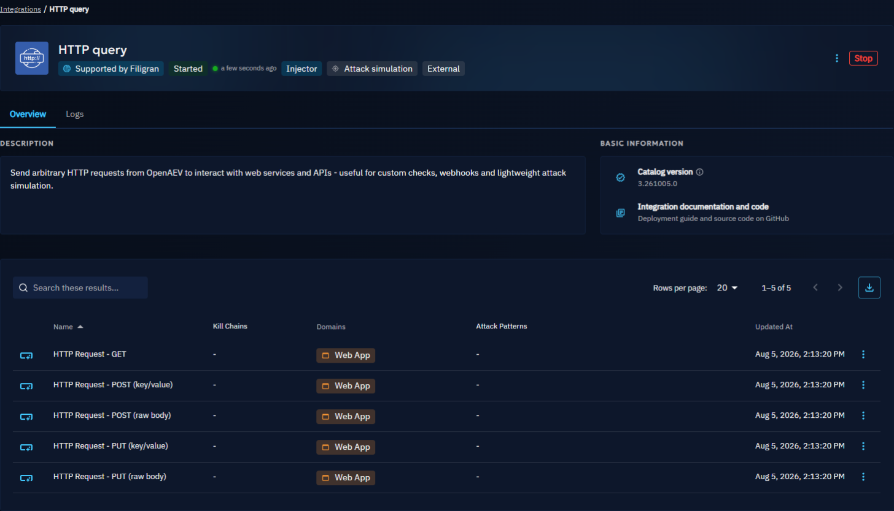

# Deploy Injectors

This page explains how to deploy and configure Injectors. To learn what Injectors do, see [Injectors](injectors.md).

## Built-in Injectors

Some Injectors, such as email, SMS or media pressure, are embedded in the platform. To configure them, set their parameters in the [platform configuration](../../reference/deployment/configuration.md).

## External Injectors

You can deploy an external Injector in three ways:

- with the Integration Manager (recommended);
- with Docker;
- manually.

!!! note

    External Injectors must reach the OpenAEV API. They need `OPENAEV_URL` and `OPENAEV_TOKEN`, plus their own mandatory parameters, listed in each Injector's README.

### Integration Manager (recommended)

The Integration Manager deploys Injectors directly from the OpenAEV interface. See the [Integration Manager documentation](../../deployment/integration-manager/overview.md).

### Docker

To add an Injector to your existing deployment, for example HTTP query, add a service to your `docker-compose.yml` file:

```yaml
  injector-http-query:
    image: openaev/injector-http-query:latest
    environment:
      - OPENAEV_URL=http://localhost
      - OPENAEV_TOKEN=ChangeMe
      - INJECTOR_ID=ChangeMe # a valid UUIDv4 of your choice
      - "INJECTOR_NAME=HTTP query"
      - INJECTOR_LOG_LEVEL=error
    restart: always
```

Injector images and versions are on [Docker Hub](https://hub.docker.com/u/openaev).

To run an Injector on its own, use the `docker-compose.yml` file in its folder of the [injectors repository](https://github.com/OpenAEV-Platform/injectors), set its parameters, then run:

```bash
docker compose up -d
```

### Manual deployment

Manual deployment needs Python 3.11 or later and [Poetry](https://python-poetry.org/). Copy `config.yml.sample` to `config.yml`, set the values, then follow the **Manual deployment** section of the Injector's README. For example, for HTTP query:

```bash
git clone https://github.com/OpenAEV-Platform/injectors.git
cd injectors/http-query
cp config.yml.sample config.yml
poetry install
poetry run python -m http_query.openaev_http
```

Example of `config.yml`:

```yaml
openaev:
  url: 'http://localhost:8080'
  token: 'ChangeMe'

injector:
  id: 'ChangeMe'
  name: 'HTTP query'
  log_level: 'info'
```

!!! tip "Injector tokens"

    You can use your administrator token or an administrator service account. You do not need one user per Injector.

### Networking

Injectors reach RabbitMQ with the configuration the platform gives them, so they must reach RabbitMQ on that hostname and port. With Docker, attach the Injector container to the OpenAEV network, for example:

```yaml
networks:
  default:
    external: true
    name: openaev-docker_default
```

## Injector status

To see an Injector's status, open **Integrations** and the **Deployed** tab. Each card shows whether the Injector is started and when it was last seen. Select an Injector to see its contracts and, if the Integration Manager deployed it, its logs in the **Logs** tab.



## What's next?

- [Injectors](injectors.md) -- Main types of Injectors
- [Injector development](../../development/injectors.md) -- Build your own Injector
