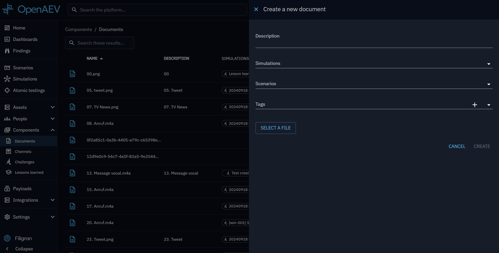

# Documents

Documents serve as resources for adding content to your table-top injects, helping your animation team and players. They
can also be utilized in Threat Arsenal Actions for file dropping purposes.

## Create a document

To create a new document, follow these steps:

1. Click the + button in the bottom right corner of the screen.
2. Select a file to create your document.
3. Optionally, add a description and tags to provide additional context. You can also link your documents directly to specific simulations or scenarios.
   specific simulations or scenarios.

After completing these steps, your new document will appear in the document list. Clicking on a document in the list
will allow you to download it.

## Use a document

Documents can be added into table-top injects and Threat Arsenal Actions.

When creating an table-top inject, you can attach documents to provide context or, in the case of email injects, to
include attachments.

Additionally, you can create a File Drop Threat Arsenal Action and include your documents within it.

## What's next?

- [Scenarios](../scenario/scenario.md) -- Attach Documents to your Scenarios
- [Injects](../../evaluate/injects/inject-overview.md) -- Use Documents in table-top Injects
- [Threat Arsenal](../threat-arsenals/threat-arsenals.md) -- Create File Drop actions with your Documents
