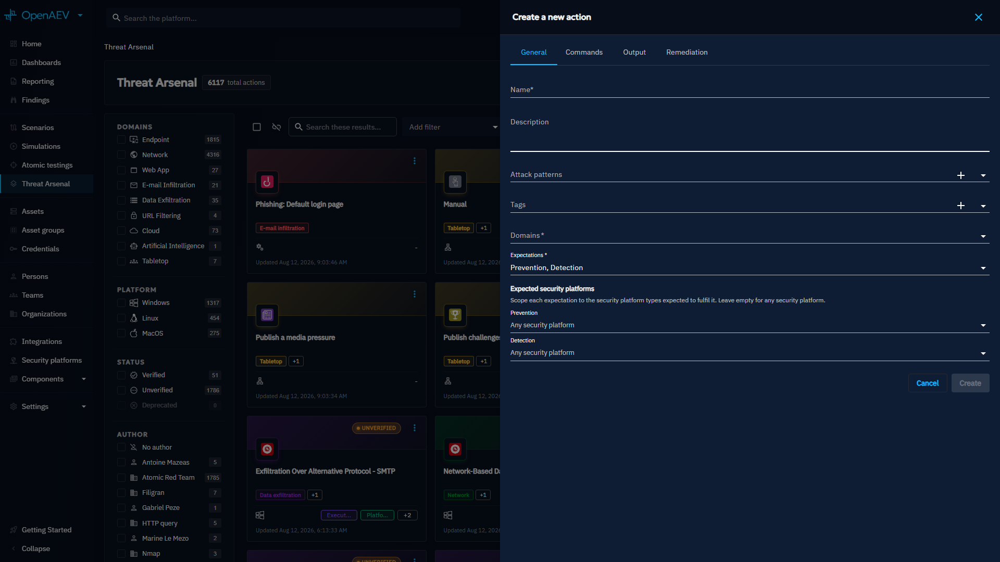
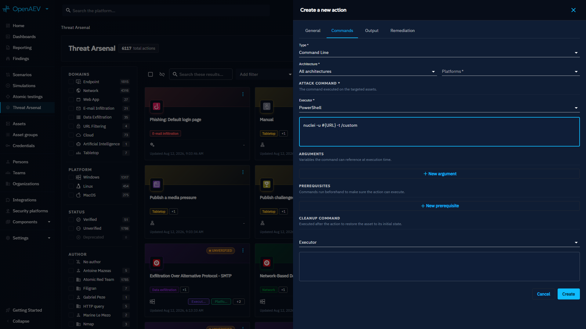
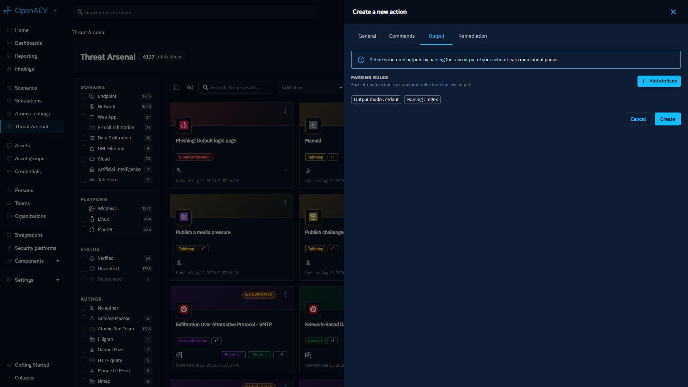
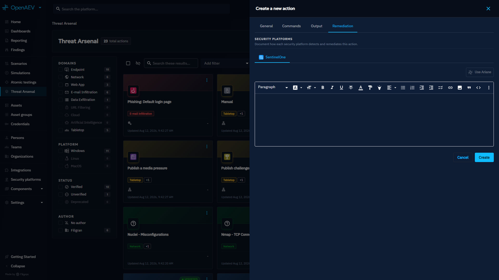
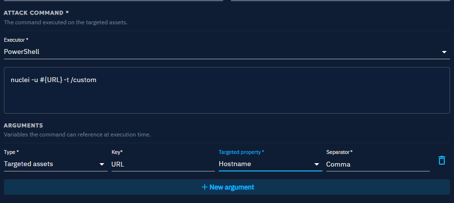
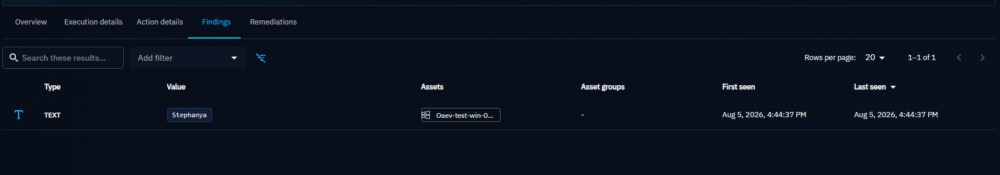
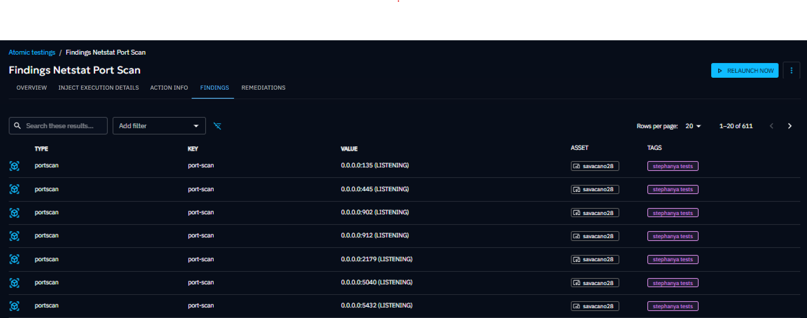
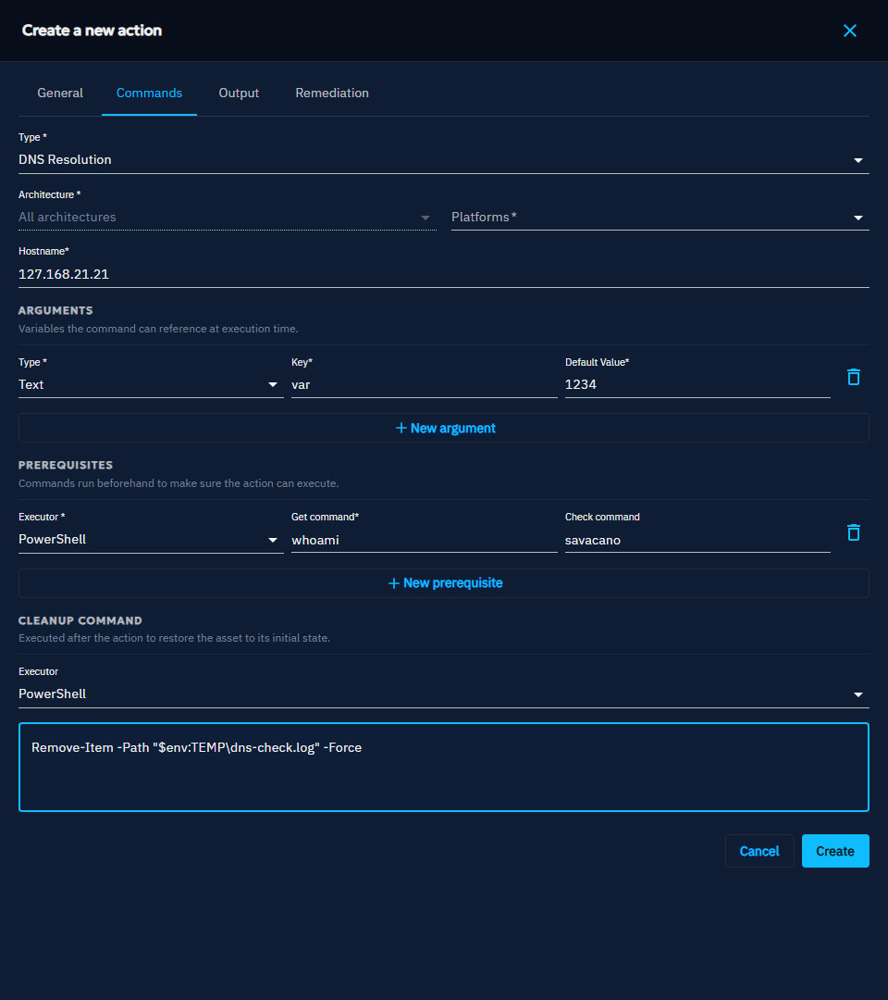
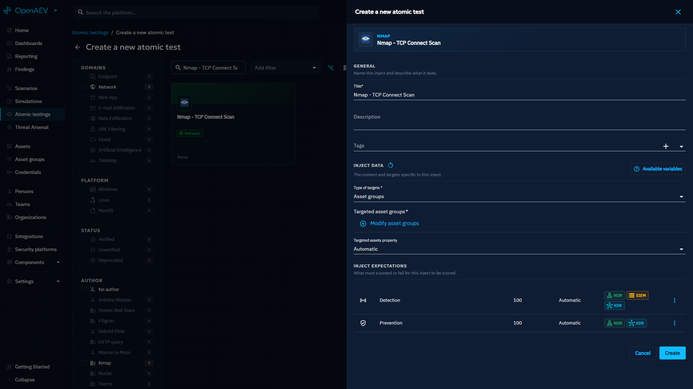

# Threat Arsenal

The **Threat Arsenal** is the section in OpenAEV where you manage all the Actions available for building injects.

An **Action** defines what happens when an Inject executes on a target: a shell command, an executable, a file drop, or a DNS resolution.

Actions unify what were previously known as **Payloads** and **Injector Contracts** into a single, simplified interface. Depending on their source, actions can be:

- **User-created :** Built from scratch by users via the Threat Arsenal interface (supported by the OpenAEV Implant Injector)
- **Injector-provided :** Automatically inserted by injectors integrated into the platform (e.g. Nuclei). Only domains, attack patterns, and tags can be edited
- **Collector-provided :** Inserted by collectors (e.g., Atomic Red Team) These Actions are read-only and managed entirely by the collector.

## Why use the Threat Arsenal?

- Build custom attack Actions tailored to your environment and threat landscape.
- Leverage community and vendor-provided Actions from Injectors and Collectors.
- Attach output parsers to automatically generate Findings from execution results.
- Define detection and remediation rules to validate Collector coverage.

## Threat Arsenal Action — list view

The **Threat Arsenal** view displays all Actions available in the platform. 
Actions can either be created by users or inserted through injectors.

Each entry in the list includes the following columns:

| Column          | Description                                                                                                      |
|-----------------|------------------------------------------------------------------------------------------------------------------|
| **Type**        | The injector type that supports the Action. (User-created Actions are supported by the OpenAEV Implant Injector) |
| **Name**        | The name assigned to the Action.                                                                                 |                                                                         
| **Domains**     | The domains on which the Action operates (e.g., Endpoint, Network, Web App, E-mail infiltration...).             |
| **Platform**    | The platforms that Action supports (e.g., Windows, Linux, macOS)                                              |
| **Tags**        | Tags to help categorize and search for Actions                                                         |
| **Status**      | The reliability or lifecycle state of the Action (see [**Action Status Logic**](#action-status-logic)).          |
| **Updated**     | The last modification date                                                                                     |

### Action status logic

Threat Arsenal Actions can have one of the following statuses:

- **Verified** ✅  
  OpenAEV has tested the Action and confirmed it works as expected.

- **Unverified** ⚠️  
  The Action has not been tested by OpenAEV. It may or may not work.

- **Deprecated** ❌  
  The original source has marked the Action as deprecated. It’s kept for reference, but functionality is not
  guaranteed.

## Create a Threat Arsenal Action

To create a new Action, follow these steps:

1. Click the **"+"** button in the bottom right corner of the screen
2. In the **General Information** tab, fill in the required details about the Action
   2.1. Assign a name to your new Action and provide additional general details such as description, attack patterns and tags 
3. In the **Commands** tab:   
   3.1. Choose a **Threat Arsenal Action type** based on your needs:
    - **Command Line**: Executes a command using an executor (e.g., PowerShell, Bash, etc.)
    - **Executable**: Runs an executable file on an asset
    - **File Drop**: Drops a file onto an asset
    - **DNS Resolution**: Resolves a hostname into IP addresses

   3.2. Specify the platform and provide additional command details, such as arguments and prerequisites.
   
   3.3. Specify a **cleanup executor and cleanup command** to remove any remnants from execution on the asset

4. In the **Output Parsers** tab (optional):  
   4.1. Add **[Output Parsers](#output-parsers)** to process the raw output of your execution.
   
   4.2. Specify whether to generate **[Findings](../../evaluate/findings/findings.md)** from the output 

5. In the **Remediation** tab (optional and EE):  
   This section allows Threat Arsenal Action creators to define detection rules to identify Threat Arsenal Actions that were not
   blocked or detected by existing security systems (such as EDRs, SIEMs, etc.).  
   A dedicated Remediation tab is available for each collector integrated into the platform.
   
    5.1 Use Ariane, allows Threat Arsenal Action creators to generate rules using AI, for Threat Arsenal Action of type Command or DnsResolution and for the collector Splunk or Crowdstrike

### Status of detection remediation rules

| Status                                                                     | Description                                                                                                              |
|----------------------------------------------------------------------------|--------------------------------------------------------------------------------------------------------------------------|
|  Rules written by Human                | The rules have been written by a human                                                                                   |
|  Rules generated by AI                 | The rules have been generated by AI                                                                                      |
|  Threat Arsenal Action changed since rule was edited | The Threat Arsenal Action has been edited since last AI rules generation **[(relevant fields)](#fields-used-for-ai-rules-generation)** |

### Fields used for AI rules generation

| Fields                               | Tab      |
|--------------------------------------|----------|
| Name                                 | General  |
| Description                          | General  |
| Attack patterns                      | General  |
| Type                                 | Commands |
| Architecture                         | Commands |
| Platforms                            | Commands |
| Attack command - Executors (Command) | Commands |
| Attack command - Content (Command)   | Commands |
| Arguments                            | Commands |
| Hostname (DnsResolution)             | Commands |

Once completed, your new Threat Arsenal Action will appear in the Threat Arsenal Action list.

### General Threat Arsenal Action properties

| Property        | Description                     |
|-----------------|---------------------------------|
| Name            | Threat Arsenal Action name                    |
| Description     | Threat Arsenal Action description             |
| Attack patterns | Command-related attack patterns |
| Tags            | Tags                            |

### Commands common Threat Arsenal Action properties

| Property         | Description                                                                          |
|------------------|--------------------------------------------------------------------------------------|
| Type             | Type of Threat Arsenal Action such as Command Line, Executable, File Drop or DNS Resolution        |
| Architecture     | Architecture in which the command can be executed (x86_64, arm64, all architectures) |
| Platforms        | Compatible platforms (ex. Windows, Linux, MacOS)                                     |
| Prerequisites    | Prerequisites required to execute the command                                        |
| Cleanup executor | Executor for cleaning commands                                                       |
| Cleanup command  | Cleanup command to remove or reset changes made                                      |
| Arguments        | Arguments for the cleanup, prerequisites and potential command line                  |

#### Arguments in depth

Arguments allow you to dynamically set variables within command lines, which can be for cleanup commands, prerequisites,
or execution commands.

We support two types of arguments: text and targeted asset.

For text arguments, you can specify

- Key: This is how you reference the argument in your command using a placeholder.
- Default Value: During execution, this placeholder is replaced with the argument's value. This default value can be
  overridden when creating an inject.

For targeted asset arguments, you can specify several attributes within the Action:

- Key: This is how you reference the argument in your command using a placeholder.
- Targeted Property: This determines which attribute of each targeted asset to use in the command, such as local IP,
  seen IP, or hostname.
- Separator: This is used to separate multiple values when the command is executed, allowing you to format the arguments
  correctly in your script (e.g., using a comma to separate values).

Let's consider a practical example: If I want to create a Threat Arsenal Action using 'nuclei' for scanning, I would create it
with a command like nuclei -t #{asset-key}. I'd set up a targeted asset argument with the key "asset-key".

Next, I would create an inject based on this Threat Arsenal Action. In this inject, I'd designate a source asset, which is where the
command will execute (such as the asset where 'nuclei' is installed), and define the targeted assets that will serve as
the scan targets.

#### Prerequisites in depth

| Property          | Description                            |
|-------------------|----------------------------------------|
| Command executor	 | Executor for prerequisite              | 
| Check command     | Verifies if specific condition are met |                                                                                                                                                                                                                                         |
| Get command       | Run command if check command failed    |                                                                                                                                                                                                                      |

### Additional Threat Arsenal Action properties by type

#### Command line

This Threat Arsenal Action type executes commands directly on the command line interface (CLI) of the target system
(e.g., Windows Command Prompt, PowerShell, Linux Shell).

Command Line Threat Arsenal Actions are used for remote command execution to simulate common attacker Actions like privilege
escalation or data exfiltration.

| Property         | Description                     |
|------------------|---------------------------------|
| Command executor | Executor for command to execute |
| Command          | Command to execute              |

#### Executable

An Executable Threat Arsenal Action involves delivering a binary file (such as .exe on Windows or ELF on Linux) that the system runs
as an independent process.

Executables can perform a variety of functions, from establishing a backdoor to running complex scripts (mimic malware).

| Property        | Description     |
|-----------------|-----------------|
| Executable file | File to execute |

#### File drop

Use File Drop Threat Arsenal Actions to deliver files (e.g., scripts, documents, binaries) to the target system without
immediately executing them.

The goal is typically to simulate scenarios where attackers place files in specific locations for later use, either
manually or by another process.

| Property     | Description  |
|--------------|--------------|
| File to drop | File to drop |

#### DNS resolution

DNS resolution Threat Arsenal Actions attempt to resolve hostnames to associated IP address(es).

The goal of DNS resolution is to test if specific hostnames resolve to IP addresses correctly, helping assess network
accessibility, detect issues, and simulate potential attacker behavior.

| Property  | Description              |
|-----------|--------------------------|
| Hostnames | Hostname list to resolve |

### Output parsers

Output parsers allow processing the raw output from an execution. You can define rules to extract specific data from
the output and link it to variables.

These variables can then be used for [chaining injects](../../evaluate/injects/inject-overview.md/#conditional-execution-of-injects).

Currently, output parsers support:

* Output Mode: **StdOut**
* Parsing Type: **REGEX**

If the extracted data is compatible with a [Finding](../../evaluate/findings/findings.md), you can enable **"Show in Findings"**
option.

The findings results and the details of the output parser will also be available in the Findings and Threat Arsenal Action Info tabs
of the [Atomic Testing detail view](../../evaluate/atomic-testing/atomic-testing.md).

#### Defining a rule

When adding a rule, the following properties must be defined:

| Property     | Description                                                                                                                                                                                                                                                       | Mandatory |
|--------------|-------------------------------------------------------------------------------------------------------------------------------------------------------------------------------------------------------------------------------------------------------------------|-----------|
| Name         | The name of the rule.                                                                                                                                                                                                                                             | Yes       |
| Key          | A unique key identifier.                                                                                                                                                                                                                                          | Yes       |
| Type         | The data type being extracted (e.g., Text, Number, Port, IPv4, IPv6, Port Scan, Credentials).                                                                                                                                                                     | Yes       |
| Tags         |                                                                                                                                                                                                                                                                   | No        |
| Regex        | A regular expression (REGEX) to extract data from the raw output. Supports capturing groups and line anchors (e.g., ^ for start of line).
The parser uses these flags by default: Pattern.MULTILINE, Pattern.CASE_INSENSITIVE, Pattern.UNICODE_CHARACTER_CLASS. | Yes       |
| Output Value | Map each regex capture group to the corresponding fields based on the selected type.                                                                                                                                                                              | Yes       |

#### Output value mapping

Depending on the Type, a specific number of fields can be extracted using the group index from the regex :

| Type        | Fields                 | Output format       |
|-------------|------------------------|---------------------|
| Port Scan   | host, port, service    | host:port (service) |
| Credentials | username, password     | username:password   |
| Cve         | host, id, severity     | host:id (severity)  |
| Other       | single extracted value | single value        |

The group index must start with **$** to differentiate between multiple capture groups.

#### Example: extracting elements with regex for a port scan rule

In the next image, you can see a rule named **Port Scan (port_scan)** with the type **Port Scan**. This rule includes a
**regex pattern(`^\\s*(TCP|UDP)\\s+([\\d\\.]+|\\*)?:?(\\d+)\\s+\\S+\\s+(\\S+)`)**, which defines **four capture groups**
you could extract from the raw output.

You can define the group used to build the output in the **Output Value** section. For this example, each field is
mapped to a
specific capture group:

- **Host** (`$2`)
- **Port** (`$3`)
- **Service** (`$6`)

The finding generated would be:

If you want to combine multiple groups in a field, you have to concatenate them like `$n$m` (placing the group
references next to each other). The final value of the field will be a composition of these groups.

### Threat Arsenal Action execution workflow

## Use a Threat Arsenal Action

After creation, a new inject type will automatically appear in the inject types list if the implant you're using
supports it (the OpenAEV Implant does).

## Update a Threat Arsenal Action

As described in the [Threat Arsenal Action — list view](#threat-arsenal-action-list-view) section,
Threat Arsenal Actions can be created by you, inserted through Injectors, or inserted through Collectors.

Depending on the source of the Action, the update process may differ:

- **User-created actions** — You can update them directly from the Threat Arsenal view by clicking on the Action and modifying all its properties.
- **Actions inserted through injectors** — You can only update the domains, attack patterns, and tags linked to the Action.
- **Actions inserted through collectors** (e.g. Atomic Red Team) — You cannot update them from the platform, as they are managed by the collector.

## Delete a Threat Arsenal Action

The deletion process depends on the Action's source:

- **User-created actions** — You can delete them directly from the Threat Arsenal view by clicking on the Action and selecting the delete option.
- **Actions inserted through injectors or collectors** — These Actions cannot be deleted from the platform.

## Bulk operations

The Threat Arsenal list view supports bulk operations, allowing you to perform **operations** on multiple items at once.

### How to use

1. Select one or more Actions using the **checkboxes** on the left side of the list
2. A **bulk Action toolbar** appears at the top of the list with the available operations
3. Choose the desired operation

### Available bulk operations

| Operation       | Description                                                                                                      |
|-----------------|------------------------------------------------------------------------------------------------------------------|
| **Delete**      | Delete multiple user-created Actions at once. Actions from injectors or collectors cannot be deleted.            |
| **Export**      | Export selected Actions as a JSON ZIP archive ([JSON:API](https://jsonapi.org/) format)                          |
| **Tag**         | Add or remove tags on multiple Actions simultaneously                                                            |
| **Run a Test**  | Launch a scenario or atomic test directly from the selected Actions  |

### Run a test from bulk selection

When you click **"Run a Test"** from the bulk toolbar, a drawer opens with three execution options:

| Option                        | Description                                                          | Availability              |
|-------------------------------|----------------------------------------------------------------------|---------------------------|
| **Create a new scenario**     | Build a fully customized scenario. Selected Actions are prefilled as scenario steps. | One or more Actions selected |
| **Add to existing scenario**  | Insert the selected Actions as new steps into one or more existing scenarios.         | One or more Actions selected |
| **Run atomic test**           | Execute the selected Action immediately as a one-off simulation.                     | **Single Action only**       |

#### Create a new scenario

1. Select one or more Actions and click **Run a Test**
2. Choose **"Create a new scenario"**
3. The standard scenario creation funnel opens in the drawer
4. Click **Create** — the scenario is created with the selected Actions prefilled as inject steps

#### Add to existing scenario

1. Select one or more Actions and click **Run a Test**
2. Choose **"Add to existing scenario"**
3. Select one or more target scenarios from the dropdown list (multi-selection supported)
4. Click **Create** — the selected Actions are added as inject steps to all chosen scenarios

#### Run atomic test

1. Select **exactly one** Action and click **Run a Test**
2. Choose **"Run atomic test"**
3. The standard atomic test execution funnel opens with the Action prefilled
4. The simulation executes as a one-off run

## Import / export Threat Arsenal Actions

### Overview

There are two ways to export Threat Arsenal Actions:

- **CSV Export**
  You can filter or search your Threat Arsenal Action list and export the current view as a CSV file. The exported file contains the same information displayed in the Threat Arsenal page. This export is available for all types of Actions.

- **JSON ZIP Export** — [JSON:API](https://jsonapi.org/) 
  The JSON export is designed to be paired with the import feature — you export to reimport elsewhere. This export is only available for user-created Actions, as it contains all the details of the Action (including the command, arguments, output parsers, etc.) that are not editable for Actions coming from injectors or collectors.

OpenAEV supports importing and exporting Threat Arsenal Actions using the [JSON:API](https://jsonapi.org/) specification. 
This enables seamless sharing of Threat Arsenal Actions across instances or within the community.

### Use cases

- Share complex Threat Arsenal Actions with teammates or the community
- Use Threat Arsenal Actions across dev, test, and production environments

## What's next?

- [Domains](domains.md) -- Understand how Domains classify Threat Arsenal Actions by security control
- [Injects](../../evaluate/injects/inject-overview.md) -- Use Threat Arsenal Actions in Injects
- [Atomic testing](../../evaluate/atomic-testing/atomic-testing.md) -- Run individual Threat Arsenal Actions as Atomic Tests
- [Findings](../../evaluate/findings/findings.md) -- View parsed output from Threat Arsenal Action executions
