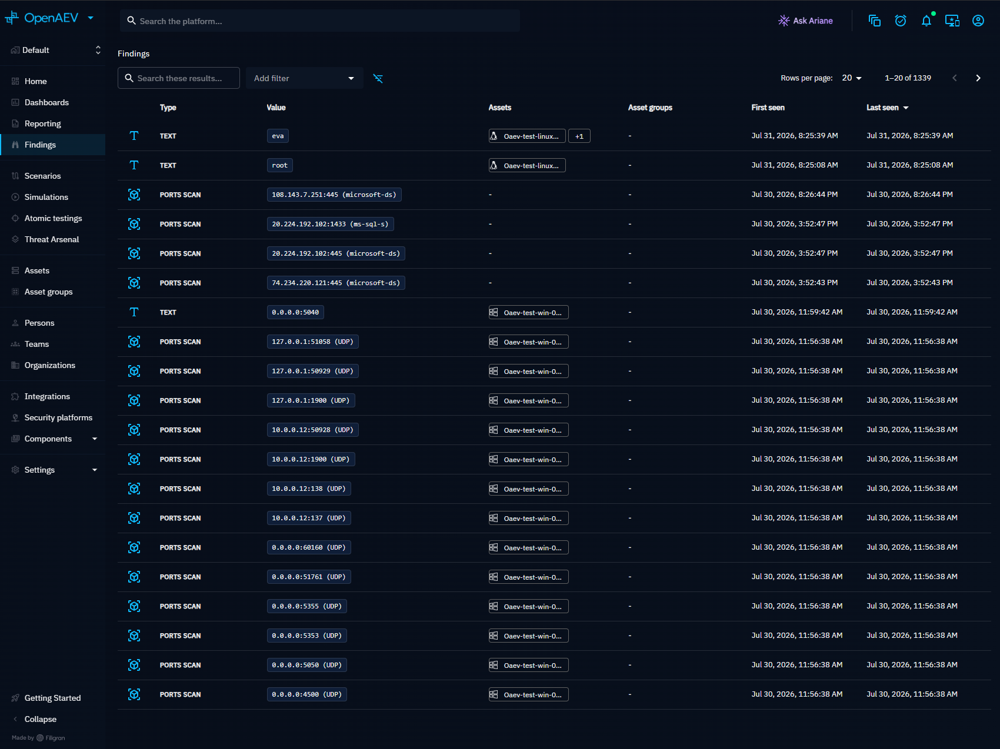
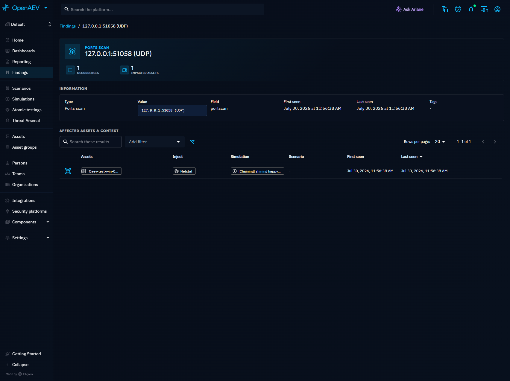
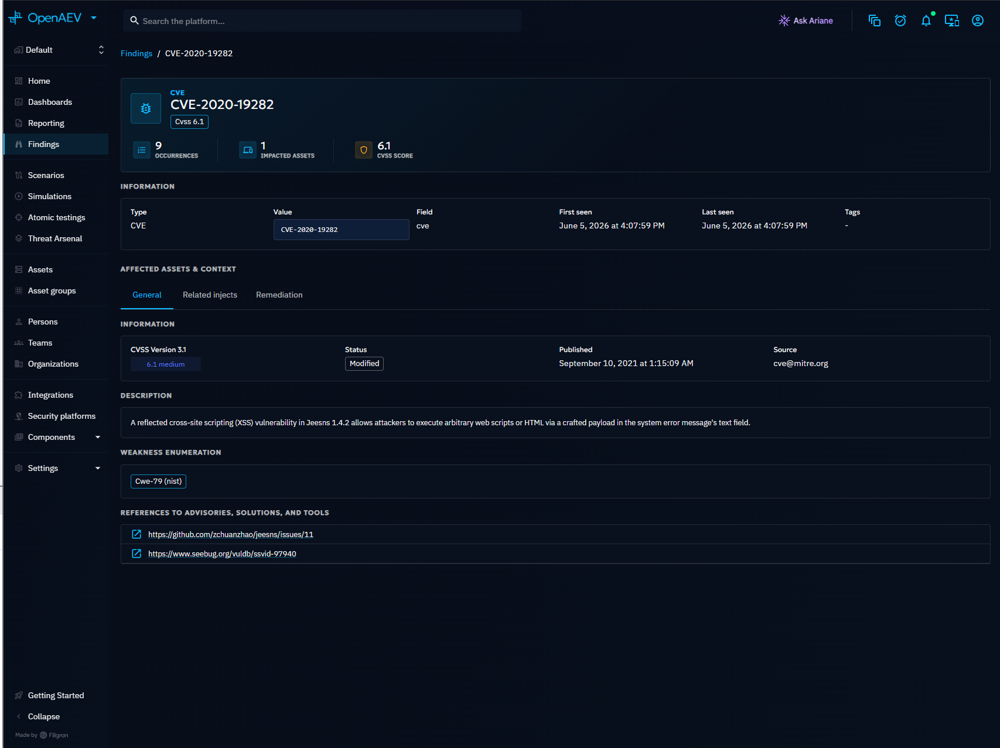

# Findings

Findings are structured security insights automatically extracted from Inject execution results. They surface discovered vulnerabilities, exposed credentials, open ports, IP addresses, and other actionable data produced by Injectors during Simulations and Atomic Tests.

## Why use Findings?

Findings transform raw execution output into searchable, categorized technical indicators. They help you:

- **Identify exposure**: see which CVEs, open ports, and credentials were discovered across your infrastructure
- **Track remediation**: monitor whether previously detected issues reappear in subsequent Simulations
- **Correlate with Assets**: understand which endpoints are affected by each Finding
- **Prioritize action**: CVE-type Findings include CVSS scores and enrichment data from [Taxonomies](../../../administration/taxonomies.md)

## How Findings are created

Findings are created automatically during Inject execution. When an Inject produces structured output (e.g., a port scan result, a CVE detection, or extracted credentials), OpenAEV parses the output and creates one Finding per discovered indicator.

OpenAEV keeps a stable Finding identity and a separate occurrence for every observation. The stable
identity combines the tenant, source namespace (Injector and contract output), type, and value.
Every detected location/context is stored on an occurrence. A re-detection appends an occurrence
and updates the stable Finding's first/last seen dates; it never overwrites earlier evidence.
Human-owned tags are consolidated on the stable Finding.

## Finding types

| Type | Description |
|---|---|
| CVE | Known vulnerabilities (e.g., CVE-2021-44228) with optional CVSS enrichment |
| Credentials | Extracted username/password pairs |
| IPv4 / IPv6 | Discovered IP addresses |
| Port | Open ports detected on an endpoint |
| PortScan | Structured port scan results |
| Text | Free-form textual indicators |
| Number | Numeric indicators |
| File / Share | Discovered files or network shares |
| Username | Discovered usernames and accounts |
| Misconfig | OCSF configuration findings, including Prowler cloud checks |

Additional types exist for Active Directory findings (SID, delegation, Kerberoastable accounts, ASREPRoastable accounts, etc.).

### Actionable groups

The global Findings page groups technical types by the analyst step they support. The group is
stored on the stable Finding, so sidebar filtering applies to the complete result set rather than
only the currently loaded page.

| Group | Contract output types |
|---|---|
| Surface & Reachability | Port, PortScan, IPv4, IPv6, Computer |
| Identities | SID, Username, Admin username, Email |
| Credential Access | Credentials, account without password requirement, AS-REP-roastable account, Kerberoastable account |
| Privilege & Trust Structure | Group, Delegation |
| Exploitable Weaknesses | CVE, Vulnerability |
| Resources | Share, File |
| Configuration & Posture | Password policy, OCSF cloud misconfiguration |
| Informative | Text, Number, action output, and expectation signature |

The **Informative** group is intentionally separate from the actionable workflow. Asset discovery
continues to create Assets rather than Findings.

### Prowler and OCSF findings

Prowler results enter OpenAEV through the standard Inject execution callback as unmodified OCSF
records. OpenAEV uses `metadata.event_code` as the rule value and each `resources[]` UID as its
occurrence location. Repeated scans and additional resources for the same rule remain occurrences
of the same stable Finding. The source product participates in the stable identity, preventing
similarly named rules from unrelated scanners from being merged.

The visible label is **Misconfig (provider)**, for example **Misconfig (AWS)**. The provider is
derived only from `resources[].cloud_partition`; `cloud.provider` is not used. Blank partitions are
ignored. Each resource keeps its own partition on its occurrence. If the observed partitions
conflict, the aggregate Finding does not present an arbitrary provider.

OCSF outcome and OpenAEV triage are separate concepts:

| OCSF outcome | Finding behavior |
|---|---|
| `FAIL` | Active misconfiguration |
| `MANUAL` | Review result; not persisted as a Finding |
| `MUTED` | Muted result; not persisted as a Finding |
| `PASS` | Compliant result; not persisted as a Finding |

The detail view preserves the raw OCSF response and shows the rule title and description, evidence,
risk, categories, MITRE ATT&CK mappings, resource metadata, remediation, Inject source, and
re-detection timeline.

## Sensitive Findings

Some Finding types carry secret material: their value is masked everywhere the platform returns it
(list, detail, Simulation, Scenario, Endpoint and Inject views).

| Sensitive type | Value shape | Masked as |
| --- | --- | --- |
| Credentials | `admin:motdepasse` | `admin:mo******` |

Sensitivity is **derived from the Finding type**, not stored: a type is sensitive as soon as its
value is made of a password, a hash or a key.

Masking is applied **segment by segment**. The platform knows how each Finding value is composed, so
it masks only the segments that are actually secret: a credential is returned as `admin:mo******`,
keeping the account name - which tells you *which* account is compromised, and is not itself a
secret - and masking only the password or the hash.

A masked segment keeps its first two characters, so you can still tell which secret was discovered
when you already know it, without the platform ever disclosing it. A segment too short to keep a
fragment safely is masked entirely (`admin:abcd` becomes `admin:******`), and the mask has a fixed
width, so the length of the secret is not leaked either.

When the composition of a value is unknown, or when a value does not match the expected shape, every
segment is masked instead: an omission can only ever hide too much, never disclose a secret.

**Password policy** Findings are an explicit exception and are never masked: their `key` is the name
of a policy setting (`MinimumPasswordLength`...), not a secret.

Kerberoastable and ASREPRoastable account Findings are not masked either, and need no exception to
be so: their value is the account name alone. The hash their type declares never reaches the value,
so segment-level masking leaves them untouched on its own.

!!! warning "The secret is not deleted"

    The full value is still stored in the database, because deduplication, correlation and attack
    path computation rely on it. Only its API representation is masked: it is not possible to
    retrieve the cleartext value of a sensitive Finding through the REST API.

## Findings list

Navigate to **Findings** in the left menu to see all Findings in an aggregated view. The list shows
one row per stable tenant/source/type/value identity and consolidates its observed Locations.

Each row displays:

| Column | Description |
|---|---|
| Type | The Finding category (CVE, Port, Credentials, etc.) |
| Value | The technical value (monospace display), masked for sensitive Findings |
| Location | Asset, endpoint, cloud resource, account, user, team, or other context where the Finding was detected |
| First seen | When the Finding was first detected |
| Last seen | When the Finding was most recently detected (default sort) |

Use the actionable-group sidebar, search bar, and filters to narrow results by workflow, type, date
range, source, or triage status. The toolbar switches between grid and list views and exports the
currently loaded result set. The selected view is retained in the browser.

## Finding detail

Click on a Finding to open its detail view. The **Overview** presents the Finding at a glance:

- **Finding type and value** with occurrence count and impacted Asset count
- **Information**: type, value, field, first seen, last seen, tags
- **Occurrences**: every Inject execution that produced this Finding, shown both as a list and as a timeline, with links to the parent Simulation and Scenario
- **Also Detected On**: the distinct Locations observed across the Finding's occurrence history
- **Vulnerability panel**: for CVE-type Findings, a summary of the vulnerability enrichment surfaced directly in the Overview

The Overview loads a lightweight Finding summary so counts and enrichment appear without fetching every occurrence up front.

### CVE enrichment

For CVE-type Findings, additional tabs appear:

- **General tab**: vulnerability description, CVSS v3.1 score, CISA exploitability data (KEV catalog), CWE classifications, and reference URLs. This data is sourced from the [Taxonomies](../../../administration/taxonomies.md) configured on the platform.

!!! tip "Enterprise Edition"

    The **Remediation tab** displays actionable remediation recommendations for CVE-type Findings. This tab is available with a valid Enterprise Edition license.

## Where Findings appear

Findings are accessible from multiple locations in the platform:

| Location | Description |
|---|---|
| **Findings** (left menu) | Global aggregated view across all Simulations |
| **Simulation detail** | Findings produced by Injects in that Simulation |
| **Scenario detail** | Findings aggregated across all Simulations of the Scenario |
| **Inject execution results** | Findings produced by a specific Inject |
| **Endpoint detail** | All Findings linked to a specific Asset |

## What's next?

- [Inject results](../injects/inject-result.md) -- Understand Inject execution results
- [Assets](../../build/assets.md) -- Manage endpoints and Asset groups
- [Taxonomies](../../../administration/taxonomies.md) -- Configure CVE and attack pattern data
- [Reporting](../reporting/reporting.md) -- Generate reports that include Findings
