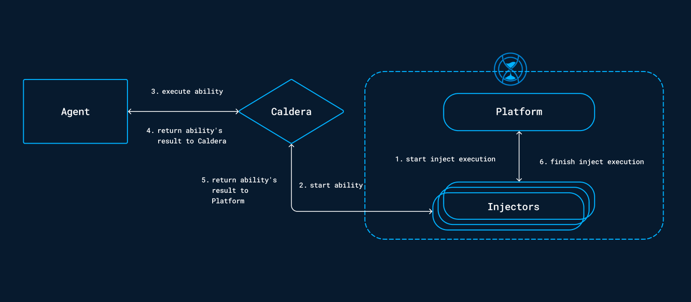

# Caldera Injects

The [Caldera framework](https://caldera.mitre.org/), developed by MITRE, is a powerful framework designed to simulate cyberattacks. It enables security teams to conduct realistic and controlled simulations of adversary behavior, reducing the amount of time and resources needed for routine cybersecurity testing.

## Injects

In OpenAEV, the Caldera framework has been fully integrated, offering users access to a comprehensive library of injects for conducting simulation exercises. With this integration, users can leverage the extensive capabilities of Caldera within OpenAEV.

Caldera offers 1600+ [abilities](https://caldera.readthedocs.io/en/latest/Learning-the-terminology.html#abilities-and-adversaries), covering the full range of ATT&CK tactics and techniques. These capabilities equip security teams with an extensive toolkit to simulate various threats and assess defense mechanisms effectively.

## Behavior

Injects within the Caldera framework can be played on both individual [Endpoints and Asset groups](../../build/assets.md). Prior to playing injects, [Caldera agents](../../build/injectors.md#agents) need to be installed on the target machines to enable interaction with the platform.

Once the agents are deployed, simulations with Caldera injects can be executed. The platform will contact the Agent to start the ability. Subsequently, the agents will report the results to OpenAEV. Below is the workflow illustrating the behavior of injects.

## Configuration variables

Below are the properties you'll need to set for OpenAEV:

| Property                | application.properties         | Docker environment variable      | Mandatory | Description                                              |
|-------------------------|--------------------------------|----------------------------------|-----------|----------------------------------------------------------|
| Enable Caldera injector | injector.caldera.enable        | `INJECTOR_CALDERA_ENABLE`        | Yes       | Enable the Caldera injector.                             |
| Injector ID             | injector.caldera.id            | `INJECTOR_CALDERA_ID`            | Yes       | The ID of the injector.                                  |
| Caldera URL             | injector.caldera.url           | `INJECTOR_CALDERA_URL`           | Yes       | The URL of the Caldera instance.                         |
| Caldera API key         | injector.caldera.api-key       | `INJECTOR_CALDERA_API-KEY`       | Yes       | The API key for the REST API of the Caldera instance.    |

